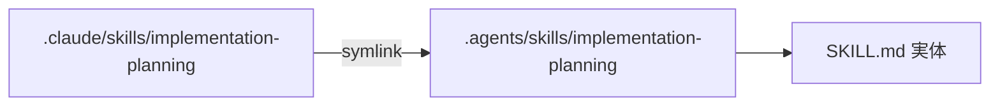
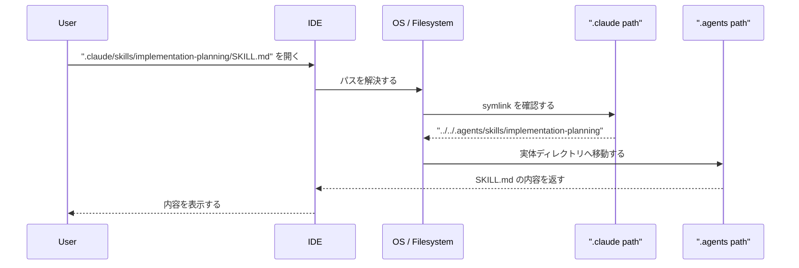
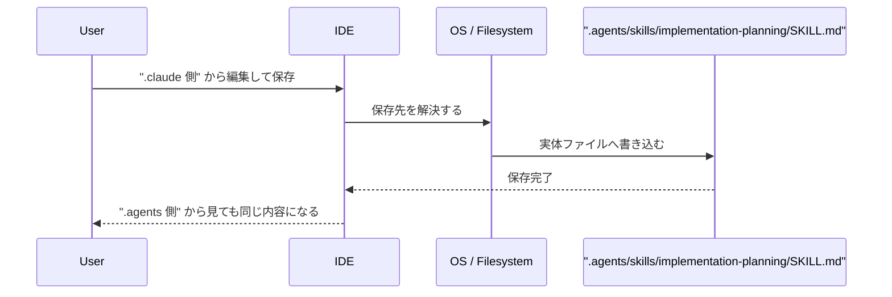

AIエージェント向けのスキルやプロンプト資産を管理していると、かなり高い確率でこうなります。

これ、地味ですがかなり面倒です。

実際、自分の環境でもimplementation-planningという skill を作ったときに、最初は ".claude/skills/implementation-planning" に実体を置いていました。  
ただ、このリポジトリでは agent-discoverable な shared skill は ".agents/skills/" に置くのが自然です。

そこでやったのが、

という構成です。

結論から言うと、これがかなり良かったです。  
コピーをやめて、実体を1つにしただけで、運用コストがかなり下がりました。

## まず結論

やりたいことはこれだけです。

イメージとしてはこうです。

```

```

つまり、.claude 側に「本体」があるわけではありません。  
.claude/skills/implementation-planning は、「本物は .agents/skills/implementation-planning にあります」と教えてくれる参照です。

## symlinkって何か

symlink は symbolic link の略で、日本語だと「シンボリックリンク」と呼ばれます。

ざっくり言うと、

> 別の場所を指すショートカットのようなもの

です。

ただし、GUI のショートカットよりもファイルシステム寄りで、かなり自然に振る舞います。  
アプリや IDE から見ると、普通のファイルやディレクトリのように扱えることが多いです。

ここが重要です。

## コピーと何が違うのか

ここが一番大事です。

### コピーの場合

たとえばこうするとします。

この2つが「コピー」なら、見た目は同じでも、実体は2つです。

その結果こうなります。

* .agents 側だけ直す
* .claude 側は古いまま残る
* 数日後にどちらが正本かわからなくなる

これはかなり危険です。

### symlinkの場合

一方で symlink なら実体は1つです。

この状態なら、

「入口は2つ、でも中身は1つ」という状態になります。

## 実際のディレクトリ構成

今回の構成はこうです。

```
.agents/
└── skills/
    └── implementation-planning/
        └── SKILL.md   ← 正本

.claude/
└── skills/
    └── implementation-planning -> ../../.agents/skills/implementation-planning
```

これを ls -l で見ると、こんな感じになります。

```
lrwxr-xr-x .claude/skills/implementation-planning -> ../../.agents/skills/implementation-planning
```

この -> が「ここは symlink で、右側を指しています」という意味です。

## 読み取りの流れ

IDE で .claude/skills/implementation-planning/SKILL.md を開いたとき、裏側ではこういうことが起きています。

```

```

つまり、ユーザーは .claude 側を開いているつもりでも、OS が自動で .agents 側に案内してくれます。

## 編集時の流れ

編集も同じです。

```

```

ここで大事なのは、

* .claude から編集しても
* .agents から編集しても
* 最終的に更新されるのは同じ1ファイル

ということです。

## どうやって作るのか

**手っ取り早いのは、AIにお願いをする。「このスキルをsymlink 化したいです。」みたいなことを伝えればやってくれます。**

一応コマンドでのやり方も載せておきますね。  
今回の implementation-planning では、以下のように整理しました。

```
mkdir -p .agents/skills/implementation-planning
mv .claude/skills/implementation-planning/SKILL.md .agents/skills/implementation-planning/SKILL.md
rmdir .claude/skills/implementation-planning
ln -s ../../.agents/skills/implementation-planning .claude/skills/implementation-planning
```

やっていることは4つだけです。

1. .agents 側に新しい正本ディレクトリを作る
2. SKILL.md をそこへ移動する
3. 元の実ディレクトリを消す
4. 元の場所に symlink を作る

これで、見た目のパスは維持しながら、正本を .agents 側へ寄せられます。

## なぜこの構成が良いのか

自分がこの構成を良いと思っている理由は3つあります。

### 1. 正本が明確になる

「どこが本物か」が明確になります。

今回のような repo では、shared skill は .agents/skills に集約した方が自然です。  
ルールも説明しやすいです。

これだけでかなり迷いが減ります。

### 2. 二重管理がなくなる

これが一番大きいです。

コピー運用だと、

* 片方だけ更新
* もう片方は更新し忘れ
* どちらが最新か不明

が普通に起きます。

symlink なら、そもそも複製していないので、ズレようがありません。

### 3. 既存の参照パスを壊さない

すでに .claude/skills/... を見ている設定やツールがある場合、いきなり path を変えると壊れます。

でも symlink なら、見た目の path は残せます。

たとえば今回も .claude/settings.json 側で .claude/skills/implementation-planning/\*\* を許可していました。  
このような既存設定があるとき、symlink はかなり便利です。

## 実運用での注意点

便利ですが、いくつか注意点があります。

### 1. link を消すのと、実体を消すのは違う

これを混同しやすいです。

この違いは理解しておいた方がいいです。

### 2. Git は「リンクそのもの」を管理する

Git は symlink を「参照情報」として扱います。  
つまり、.claude/skills/implementation-planning の中身を複製して保存するわけではなく、

> この path は ../../.agents/skills/implementation-planning を指します

という情報を持ちます。

一方で .agents/skills/implementation-planning/SKILL.md は普通のファイルとして管理されます。

### 3. Windows では少し注意が必要

macOS / Linux では symlink はかなり自然に使えます。  
一方で Windows は環境によって扱いが少し面倒です。

* 権限が必要なことがある
* 開発環境によって symlink の扱いが違う
* ZIP 展開や GUI ツールで壊れることがある

チーム全体で使うなら、メンバーの環境確認はした方がいいです。

## どう確認すればいいか

確認コマンドはこの3つが便利です。

```
ls -l .claude/skills/implementation-planning
readlink .claude/skills/implementation-planning
realpath .claude/skills/implementation-planning
```

見え方のイメージはこうです。

```
$ ls -l .claude/skills/implementation-planning
.claude/skills/implementation-planning -> ../../.agents/skills/implementation-planning
```

そして realpath を使うと、最終的にどこを見ているかがわかります。

## どんなときに symlink を使うべきか

自分の基準はシンプルです。

### symlink が向いているケース

* 正本は1つでよい
* ただし入口の path は複数ほしい
* 既存ツールとの互換性を保ちたい
* コピー運用でズレるのを避けたい

### symlink が向いていないケース

* それぞれ別々に進化させたい
* あえて内容を分岐させたい
* OS や配布方法の制約が厳しい

今回の skills 運用は、かなり前者でした。  
なので symlink がぴったりハマりました。

## まとめ

今回学んだことはかなりシンプルです。

要するに、

> 実体は1つ、入口は複数

を実現したいなら、symlink はかなり良い選択肢です。

AI エージェントの skill 管理に限らず、

* 設定ディレクトリ
* テンプレート
* ドキュメント入口
* ツール互換用パス

みたいな場面でも、かなり使えます。

自分は今回、.agents を正本にして .claude を symlink に寄せたことで、ようやくこの運用が腑に落ちました。  
もし今「同じファイルを複数箇所に置いていて、たまにズレる」状態なら、symlink は一度ちゃんと理解する価値があります。
