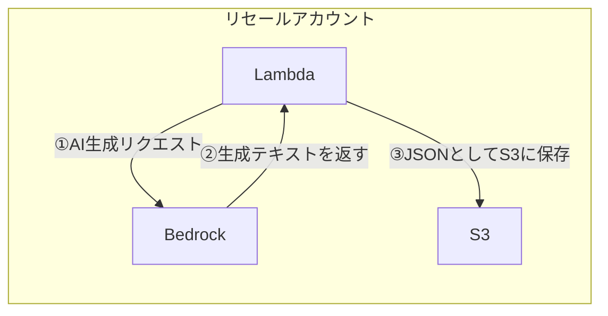

## はじめに

AWS のリセール（請求代行）アカウントで Amazon Bedrock の Anthropic モデルを使用していたところ、モデルの更新をきっかけに2つの問題が立て続けに発生しました。

- **問題① リセールアカウントで新しい Anthropic モデルが使えない**
- **問題② 別アカウントの Bedrock を使うようにしたら、今度は認証情報が1時間で切れる**

この記事では、その原因と対処法をまとめます。

**構成のイメージ**

某スポーツの試合情報を基にハイライトテキストを生成する用途で使っていました。

---

## 問題① リセールアカウントで Anthropic モデルが制限さ
