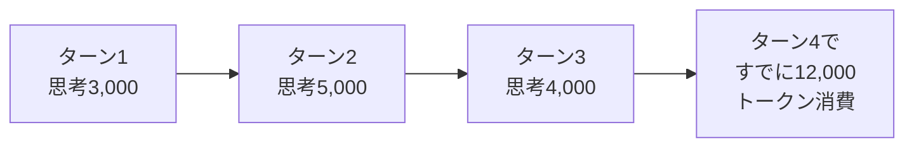

# 
## はじめに

claude.aiを日常的に使っていると、長い会話の途中で「会話の長さの上限に達しました」というメッセージに出会うことがあると思います。

公式のヘルプセンターには、この上限を伸ばすコツとして「拡張思考をOFFにする」「使わないコネクタを無効化する」という案内があります。

> Toggle extended thinking off / Temporarily disable non-critical tools and connectors

これ、最初に読んだとき「なぜ？使ってないときも消費してるの？」と疑問に思ったので調べてみました。仕組みを知ってみるとなかなか面白かったので、本記事ではその裏側を解説します。

### 対象読者

- claude.aiを日常的に使っている方
- 「なぜ拡張思考をOFFにすると節約になるの？」が気になった方
- 前提知識は不要です（非エンジニアの方もOK）

## 参考リンク

https://support.claude.com/en/articles/11647753-how-do-usage-and-length-limits-work

https://docs.claude.com/en/docs/build-with-claude/extended-thinking

https://docs.claude.com/en/docs/build-with-claude/context-windows

## そもそも「コンテキストウィンドウ」とは

Claudeとの会話には、**「作業机の広さ」のような上限**があります。これがコンテキストウィンドウです。

claude.aiでは200Kトークンが上限。トークンというのは単語よりもやや細かい単位ですが、ざっくり日本語15万字くらいのイメージで大丈夫です。

この机の上には、Claudeが「いま見えている情報」のすべてが乗っています。

机がいっぱいになると、新しい話題を載せるスペースが足りなくなる。これが「会話の長さの上限」の正体ですね。

:::note info
コンテキストウィンドウの大きさはプランによっても変わります。本記事は標準のPro/Maxプラン（200K）を前提にしています。
:::

## 拡張思考をOFFにするとなぜ節約になるのか

拡張思考（Extended Thinking）は、Claudeが回答する前に「内部でじっくり考える」モードです。難しい問題ではONにすると回答品質がぐっと上がります。

ただ、その**思考の過程は机の上にトークンとして残ります**。回答1回ぶんで数千〜1万トークン以上を消費することも珍しくありません。

そして、ここからが意外なポイント。

:::note warn
**最新モデル（Claude Opus 4.5以降 / Sonnet 4.6以降）では、過去ターンの思考も会話履歴に残り続けます。**

古いモデルでは前のターンの思考は自動的に捨てられていたのですが、新しいモデルではデフォルトで保持される仕様に変わっています。
:::

つまり長い会話を続けるほど、過去の思考がどんどん机の上に積み上がっていきます。

雑談や軽い質問では拡張思考の恩恵はそこまで大きくないので、「難しい問題を解くとき以外はOFF」が、節約と回答速度の両面でちょうどよいバランスになります。

## ツール・コネクタをOFFにするとなぜ節約になるのか

こちらはさらに意外な仕組みです。

Web検索、Research、MCPコネクタ（Google Drive、Notion、Slack、Gmailなど）は、**「実際に使ったときだけ消費する」のではありません。「有効化されているだけで毎ターン消費」しています。**

理由は、これらのツールを使うために「**使い方の説明書（ツール定義）**」をClaudeに渡しておく必要があるからです。料理人に新しい調理器具を渡すときに「これはこう使います」というマニュアルが必要なのと同じで、その説明書が机の上に常時置かれている状態になります。

:::note alert
MCPコネクタを5〜10個接続していると、会話を始める前から数千〜1万トークン規模の「説明書」が机を占有していることがあります（具体的な消費量は接続先のサービス次第）。
:::

たとえば「今日はNotionだけ使うからGoogle DriveとSlackは切っておく」だけで、長い会話で詰まりにくくなります。

## まとめ：使い分けの早見表

意外と気にしない部分なのでコンテキストウィンドウを圧迫しないためにも意識できるとよいと思いました。

| シーン | 拡張思考 | コネクタ |
|--------|----------|----------|
| 雑談・カジュアルなやりとり | OFF | OFF |
| 長文の文書作成・要約 | OFF | 必要なものだけ |
| 難しい問題を考える・コーディング相談 | ON | OFF |
| Notion/Drive のデータを参照する作業 | OFF | 必要なものだけ |

普段使わないコネクタは思い切ってOFFにしておくと、肝心なときにコンテキスト容量を残せます。長く快適に使うために、claude.aiの「検索とツール」設定を一度見直してみるとよさそうですね。

:::note info
本記事の内容は2026年4月時点のものです。Claudeのモデル仕様や挙動は変更される可能性があるため、最新情報は[公式ドキュメント](https://docs.claude.com/)をご確認ください。
:::
