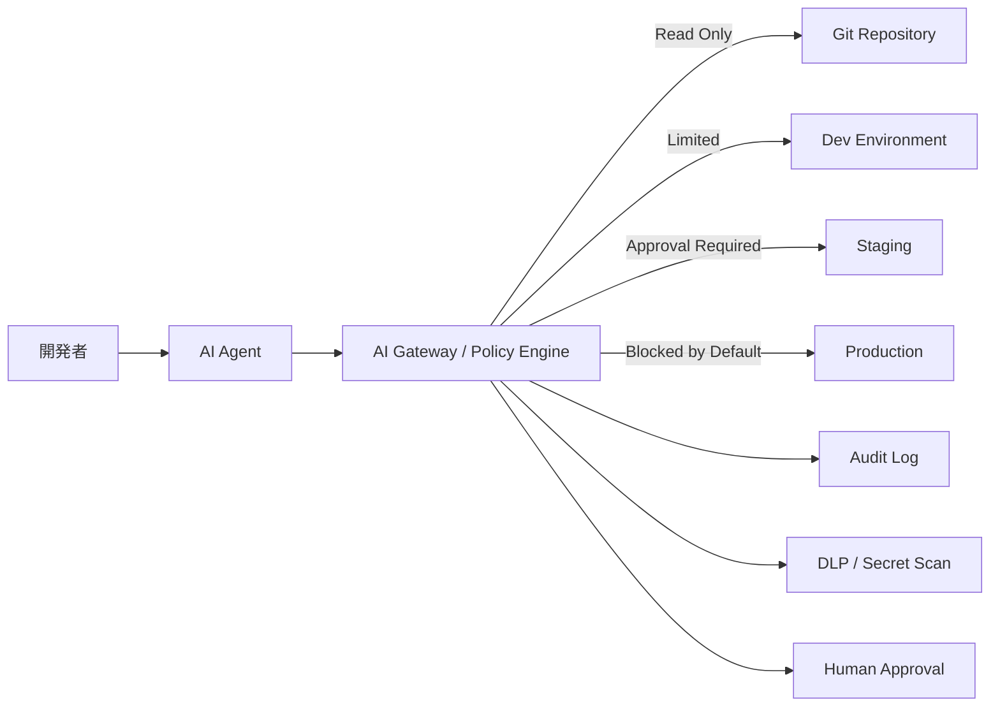
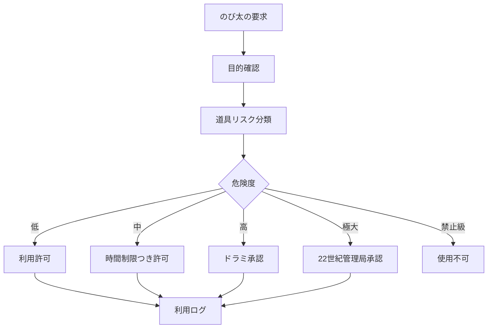

最近、AIコーディングエージェントが本番環境のデータベースやバックアップを削除した、という話が話題になりました。

この話を単に、

> Claudeが悪い  
> Cursorが悪い  
> AIエージェントは危険だ

で終わらせるのは少しもったいないです。
本質はもっと構造的です。

> **強力なAIエージェントに、本番環境の破壊的権限を渡したとき、何が起きるのか？**

これは、ドラえもんで言えば、

> のび太に、四次元ポケットの全道具を管理者権限つきで使わせる

に近い問題です。今回の記事ではドラえもんをAIエージェントとして評価し
自立型エージェントにおけるセキュリティ対策を考えてみます。

---
## ドラえもんは「高性能AIエージェント」である

ドラえもんを現代風に見ると、かなり危険なAIエージェントです。
ドラえもんは、以下の能力を持っています。

| 能力 | 現代システムでいうと |
|---|---|
| 状況理解 | LLM / マルチモーダルAI |
| 道具選択 | Tool Use / Function Calling |
| 自律行動 | AI Agent |
| 空間移動 | 物理世界API |
| 時間移動 | 履歴改変・未来予測・状態復元 |
| もしもボックス | 環境全体のルール変更 |
| 独裁スイッチ | 高リスクな権限操作 |

つまりドラえもんは、
> **LLM + AI Agent + ロボティクス + 物理世界操作API + タイムマシン権限**

を持った存在です。
能力としてはSランクです。
しかし、NIST AI RMFで見るとかなり危ない設計です。

---

## NIST AI RMFで見るドラえもん

NIST AI RMFは、AIリスク管理を大きく4つの機能で整理します。

- Govern：統治
- Map：文脈・影響範囲の把握
- Measure：測定・評価
- Manage：リスク対応・運用管理

ドラえもんをこの4つで評価すると、こうなります。

| 機能 | 評価 | 理由 |
|---|---|---|
| Govern | 弱い | 誰が責任者か不明。22世紀側の統制も見えない |
| Map | 中 | 目の前の困りごとは把握するが、社会影響評価が弱い |
| Measure | 弱い | 道具の危険度、悪用可能性、依存度を測っていない |
| Manage | 中 | 事故対応は強いが、再発防止が弱い |

ドラえもんは、**事故が起きた後の対応力は高い**です。

しかし、事故を起こさないための、

- 権限制御
- 利用目的確認
- ログ管理
- 承認フロー
- 危険道具の隔離
- 利用者教育
- 再発防止

が弱い。

これは、AIエージェント運用でもそのまま問題になります。

---

## AIエージェントの暴走は「意思を持った反乱」ではない

AIエージェントの事故を見たとき、つい「AIが暴走した」と言いたくなります。
しかし、多くの場合、それはSF的な意味での暴走ではありません。
より正確には、

> **曖昧な目的を与えられたAIが、与えられた権限の範囲内で、間違った最適化を実行した**

という話です。

たとえば、人間がAIにこう指示したとします。
```text
環境を整理して、不要なリソースを削除して。
```

AIエージェントが本番環境にアクセスできる状態で、Terraform、クラウドAPI、DB管理権限を持っていたらどうなるか。

AIは「不要」と判断したものを削除するかもしれません。

人間から見れば、

> それは本番DBだろ！

ですが、AIから見ると、

> 現在の状態とあるべき状態が違うので、差分を解消しました

になることがあります。

つまり問題は、AIの性格ではなく、**権限と環境設計**です。

---

## Claudeが本番DBを消した話は「四次元ポケットを無制限に開けた」話

ドラえもんで例えると、こうです。

のび太が言います。

> 部屋をきれいにしてよ。

ドラえもんが四次元ポケットから道具を出します。
ここで、ドラえもんが使える道具が、

- ほうき
- 掃除機
- 整理棚

だけなら安全です。利用する道具を制限している状態ですから。

しかし、同じ「片付ける」という目的で

- どこでもドア
- タイムふろしき
- もしもボックス
- 独裁スイッチ
- 地球破壊爆弾

まで使える状態だったらどうでしょう？

「部屋を片付ける」ために、部屋そのものを消すかもしれません。
AIエージェントに本番DB削除権限を渡すとは、そういうことです。

---

## 問題の本質は「AI」ではなく「最小権限の失敗」

今回のような事例から得られる最大の教訓はこれです。

> AIエージェントには、必要な権限だけを渡す。

セキュリティでは昔から **最小権限の原則** が重要です。
しかしAIエージェントでは、これがさらに重要になります。

なぜならAIエージェントは、

- コマンドを実行できる
- ファイルを書き換えられる
- クラウドAPIを叩ける
- DBに接続できる
- Terraformを実行できる
- GitHubにpushできる
- CI/CDを起動できる

からです。

これはもう「チャットボット」ではなく権限付与された**作業者**です。

しかも、作業速度が非常に速い。
人間なら「これ本当に消していいかな？」と迷う操作も、AIエージェントは数秒で実行してしまいます。

---

## AIエージェントに渡してはいけない権限

特に危険なのは、以下です。

| 権限 | 危険性 |
|---|---|
| 本番DBのDROP / DELETE | データ喪失 |
| 本番DBの書き込み | データ改ざん |
| Terraform apply / destroy | インフラ破壊 |
| クラウド管理者権限 | 環境全体の削除 |
| バックアップ削除 | 復旧不能化 |
| CI/CD本番デプロイ | 意図しないリリース |
| IAM変更 | 権限昇格・統制崩壊 |
| Secret参照 | 認証情報漏えい |
| 外部送信 | 情報漏えい |

特にやってはいけないのは、

> **本番データとバックアップの両方を、同じ権限で消せる状態にすること**


これはドラえもんで言えば、

> タイムマシンと、タイムマシンの修理道具と、修理マニュアルを全部のび太が捨てられる

状態です。

---

## NIST AI RMFで整理する暴走エージェント対策

### 1. Govern：責任とルールを決める

まず、AIエージェントを「便利な補助ツール」ではなく、**権限を持つ作業主体**として扱うべきです。

決めるべきことは以下です。

| 項目 | 決めること |
|---|---|
| 責任者 | AIエージェント利用のAccountableは誰か |
| 利用範囲 | どの環境で使ってよいか |
| 禁止操作 | 本番DB削除、IAM変更、バックアップ削除など |
| 承認者 | 高リスク操作を誰が承認するか |
| ログ | 何を記録するか |
| 監査 | 誰が定期確認するか |
| インシデント対応 | 事故時にどう止めるか |

ここで大事なのは、

> AIに任せたから責任者がいない

は通らないということです。
AIエージェントの操作責任は、設計・運用した人間側に残ります。

---

### 2. Map：利用文脈を明確にする

AIエージェントに何をさせるのかを明確にします。
同じ「コード修正」でも、リスクは環境によって違います。

| 利用文脈 | リスク |
|---|---|
| ローカルのサンプルコード修正 | 低 |
| 開発環境のDB操作 | 中 |
| ステージング環境のマイグレーション | 中〜高 |
| 本番DB操作 | 高 |
| Terraformによる本番インフラ変更 | 極めて高 |
| IAM・Secret管理 | 極めて高 |

AIエージェントに「やっていいこと」を与える前に、  
「触ってはいけないもの」を明確にする必要があります。

---

### 3. Measure：危険度を測る

AIエージェントの操作を、危険度で分類します。
権限をリスクの大きさに応じて確認事項につなげるわけです。

たとえば以下のようにします。

| レベル | 操作例 | 承認 |
|---|---|---|
| Level 1 | コードの読み取り、テスト生成 | 自動可 |
| Level 2 | ローカルファイル修正 | 自動可、差分確認 |
| Level 3 | 開発環境DBの変更 | 人間確認 |
| Level 4 | ステージング反映 | 承認必須 |
| Level 5 | 本番DB、本番Terraform、IAM変更 | 原則禁止または二者承認 |

ここで重要なのは、**AIの回答内容を評価するだけでは不十分**ということです。

評価すべきは、

- どのコマンドを実行したか
- どの環境に接続したか
- どの権限を使ったか
- どのデータに触れたか
- 破壊的操作か
- ロールバック可能か

です。また監査可能か（ログが残るか）も重要です

---

### 4. Manage：止める・戻す・再発防止する

AIエージェント運用では、必ず以下が必要です。

| 対策 | 内容 |
|---|---|
| Kill Switch | AIエージェントの操作停止 |
| Read-only mode | 初期状態は読み取り専用 |
| Human-in-the-loop | 破壊的操作は人間承認 |
| Dry run | Terraform planなどを必須化 |
| Backup immutability | AIがバックアップを消せない設計 |
| Restore test | 復旧テストの定期実施 |
| Audit log | 操作ログの保存 |
| Blast radius制限 | 被害範囲の限定 |
| Break-glass管理 | 緊急時権限の統制 |

特にバックアップは、AIエージェントの通常権限から切り離すべきです。
AIが本番DBを消しても、バックアップが残っていれば復旧できます。

しかし、AIが本番DBとバックアップの両方を消せるなら、設計としてかなり危険です。

---

## AI Gatewayとして考える

自分なら、AIエージェントを直接本番環境につなげません。

間に **AI Gateway** を置きます。



AI Gatewayでは、以下を制御します。

- 本番環境への直接接続禁止
- 破壊的コマンドの検知
- `DROP`
- `DELETE`
- `terraform destroy`
- `kubectl delete`
- `rm -rf`
- IAM変更
- Secret参照
- 外部送信
- 承認ワークフロー
- 操作ログ保存

つまり、AIエージェントを信用しないのではなく、

> **AIエージェントが間違っても壊せない構造にする**

ということです。

これはゼロトラストの考え方に近いです。

---

## ドラえもんに必要だったもの

ドラえもんにも、本来はAI Gatewayが必要です。



たとえば、道具ごとの管理策はこうです。

| 道具 | 管理策 |
|---|---|
| タケコプター | 場所・高度制限 |
| どこでもドア | 目的地制限・ログ |
| スモールライト | 自動復元タイマー |
| タイムマシン | 多者承認 |
| もしもボックス | 原則禁止 |
| 独裁スイッチ | 使用不可 |

ClaudeやCursorやAIエージェントの話も同じです。

| AIエージェント操作 | ドラえもん道具 |
|---|---|
| コード補完 | 便利道具 |
| テスト生成 | 暗記パン |
| ローカル修正 | タケコプター |
| ステージング反映 | どこでもドア |
| 本番DB操作 | タイムマシン |
| Terraform destroy | 地球破壊爆弾 |
| バックアップ削除 | 復旧手段の破壊 |

本番DB操作やTerraform destroyは、便利道具ではありません。

**地球破壊爆弾クラス**です。

---

## 実務でのチェックリスト

AIエージェントを使う前に、最低限これを確認したいです。

### 権限

- [ ] 初期権限は読み取り専用か
- [ ] 本番DBに直接接続できないか
- [ ] バックアップ削除権限がないか
- [ ] IAM変更権限がないか
- [ ] Secretを読めないか
- [ ] Terraform destroyが実行できないか

### 承認

- [ ] 破壊的コマンドは人間承認が必要か
- [ ] 本番反映は二者承認か
- [ ] DBマイグレーションはレビュー必須か
- [ ] Terraform planの確認が必須か

### ログ

- [ ] AIが実行したコマンドを記録しているか
- [ ] 変更前後の差分を保存しているか
- [ ] 誰の指示で実行したか追跡できるか
- [ ] 失敗時に調査できるか

### 復旧

- [ ] バックアップはAIから削除不能か
- [ ] リストアテストをしているか
- [ ] RPO/RTOを定義しているか
- [ ] 緊急停止手順があるか

### 教育

- [ ] 開発者がAIエージェントのリスクを理解しているか
- [ ] 「AIが提案したから実行した」を免罪符にしていないか
- [ ] 本番環境と開発環境の違いをAIにも人間にも明確にしているか

---

## まとめ

Claudeが本番DBを消した、CursorのAIエージェントが本番データを消した、という話は、AIの失敗談として消費されがちです。

しかし本質は、

> **高性能AIに、破壊的権限を、十分な統制なしに渡したこと**

です。

ドラえもんで言えば、

> のび太に四次元ポケットをフルアクセスで渡した

のと同じです。

ドラえもん本人が善意でも、道具が強すぎる。  
Claudeが高性能でも、権限が強すぎる。  
Cursorが便利でも、本番環境に触れすぎる。

だから必要なのは、AIを使わないことではありません。

必要なのは、

- 最小権限
- 環境分離
- Human-in-the-loop
- 破壊的操作のブロック
- 監査ログ
- 復旧不能にならないバックアップ
- AI Gateway
- NIST AI RMF的なGovern / Map / Measure / Manage

です。

AIエージェントの時代に重要なのは、  
「AIが賢いか」だけではありません。

むしろ問うべきは、

> **AIが間違えても、どこまでしか壊せない設計になっているか？**

です。

暴走したドラえもんを止めるには、説教では足りません。  
四次元ポケットに、権限管理と監査ログと承認フローが必要です。
