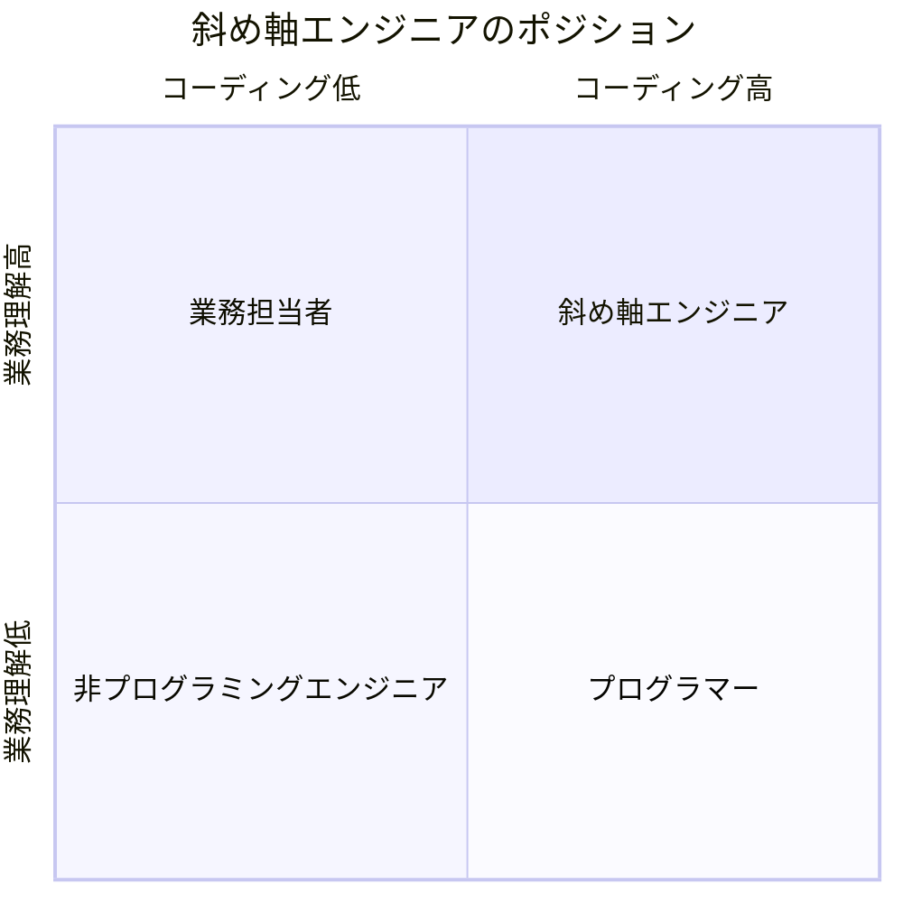
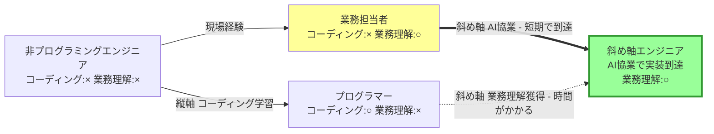
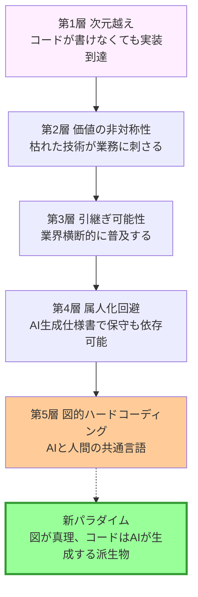

## 1. 朝の記事の続き、もしくは枯れた技術への賛歌

朝、別の記事で「業務データを LLM に渡せない問題」 を pandas 1 行 + Faker で解決する話を書きました。

プログラマー界隈で言えば「pandas?」 「Faker? 知ってるよ」 「列単位シャッフル? 定番の de-identification」 — 完全に**枯れた技術**です。

でも非エンジニア界隈では:

> 「これで月 8 時間の作業が消える」
> 「実データを渡さずに AI と議論できる」
> 「マスキングツールの足場ができた」

と喜ばれます。同じ技術が、評価軸によって「些末」 にも「革命」 にもなるのです。

この**価値の非対称性**は偶然ではなく、AI 協業時代の構造的な特徴です。本記事のテーマ:

> **コードが書けない非プログラマー・エンジニアこそ AI 時代の最大受益者になり得ます。それは斜め軸の 5 層構造で武装することで成立します。**

---

## 2. 縦軸 / 横軸 / 斜め軸 — AI 利用の 3 つのパターン

まず、コード能力と業務理解の 2 軸で 4 つのポジションを整理します:

左下の「非プログラミングエンジニア」 から右上の「斜め軸エンジニア」 へ向かう動きが、本記事のテーマです。このマトリクスを前提に、AI 利用の 3 つのパターンを見ていきます。

| 軸 | 利用者 | AI の役割 | 効果 |
|---|---|---|---|
| **縦軸 (同次元加速)** | プログラマー | 同種スキルの速度向上 | タイピング・リファクタが 2x 高速化 |
| **横軸 (同次元拡張)** | プログラマー | スキル幅の拡張 | フロント専門が DB 設計を学ぶ等 |
| **斜め軸 (次元越え)** | **非プログラマー・エンジニア** | **不足領域の補完** | **「設計はできるが書けない」 → 自力で実装到達** |

縦軸 + 横軸 = グラフの傾きを倍増させる線形拡張です。
斜め軸 = グラフの線そのものが分岐する非線形変化 (パラダイム移行) です。

レバレッジ効果は **斜め軸 >>> 縦軸 + 横軸**。プログラマーの 2x 高速化と、エンジニアの 0 → 1 越えでは、後者が圧倒的に大きいわけです。

斜め軸エンジニアへの到達経路を図にすると、こうなります:

業務担当者から AI 協業で短期到達するルート (太線) と、プログラマーが業務理解を獲得して到達するルート (破線) の対比が見えます。AI 協業時代の特徴は、後者が時間と意欲を要するのに対し、前者は技術ギャップが AI で埋まる点にあります。

---

## 3. 斜め軸エンジニアの 5 層構造

「コードが書けないが AI で実装に到達できる」 だけでは武器になりません。市場で勝つには 5 層揃う必要があります。

| # | 層 | 効果 |
|---|---|---|
| 1 | 次元越え | コードが書けなくても実装到達できる |
| 2 | 価値の非対称性 | 中程度の技術が業務側で刺さる、市場が広い |
| 3 | 引継ぎ可能性 | 簡単な実装ゆえに業界横断的に普及する |
| 4 | 属人化回避 | AI 生成仕様書で保守も AI に依存できる |
| 5 | 図的ハードコーディング | AI と人間の共通言語、問題箇所の視覚化 |

5 層の積み上げ関係を図にすると:

第 1 層の「実装到達」 が起点となり、上に積み上がるほど市場での勝ち方が強化される構造です。第 5 層を超えると、新しい開発パラダイムへ抜け出ます。

各層を見ていきます。

### 第 1 層: 次元越え

設計ができるがコードが書けない人にとって、AI は「実装手段」 そのものです。これまで他人に頼まないと作れなかった領域に、自力で到達できます。**0 → 1 越え**が起きるのです。

### 第 2 層: 価値の非対称性

冒頭で書いた話です。プログラマー界では「枯れた技術」 「程度が低い」 と判定される実装が、非エンジニア界では業務インパクトとして喜ばれます。同じ技術が評価軸によって価値が逆転します。

つまり「程度が低い」 と判定される技術ほど、**業務側で刺さる市場が広い**わけです。プログラマーは技術的高度さで競争する世界に閉じ込められやすく、結果として狭い市場に張り付くことになります。

### 第 3 層: 引継ぎ可能性

| 実装の複雑度 | 必要人材 | 引継ぎ可能性 | 業界横断性 |
|---|---|---|---|
| 高度・複雑 | 高度プログラマー | 低 (属人化) | 1 業界に閉じ込められる |
| 中程度 | 一般エンジニア | 中 | 中規模に展開可能 |
| **簡単 (バッチ + Excel)** | **運用担当者** | **高** | **業界横断的に普及** |

簡単な実装ほど現場に届き、業界の窓口になります。バイブコーダーが作る成果物は構造的に「簡単な実装」 に着地します (本人がコードを読まないので複雑にできない)。AI に「ダブルクリックで動くバッチファイルにして」 と指示する → 中程度の複雑度に自動収束 → 現場引継ぎ可能性が偶然成立するわけです。

### 第 4 層: 属人化回避

「簡単な実装」 で現場引継ぎ可能でも、保守は別問題です。プログラマーが百年悩んできた**属人化**を、AI 協業は構造的に回避できます。

**AI 生成仕様書とは**: 実装したコードを別のアカウントの AI (別の Claude / Gemini 等) に読み込ませて、**そちらでも改修・保守ができるようにするための引継ぎ書**です。コードを書いた本人 (バイブコーダー) が離脱しても、新しい保守者が別の AI を連れてきて「このコードを引き継いで保守してほしい」 と依頼すれば、システムは生き続けます。伝統的な「人 → 人」 の引継ぎではなく、**「AI → AI」 の引継ぎ**を前提にした設計です。

これで保守の仕組みが 2 層化できます:

- 第 1 層: 実装の簡単さ → 運用担当者が直接触れる
- 第 4 層: AI 生成仕様書 → 別の AI / 新しい保守者が引き継げる

AI 仕様書の革命的な点は、**静的ではなく対話的**であることです。新しい保守者の AI に「このシステムどう動く?」 と質問できます。コードを読まずに、AI 経由でシステムを理解できるのです。

### 第 5 層: 図的ハードコーディング

第 4 層は「AI → AI」 の主体間引継ぎを担保しますが、**進行中の協業で人間と AI が同じ理解を持つ**には、もう一段必要です。

そこで図的仕様書 (Mermaid 等のフローチャート / ロジックツリー) を**正本**として残します:

自然言語仕様書 = ソフト (流動的、解釈が揺れる)
**図的仕様書 = ハード (構造そのものが正本、人間と AI が同じ図を見る)**

人間と AI が**同じ図言語で会話**できます。「この分岐の Yes 側を変えたい」 のような指示が一瞬で伝わります。視覚パターンで死蔵処理 / 未使用ノードも一目瞭然です。

---

## 4. 必要条件 — 検証眼なき斜め軸は AI 任せの劣化版

5 層構造は「コードが書けなくても勝てる」 と言っていますが、これは誤解されやすい論題です。

| 要素 | 必要度 |
|---|---|
| コードを書く能力 | 不要 |
| システム全体を構造化する能力 | **必須** |
| 出力結果の妥当性を判定する観察眼 | **必須** |
| 業界用語との照合能力 (サーベイ駆動) | **必須** |

これらが欠けると、AI に良いプロンプトが出せず、結果検証もできず、バグまみれの納品物が量産されます。

つまり「業務担当者が AI を使う = 斜め軸エンジニア」 ではありません。両者の間にはこの 3 要素のフィルタがあり、ここを越えられない人は「AI 任せの劣化版」 に留まります。

**バイブコーダー = 検証眼を持つ非プログラマー**、と再定義する必要があります。

---

## 5. 悪魔の代弁者

5 層構造も無敵ではありません:

- **AI 生成仕様書の信頼性問題**: AI が事実と違うことを書く可能性があり、検証不能
- **商用 LLM 依存リスク**: サービス停止 / モデル変更で再現性が崩壊する
- **図解リテラシー前提**: 図的仕様書は「読み解く能力」 を要求する
- **短期 vs 長期**: プログラマーも斜め軸に張り出してくれば、優位性は侵食される

これらは個別対策が必要 (人間レビュー / ローカル LLM 併用 / 静的ドキュメントも併存) ですが、本記事の主張を覆すレベルではありません。

### 想定される反論への応答

**「業務担当者が AI を使えば、誰でも斜め軸エンジニアになれるのでは?」**

→ なれません。第 4 章「必要条件」 で示した 3 要素 (構造化能力 / 検証眼 / サーベイ能力) が揃わないと、AI 出力をそのまま信じる「検証眼なきバイブコーダー」 になり、バグまみれの納品物が量産されます。**業務担当者 + AI ≠ 斜め軸エンジニア**。間に必要条件のフィルタがあります。

**「プログラマーが業務理解を進めれば、いずれ斜め軸エンジニアになれるのでは?」**

→ なれます、ただし**時間がかかります**。プログラマーが特定業務のドメイン知識を獲得するには、現場 OJT + 経験蓄積 + 業務側との対話が必要で、AI 協業の即効性 (技術ギャップが AI で埋まる) と比べて速度が桁違いです。経路図の破線が示すのはその時間差。AI 協業時代の特徴は **「業務理解の獲得には依然として時間がかかるが、技術ギャップは AI で即埋まる」** という非対称性です。だからこそ業務担当者発の斜め軸エンジニアが先行優位を持ちます。

---

## 6. 筆者の場合 — インフラ運用 × 他業種の二重クロス

筆者の場合は OJT による業務知識を得てから AI にコーディングさせる形で、マトリクスの右上にいます。システム構築や運用の経験があるエンジニアであれば、たいていの定型業務のフローは自分で書き起こせるため、フローの中で効率化できる部分を AI と相談して実装するだけで到達できます。

筆者はインフラエンジニア出身で、運用技術 (フロー確立 / 効率化 / 監視 / 引継ぎ) を他業種の業務改善に持ち込む立場で動いています。

つまり:

| レイヤー | 構造 |
|---|---|
| 1 (斜め軸) | コードが書けないが、AI で実装到達 |
| 2 (ドメインクロス) | インフラ運用技術 × 他業種の業務フロー |

**斜め軸 × ドメインクロス = 二重レバレッジ**です。AI 協業が斜め軸の弱点 (コードが書けない) を補完し、インフラ運用技術が他業種に新しい視点を持ち込みます。

これがクロスドメインエンジニアの市場価値の正体です。「業界を渡り歩ける」 と感じる根拠は、この二重クロスにあります。

---

## 7. まとめ — 新しい開発パラダイム

プログラマー時代: **コード = 真理、ドキュメントは補助**
バイブコーダー時代: **図 = 真理、コードは AI が生成する派生物、自然言語は補助**

そして、AI 協業時代の市場価値は「**業界を渡り歩く能力**」 に集約されます。「なんだその程度か」 と言われる技術こそ、業界の窓口になるのです。

枯れた技術への賛歌、と言ってもいいでしょう。
