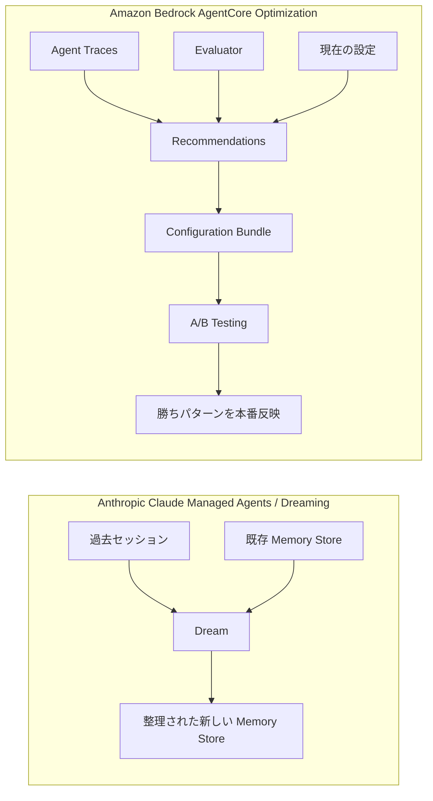
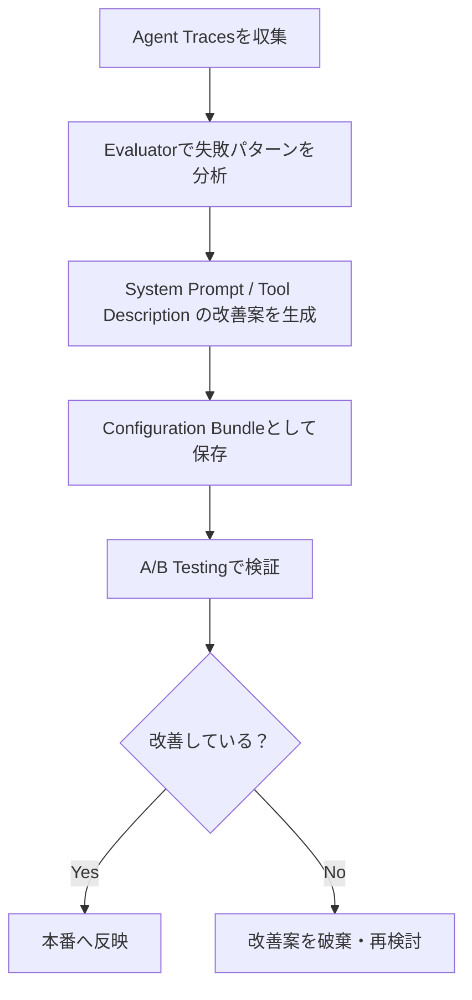
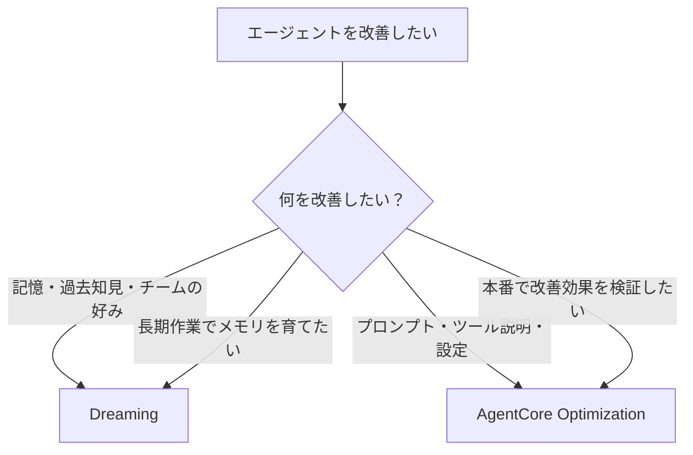

## はじめに

2026年5月、AIエージェント界隈でかなり面白い機能が出てきました。

それが、Anthropic の Claude Managed Agents に追加された **Dreaming** です。

名前だけ聞くと「AIが夢を見るの？」という感じですが、実際にはもう少し実務的で、  
**エージェントが過去の作業ログやメモリを振り返って、次回以降に使いやすい記憶へ整理する機能**です。

一方で、似た文脈で語られやすいものに **AgentCore Optimization** があります。

ただし、ここでまず重要な前提があります。

- **Dreaming**：Anthropic / Claude Managed Agents の機能
- **AgentCore Optimization**：AWS / Amazon Bedrock AgentCore の機能

つまり、どちらも「AIエージェントを改善する」ための仕組みではありますが、  
**提供元も、改善する対象も、運用の考え方も違います。**

ざっくり言うと、以下のイメージです。

> Dreaming は「エージェントの記憶を整理する仕組み」  
> AgentCore Optimization は「エージェントの設定改善を検証する仕組み」

本記事では、この2つの違いをできるだけ分かりやすく整理します。

---

## 先に結論

個人的には、このように捉えると一番分かりやすいと思います。

| 観点 | Dreaming | AgentCore Optimization |
|---|---|---|
| 提供元 | Anthropic | AWS |
| 対象 | Claude Managed Agents | Amazon Bedrock AgentCore |
| 改善するもの | メモリ、過去知見、作業パターン | system prompt、tool description、model ID、runtime設定など |
| 入力 | memory store、過去セッション | agent traces、evaluator、現在の設定 |
| 出力 | 新しい memory store | 改善案、configuration bundle、A/B test結果 |
| 得意なこと | 長期的な記憶の整理 | 設定変更の検証と本番反映 |
| 例えるなら | 振り返り・ナレッジ整理 | 実験・改善サイクル |

---

## 全体像

図にすると、かなり違いが分かりやすいです。

Dreaming は、過去の作業や記憶を見直して、**エージェントの長期メモリを整理する**方向です。

AgentCore Optimization は、ログや評価指標をもとに、**プロンプトやツール説明などの設定を改善して検証する**方向です。

---

## Dreaming とは

Dreaming は、Claude Managed Agents におけるメモリ改善機能です。

エージェントが長期間動いていると、memory store にはいろいろな情報が溜まっていきます。

例えば、以下のようなものです。

- 以前のプロジェクトでしか使わない古いルール
- 同じ内容の重複メモ
- 一時的な例外対応なのに、恒久ルールのように残ってしまったメモ
- 複数セッションを横断して見ないと分からない作業パターン
- チームやユーザーごとの好み

Dreaming は、こうした memory store と過去セッションを読み取り、  
**重複・矛盾・古い情報を整理した新しい memory store を作る**仕組みです。

重要なのは、入力元の memory store を直接上書きしない点です。  
Dream の結果として別の memory store が作られるので、それを確認してから使うことができます。

---

## Dreaming のイメージ

例えば、コードレビューエージェントを長期間使っていたとします。

最初は毎回このように指示していたとします。

- このチームでは `any` の使用を避ける
- PRコメントは厳しすぎず、改善提案として書く
- Next.js App Router 前提でレビューする
- テストがない変更には必ず指摘する

これらを毎回プロンプトに入れるのは面倒です。

Dreaming は、過去のレビュー履歴や memory store を見て、

> このチームでは、こういうレビュー方針が繰り返し使われている

という知見を整理し、次回以降のセッションで使いやすい memory store にまとめてくれます。

つまり、モデル自体を再学習するというより、  
**エージェントが使う長期記憶をメンテナンスする**機能です。

---

## AgentCore Optimization とは

AgentCore Optimization は、Amazon Bedrock AgentCore のエージェント改善機能です。

こちらは Dreaming と違って、主に以下を改善対象にします。

- system prompt
- tool description
- model ID
- runtime endpoint
- agent configuration

AgentCore Optimization では、実際のエージェント実行ログである **agent traces** を使います。

そして、指定した evaluator をもとに失敗パターンを分析し、改善案を作ります。

具体的には、以下のような流れです。

Dreaming が「記憶の整理」だとすると、  
AgentCore Optimization は「改善案を作って、実験して、勝ったものを反映する」仕組みです。

---

## AgentCore Optimization の3つの主要機能

AgentCore Optimization は、主に以下の3つで構成されています。

### 1. Recommendations

エージェントの trace を分析して、改善案を作る機能です。

例えば、ツール選択をよく間違えるエージェントがいた場合、  
tool description をより明確にする改善案を出してくれます。

また、system prompt が曖昧で失敗している場合は、  
より具体的な指示を含む prompt を提案してくれます。

### 2. Configuration Bundles

エージェントの設定をバージョン管理する仕組みです。

対象になるのは、例えば以下です。

- system prompt
- model ID
- tool description
- その他 runtime が読む設定値

これにより、コードを再デプロイせずに、エージェントの振る舞いだけを変更できます。

また、過去バージョンに戻す rollback にも使えます。

### 3. A/B Testing

改善案をいきなり本番100%に流すのではなく、  
control と treatment に分けて、本番トラフィック上で検証できます。

つまり、

- 既存のエージェント
- 改善後のエージェント

を比較して、どちらが良いかを統計的に見られる仕組みです。

ここが Dreaming との大きな違いです。  
AgentCore Optimization は、**改善案を検証するための運用基盤**まで含んでいます。

---

## Dreaming と AgentCore Optimization の本質的な違い

一番大きな違いは、**何を改善するか**です。

Dreaming は、エージェントが過去から何を覚えておくべきかを改善します。

AgentCore Optimization は、エージェントをどう動かすべきかを改善します。

言い換えると、

- Dreaming：**remember better**
- AgentCore Optimization：**perform better through config experiments**

という感じです。

---

## 使い分け

実務では、以下のように使い分けると良さそうです。

| やりたいこと | 向いている機能 |
|---|---|
| 長期プロジェクトの知見をエージェントに蓄積したい | Dreaming |
| チームごとの好みや作業パターンを整理したい | Dreaming |
| memory store の重複や古い情報を整理したい | Dreaming |
| system prompt を改善したい | AgentCore Optimization |
| tool description を改善したい | AgentCore Optimization |
| 本番トラフィックで改善効果を検証したい | AgentCore Optimization |
| A/Bテストで勝ちパターンを決めたい | AgentCore Optimization |

---

## 注意点

### Dreaming の注意点

Dreaming はかなり面白い機能ですが、万能ではありません。

特に注意したいのは以下です。

- research preview 段階
- モデルの重みを再学習するわけではない
- memory store を整理する機能
- 出力された memory store は確認してから使うのが安全
- 長いセッションを大量に入れるとコストも増える

「AIが勝手に賢くなる」というより、  
**エージェントの記憶を綺麗にして、次の仕事に活かしやすくする機能**と理解した方がよいです。

### AgentCore Optimization の注意点

AgentCore Optimization も、改善案をそのまま信じるのは危険です。

- public preview 段階
- recommendation はLLM生成なのでレビューが必要
- A/Bテスト前提で検証した方がよい
- AWS CloudTrail 対応など、preview特有の制約に注意
- AWS AgentCore の運用設計が必要

こちらも「完全自動で最高のエージェントになる」というより、  
**改善案の生成から検証までを回しやすくするための仕組み**です。

---

## まとめ

Dreaming と AgentCore Optimization は、どちらもAIエージェントを改善する機能です。

ただし、改善対象がかなり違います。

- **Dreaming** は、エージェントの memory store を整理し、過去の知見を次に活かすための機能
- **AgentCore Optimization** は、agent traces と evaluator を使って、prompt や tool description などの設定を改善・検証する機能

個人的には、以下のように覚えると分かりやすいと思います。

> Dreaming は「記憶のメンテナンス」  
> AgentCore Optimization は「設定改善の実験基盤」

AIエージェントは、今後ますます「一回の回答」ではなく、  
長期的に動き、振り返り、改善し続けるシステムになっていくと思います。

その中で Dreaming は、エージェントが過去を活かすための仕組み。  
AgentCore Optimization は、運用しながら性能を上げるための仕組み。

同じ「自己改善っぽい」機能でも、実際には役割が違うので、  
導入時にはこの違いを押さえておくと良いと思います。

---

## 参考

- Anthropic: New in Claude Managed Agents: dreaming, outcomes, and multiagent orchestration
- Claude API Docs: Dreams
- AWS Docs: Improve agent performance with Amazon Bedrock AgentCore Optimization
- AWS Docs: AgentCore Optimization - Recommendations / Configuration Bundles / A/B Testing
