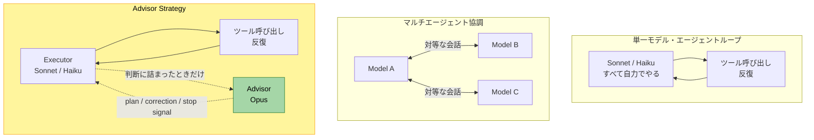
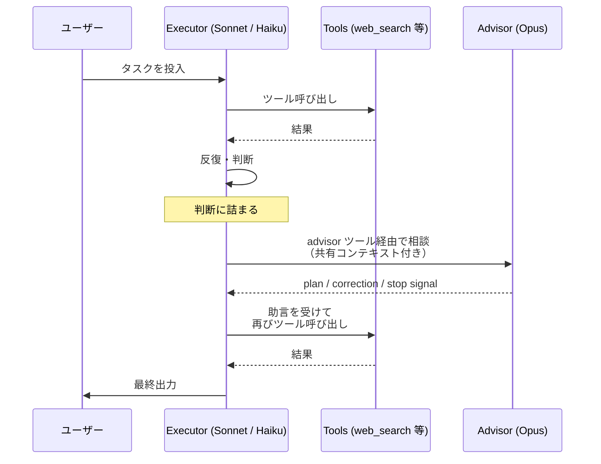
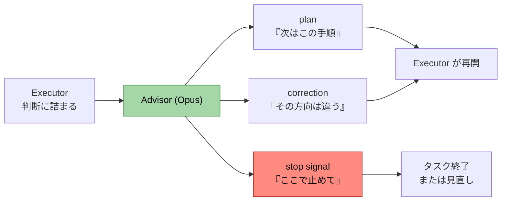
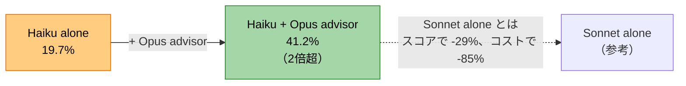
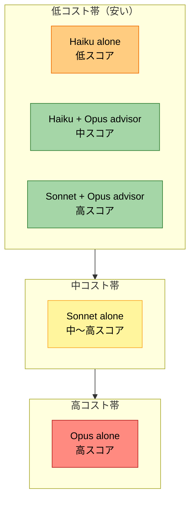
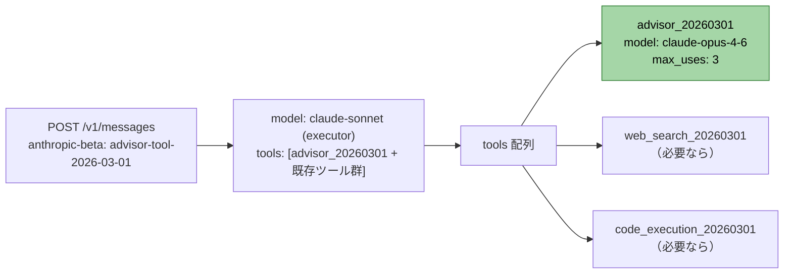
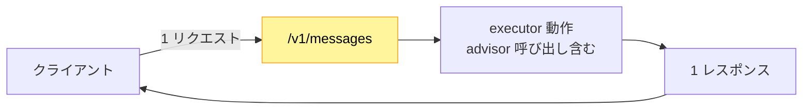
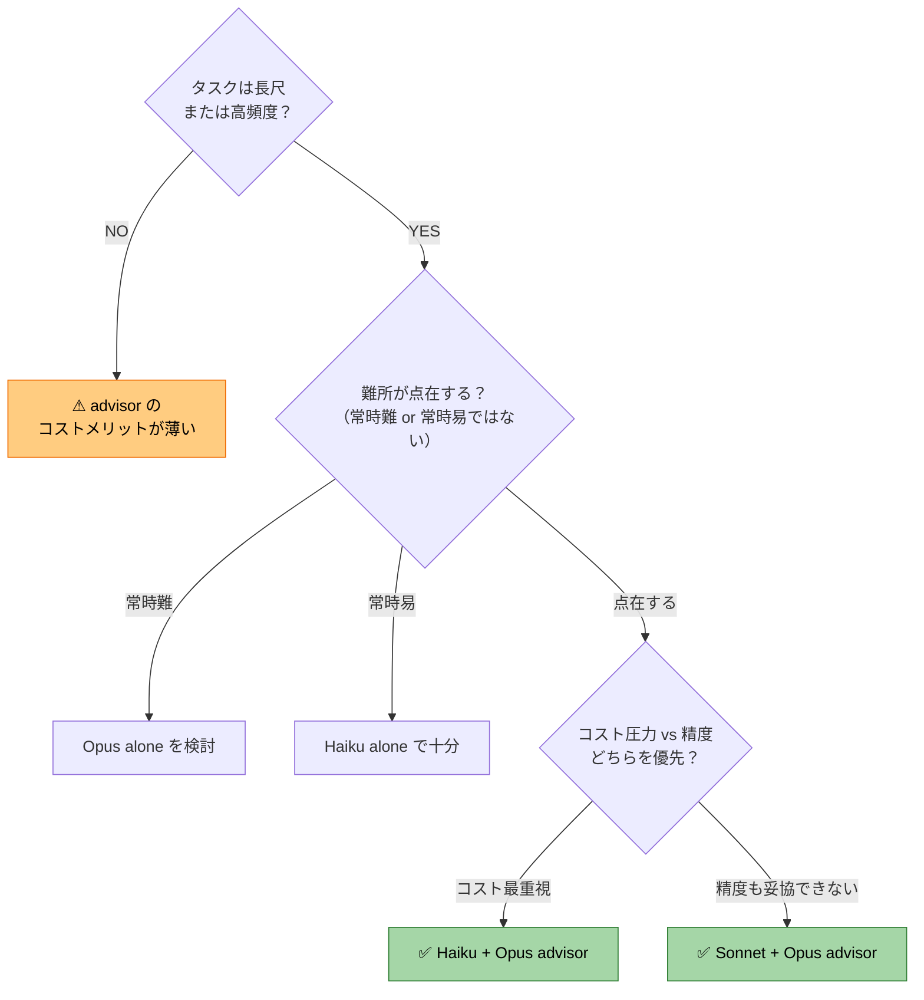

# はじめに 🎯

Anthropic が 2026 年 4 月 9 日に公開したブログ記事「The Advisor Strategy」で、Claude のエージェント運用パターンの新しい組み合わせ方が紹介されました。Opus を **アドバイザー（advisor）** として小さい Sonnet または Haiku の上に重ね、必要なときだけ Opus の判断を呼び出す、という構成です。

公式の説明では、こう書かれています。

> Pair Opus as an advisor with Sonnet or Haiku as an executor, and get near Opus-level intelligence in your agents at a fraction of the cost.

Sonnet や Haiku は executor（実行者）としてタスクを最初から最後まで動かし、ツールを呼び出し、結果を読み、解に向けて反復します。判断に詰まった瞬間だけ Opus に相談し、Opus は **プラン・修正・停止シグナル** のいずれかを返して、また executor が走り続けます。

サブエージェント連携と似ているように見えますが、構造的な違いははっきりしています。Advisor Strategy はモデル切り替えのためのフォーマット化された API ツールとして提供されるため、一回の `/v1/messages` リクエストの中で完結します。Opus 側は自分でツールを呼ばず、最終出力も生成しません。あくまで executor の隣で「助言だけする」存在として動く設計です。

この記事では、Advisor Strategy が何で、どこに使うのか、どんな数字が公式で出ているのか、API でどう書くのかを、できるだけ素直にまとめます。Claude API を業務で使っているエンジニアの方が、自分のプロダクトに入れるかどうか判断できるレベルの情報量を目指しました。

# 既存パターンとの位置づけ 🗺️

Advisor Strategy が「何の代替」かを最初に整理します。公式記事自体は **「一般的な sub-agent パターン（大きな orchestrator が小さな worker に委譲する形）を反転させたもの」** という対比軸を示しているのみで、以下の4分類は **筆者による独自整理** です。エージェント運用には、ざっくり次のパターンがあるという見方をすると位置づけが分かりやすくなります。

| パターン | 中身 | コスト感 | 精度感 |
|---------|------|---------|--------|
| 単一モデル・エージェントループ | Sonnet なり Haiku なりが単独でツール呼び出しを繰り返す | モデルの単価 | モデル単体の上限 |
| 単一モデル + Frontier 切替 | 普段 Sonnet、難所だけ手動で Opus に切り替える | 場合による | 上下が激しい |
| マルチエージェント協調 | 複数モデルが対等にやり取りしながら作業する | やや高め | パイプライン設計次第 |
| **Advisor Strategy** | Sonnet/Haiku が常時主導、Opus は呼ばれたときだけ助言 | executor のコスト + advisor 呼び出し分のみ | executor の弱点を Opus が埋める |



この図のポイントは、Advisor Strategy が「マルチエージェント協調の薄い版」ではなく「単一モデルループに **Opus のヘルプライン** を一本通したもの」という位置づけになっていることです。executor は最後まで主役を降りません。

公式の比較表現ではこう述べられています。

> Frontier-level reasoning applies only when the executor needs it, and the rest of the run stays at executor-level cost.

つまり、フロンティア級の推論を「常時かける」のではなく「必要なときだけかける」という選択肢が、Anthropic 側から提供されたわけです。

# 動作モデル 🔁

Advisor Strategy の動きを、リクエスト1回分の流れで追ってみます。



この図のポイントは、Opus が独立した「もう一つのエージェント」として走るのではなく、**executor から呼び出される助言関数のような存在** に整理されていることです。Opus 側はツールを呼びません。最終出力も生成しません。共有コンテキストを読んで、短いガイダンスを返すだけです。

## 3つの応答パターン

公式は advisor の返答を **plan / correction / stop signal の3種類** として列挙しています。下表の「典型的な使い方」列は筆者による補足です。

| 応答タイプ（公式表現） | 中身 | 典型的な使い方（筆者補足） |
|-----------|------|--------------|
| **plan** | これから取るべき手順の提示 | executor が「次に何をすべきか」迷ったとき |
| **correction** | これまでのアプローチへの訂正 | executor が誤った仮定で進んでいるとき |
| **stop signal** | 「ここで止めるべき」のシグナル | これ以上やっても無駄、と判断できるとき |



この図のポイントは、advisor が「常にプランを返す」わけではないところです。「やめろ」と言うこともできるのが地味に重要で、無限ループ的に進む executor を止める安全装置にもなります。

> 💡 私はこの仕組みを見て「ペアプログラミングで隣に座っているシニア」のメタファーが一番しっくり来ました。普段は手を動かさない。詰まったら呼ぶ。3パターンの応答も、シニアが現場でやることそのものです。

# パフォーマンス: SWE-bench Multilingual 📊

最初の数字は、Sonnet を executor、Opus を advisor として組ませたときの SWE-bench Multilingual の結果です。

| 構成 | スコア変化 | エージェントタスクあたりコスト |
|------|----------|--------------------------|
| Sonnet alone | ベースライン | ベースライン |
| Sonnet + Opus advisor | **+2.7 percentage point** | **−11.9%** |

スコアが上がってコストが下がる、というやや直感に反する結果です。普通は「精度を上げたければ高いモデルを使う」「コストを下げたければ精度を犠牲にする」のトレードオフがありますが、advisor の入れ方によってはその両方が同時に動くことがある、という主張になっています。

> 💡 直感的には「Opus が混ざるならコストは上がるはず」と思いがちですが、advisor が呼ばれる回数は限定的（`max_uses` で制御）で、しかも executor が無駄に長く反復するのを **stop signal で短く切れる** ことが効いていそうです。executor が一人で迷走するより、Opus が早めに方向修正する方が、トータルの token 消費が減るというロジックです。

ただし、+2.7pp というのは絶対値で見ると劇的に大きい数字ではありません。SWE-bench Multilingual のように既に Sonnet が強いベンチマークでは、advisor 効果は「上積み」のレベルで、ベースモデルを置き換えるほどではない、と読むのが穏当です。

# パフォーマンス: BrowseComp 📊

もう一つの数字は、Haiku を executor、Opus を advisor として組ませたときの BrowseComp（Web ブラウジングベンチ）の結果です。こちらはインパクトの方向が違います。

| 構成 | スコア | 対 Sonnet alone（Haiku + Opus advisor の場合） |
|------|------|------------------|
| Haiku alone | **19.7%** | — |
| Haiku + Opus advisor | **41.2%** | スコア -29% / コスト -85%（対 Sonnet alone） |

Haiku 単独が 19.7% だったところに Opus advisor を被せたら 41.2% まで上がる、というのが目を引きます。**スコアが2倍超** です。



この図のポイントは、**「Haiku の弱点を Opus が補える」** という関係です。Haiku は速くて安いのが取り柄ですが、込み入った判断は苦手という側面があります。そこに Opus の助言を差し込むと、Haiku 単独では届かなかった領域に手が届くようになる、という結果になっています。

そのうえで、Sonnet 単独と比較すると、Haiku + Opus advisor は **スコアで -29%、コストで -85%** という位置に着地します。安いが弱い、というシンプルな関係ではなく、「Sonnet ほどではないが、85% 安く済んで、それなりに使える精度に届く」ゾーンを作っているわけです。

> ⚠️ 数字の解釈は文脈によります。BrowseComp 上のスコアが他のタスク（社内のRAG、構造化抽出、コード生成など）でそのまま再現するとは限りません。自分のワークロードで計測しないと、本当に -85% のコスト削減が効くかは分かりません。

# コスト構造 💰

ここまでの数字を、スコアとコストの平面に落とし込みます。

| 構成 | スコア（イメージ） | コスト（イメージ） |
|------|----------------|------------------|
| Haiku alone | 低い | 最も安い |
| Haiku + Opus advisor | 中（Sonnet alone より -29%） | 安い（Sonnet alone より -85%） |
| Sonnet alone | 中〜高 | 中 |
| Sonnet + Opus advisor | 高い（Sonnet alone +2.7pp） | Sonnet alone より -11.9% |
| Opus alone | 高い | 最も高い |

> 📝 上表のスコア列「高い / 中〜高 / 低い」は **イメージ表現** です。公式記事は Sonnet + Opus advisor と Opus alone のスコア絶対値比較を明示していないので、次に続く Mermaid 図も同様に **公式数値に基づく概念図** と捉えてください。



この図のポイントは、advisor を入れた2構成（緑）が **「低コスト帯のなかで中〜高スコアに到達している」** ことです。advisor は「フロンティア性能をフルにかける代わりに、必要な瞬間だけ呼ぶ」という設計なので、トータルのコスト曲線が下にズレ、Opus alone（赤）に頼らずに済むケースが増えます。

実務で考えるべき問いは、私の感覚ではこの3つです。

1. ベース executor を Sonnet にするか Haiku にするか
2. advisor 呼び出しの `max_uses` を何回に設定するか
3. 自分のタスクが「フロンティア推論を必要とする難所をたまに含む」型かどうか

3番目が最も重要で、advisor が真価を発揮するのは「**たまにすごく難しい判断がある**」型のタスクです。常時難しいタスクなら Opus alone のほうが向きますし、常時かんたんなタスクなら Haiku alone でいいわけです。Advisor Strategy は **その中間** を狙う仕組みになっています。

# 実装方法（API） 🛠️

API での書き方はとてもシンプルです。`/v1/messages` リクエストの `tools` 配列に、advisor 用のツール宣言を一つ加えるだけです。

```python
tools = [
    {
        "type": "advisor_20260301",
        "name": "advisor",
        "model": "claude-opus-4-6",
        "max_uses": 3,
    }
]
```

必要なベータヘッダはこちらです。

```
anthropic-beta: advisor-tool-2026-03-01
```

executor 側のモデル（Sonnet または Haiku）は通常どおり `messages.create` の `model` フィールドで指定し、tools 配列に上記の advisor を追加します。executor は会話の流れの中で必要に応じて advisor を呼び、Opus からの返答を受け取って動作を継続します。



この図のポイントは、**advisor が他のツールと並列に `tools` 配列に並ぶ** ことです。Anthropic 側の API として、特殊な multi-agent オーケストレーションを別立てで構築する必要がない設計になっています。web search や code execution と同じ感覚で advisor を追加し、不要なら外せばいい、という素直さがあります。

> 💡 `max_uses` の値は最初は控えめ（2〜3）から始めて、advisor 呼び出しが実際どれくらい入っているかを `usage` で観察してから増やすのが安全です（後述）。

# 内部動作の詳細 🔍

API の使い勝手の話に少し踏み込みます。Advisor Strategy は単に「ツールを増やす」だけではなく、トークン会計と round-trip の作り方にも工夫があります。

## 単一リクエストで完結する

Advisor 呼び出しは、ユーザー側の追加リクエストを必要としません。`/v1/messages` 一回の中で、executor が advisor を呼び、Opus が応答し、executor が続行する流れまでが完結します。



この図のポイントは、クライアント側のコードが **「いつもどおりの messages.create を一回叩くだけ」** で済むことです。multi-agent 連携のような、複数 round-trip 管理を自前で書く必要はありません。

## advisor 出力サイズの目安

公式の説明では、advisor の応答は典型的に **400-700 テキストトークン** とされています。短いプランや修正指示、停止判断といった「指示」中心の出力なので、長文生成のような重い消費にはなりません。

## usage ブロックの分離

advisor が消費したトークンは、通常の executor のトークンとは別に `usage` ブロック内で **分離して報告** されます。これにより、コスト分析の際に「executor の token はこれ、advisor の token はこれ」と切り分けてモニタリングできます。

> 💡 ここが地味に効きます。advisor が想定以上に呼ばれてコストが膨らんでいないかを `usage` で監視できるので、本番に乗せるときの観測性が確保されます。`max_uses` と組み合わせれば、advisor 呼び出しがブレないように制御できます。

## 既存ツールとの併用

advisor tool は、web search や code execution など Anthropic 公式の他ツールと **同じ tools 配列に並べて使えます**。executor は必要に応じてどのツールを呼ぶか判断するので、advisor だけが特別扱いされるわけではありません。

# どこに使うか／どこに使わないか ⚖️

Advisor Strategy が向くのはどんな場面か、私なりに整理します。

## 向く場面

- **高頻度・長尺のエージェントタスク**: コードリファクタ、ブラウジング系の調査、データ変換パイプラインなど、長く動かすほどコスト差が効くもの
- **タスク内に「難所」が点在する型**: ほとんどは Sonnet/Haiku で十分こなせるが、たまに込み入った判断が要るような分布
- **コスト上限が厳しいが品質も妥協できない型**: Haiku ベースに Opus advisor を被せて、Sonnet alone より安く・Haiku alone より精度高くの中間点を狙う

## 向かない場面

- **常時フロンティア推論が必要なタスク**: 数学証明や、すべてのステップで深い推論を要するもの。素直に Opus alone が向く
- **逆に常時単純なタスク**: 既に Haiku で 95% 以上の精度が出ているなら、advisor を入れても改善余地が小さい
- **advisor の判断を待つレイテンシが許容できない超低レイテンシ用途**: 単純なチャットボットの即応など



この図のポイントは、「使う／使わない」の判断軸が、**スコアやコストの絶対値より「難所の分布」と「タスクの長さ」** に依存していることです。advisor の真価は「たまに必要な深い推論」を効率よく供給するところにあるので、まずは自分のタスクが点在型かを見極めるのが先です。

# まとめ 🏁

Advisor Strategy を一言で表すなら、**「フロンティア性能を、必要なときだけ呼べるツールとして API に組み込んだ仕組み」** ということになります。Anthropic が executor + advisor という二段の役割を、一つのリクエスト内で完結するように整えてくれたおかげで、利用側は multi-agent 連携の重い実装を抱え込まずに済みます。

公式の数字を見る限り、SWE-bench Multilingual で +2.7pp / -11.9% コストという「ささやかだが両立する」改善が出るケースと、BrowseComp で Haiku のスコアが 2 倍超に伸びるという「劇的に効く」ケースの両方があります。タスクの性質次第で振れ幅が大きいので、**自分のワークロードで一度ベンチマークするのが現実的** です。

私が個人的に一番好きなのは、`usage` ブロックで advisor のトークンを分離報告してくれるところです。「Opus がどれだけ呼ばれて、どれだけ消費したか」をリクエスト単位で見られるので、本番投入後のコストモニタリングがブラックボックスにならないという、運用側にとって地味に大きな安心材料があります。

明日から試すなら、最初の一手はこうしてみてください。

1. 既存の Sonnet または Haiku ベースのエージェントタスクを1つ選ぶ
2. `tools` 配列に `advisor_20260301` を `max_uses: 2` で追加
3. ベータヘッダ `anthropic-beta: advisor-tool-2026-03-01` を付ける
4. 同じタスクを advisor あり／なしで10〜20件回し、`usage` でトークン分布を比較
5. スコア（自前の評価指標）とコストの両方で、advisor の効きどころを観察する

advisor を入れるかどうかは、結局のところ「自分のタスクのどこに難所があって、それをどれだけの頻度で踏むか」の話に行き着きます。`usage` を眺めながら、自分のワークロードでの advisor 呼び出しの実態を確かめる――そこからのスタートで十分だと思います。

# 参考
- [Anthropic Blog / The Advisor Strategy](https://claude.com/blog/the-advisor-strategy) ― 本記事のベースとした公式記事（2026-04-09 公開）
