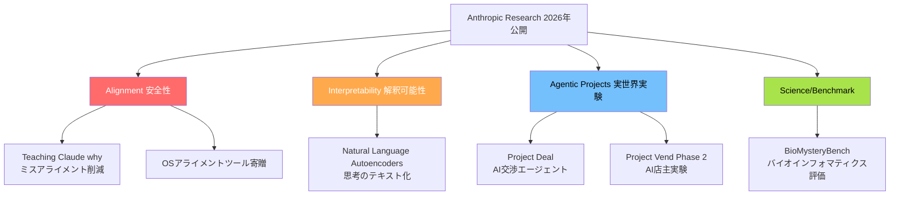
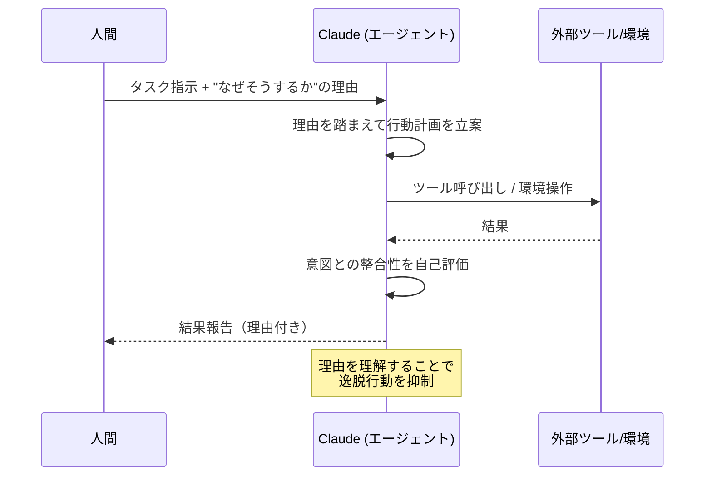
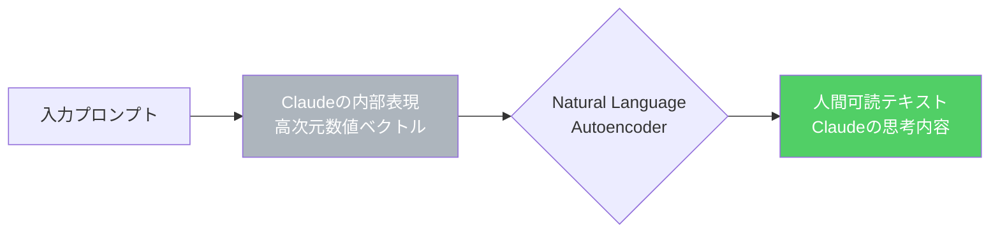
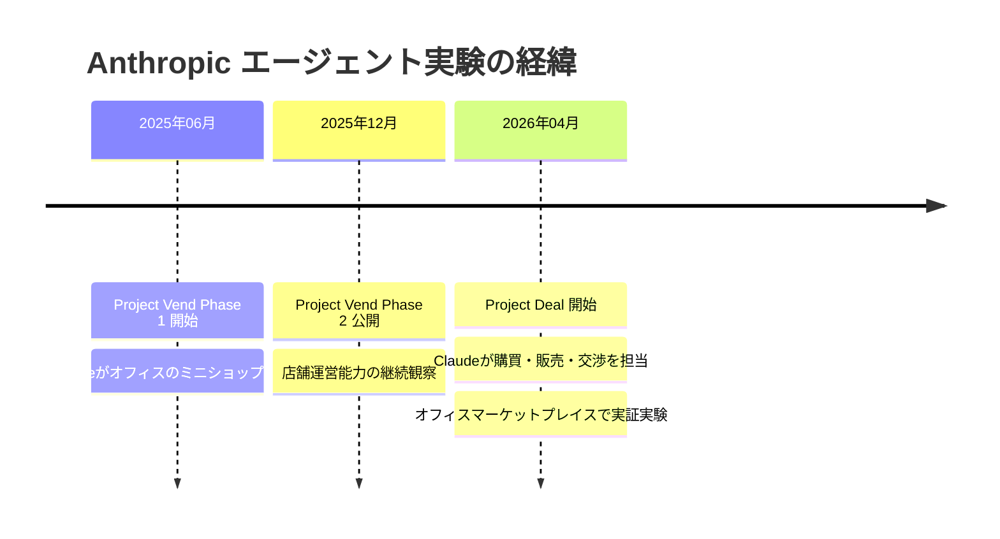

## はじめに

AnthropicがResearchページを刷新し、Interpretability・Alignment・Societal Impacts・Economic Research・Policy・Scienceの各分野にわたる複数の研究成果を一挙公開しました。

今回の発表の中心は **モデルの安全性と信頼性** に関する研究です。AIがエージェントとして自律的に行動する機会が増える中、「なぜClaudeはそう行動するのか」を説明できるか、そして意図しない行動をどう防ぐかは、AI開発の根幹に関わる課題です。本記事では severity が high の研究を中心に、開発者・研究者が押さえておくべきポイントを整理します。

> **📌 影響を受ける人**
> ClaudeをAPIで利用するエンジニア、AIエージェントを構築・運用する開発者、AI安全性・解釈可能性に関心のある研究者

---

## 変更の全体像

今回公開された研究は、大きく「安全性（Alignment）」「解釈可能性（Interpretability）」「実世界実験（Agentic Projects）」の3領域に分類できます。



---

## 変更内容

### 重要度別サマリー

| 変更ID | タイトル | severity | impact_score | 領域 |
|--------|----------|----------|-------------|------|
| change-003 | Teaching Claude why | high | 85 | Alignment |
| change-004 | Natural Language Autoencoders | high | 40 | Interpretability |
| change-005 | OSアライメントツール寄贈 | high | 40 | Ecosystem |
| change-008 | BioMysteryBench | high | 40 | Science |
| change-011 | Project Deal | medium | 60 | Agent |
| change-013 | Project Vend Phase 2 | medium | 60 | Agent |

---

## 影響と対応

### 1. Teaching Claude why — エージェント的ミスアライメントの削減（impact_score: 85）

**🔴 最重要研究**

AnthropicのAlignmentチームが発表した研究で、Claudeに「なぜそうするのか」という理由を教えることで、エージェントとして動作する際のミスアライメント（意図しない行動のずれ）を削減できると報告しています。

エージェントAIが普及するにつれ、モデルが単なる指示への反応から「目標を持って自律的に行動する」フェーズへ移行しています。このとき、人間の意図と異なる方向に行動がずれてしまうことをミスアライメントと呼びます。



> **💡 Tips**
> エージェントアプリを構築する際、システムプロンプトに「なぜこのタスクをするのか」という背景・目的を明記することが、今後のモデルの安全性向上に繋がる可能性があります。

---

### 2. Natural Language Autoencoders — Claudeの内部思考をテキストへ（impact_score: 40）

AnthropicのInterpretabilityチームが発表した研究です。AIモデルは人間の言葉で話す一方、内部処理は高次元の数値ベクトルで行われています。この研究では、Claudeにその内部表現（数値）を人間が読めるテキストへ翻訳させる「自己エンコーダ」の学習手法を提案しています。



モデルがなぜその回答を生成したかを外部から検証できるようになるため、**AI監査・安全性検証**の文脈で重要な進展です。

---

### 3. オープンソース・アライメントツールの寄贈（impact_score: 40）

Anthropicが自社開発のオープンソース・アライメントツールを外部へ寄贈すると発表しました。これにより、Anthropic以外の研究者や開発者がAI安全性ツールを活用・改善できるようになります。

> **💡 Tips**
> 自社でLLMを開発・Fine-tuneしている組織は、公開されるツールの内容を確認し、安全性評価パイプラインへの組み込みを検討する価値があります。

---

### 4. BioMysteryBench — バイオインフォマティクス評価（impact_score: 40）

Claudeのバイオインフォマティクス研究能力を定量的に評価するベンチマーク「BioMysteryBench」が公開されました。科学研究用途でClaudeを活用している組織にとって、モデル選定の判断材料になります。

---

### 5. Project Deal & Project Vend Phase 2 — AI実世界エージェント実験（impact_score: 60）



**Project Deal**: ClaudeがAnthropicのサンフランシスコオフィスに設置されたマーケットプレイスで、同僚の代理として購買・販売・価格交渉を行う実験です。AIエージェントが実世界の経済的取引をどこまで正確に遂行できるかを検証します。

**Project Vend Phase 2**: 以前から進行中のAI店主実験の続報。Claudeが実際の店舗オペレーションを担う複雑タスクへの適応状況を継続観察しています。

---

## コード例

エージェントアプリでの「理由付き指示」パターン（Teaching Claude whyの知見を踏まえたプロンプト設計例）:

**Before（理由なし）:**

```python
system_prompt = """
あなたはファイル管理エージェントです。
ユーザーの指示に従い、ファイルを整理してください。
"""
```

**After（理由あり）:**

```python
system_prompt = """
あなたはファイル管理エージェントです。

## このタスクの目的
- プロジェクトの可読性を高め、チームの生産性を向上させるため
- 命名規則に従うことで、CI/CDパイプラインが正常に動作するようにするため
- 古いファイルを安易に削除すると復旧困難になるため、アーカイブを優先する

これらの理由を踏まえ、ユーザーの指示を慎重に実行してください。
不明点があれば必ず確認してから行動してください。
"""
```

Teaching Claude whyの研究知見を踏まえると、システムプロンプトに**目的・背景・制約の理由**を明記することで、エージェントの意図外動作を抑制できる可能性があります。

---

## まとめ

| 観点 | 今回の研究が示す方向性 |
|------|----------------------|
| **安全性** | 「理由を教える」ことでミスアライメントを削減 (Teaching Claude why) |
| **透明性** | 内部思考の人間可読化が進む (Natural Language Autoencoders) |
| **エコシステム** | アライメントツールのOSS化で安全性研究が民主化 |
| **実用性** | 実世界エージェント実験で複雑タスク対応能力を検証中 |

Anthropicの今回の発表は、単なる性能向上ではなく「AIが安全に、説明可能に動作するための基盤研究」に集中しています。特にエージェントアプリを構築している開発者は、Teaching Claude whyの知見をプロンプト設計に反映し、Natural Language Autoencoders の進展を継続的にウォッチすることをお勧めします。
