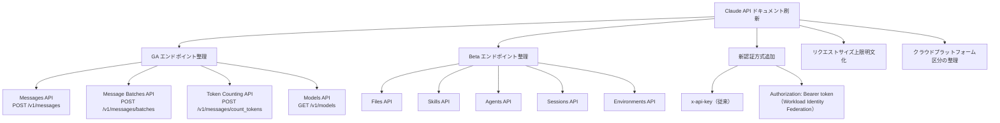
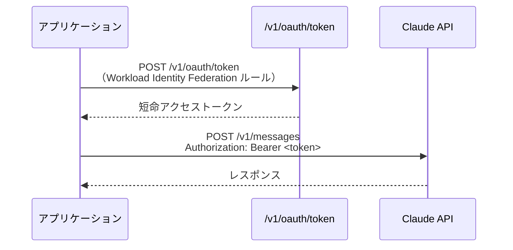
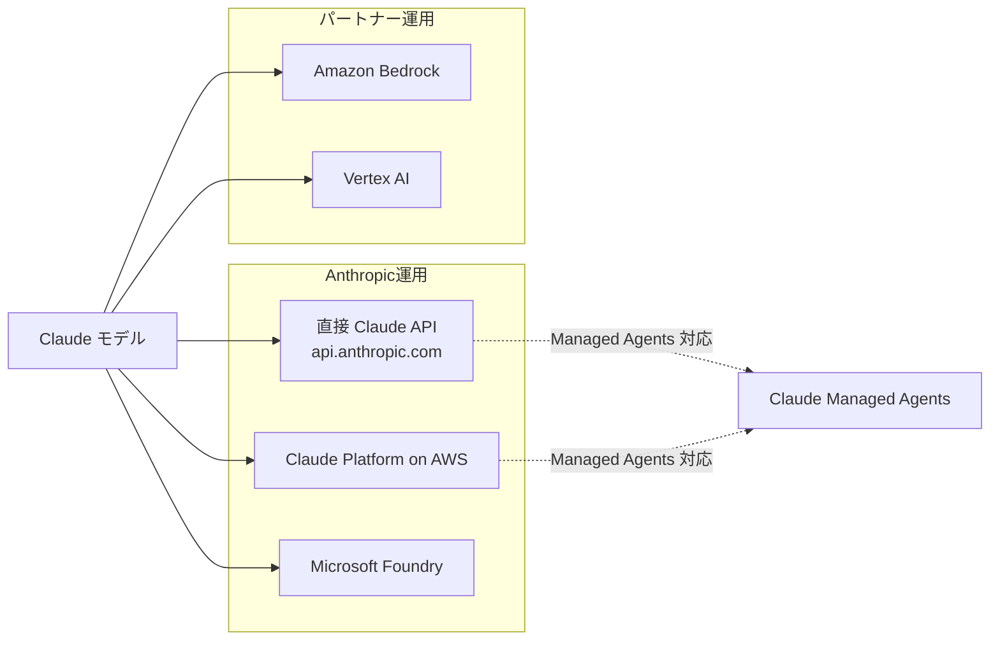

## はじめに

2026年5月22日、Anthropic の Claude API ドキュメントが大幅に再構成されました。従来の「Client SDKs」ページが「Using the API」ガイドへと刷新され、**GA（一般提供）と Beta のエンドポイントが明確に整理**されました。

さらに、**Workload Identity Federation による Bearer トークン認証**が正式にサポートされ、エンドポイントごとのリクエストサイズ上限も明文化されています。Claude を使った開発・運用に関わるすべての方に影響がある変更です。

> **📌 影響を受ける人**
> - Claude API を直接利用している開発者
> - Managed Agents / Agentic システムを構築・運用中のチーム
> - AWS / Google Cloud / Azure 経由で Claude を利用している方
> - CI/CD パイプラインや本番環境で Claude API を呼び出しているエンジニア

---

## 変更の全体像



---

## 変更内容

### 1. GA / Beta エンドポイントの体系化

旧ドキュメントでは SDK 中心の案内にとどまっていましたが、今回の刷新で Claude API が `https://api.anthropic.com` の RESTful API であることを明示しつつ、各エンドポイントのステータスが整理されました。

| ステータス | エンドポイント | メソッド | 備考 |
|:---:|:---|:---|:---|
| **GA** | Messages API | `POST /v1/messages` | メイン推論エンドポイント |
| **GA** | Message Batches API | `POST /v1/messages/batches` | **50% コスト削減** |
| **GA** | Token Counting API | `POST /v1/messages/count_tokens` | 事前トークン数見積もり |
| **GA** | Models API | `GET /v1/models` | 利用可能モデル一覧 |
| **Beta** | Files API | — | ファイルアップロード管理 |
| **Beta** | Skills API | — | Managed Agents 向けスキル定義 |
| **Beta** | Agents API | — | エージェント実行管理 |
| **Beta** | Sessions API | — | セッション状態管理 |
| **Beta** | Environments API | — | 実行環境の設定・管理 |

> **⚠️ Breaking Change**
> Beta エンドポイント（Files, Skills, Agents, Sessions, Environments）は仕様変更の可能性があります。本番環境への導入前に、変更履歴を継続的に確認することを強く推奨します。

### 2. Workload Identity Federation による Bearer トークン認証

従来の `x-api-key` に加え、短命アクセストークンを使った Bearer 認証が正式にサポートされました。CI/CD パイプラインや、複数サービス間での認証統合においてセキュリティ強化に直結する変更です。



**必須ヘッダーの整理**

| ヘッダー | 必須/任意 | 説明 |
|:---|:---:|:---|
| `x-api-key` | どちらか必須 | 従来の API キー認証 |
| `Authorization: Bearer <token>` | どちらか必須 | WIF による短命トークン認証 |
| `anthropic-version` | **必須** | API バージョン指定 |
| `content-type: application/json` | **必須** | リクエスト形式 |

### 3. エンドポイント別リクエストサイズ上限の明文化

上限を超えると `413 request_too_large` エラーが返されます。大容量データを扱うシステムでは事前に確認が必要です。

| エンドポイント | 直接 Claude API | Vertex AI | Bedrock |
|:---|:---:|:---:|:---:|
| Messages / Token Counting / Sessions / Agents / Environments | **32 MB** | 30 MB | 20 MB |
| Message Batches | **256 MB** | — | — |
| Files | **500 MB** | — | — |

> **💡 Tips**
> Claude Platform on AWS は直接 Claude API と同一の上限が適用されます。Vertex AI・Bedrock 経由の場合はクラウド側の独自上限（それぞれ 30MB / 20MB）に注意してください。

### 4. クラウドプラットフォーム提供形態の整理

Claude の利用経路が明確に分類されました。



**Claude Managed Agents が使えるのは直接 Claude API と Claude Platform on AWS のみ**です。Bedrock や Vertex AI 経由では Managed Agents を利用できない点に注意してください。

---

## 影響と対応

### すぐに確認すべきこと

1. **Managed Agents を使っている場合**
   - 利用している Agents / Sessions / Environments API が Beta であることを認識し、変更通知を追う体制を整える
   - Bedrock / Vertex AI 経由で Managed Agents を利用しようとしている場合は、直接 API か Claude Platform on AWS への移行を検討する

2. **大容量データを扱うシステム**
   - Vertex AI 経由なら 30MB、Bedrock 経由なら 20MB の上限に引っかかっていないか確認する
   - Files API（Beta, 500MB）を使うことで大容量ファイルの送受信を効率化できる

3. **CI/CD パイプラインや IAM 統合を検討中の場合**
   - Workload Identity Federation を使った Bearer トークン認証に移行すると、長命な API キーをシークレットとして管理するリスクを低減できる

4. **Message Batches API を未使用の場合**
   - GA ステータスで 50% コスト削減が可能。大量リクエストをバッチ処理に切り替えるだけでコストを半減できる

---

## コード例

### Before: 従来の API キー認証

```python
import anthropic

client = anthropic.Anthropic(api_key="sk-ant-...")

response = client.messages.create(
    model="claude-opus-4-7-20251101",
    max_tokens=1024,
    messages=[{"role": "user", "content": "Hello"}],
)
```

### After: Bearer トークン認証（Workload Identity Federation）

```python
import anthropic
import httpx

# Workload Identity Federation でトークンを取得
token_response = httpx.post(
    "https://api.anthropic.com/v1/oauth/token",
    json={"grant_type": "workload_identity_federation", ...},
)
access_token = token_response.json()["access_token"]

# Bearer トークンで Claude API を呼び出す
client = anthropic.Anthropic(
    auth_token=access_token,  # api_key の代わりに Bearer トークンを使用
)

response = client.messages.create(
    model="claude-opus-4-7-20251101",
    max_tokens=1024,
    messages=[{"role": "user", "content": "Hello"}],
)
```

### Message Batches API（50% コスト削減）

```python
import anthropic

client = anthropic.Anthropic(api_key="sk-ant-...")

# 複数リクエストをバッチで送信
batch = client.messages.batches.create(
    requests=[
        {
            "custom_id": "req-1",
            "params": {
                "model": "claude-opus-4-7-20251101",
                "max_tokens": 1024,
                "messages": [{"role": "user", "content": "タスク1の内容"}],
            },
        },
        {
            "custom_id": "req-2",
            "params": {
                "model": "claude-opus-4-7-20251101",
                "max_tokens": 1024,
                "messages": [{"role": "user", "content": "タスク2の内容"}],
            },
        },
    ]
)

print(f"Batch ID: {batch.id}")
# 処理完了後に結果を取得（非同期）
```

---

## まとめ

今回の Claude API ドキュメント刷新は、単なる情報整理にとどまらず、今後の機能拡張の方向性を示す重要なアップデートです。

| 変更点 | 重要度 | 対応の緊急度 |
|:---|:---:|:---:|
| GA/Beta エンドポイントの体系化 | 🔴 高 | すぐに確認 |
| Workload Identity Federation 認証 | 🔴 高 | セキュリティ要件に応じて検討 |
| リクエストサイズ上限の明文化 | 🟡 中 | 大容量データ利用時は即確認 |
| クラウドプラットフォーム区分の整理 | 🟡 中 | Managed Agents 利用者は要確認 |

特に **Managed Agents 系の API（Agents / Sessions / Skills / Environments）はすべて Beta** であり、仕様変更が今後も起こり得ます。本番利用する場合はフォールバック設計や変更通知の購読を強く推奨します。また、**Message Batches API は GA で 50% コスト削減**という強力なメリットがあるため、まだ使っていない方はすぐに検討する価値があります。
