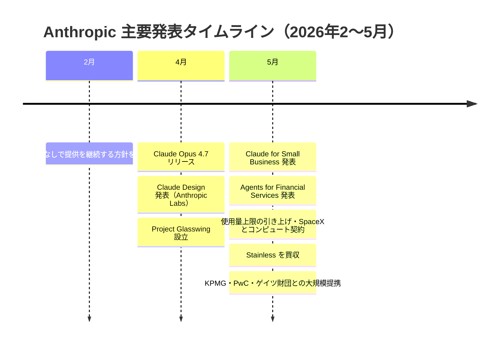
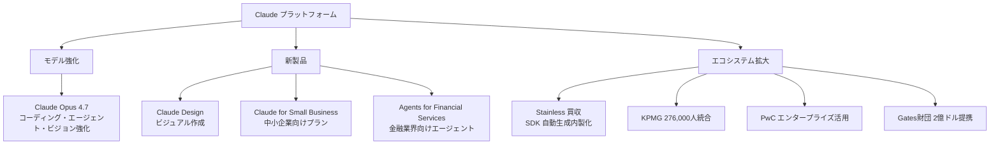
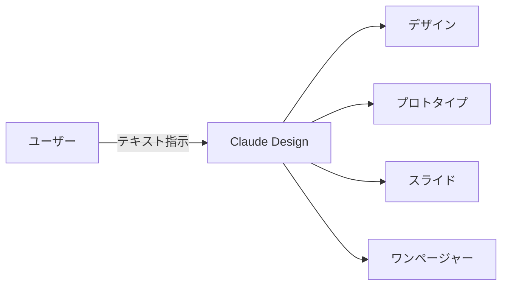
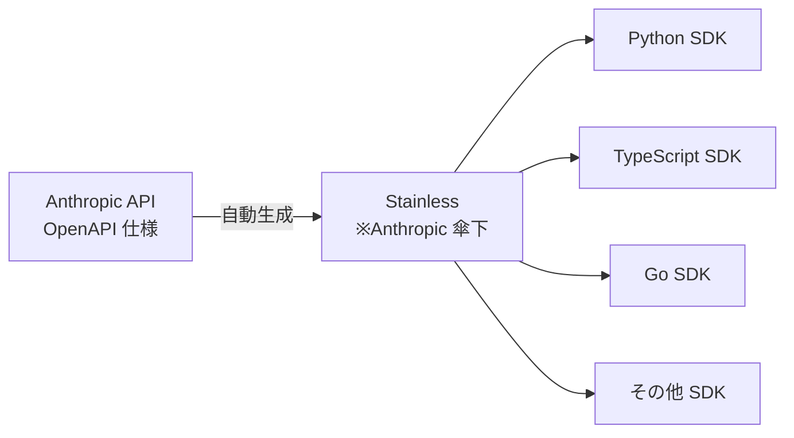
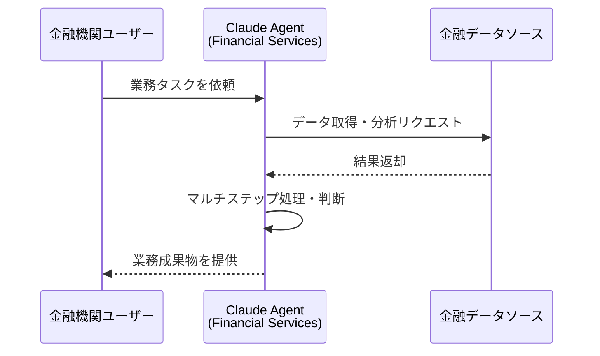

## はじめに

2026年春、Anthropic から製品・事業の両面にわたる大規模なアップデートが相次いで発表されました。新モデル **Claude Opus 4.7** のリリース、デザイン特化の新製品 **Claude Design**、SDK 生成企業 **Stainless の買収**、**中小企業向け・金融業界向けプラン**の新設など、API を日常的に使う開発者にとっても、ビジネスで Claude を活用する企業にとっても見逃せない内容が続いています。

本記事では severity が high 以上の変更を中心に整理し、「誰に何の影響があるか」「何をすべきか」をわかりやすく解説します。

> **📌 影響を受ける人**
> - Claude API / SDK を利用している開発者
> - Claude を業務に導入している・検討している企業担当者
> - AI エージェントを構築している技術者

## 変更の全体像

2026年2月〜5月にかけての Anthropic の動きを俯瞰してみます。



製品・エコシステムの観点で見ると、Claude はモデルの高性能化だけでなく、**縦（業界・規模別の特化製品）** と **横（エンタープライズパートナーの拡大）** の両軸で急速に展開していることがわかります。



## 変更内容

### 1. Claude Opus 4.7 リリース

2026年4月16日にリリースされた **Claude Opus 4.7** は、コーディング・エージェント・ビジョン・複雑なマルチステップタスクにおける性能が強化された最新の Opus モデルです。特に重要な作業における「徹底性」と「一貫性」が改善されています。

| 強化された領域 | 内容 |
|---|---|
| コーディング | より高精度なコード生成・レビュー |
| エージェント動作 | マルチステップタスクの一貫性向上 |
| ビジョン | 画像理解・マルチモーダル性能の向上 |
| 複雑タスク | 長時間タスクにおける徹底性の強化 |

API で Opus 系モデルを固定指定している場合は、モデル ID の更新を検討してください。

### 2. Claude Design 発表（Anthropic Labs）

2026年4月17日、**Claude Design** が Anthropic Labs の新製品として発表されました。Claude と協働してデザイン・プロトタイプ・スライド・ワンページャーなどのビジュアル作品を作成できる製品です。



コードなしでデザイン成果物を生み出せる点が特徴であり、デザイナーとの協働や非エンジニア職のセルフサービス化を後押しするプロダクトです。

> **💡 Tips**
> Claude Design は現時点では Anthropic Labs の発表段階です。一般提供のタイミングについては公式情報を継続的に確認してください。

### 3. Stainless を買収

2026年5月18日、Anthropic は **SDK 自動生成プラットフォーム** を提供する **Stainless** を買収しました。Stainless は OpenAPI 仕様から品質の高い多言語 SDK を自動生成するツールで、Anthropic を含む多くの API プロバイダーが利用していました。



この買収により、Anthropic の SDK 品質・開発速度のさらなる向上が期待されます。将来的には SDK のリリースサイクルが短縮されたり、マルチ言語対応が拡充したりする可能性があります。

> **📌 影響を受ける人**
> `anthropic-sdk-python` や `anthropic-sdk-typescript` など公式 SDK を利用している開発者全員が恩恵を受ける見込みです。破壊的変更が伴うアップデートが来た際はリリースノートを必ず確認してください。

### 4. Claude for Small Business

2026年5月13日に発表された **Claude for Small Business** は、中小企業向けに最適化された新プランです。これまで個人向けプランと大企業向けエンタープライズプランの間にあったギャップを埋める選択肢となります。

| プラン | 対象 | 備考 |
|---|---|---|
| Claude.ai 個人プラン | 個人ユーザー | 既存 |
| **Claude for Small Business** | **中小企業** | **新設** |
| Claude Enterprise | 大企業 | 既存 |

チームでの利用、管理機能の必要性、コストのバランスを考慮してプラン選択の検討をおすすめします。

### 5. 使用量上限の引き上げ（SpaceX とのコンピュート契約）

2026年5月6日、Claude の **ユーザー使用量上限が引き上げ**られ、コンピュートリソース確保のために SpaceX と契約を締結したことが発表されました。インフラ面での体制を強化することで、需要増加への対応力を高めたものと見られます。

> **💡 Tips**
> 使用量上限の引き上げはヘビーユーザーにとって直接的なメリットです。レート制限エラー（`RateLimitError`）の発生頻度が改善している場合は、リトライロジックのパラメーターも見直す好機です。

### 6. Agents for Financial Services

2026年5月5日、**金融サービス業界向けに特化したエージェントソリューション**が発表されました。コンプライアンス要件が厳しい金融業界向けに最適化されており、証券・銀行・保険などの領域での活用が想定されます。



### 7. 大規模エンタープライズパートナーシップ

| パートナー | 内容 | 発表日 |
|---|---|---|
| KPMG | 276,000人・コア業務へ全社統合 | 2026年5月19日 |
| PwC | クライアント技術構築・案件遂行に活用 | 2026年5月14日 |
| ビル&メリンダ・ゲイツ財団 | 2億ドル規模のパートナーシップ締結 | 2026年5月14日 |
| Blackstone / Goldman Sachs ほか | 新エンタープライズ AI サービス企業設立 | 2026年5月4日 |

Big4 コンサルの KPMG・PwC を含む大手企業との提携が相次いでおり、Claude のエンタープライズ市場への浸透が加速していることがわかります。

## 影響と対応

### 開発者・エンジニア向け

1. **Claude Opus 4.7 への移行検討**: 既存アプリケーションで Opus 系モデルを使用している場合は、新モデル ID への更新を検討してください
2. **SDK のアップデート監視**: Stainless 買収に伴い SDK の更新が加速する可能性があります。`CHANGELOG` やリリースノートの定期チェックを習慣化しましょう
3. **レート制限ロジックの見直し**: 使用量上限引き上げに合わせ、リトライやバックオフのパラメーターを最適化するチャンスです

### 中小企業・スタートアップ向け

- **Claude for Small Business** の詳細仕様・価格を確認し、現在のプランとのコスト・機能比較を行いましょう
- チーム管理機能や SSO が必要かどうかによって適切なプランが変わります

### 金融業界の開発者・担当者向け

- **Agents for Financial Services** のコンプライアンス対応範囲を確認し、自社の規制要件（金融商品取引法・銀行法など）との適合性を評価してください
- エージェントが扱うデータの機密性・監査証跡の要件にも注意が必要です

## コード例

### Claude Opus 4.7 を使った基本的な API 呼び出し

```python
import anthropic

client = anthropic.Anthropic()

message = client.messages.create(
    model="claude-opus-4-7",  # 最新 Opus モデル
    max_tokens=1024,
    messages=[
        {
            "role": "user",
            "content": "このコードのセキュリティ上の問題点を洗い出してください。"
        }
    ]
)

print(message.content)
```

### ツール使用（Tool Use）でエージェント的なマルチステップ処理

Opus 4.7 の強化された点はエージェント動作の一貫性です。Tool Use と組み合わせることでその恩恵を最大限に受けられます。

```python
import anthropic

client = anthropic.Anthropic()

tools = [
    {
        "name": "analyze_code",
        "description": "コードの品質・セキュリティを分析する",
        "input_schema": {
            "type": "object",
            "properties": {
                "code": {
                    "type": "string",
                    "description": "分析対象のコード"
                },
                "language": {
                    "type": "string",
                    "description": "プログラミング言語"
                }
            },
            "required": ["code", "language"]
        }
    }
]

response = client.messages.create(
    model="claude-opus-4-7",
    max_tokens=2048,
    tools=tools,
    messages=[
        {
            "role": "user",
            "content": "以下の Python コードのセキュリティ問題を分析してください:\n\ndef get_user(user_id):\n    query = f'SELECT * FROM users WHERE id = {user_id}'\n    return db.execute(query)"
        }
    ]
)

print(response.content)
```

**Before（旧モデル）** と **After（Opus 4.7）** の違いは、複数ツールを連鎖させる複雑なタスクで特に顕著です。長いコンテキストを維持しながら複数ステップを一貫性をもって処理できるようになっています。

## まとめ

今回の Anthropic からの一連の発表を整理すると、以下の3つのトレンドが見えてきます。

| トレンド | 代表的な変更 | 開発者への影響 |
|---|---|---|
| モデル性能の継続的向上 | Claude Opus 4.7 | エージェント・コーディング品質の改善 |
| 製品の縦展開（業界・規模別） | Claude Design / Claude for Small Business / Agents for Financial Services | 自社のユースケースに合ったプラン選択が重要に |
| エコシステムの横展開 | Stainless 買収・各種大型提携 | SDK 品質向上・エンタープライズ普及加速 |

特に API 開発者にとって直近の注目ポイントは、**Claude Opus 4.7 への移行検討** と **Stainless 買収に伴う SDK の品質・更新頻度の向上への期待** です。Anthropic の動きは今後も続くと予想されるため、公式ドキュメントやリリースノートの定期チェックを習慣化しておくことをおすすめします。
