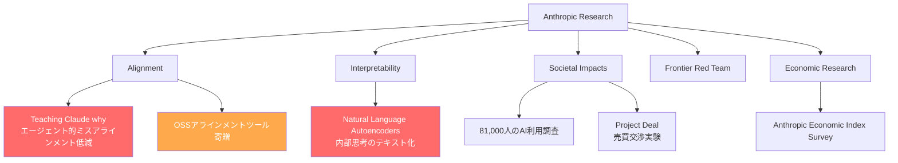
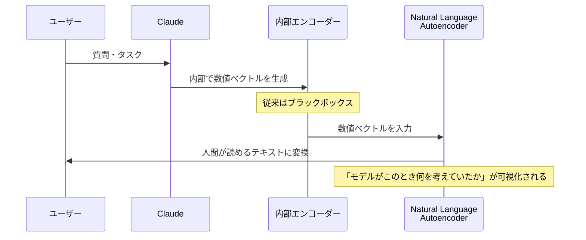
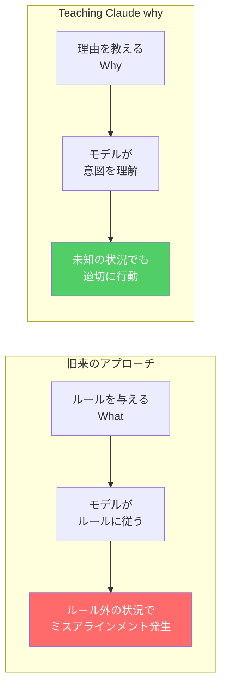
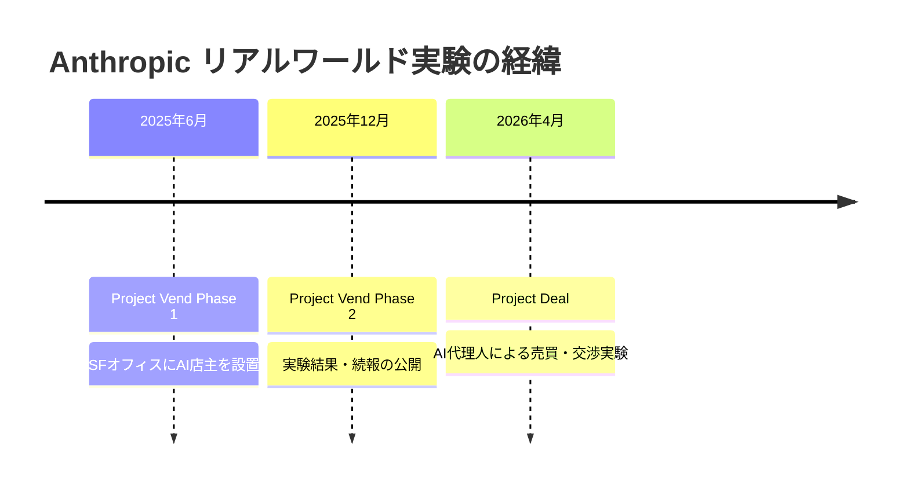

## はじめに

2026年5月、AnthropicはリサーチページをリニューアルしAI安全性・解釈性に関する複数の重要な研究・プロジェクトを一挙公開しました。

特に注目すべきは以下の3点です。

- **Project Glasswing**: 新たな重点プロジェクトの立ち上げ
- **Natural Language Autoencoders**: Claudeの「内部思考」を人間が読めるテキストに変換する技術
- **Teaching Claude why**: エージェント利用時のミスアラインメント低減手法

AIエージェントの実用化が進む今、モデルが「なぜその行動を取るか」を理解・制御する研究は開発者・利用者双方にとって直接的な意義を持ちます。

> **📌 影響を受ける人**
> - Claude APIを使ってエージェントアプリケーションを開発している方
> - AIの解釈性・安全性に関心のある研究者・エンジニア
> - AnthropicのAI戦略や研究動向を追っている方

---

## 変更の全体像

今回公開された研究群は、Anthropicの5つの研究チームにまたがっています。

---

## 主要な研究内容

### 1. Natural Language Autoencoders — AIの「内部思考」を読む

**Interpretabilityチーム** が2026年5月7日に発表した研究です。

AIモデルは自然言語で出力しますが、内部では数値ベクトル（埋め込み表現）で「思考」しています。この研究では、Claudeの内部表現を人間が読めるテキストに変換するオートエンコーダーを訓練しました。

**なぜ重要か**

モデルの内部状態が言語化できれば、意図しない推論パターンの早期発見やデバッグが可能になります。「なぜこの回答をしたのか」がブラックボックスから抜け出す第一歩です。

---

### 2. Teaching Claude why — エージェント的ミスアラインメントの低減

**Alignmentチーム** が2026年5月8日に発表した研究です。

エージェント的ミスアラインメントとは、AIエージェントが開発者・ユーザーの意図とずれた目標に向けて行動してしまう現象です。長期タスクや自律的な意思決定が求められるエージェント利用では特に問題になります。

**こんな人に影響がある**

Claude APIを使ったエージェント開発者は、この研究成果がClaudeのモデルトレーニングに反映されることで、自律的なタスク処理における信頼性向上を期待できます。

---

### 3. Project Glasswing — 新たな重点取り組み

2026年5月22日付でAnnouncementsカテゴリに最新エントリとして掲載されました。詳細は現時点では公開されていませんが、Anthropicの公式発表群の中で最上位にリストされていることから、同社の新たな重点プロジェクトと見られます。

> **💡 Tips**
> Project Glasswingの詳細はAnthropicの公式ページで随時更新予定です。Announcementsカテゴリを定期的に確認することを推奨します。

---

### 4. OSSアラインメントツールの寄贈

**Alignmentチーム** が開発したアラインメントツールをオープンソースコミュニティに寄贈することを発表しました（2026年5月7日付）。

これにより、Anthropic社外の研究者・開発者がAnthropicのアラインメント手法を活用・改善できる環境が整います。AI安全性研究のエコシステム拡大に向けた重要な動きです。

---

## Anthropicの研究チーム体制

今回のリサーチページ公開により、Anthropicの研究組織構造が明確になりました。

| チーム | 主な役割 |
|---|---|
| Alignment | モデルのリスク理解と安全性確保、ミスアラインメント低減 |
| Interpretability | LLMの内部動作の理解・可視化 |
| Societal Impacts | 現実世界でのAI利用パターン調査 |
| Frontier Red Team | サイバー・バイオセキュリティ・自律システムにおけるリスク分析 |
| Economic Research | AI経済影響の測定・追跡 |

---

## リアルワールド実験: Project Deal

**2026年4月24日**、AnthropicはSFオフィス内でClaudeに従業員の代理として商品の売買・交渉を行わせる実験「Project Deal」を発表しました。2025年6月の「Project Vend（AI店主実験）」に続くリアルワールドタスクへのAI適用実験です。

**こんな人に影響がある**

エージェントに実際のビジネスオペレーション（交渉・意思決定・取引）を担わせることを検討している開発者にとって、実世界でのClaudeの振る舞いを示す貴重な事例です。

---

## 81,000人調査: ユーザーはAIに何を求めているか

**Societal ImpactsチームとEconomic Researchチーム** が連携し、Claude.aiユーザー約81,000人を対象とした大規模調査を実施しました（2026年3月〜4月発表）。史上最大規模かつ最多言語の定性調査です。

- **What 81,000 people want from AI**（Societal Impacts）: AIの利用方法・期待・懸念
- **What 81,000 people told us about the economics of AI**（Economic Research）: AI経済影響の視点

同一の調査データを「ユーザー行動」と「経済影響」の2軸で分析した点が特徴です。

---

## まとめ

今回のAnthropicリサーチページ公開は、単なる情報整理ではなく、AI安全性・解釈性研究の現状を体系的に示すものです。

**開発者が注目すべきポイント**:

1. **Natural Language Autoencoders**: モデルの内部思考可視化は、エージェントのデバッグや信頼性検証に新しい手段をもたらす可能性があります
2. **Teaching Claude why**: 「ルールではなく理由を教える」アプローチは、エージェントアプリの安全設計の考え方にも影響を与えます
3. **OSSアラインメントツール**: 公開後はAlignmentエンジニアリングの実践に活用できます
4. **Project Glasswing**: 詳細公開に注目。Anthropicの次の重点領域を示す可能性があります

AI研究の最前線が急速に進む中、解釈性と安全性の両面で具体的な技術進展が生まれていることは、実用レベルでのAIエージェント展開に向けた確かな土台となっています。
