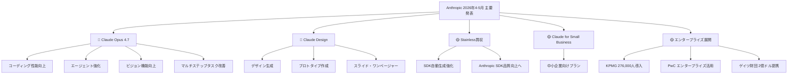
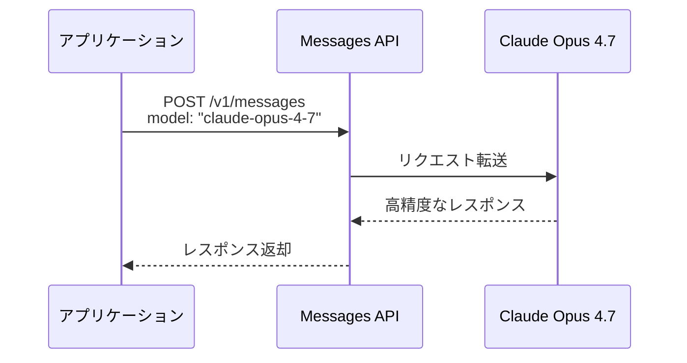
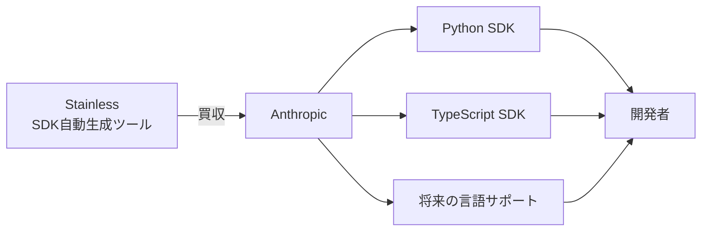
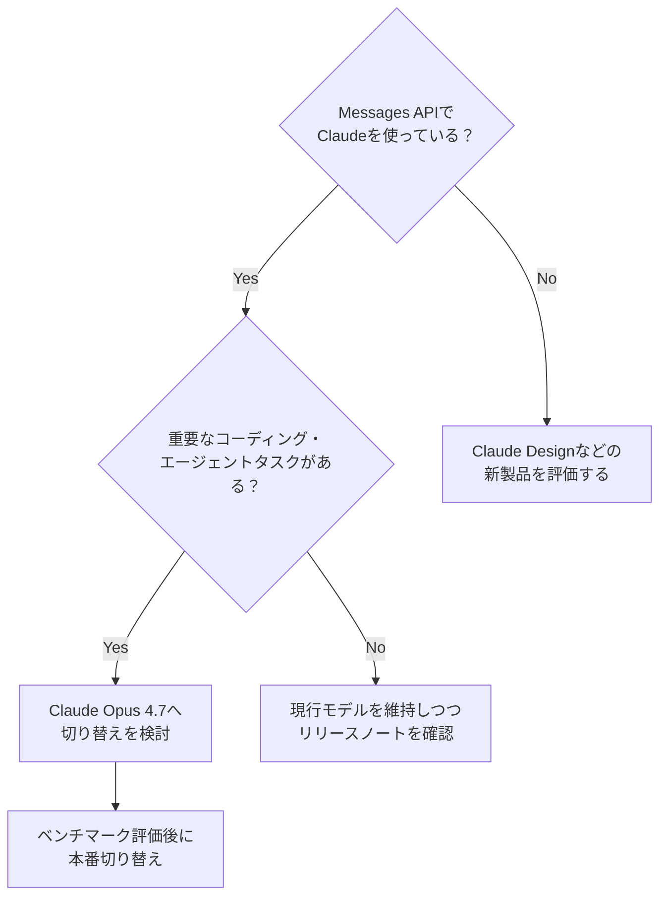

## はじめに

2026年4〜5月にかけて、Anthropicから多数の重要発表が相次いだ。最も注目すべきは **Claude Opus 4.7** の登場と、新製品 **Claude Design** のローンチ、そして **Stainless買収** によるSDK開発体制の強化だ。

本記事では、開発者・AIエンジニアが特に把握すべき変更を中心に整理する。「自社プロダクトでClaudeを使っている」「Anthropic APIを利用している」人にとって直接影響のある情報を優先して解説する。

> **📌 影響を受ける人**
> - Messages API経由でClaudeを呼び出しているエンジニア
> - Anthropic SDKを使ってアプリを開発している開発者
> - 中小企業・エンタープライズでのAI活用を検討しているビジネスパーソン

---

## 変更の全体像



---

## 変更内容

### 🔴 [Critical] Claude Opus 4.7 の発表

**2026年4月16日発表。Messages APIで利用可能。**

Claude Opus 4.7は、Anthropicの最新かつ最上位モデルとして登場した。従来のOpus系と比較して、以下の領域で性能が向上している。

| 改善領域 | 概要 |
|---|---|
| コーディング | より正確なコード生成・デバッグ |
| エージェント | 自律的なマルチステップ実行の精度向上 |
| ビジョン | 画像理解・解析能力の強化 |
| マルチステップタスク | 徹底性と一貫性の改善 |

**モデルIDについては公式ドキュメントで最新の識別子を確認すること。**



> **💡 Tips**
> 現在 `claude-opus-4-6` 等の旧モデルを使っている場合、Opus 4.7への切り替えでコーディングエージェントの品質が向上する可能性がある。特に複数ステップにわたる自律エージェント構築をしているチームは優先的に評価したい。

---

### 🔴 [High] Claude Design の発表

**2026年4月17日、Anthropic Labsより発表。**

「Claude Design」は、Claudeと協力してビジュアル成果物を生成する新製品だ。

- デザイン（UI/UXモックアップ等）
- インタラクティブなプロトタイプ
- プレゼンテーションスライド
- ワンページャー・資料

デザイナーや非エンジニアがClaudeを使って洗練されたビジュアルを作れるようになる点が特徴。Anthropic Labsブランドでの提供のため、まずは限定公開・実験的提供となる見込み。

> **📌 影響を受ける人**
> - デザイナーや企画担当者でAIツールを探している人
> - 社内資料・提案書をAIで効率化したいビジネスパーソン
> - Figma等のデザインツール活用に限界を感じているエンジニア

---

### 🟡 [High] AnthropicがStainlessを買収

**2026年5月18日発表。**

StainlessはAPIのSDKを自動生成するツールを提供する企業で、すでに **Anthropic SDKの開発にも利用されていた**。この買収により、Anthropic SDKの開発・メンテナンス体制が内製化・強化されることが予想される。



**開発者への直接的な影響は現時点では限定的** だが、長期的にはSDKの品質・サポート言語の拡充・ドキュメントの改善につながる可能性がある。SDKのメジャーアップデートには注意を払っておきたい。

---

### 🟡 [High] Project Glasswing：重要ソフトウェアのセキュリティ確保イニシアチブ

**2026年4月7日発表。2026年5月22日に初回アップデート公開。**

AWS、Anthropic、Apple、Google、Microsoft、NVIDIA、Cisco、CrowdStrike、JPMorganChase、Linux Foundation、Palo Alto Networksなど主要企業が参画する、世界の重要ソフトウェアのセキュリティ強化を目指す業界横断イニシアチブ。

AIが重要インフラのコードを扱うようになる中で、サプライチェーンセキュリティや脆弱性対応に業界が連携して取り組む動きとして注目される。

---

### 🟡 [High] Claude for Small Business の発表

**2026年5月13日発表。**

中小企業向けの新プラン「Claude for Small Business」が登場した。これまでのTeamsプランやEnterpriseプランよりも小規模な組織がAIを導入しやすくするための製品・価格体系と見られる。

> **📌 影響を受ける人**
> - スタートアップや中小企業でClaudeの業務利用を検討している担当者
> - 現行プランのコストに課題を感じているチーム

---

## 影響と対応



| 変更 | 対応優先度 | アクション |
|---|---|---|
| Claude Opus 4.7 | ★★★ 高 | 評価環境でベンチマーク実施、モデルID更新 |
| Claude Design | ★★ 中 | Anthropic Labsページでウェイトリスト確認 |
| Stainless買収 | ★ 低（監視） | SDKのChangelog・リリースノートを定期確認 |
| Claude for Small Business | ★★ 中 | 自社プランとの比較・コスト試算 |
| Project Glasswing | ★ 低（監視） | セキュリティアップデートの情報収集 |

---

## コード例

### Claude Opus 4.7 への切り替え（Python SDK）

**Before（旧モデル使用）:**

```python
import anthropic

client = anthropic.Anthropic()

message = client.messages.create(
    model="claude-opus-4-6",  # 旧モデル
    max_tokens=1024,
    messages=[
        {"role": "user", "content": "このコードをリファクタリングしてください。"}
    ]
)
print(message.content)
```

**After（Opus 4.7へ更新）:**

```python
import anthropic

client = anthropic.Anthropic()

message = client.messages.create(
    model="claude-opus-4-7",  # 最新モデルに更新
    max_tokens=1024,
    messages=[
        {"role": "user", "content": "このコードをリファクタリングしてください。"}
    ]
)
print(message.content)
```

### エージェントタスクでの活用例（TypeScript SDK）

```typescript
import Anthropic from "@anthropic-ai/sdk";

const client = new Anthropic();

async function runCodingAgent(task: string) {
  const response = await client.messages.create({
    model: "claude-opus-4-7", // マルチステップタスクに最適化
    max_tokens: 4096,
    system:
      "あなたはコーディングエージェントです。与えられたタスクを段階的に実行してください。",
    messages: [{ role: "user", content: task }],
    tools: [
      // ツール定義をここに追加
    ],
  });

  return response;
}
```

> **💡 Tips**
> Opus 4.7はマルチステップタスクの「徹底性と一貫性」が向上しているため、ツール呼び出しを繰り返すエージェント実装では特に効果が出やすい。まずはコスト・レイテンシを測定した上で本番投入を判断すること。

---

## まとめ

2026年4〜5月のAnthropicは、**モデル・製品・エコシステム**の3軸で大きく前進した。

- **Claude Opus 4.7**：コーディング・エージェント・ビジョンで性能向上。Messages API利用者は評価・移行を検討すべき最重要変更
- **Claude Design**：Anthropic Labsの新製品。ビジュアル生成の民主化を狙う
- **Stainless買収**：SDK品質向上への長期投資。将来のアップデートに注目
- **Claude for Small Business**：中小企業への展開加速
- **エンタープライズ提携**：KPMG・PwC・ゲイツ財団等、大規模採用が加速中

エンジニアとして最優先で確認すべきは **Claude Opus 4.7への切り替え評価** だ。特にコーディングエージェントや複雑なマルチステップ処理を実装しているチームは、早期に検証環境で性能比較を行うことを推奨する。
