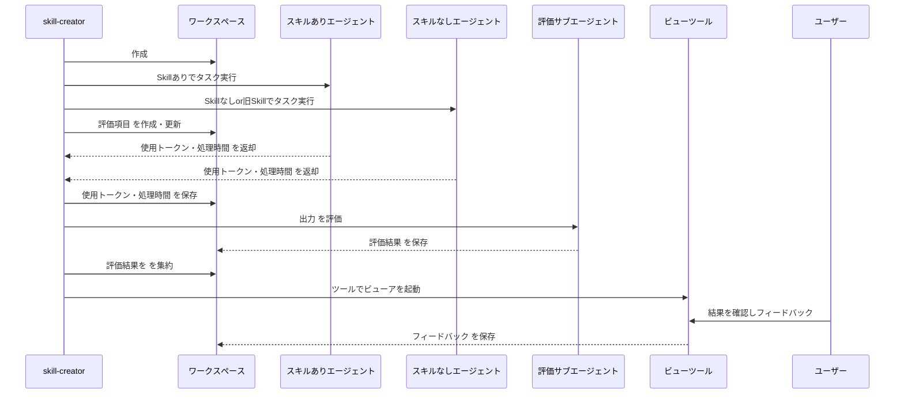

## 背景

Anthropic の Agent Skills のベストプラクティスでは、Skill の作成において「評価駆動開発」が推奨されています。

ただ、最初に読んだときに疑問に思ったのは、

> 評価駆動で具体的にどう評価するの？

という点でした。

「Skill を作る前に評価を作る」と言われても、実際には何を比較し、何を採点し、どう改善に使うのかが分かりにくいです。

そこで、Anthropic が公開している公式 Skill である `skill-creator` と、そこから呼び出される `agents/grader.md` を読むと、評価駆動の具体例としてかなり参考になる構成となっていました。

## ガイドラインの記載について

[Anthropic のベストプラクティス](https://platform.claude.com/docs/ja/agents-and-tools/agent-skills/best-practices#)では、広範なドキュメントを書く前に評価を作ることが推奨されています。

> **広範なドキュメントを作成する前に評価を作成します。** これにより、スキルが想像上のものではなく実際の問題を解決することを確認します。

さらに、評価駆動開発の流れとして、以下のように説明されています。

> **評価駆動開発：**
>
> 1. **ギャップを特定する：** スキルなしで Claude を代表的なタスクで実行します。具体的な失敗または欠落しているコンテキストを文書化します
> 2. **評価を作成する：** これらのギャップをテストする 3 つのシナリオを構築します
> 3. **ベースラインを確立する：** スキルなしで Claude のパフォーマンスを測定します
> 4. **最小限の指示を書く：** ギャップに対処して評価に合格するのに十分なコンテンツのみを作成します
> 5. **反復する：** 評価を実行し、ベースラインと比較し、改善します

ポイントは、「Skill を作ってから何となく確認する」のではなく、まず Skill なしのベースラインを作成してから Skill の作成に着手している点です。

先に失敗パターンや不足コンテキストを観測し、その差分を埋める形で Skill を実装していくため、「本当に改善したのか」を比較しやすくなっています。

## スキルクリエーターにおける評価方法

[skill-creator](https://github.com/anthropics/skills/tree/main/skills/skill-creator) の `Running and evaluating test cases` では、評価の流れがかなり具体的に定義されています。

下記はskill-creatorの評価の部分をリバースしたものになります。

各種結果は集約され、Skill あり・なしの比較ができるようになっています。

主な評価項目を整理すると、以下のようになります。

| 判定方式   | 観点               | 具体的な評価方法                                              |
| ------ | ---------------- | ----------------------------------------------------- |
| 自動     | 合計経過時間           | 実行完了時のタスク通知から `duration_ms` を取得する    |
| 自動     | トークン数            | 実行完了時のタスク通知から `total_tokens` を取得する   |
| 自動     | 出力サイズ            | `execution_metrics.output_chars` として出力文字数を集計          |
| AI判定   | 評価項目の合否  | 評価エージェントが作業ログや最終出力から判定               |
| AI判定   | 事実 | 作業ログ・出力・外部ソースと照合して事実か確認                        |
| AI判定   | 処理 | 作業ログを確認し、実際にその処理を実行したか確認                          |
| AI判定   | 品質 | 「正しく処理した」などの主張が、出力内容から妥当か評価                         |
| 人間レビュー | 出力品質             | review viewer 上でユーザーが qualitative に確認                 |
| 人間レビュー | フィードバック          | `feedback.json` にコメントを保存                              |

評価方法の設計で特に重要なのは、採点を「何となく」行わないことです。

たとえば expectation は `text(チェック内容)`, `passed(合否)`, `evidence(根拠)` の形式で保存されます。`passed` は真偽値であり、部分点はありません。また、`evidence` には判定を支える具体的な引用や説明を書く必要があります。

さらに、ガイドラインとしても以下のような姿勢が明示されています。

* 証拠に基づいて客観的に判定する
* 判定根拠を具体的に書く
* transcript と output files の両方を確認する
* 各 expectation に同じ基準を適用する
* 失敗理由を明確に説明する
* 部分点を与えず、合格または不合格で判定する

この構成を見ると、`skill-creator` は「Skill を作る Skill」であると同時に、「Skill を評価駆動で改善するための実装例」でもあると言えます。

## まとめ

Agent Skills の評価駆動開発では、まず Skill なしで Claude を実行し、どこで失敗するか、どのコンテキストが足りないかを確認します。

そのうえで、そのギャップをテストする eval を作り、Skill ありと Skill なし、または旧 Skill の結果を比較します。

先に評価を作ることで、
* Skill に何をさせたいのか
* 何ができれば成功なのか
* どの失敗を防ぎたいのか
* 改善前後で本当に良くなったのか

が明確になります。

Skill は単なるプロンプト集ではなく、評価とセットで育てるソフトウェア資産として扱うのがよさそうです。
