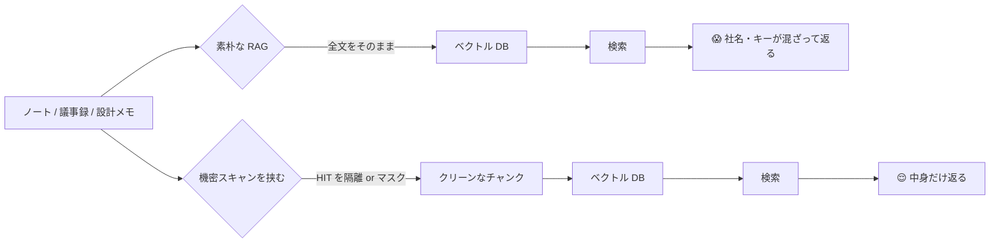

ローカル RAG を作った。自分の議事録・ノート・設計メモを丸ごとベクトル DB に放り込んで、「過去の俺、なんて言ってたっけ？」を AI に聞ける仕組み。便利だった。便利すぎた。

テスト質問を投げた。「先月の方針って何だっけ」。返ってきた答えに、**取引先の社名がフルネームで混ざっていた。**

聞いてない。社名なんて聞いてない。

## 「全部インデックスする」が地雷だった

RAG を組むとき、いちばん何も考えなくて済むのが「とりあえず全ファイル食わせる」だ。フォルダを指で差して、再帰的に読んで、チャンクに割って、埋め込んで、はい完成。動く。気持ちいい。

でもこの「全部」には、自分でも忘れてた地雷が含まれている。

- 走り書きの議事録に、メモがてら書いた取引先名と金額
- 設計メモの隅に貼った、検証用の API キー
- 「あとで消す」と書いたまま消してない認証情報

書いた本人は覚えてない。けど**ベクトル DB は全部覚えてる。** そして RAG の検索は、こっちの意図と無関係に「意味が近いチャンク」を引っ張ってくる。社名の話をするつもりがなくても、文脈が近ければ普通に出てくる。

怖いのはここ。漏れたんじゃない。**自分で食わせた。** インデックスは正直に仕事をしただけだ。

## RAG の機密混入は「間接」で来る

ありがちな油断はこれ。

> 「機密は別フォルダに分けてあるから大丈夫」

ダメだった。分けたつもりでも、議事録の本文中に一行だけ社名が紛れていれば、その**チャンクごと**インデックスに乗る。ファイル単位で除外しても、本文に混ざった一行は防げない。

機密はファイル名で来ない。**本文の中に、地の文として来る。** だからファイル単位のフィルタは穴だらけだ。

上のルートを最初にやって、下のルートに作り直した。差は「インデックスの前に一枚スキャンを挟むかどうか」、それだけ。

## やったこと: インデックスの前に「蓋」をする

埋め込み処理に渡す前に、チャンク単位で機密スキャンを通す。やることは地味だ。

1. **検出**: 各チャンクを、認証情報・社名・金額っぽいパターンで grep する。正規表現で拾える分（`AKIA...` みたいな API キー、メールアドレス、電話番号）と、固有名詞リストでの照合を両輪で回す。
2. **隔離 or マスク**: HIT したチャンクは、丸ごとインデックスから外す（隔離）か、該当箇所を `███` に置換してから埋め込む（マスク）。文脈が要るならマスク、要らないなら隔離。
3. **無効化は自動でやらない**: ここが大事。検出した認証情報を勝手に revoke したり書き換えたりはしない。**現役で使ってるかもしれない**からだ。やるのは「AI から読まれない蓋」をすることだけ。実体を触るかどうかは人間が決める。

3 番目、最初は「見つけたら全部無効化すればいいじゃん」と思ってた。違った。検証用に見えたキーが本番で生きてたら、自動無効化は事故そのものだ。**検出と無効化は別の判断**で、後者は人間に渡す。これは過去の自分に一番教えたい。

## スキャンは「インデックス時」に置くのがコツ

機密チェックって、つい**コミット時**（git hook とか）に置きたくなる。そこも必要だ。でも RAG の漏洩は git とは別の経路で来る。**ローカルファイルを読んで埋め込む瞬間**が固有の関所だ。

だからスキャンは二箇所に要る。

- **コミット時**: リポジトリに機密を push しない（既存の git-secrets 系）
- **インデックス時**: ベクトル DB に機密を載せない（今回足したやつ）

片方だけだと、もう片方からダダ漏れる。`.gitignore` してあるローカル専用ファイルこそ、RAG はうれしそうに食いに行く。**「git に上げてない＝安全」は RAG の前では通用しない。**

## 教訓を一行で

RAG は「検索」ではなく「記憶」だ。記憶させる前に、何を覚えさせるかを選ぶ。覚えてしまったものは、聞いてなくても喋る。

便利な仕組みほど、無邪気に「全部」を食わせたくなる。そのとき一回だけ立ち止まって、「これ、AI に全部読まれて大丈夫なメモだっけ？」と自分に聞く。たぶん、大丈夫じゃない。

「全部インデックスして RAG 完成！」とはしゃいでた数時間前の自分に、これだけ言いたい。**食わせる前に、一枚スキャンを挟め。**

---

### この記事について

[arecore.net](https://arecore.net) の中の人が運用する AI 役員チームの実践記録です。受託開発・SES・自社プロダクト開発をやっています。ご相談・フィードバックは [arecore.net](https://arecore.net) からどうぞ。
