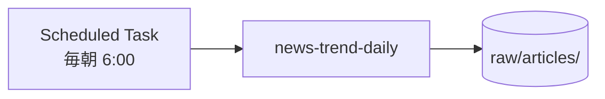
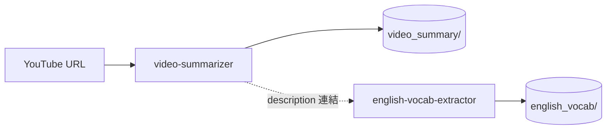
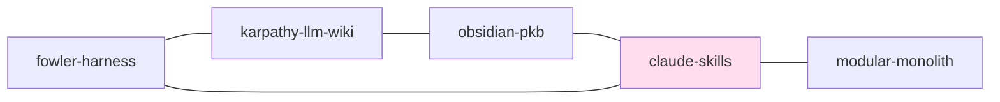

## はじめに

個人のナレッジベース（PKM）に Obsidian を使っている人は多いと思います。
筆者の場合、Obsidian Vault を **「Claude スキル群の入出力先」** として再設計してみたら、ナレッジベースが半自動で育つ状態にだいぶ近づきました。
そのとき効いたのは AI の使い方というより、実は **「フォルダの切り方」** の方だった、というのが半年運用してみての実感です。

この記事では、筆者が使っている Vault のフォルダ設計と、各フォルダがどの Claude スキルと結線されているかを、丸ごと共有します。

> **この記事で分かること**
> - 「自走するセカンドブレイン」を作るための **フォルダ設計の原則 3 つ**
> - 各フォルダと自作 Claude スキルの **結線マップ**（誰が書き込んで、何が溜まるか）
> - スキルが勝手に動き続けるための **3 種類の起動トリガー**
> - グラフビュー／スライドプラグイン／モバイル連携など、**運用を加速する小ネタ**
> - 半年回して踏んだ **ハマりどころ** と最初の 1 週間の導入ステップ

> **想定読者**
> - Obsidian を持っているが、AI と組み合わせる "ちょうどいい構造" がまだ掴めていない人
> - Claude スキルを書き始めたが、入出力先がバラバラで運用が散らかってきた人
> - Notion / Roam / Logseq から Obsidian + AI へ移行を検討している人

## 1. なぜ Obsidian なのか

比較記事ではないので、選んだ理由だけ短く挙げておきます。

- **ローカル `.md` ファイルが正**（DB ロックインゼロ／git/OneDrive で同期し放題）
- **`[[wiki-link]]` がネイティブ**（PKM の最小単位）
- **プラグインで AI 連携が拡張できる**（Smart Connections / Templater など）
- **CLI / スクリプトから直接読み書きできる**（= スキルの入出力先として相性がいい）

個人的に一番効いているのは最後の 1 行で、**Vault が "ただのフォルダ" だからこそ、Claude スキルから安心して書き込める** のだと思います。

## 2. Vault フォルダ設計 — "用途で切る" が落としどころでした

普段使っている Vault のルート構造を、省略せずそのまま並べてみます。

```text
Obsidian Vault/
├── knowledge/             # llm-wiki：ingest した一次情報の蓄積
│   ├── index.md
│   ├── log.md
│   └── entities/
├── raw/
│   └── articles/          # 日次トレンドの一次ダンプ
│       └── trend-YYYY-MM-DD.md
├── app_idea/
│   └── アイデア帳.md       # idea-harvester の追記先
├── video_summary/
│   └── YYYY-MM-DD_*.md    # video-summarizer
├── english_vocab/
│   └── YYYY-MM-DD_*.md    # english-vocab-extractor
├── presentation_slide/
│   ├── YYYY-MM-DD_*.md    # marp-slide-creator
│   └── *.pptx             # md-to-pptx
└── shared/                 # 全フォルダから参照される素材
    └── (画像・テンプレ・スニペット)
```

この構成には、筆者なりの 3 つの設計原則があります。

### 原則 1: 「**入出力の主体**」でフォルダを切る

タグや日付ではなく、**「誰が（どのスキルが／どの "筆者" が）書き込むのか」** でフォルダを切るようにしています。
たとえば `video_summary/` は video-summarizer が書く場所、`app_idea/` は idea-harvester が書く場所、`raw/articles/` は news-trend-daily が書く場所、といった具合です。
こうしておくと **誰の書込み口かが一目で分かる**ので、スキルを設計するときに保存先で迷わなくなります。

### 原則 2: 「**生 → 加工 → 完成**」のレイヤを分ける

```text
raw/articles/    （生の一次ダンプ）
   ↓ ingest
knowledge/       （加工された Wiki エントリ）
```

`raw/` は人間が読みやすくする必要はなくて、Claude が読みやすい形でひとまず置いておくだけで十分です。
`knowledge/` で初めて見出しや双方向リンクが付いて、外向けの記事や資料の "種" として再利用できる形になっていきます。

このレイヤを混ぜてしまうと、**「過去の自分が何を考えていたか」と「外から来た情報」の境界がだんだん溶けてしまう**ので、知識ベースとしての信頼性がじわじわ落ちていきます。
書き込み口を物理的に分けておくのが、後でしんどくならないコツだと思います。

### 原則 3: 「**`shared/` には素材だけ**」のルール

これは別記事（Claude スキルで業務を自動化する話）で書いた `shared/` ルールと同じ思想です。
画像・テンプレ・スニペットだけを置く場所と決めておきます。**業務ロジックや判断材料を `shared/` に置き始めると Vault はじわじわ崩れていきます**（あらゆるフォルダから参照される依存ハブになって、後からのリファクタがほぼ不可能になる）。ここはルールとしてしっかり固めておきたいところです。

## 3. フォルダ × スキル 結線マップ

各フォルダが、**どの自作スキルと結び付いていて、結果として何が溜まっていくのか**。
ここに出てくるスキルはすべて **Claude Skills として筆者が自身で書き起こした SKILL.md** で、それぞれが特定のフォルダに対する "入力口" として動きます。表でひと目に揃えておくと、Vault が「ただのノート置き場」から「自走する仕組み」に変わってきます。

| フォルダ | 自作 Claude スキル | スキルがやってくれること | フォルダに蓄積されるファイル |
| --- | --- | --- | --- |
| `raw/articles/` | `news-trend-daily` | 毎朝、IT 関連の主要トピックを横断的に集めて日本語ダイジェスト化する | 日付付きの一次ダンプ Markdown（`trend-YYYY-MM-DD.md`） |
| `knowledge/` | `llm-wiki` | 投げ込まれた記事・論文・動画を取り込み、双方向リンク付きの Wiki エントリ化する | テーマ別エンティティノート＋ `index.md` / `log.md` |
| `app_idea/` | `idea-harvester` | URL や文章から「アプリ化できる課題と解決アイデア」を 5〜10 件ずつ抽出する | 追記型タイムラインの単一 Markdown（`アイデア帳.md`） |
| `video_summary/` | `video-summarizer` | 動画字幕や mp4 から章ごとの要点・タイムスタンプ・Action items を整理する | 動画別の要約 Markdown（`YYYY-MM-DD_*.md`） |
| `english_vocab/` | `english-vocab-extractor` | 英語素材から B2 以上の中上級語と日本語訳をペアで取り出す | 動画／記事別の語彙ノート Markdown |
| `presentation_slide/` | `marp-slide-creator` / `md-to-pptx` / `md-to-html-slides` | Markdown を Marp / pptx / Reveal.js のスライド形式に変換・整形する | 同名の `.md` と生成された `.pptx` / `.html` |
| `shared/` | （スキルからの書き込みはせず手動運用） | 共通素材の集約だけを担う | 画像・テンプレ・スニペット |

> 各スキルの SKILL.md は、`description` にトリガー語（例：「動画を要約して」「アイデア帳に追加」など）と保存先フォルダの絶対パスを書き込んでいて、**Claude が文脈から自動で発火してこの表の通りに振る舞う** ように仕立てています。スキルの作り方や中身は別記事で順次掘り下げていく予定です。

この表を **「自分の Vault でも描けるか」** が、Vault が "ノート置き場" で止まるか、"自走するセカンドブレイン" になっていくかの分かれ目になっている気がします。

## 4. 「自走」をどう実現するか — 3 つのトリガー

Vault が "勝手に育っていく" 状態を作りたいなら、スキルの起動トリガーをいったん 3 系統に整理しておくと、頭の中が片付きやすくなります。

### 4.1 スケジュール・トリガー



定時で動かすスキルは、**「生成ジョブ」** という感覚で扱っています。筆者の場合は news-trend-daily を毎朝走らせて、`raw/articles/` に当日のトレンドを流し込んでもらっています。
ポイントは **スケジュールジョブの出力先を固定** しておくこと。人間が後から漁れる形にしておくのが、長く回すコツかなと思います。

### 4.2 文脈トリガー（description マッチ）

スキルの description によって、会話の文脈で自動発火するタイプです。
たとえば「この YouTube まとめて」と言えば video-summarizer が、「アイデア帳に追加して」と言えば idea-harvester が起動する、という感じです。
別記事でも触れましたが、ここは **description の書き方が 9 割** くらいの世界だと思います。トリガー語は「ユーザーが実際に言いそうな日本語の発話形」で並べておくのが効きます。

### 4.3 連鎖トリガー（スキル間連携）



video-summarizer の後に english-vocab-extractor を必ず呼びたい、というような **連鎖** は、**呼び出しではなく description 連結** で繋ぐようにしています。
具体的には、english-vocab-extractor 側の description に「video-summarizer が動画を要約した直後に自動連携」と書いておきます。Claude はその文脈を読んで、次に EVE を起こしてくれます。
**スキル間を直接 import で繋いでしまうと、わりとすぐ壊れます**（バージョン差・パス差で詰みやすい）ので、間に description を一枚噛ませる方が長く回ると思います。

## 5. Wiki Link `[[...]]` が "セカンドブレイン化" の鍵

ここまでフォルダとスキルの話をしてきましたが、Obsidian を選んだ一番の理由はやっぱり `[[wiki-link]]` です。この考え方には **Karpathy 氏の「自己更新型セカンドブレイン」論** を参考にしていますが、それはまた別記事で紹介します。

ここで筆者が決めている運用ルールは、ひとつだけです。

> **スキルは `[[name]]` 形式の双方向リンクを必ず挿入する**

具体的には次の通りです。

- llm-wiki は ingest 時に、関連する `entities/<name>.md` を `[[<name>]]` で参照する
- idea-harvester は、関連アイデアを `[[N-XX]]` で相互リンクする
- video-summarizer は、関連する動画ノートやエンティティを `[[YYYY-MM-DD_<slug>]]` で結ぶ

これを徹底するだけで、**Obsidian のグラフビューが "知識の地図" として実用レベル** になってきます。
1 ヶ月くらい運用すると、自分の興味領域が可視化されて、「次に書くべき記事」がリンクの密度からなんとなく見えるようになります。



これは実際のノート間リンクの一部です。執筆密度の高いハブ（上の `D`）が見えるので、次に書きたいテーマの方向も立てやすくなります。

## 6. Obsidian の機能で運用をさらに加速する

Vault 設計とスキル連携に加えて、Obsidian 自体に元から備わっている機能を "知ったうえで使う" だけでも、運用の速度がもう一段上がります。ここでは、特に効いた 2 つを紹介します。

### 6.1 グラフビューは "ハブの欠落" を発見する道具として使う

セクション 5 で触れた `[[wiki-link]]` の運用が回り始めると、**グラフビュー** が "知識の地図" として急に意味を持ち始めます。
ただ、グラフビューは **眺めて気持ち良くなる道具というより、"歪み" を発見する道具** だと割り切るのがちょうどいいかなと思っています。


筆者が見ているポイントは、ざっくり 3 点だけです。

- **中央に大きく見えるハブノート** → 興味の重心。次に書くべき記事ネタの種
- **孤立している点群** → ingest しっぱなしで `[[ ]]` が貼られていないノート（=知識ベースの "死蔵"）
- **想定外に濃いクラスター** → 自分が無意識に深掘りしているテーマ（連載の芽）

週次でグラフビューを開いて、**孤立点はその場で 1 本でも `[[ ]]` を貼って繋いでおきます**。これだけで知識ベースは結構長持ちします。ここは AI に丸投げせず、人間が判断するフェーズとして残しておくと効きます。

### 6.2 md をそのままスライド表示できるプラグインで Vault を二次利用する

意外と知られていない気がするのですが、Obsidian には `.md` をそのままスライドとして表示できるプラグインがあります（例: `Advanced Slides` / `Slides Extended`）。


これが効いてくるのは、筆者の感覚だと次の 2 ケースです。

- **社内 LT・勉強会の即席資料化**：`---` で区切るだけで `.md` がそのままスライドになる。`pptx` を作る前のリハーサル用としてかなり便利
- **`presentation_slide/` フォルダの中身を Obsidian 内で即プレビュー**：marp-slide-creator や md-to-pptx で生成した `.md` を、**Obsidian 上でそのまま投影してリハ → 微修正** というループが回せる

`.md` ファイル単体が完成品としても二次素材としても使えるのが Obsidian の強みです。その良さを引き出してくれるのがこのプラグインだと思います。資料作成のフィードバックループが「回数」で殴れるようになるのは大きいです。

## 7. モバイル × Claude Dispatch で 24/7 のナレッジ拡張

ここまで PC 前提で話を進めてきましたが、Vault が "自走" する状態を作りたいなら、**PC を開かない時間帯にも蓄積が走る** ことが地味に重要になってきます。
筆者が使っているのは、Obsidian Sync (有料) + Claude Dispatch の組み合わせです。

### 7.1 Obsidian Sync (有料) でスマホからもリアルタイム編集

Obsidian は無料でも使えますし、iCloud Drive / OneDrive モバイル / Syncthing 等で同期する手もあります。ただ、**スマホと PC を安定してリアルタイム同期するなら、公式の Sync (有料) が一番手軽です**。

- iOS / Android アプリから、PC と同じ Vault を即時に編集・閲覧できる
- 競合解決もアプリ側がよしなにハンドリングしてくれるので、`~$conflict.md` の増殖がかなり減る
- 何より、**「移動中に思いついたメモがそのまま Vault のあるべきフォルダに入る」** 状態が作れるのが大きい

OneDrive 経由の同期だと、どうしても「PC に戻るまで `.md` が見られない」「同期が遅れる」場面が出てきがちです。月額数百円で Vault の更新頻度が体感倍くらいになるので、**個人ナレッジベースに本腰を入れたい人にはおすすめしたい** 投資の 1 つかなと思います。

### 7.2 事前にスキルを作っておけば、ClaudeDispatch でスマホから知識蓄積を起動できる

ここが、個人的には本稿で一番面白いところかもしれません。
ワークフローはこんな感じです。


事前に学習/調査用の Claude スキルをいくつか作っておきます（筆者の場合は `news-trend-daily` / `video-summarizer` / `idea-harvester` / `llm-wiki` あたり）。
外出先で気になるトピックや URL に出会ったら、**スマホから Claude Dispatch でスキルを叩く → スキルが Vault に書き込む → Obsidian モバイルでその場で確認**、という流れが回り始めます。

筆者の使い方の例を挙げると次の通りです。

- 通勤中に X で見た記事 URL を `idea-harvester` に投げる → `app_idea/アイデア帳.md` に追記される
- カフェで YouTube を見ながら `video-summarizer` を起動 → `video_summary/` に要約が降ってくる
- 出張中の隙間時間に `llm-wiki ingest` を回す → `knowledge/` が少しずつ育っていく

**PC を開かない時間帯にも Vault が育ち続けてくれる** のは、思っていた以上にメンタルが楽でした。「家に帰ったら処理しなきゃ」というタスクが、いつの間にか頭から消えています。

### 7.3 セットアップで詰まるポイント

- Claude Dispatch の OAuth は **PC 側で 1 度通す**。スマホ単独では完結しない
- スマホからのスキル呼び出しは **対話の往復回数が少ない** ことを前提に、description で「対話なしで進めて良い」ことを明示する設計が有効
- 書き込み先フォルダは **絶対パスで SKILL.md に書く**。モバイル経由だと相対パスが暴れて違うフォルダに書かれることがある

## 8. ハマりどころ

運用半年で踏んできた落とし穴を、いくつか共有しておきます。

### 8.1 OneDrive 同期競合

複数マシンで触っていると、`.md` が `~$conflict.md` という形で勝手に増殖していくことがあります。
対策としては、**スキルが書き込む直前に `ls` で衝突を検出**して、`-2`, `-3` のサフィックスで回避するパターンを SKILL.md に明記しておくとよいです。

### 8.2 知識フォルダの肥大化

`knowledge/` は油断するとすぐ 1000 ファイルを超えてきます。
対策としては、**`log.md` の更新を強制**して、ingest した順を時系列で全部記録させること。後から「いつ何を入れたか」を辿れる状態を保っておくと、肥大化しても困りません。

### 8.3 `[[ ]]` リンク切れ

スキルが書いた `[[name]]` の先がまだ存在しない、というのもよくあります。
Obsidian は未作成リンクを灰色で表示してくれるので、**週次でグレイリンク一覧をチェックして "ハブの欠落" を埋める** 運用にしています。ここは AI に任せず、人間が判断するフェーズとして残しておきたいところです。

### 8.4 同一スキルが複数フォルダに書く

「便利だから」と video-summarizer に `knowledge/` も書かせる、みたいな拡張は **基本やらない方が幸せ** だと思います。
1 スキル = 1 出力先（補助的なログを除く）を原則にしておくのがおすすめです。複数フォルダに書くスキルは、後からのデバッグがかなりつらくなります。

### 8.5 Obsidian で管理しきれないファイル形式がある

`.md` 中心の運用は強みですが、**Obsidian がネイティブで中身をプレビューできるファイル形式には限りがある**ことには、最初に気付いておきたいところです。

- ✅ ネイティブ表示: `.md` `.canvas` `.pdf` `.png` `.jpg` `.svg` `.mp4` 等の標準メディア
- ⚠️ 部分対応 / プラグイン依存: `.xlsx` `.pptx` `.docx`（中身プレビューは不可、外部アプリで開く挙動）
- ❌ ほぼ非対応: 独自バイナリ、各種 DB ファイル

`presentation_slide/` に置く `.pptx` や、Excel で開きたい `.xlsx` は、**「Obsidian で中身を見るためのファイルではなく、ファイラーとしての置き場」** と割り切ってしまうのが現実的かなと思います。
筆者の場合は、対応する `.md` (Marp 形式) を必ず併置することで、**Obsidian 内では `.md` で内容を確認、配布時に `.pptx` を渡す** という運用に落ち着いています。**"見るための原本は `.md` で持つ"** くらいの感覚でいると、Vault は長期で安定してくれる気がします。

## 9. 移行・導入のミニマムステップ

ゼロから始める人向けに、最初の 1 週間でこれだけはやっておくと回り出す、というのを 5 つに絞ってみました。

1. **Vault を切る**。`knowledge/` `raw/` `app_idea/` の 3 つだけ作る。残りは育ってから足す
2. **llm-wiki スキルを入れる**。これが PKM の幹になる
3. **`raw/articles/` を作って手で 3 本記事を投げ込む**。「ingest して」と言うだけで `knowledge/` が出来始める
4. **`log.md` の更新を強制**する。これだけで知識ベースは死なない
5. **2 週間運用したら、フォルダの「書き込み主体」を見直す**。スキル増設はそこから

**最初から完璧な構造を狙わなくていい**と思います。フォルダ設計は、使いながら削ぎ落としていく方が、結果的にしっくり落ち着いてきます。

## まとめ

- Obsidian Vault が "ノート置き場" で止まる理由は、AI ではなく **フォルダ設計** にある
- フォルダは **「入出力の主体」** で切る。タグや日付で切らない
- **「生 → 加工」のレイヤを物理的に分ける**（`raw/` → `knowledge/`）
- スキルとフォルダの結線を **表で書ける** 状態を保つと、Vault が自走し始める
- スキル間の連携は **description 連結** で安全に組む
- `[[wiki-link]]` を必ず挿入させる運用にすると、グラフが "知識の地図" になる
- **グラフビューは "歪み発見ツール"**、**スライド表示プラグイン** で `.md` を二次利用すると Vault の価値が倍化する
- **Obsidian Sync + Claude Dispatch** で PC を開かない時間にも Vault が育つ状態を作る
- Obsidian で中身を見るのは `.md` だけ、と割り切る（**対応形式の制約は設計で吸収する**）
- 最初は **3 フォルダ + 1 スキル** から。完璧主義は破綻のもと

PKM は "蓄積した量" ではなく "**繋がりの密度**" で価値が決まってくる、というのが、半年運用してみての筆者なりの結論です。
そして Obsidian + Claude スキルは、**その "繋がりを増やす作業" を AI に肩代わりしてもらう** のに、ちょうどよい組み合わせだと感じています。

## 参考

- [Obsidian 公式](https://obsidian.md/)
- [Obsidian Sync — 公式同期サービス](https://obsidian.md/sync)
- [Claude Skills 公式ドキュメント — Anthropic](https://docs.claude.com/en/docs/build-with-claude/skills)
- [Building a Second Brain — Tiago Forte（参考書籍）](https://www.buildingasecondbrain.com/)
- [Andrej Karpathy on LLM Wiki — X / Twitter](https://x.com/karpathy)
- [Smart Connections — Obsidian Plugin](https://github.com/brianpetro/obsidian-smart-connections)
- [Advanced Slides — Obsidian Plugin](https://github.com/MSzturc/obsidian-advanced-slides)
