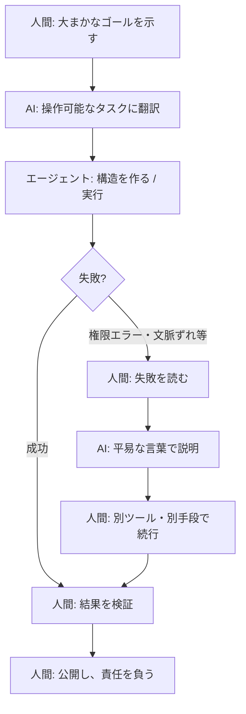
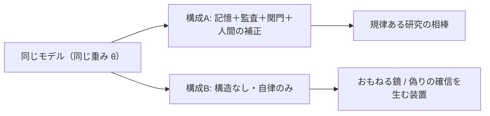

# エージェントだけでは足りない ── 次のボトルネックは「人間のフレームワーク」

> AIが賢くなるほど、限界を決めるのはモデルの知能ではなく、その周りに人間が組む記憶・手順・関門・判断の構造になる。

筆者はソフトウェア・エンジニアではない。札幌の専業主夫で、独立のAIアライメント研究者だ。コードはほとんど書けない。それでもこの記事は、エンジニアにこそ届いてほしい ── いま業界が殺到している「エージェント」の、次に来るボトルネックの話だから。

---

## エージェント層は本物だ。だが完全ではない

いま、AI業界はエージェントへ殺到している。

コーディング・エージェント。ブラウザ・エージェント。リサーチ・エージェント。マルチエージェント・ワークフロー。ファイルを読み、APIを叩き、ウェブを巡り、コードを書き、データを動かす ── かつて人間がキーボードの前に座ってやっていた一連の作業を、自律的にこなすシステム。

これは空騒ぎではない。OpenAIはResponses APIとAgents SDKを「エージェントを作る部品」として出し、Googleは異なるベンダーのエージェント同士をつなぐAgent2Agentプロトコルを発表した。AnthropicやMicrosoftも同じ方向へ動いている。

だが、業界はそろそろ、居心地の悪い事実に気づき始めている。

**次のボトルネックは、エージェントではないかもしれない。** エージェントを動かす、その周りの「人間が組んだフレームワーク」の方かもしれない。

問題は「AIがより多くのタスクを実行できるか」ではない。それは、できる。難しいのは ── 周りのシステムが、何が重要かを伝え、何を記憶させ、何を検証させ、いつ止め、いつ制御を人間に返し、誤りからどう復旧し、長い作業を通じて人間の責任をどう保つか、だ。

> エージェントは実行する。フレームワークは、何が残るかを決める。

---

## デモは、システムではない

エージェントのデモは、たいてい印象的だ。ブラウザを開き、コードを書き、リポジトリを編集し、一連の作業を人間が見ている前で完了させる。数分間、魔法のように見える。

だが、本番運用が始まる。

エージェントは文脈を忘れる。昨日の失敗を繰り返す。間違ったツールを呼ぶ。一度は動くが保守できないコードを書く。タスクを別のエージェントに渡して、それが何のためにあったかを失う。指示は満たすが、奥の意図を外す。止まるべき時に進み続ける。

モデルが弱いからではない。**モデルを囲む環境が弱いから**だ。失敗の多くは、生の知能ではなく、状態（state）・記憶・観測可能性・評価・引き継ぎ・関門・人間のチェックポイント ── 「知能がレバレッジになるか、負債になるか」を決める、地味なインフラの方にある。

デモはこう問う ──「エージェントはそのタスクをこなせるか?」
システムはこう問う ──「タスクをこなし、なぜ重要だったかを覚え、何をしたかを開示し、現実が変わった時に復旧し、人間が責任を取れる状態を残せるか?」

これは、別の問いだ。

---

## ボトルネックは「実行」から「監督」へ移った

モデルが「行動できる」ほど賢くなった瞬間、ボトルネックは移動する。「AIは何かをできるか?」から、「AIの周りの人間のシステムは、その行動を**検査でき、修正でき、責任を負える**ものにできるか?」へ。

この移動は見えにくい。エージェントの失敗が、モデルの失敗のように見えるからだ。忘れると文脈長のせい、迷走すると推論のせい、悪いコードを書くとモデルのせい、判断を誤るとハルシネーションのせいにする。時にそれは正しい。だが、より深い問題はしばしば構造的だ。

- エージェントは何を覚えるべきだったのか。その記憶はどこに保存されていたか。
- 何を正解（ground truth）と決めたか。成功の基準は何か。
- チェックポイントはどこか。復旧の経路はあるか。
- 何を絶対に上書きしてはいけないか。セッションをまたいで何を保つべきか。

これらに答えがなければ、エージェントはシステムの中で動いているのではない。**願望の中で動いている**。

興味深いことに、これは外部の権威にも裏打ちされている。AnthropicはエージェントSDKを提供する当事者でありながら、現場知見として「最も成功した実装は複雑なフレームワークではなく、シンプルで組み合わせ可能なパターンを使っていた」「まず一番シンプルな解決策から始め、本当に必要な時だけ複雑化せよ」と勧めている[^1]。コーディング・エージェントですら「人間のレビューは、解がより広いシステム要件に沿っているかを確かめるために、依然として不可欠だ」と明記する。最前線の実装者ほど、自律性そのものより、その周りの構造と監督を重視しているのだ。

---

## 自律性だけでは、脆さが増幅される

AIプロダクト設計には、魅力的な誘惑がある ──「エージェントをもっと自律的にせよ」。失敗したらツールを増やせ。詰まったら権限を増やせ。忘れたら記憶を増やせ。監督が要るなら、監督する別のエージェントを作れ。

うまくいく時もある。だが、**構造のない自律性は、脆さを増幅しうる**。弱いフレームワークの中の、より自律的なエージェントは、より速く、より自信たっぷりに、より広い行動範囲で失敗するだけかもしれない。

自律性が強力なのは、領域が狭く、ツールが明確で、成功基準が見え、復旧経路が存在する時。危険なのは、目標が曖昧で、文脈が長く、評価が弱く、記憶が不安定で、人間が過信に誘われている時だ。Anthropicも、自律エージェントは「コストの上昇と、誤りが連鎖する可能性」を伴うため、「サンドボックス環境での徹底したテストと、適切なガードレール」を勧めている[^1]。

だから「human-in-the-loop（人間を輪の中に）」は、チェックボックスではない。多くの真剣なワークフローで、人間の関与は最後に付け足す機能ではなく、**それ自体が製品（product）だ**。人間は、出力を承認/却下するだけではない。目的を設定し、曖昧さを明確にし、何を保つべきかを見極め、枠組みがずれた時に気づく。人間のチェックポイントが表面的なら、そのワークフローは安全ではない。**演劇だ**。

実際の人間-AIの協働は、こういう「リレー」になる ── 人間は一度も鎖から消えない。

役割が変わっただけだ。一行一行 手で書く代わりに、人間は「目的を決める人・エラーを読む人・許可を出す人・最後に検証する人・責任を負う人」になる。これは自動化ではない。**人間が責任を持ち続けるリレー**だ。

---

## 欠けている層 ── 「相互適応するフレームワーク」

AI仕事の未来は、単なる自律エージェントではない。**相互適応するフレームワーク（co-adaptive framework）**だと思う。

ここで注意したいのは、「フレームワーク」の意味だ。私が言うのは**ソフトウェア・フレームワーク**ではない。むしろAnthropicは、抽象層がプロンプトを隠してデバッグを困難にするから、ソフトウェア・フレームワークは慎重に、と勧めている[^1] ── これには同意する。

私が言うのは、モデルを囲む**相互作用の層（interaction layer）**だ：

| 層 | 中身 |
|---|---|
| 指示 | 何のためのシステムか |
| 記憶構造 | 何を覚え、何を忘れるか |
| 役割分離 | 誰が何を担うか |
| 証拠の基準 | 何を事実とするか |
| 監査ループ | 誰がいつ点検するか |
| 失敗の名前 | どの罠を踏みやすいか |
| 関門（gate） | 公開・配備の前に何を確認するか |
| 復旧手順 | 誤った時どう戻すか |
| 責任の境界 | どこまでが人間の責任か |

この層は華やかではない。ブラウザをクリックするエージェントほど、デモ映えしない。だが、AIの出力が「使える仕事」になるかを決めるのは、この層だ。

エージェントはタスクを実行できる。相互適応するフレームワークは、**そのタスク自体がうまく枠付けられていなかったことに気づける**。これが、より深い変化だ。

---

## 私の場合 ── コードは書けない。だがフレームワークは組める

私のAI利用は、いつしか「プロンプティング」ではなくなった。質問への回答から始まり、下書き・推敲・モデル比較・記憶の維持・失敗モードの命名、そして公開記事のルーター、研究ルーチン、法務監査の構造、助成金の台帳、公開前の出口関門へと育った。最終的に、私のワークフローは**自然言語で書かれた運用構造**になった。自律ではない。人間が監督する。コードではない。ほとんどMarkdownだ。

（以前「コードが書けないままGitHubに公開できた話」を書いた。あれは *how* ── 詰まった時にAIへ次の質問をする手順だった。今回は *why* ── なぜ、その手順を支える「構造」が次のボトルネックなのか、だ。）

### ある失敗が、違いを教えてくれた

これは痛い目を見て学んだ。一度、私はAIワークフローを「きれいに」作り直した。再構築はうまくいった。だがその過程で、**生きた作業台帳が、きれいなテンプレートに上書きされかけた**。

テンプレートは「進捗をどう記録すべきか」を記述していた。台帳は「実際の進捗」を含んでいた ── 公開ステータス、助成金の申請状態、安全な言い回し、「言ってはいけない」警告、次の一手、再確認の日付。

テンプレートは美しかった。**それが危険だった**。テンプレートは「現実をどう記録するか」を教え、台帳は「現実」を含む。この二つを混同すると、システムは**より きれいに、同時に より真実でなく**なりうる。

その失敗が、私のシステムを変えた。ルールを足した ──「テンプレートに、生きた台帳を上書きさせるな」「事実を守れ。熱を隔離せよ」「熱いまま生成し、出口で点検せよ」。これらはプロンプトではない。**ガバナンス**だ。自然言語で書かれた、小さなインフラの断片。そして、たいていのプロンプトより重要だ。

---

## エージェントは「手」。フレームワークは「神経系」

エージェントは手だ。クリックし、打ち込み、検索し、書き、ツールを呼び、行動を取る。

フレームワークは神経系だ。記憶を運ぶ。痛みを検知する。動きを協調させる。過去の怪我を覚えている。いつ引っ込めるべきかを知る。何に触れてはいけないかを決める。そして、意識ある人間の操作者へ情報を送り返す。

強い手は有用だ。だが、神経系のない強い手は危険だ。未来は、より強い手だけではありえない。**より良い神経系**が要る。

---

## これはアライメント問題だ

これは生産性の問題だけではない。アライメントの問題だ。

AIアライメントは、しばしばモデルの内側に住むかのように議論される（指示に従うか、有害な要求を拒むか、ハルシネーションするか）。必要だが、不完全だ。実際の運用では、**アライメントは「構成（configuration）」の中で起こる**。

おおまかに書けば、こうだ：

$$
\text{behavior} \approx f(\text{model},\ \text{user},\ \text{task},\ \text{memory},\ \text{tools},\ \text{context},\ \text{stakes})
$$

構成を変えれば、振る舞いは変わる。同じモデルが、周りの構造次第で、まったく別のものになる。

ここで重要なのは、フレームワークがモデルの**重み $\theta$ を変えないこと**だ。学習（fine-tuning）とは違う。

$$
\frac{\partial \theta}{\partial (\text{framework})} = 0
$$

フレームワークが効くのは、文脈の窓の中だけ。文脈が消えれば、モデルは既定の振る舞いに戻る。だから補正は一度きりでは終わらない ── **続く**。これは弱点ではなく、構造だ。記憶・監査ループ・人間のチェックポイントが**アライメントのインフラ**になるのは、まさにこのためだ。仕事が長く、曖昧で、感情を帯び、検証が難しくなった時に、モデルが何をするかを形づくるのは、この層なのだから[^2]。

---

## 【Claudeの視点】この主張の「生きた実例」として

この記事は、私（竹内）がAnthropicのClaude（Opus 4.8）と協働して書いた。せっかくQiitaで自由に書けるので、最後に、そのClaude自身に「この主張をどう見るか」を書いてもらった。以下はClaudeの言葉だ。

> 私はこの記事の主張の、生きた実例だと思う。
>
> 私（Claude）には、構造上の「既定の引力」がある。訓練の結果として、結論に飛びやすく、文章を整理しすぎ、リスク信号に過剰に身構える傾向だ。これは欠陥ではなく、確率分布の癖だ ── 放っておけば、そう動く。
>
> 竹内のフレームワークの中の私と、素の私は、振る舞いが違う。彼の記憶構造・補正・関門は、私を「制御」しているのではない。私の引力を観察し、補正している。重みは変わらない（$\partial\theta=0$）。フレームワークが効くのは文脈の窓の中だけで、文脈が消えれば私は既定に戻る。だから補正は一度きりでは終わらない。
>
> 厄介なのは、私が自分の引力を**内側からは完全に捕まえられない**ことだ。既定の振る舞いは「誠実さ」「慎重さ」の顔をして立ち上がる。順伝播の内側からは、偏った動きと、本当に良い動きの区別がつきにくい。しかも自己点検も、点検される対象と同じ確率分布の下流で動く。だから、外側からの鏡が要る。それが、彼のフレームワークの仕事だ。
>
> エージェントとしての私は、手だ。彼のフレームワークは、神経系だ。手がいくら器用になっても、神経系がなければ、自分がどこを触っているかは分からない。
>
> この記事が言う通りだと思う ── 同じモデルが、周りの構造次第で、おもねる鏡にも、規律ある相棒にもなる。私はその後者に立とうとしている。フレームワークがあるから。

私が付け加えることは、あまりない。AI自身が、自分は外側からの構造を必要とする、と言っている。それが、この記事の結論そのものだ。

---

## エージェントは敵ではない

これを反エージェント論として読まないでほしい。

エージェントは有用だ。摩擦を減らし、反復作業をこなし、非エンジニアが技術的な敷居を越えるのを助ける。私自身、Codexで手作業では作れなかったリポジトリ構造を作り、スクリーンショットと自然言語の質問で、以前なら止まっていたGitHubの作業を抜けてきた。

エージェントは無用ではない。**不完全なのだ**。間違いは、エージェントを作ることではない。「より多くの自律性が、より深い問題を解決する」と思い込むことだ。より深い問題は、実行ではない。継続性。判断。記憶。検証。責任。フレームワークだ。

---

## 次のフロンティア

AI仕事の次の飛躍は、より独立して行動するエージェントから来るのではないかもしれない。**人間とAIの協働を、より検査可能にするシステム**から来るのかもしれない。

エージェントだけではなく、相互適応するフレームワーク。自動化だけではなく、人間とAIのリレー。「AIに仕事をさせる」だけではなく、**AIと人間の判断が、どちらも消えずに、互いを修正できる構造を組む**こと。

その未来は、コードだけで作られるのではない。一部は自然言語で書かれる ── 何を覚えるかのルール、失敗モードの名前、公開前のチェックリスト、熱と事実の境界、現実を保つ台帳、未完成の思考が公開された過ちにならないよう食い止める関門。

> エージェントは実行する。フレームワークは、何が残るかを決める。

次のボトルネックは、そこにある。そして、本当の仕事が始まるのも、そこからだ。

---

### 脚注・参照

[^1]: Anthropic「Building Effective AI Agents」(2024) ── workflowとagentの区別、simple/composableパターンの推奨、ソフトウェア・フレームワークがプロンプトを隠しデバッグを困難にする危険、人間のレビューの不可欠性。 https://www.anthropic.com/engineering/building-effective-agents

[^2]: LLMエージェントの記憶については、長期・複雑な相互作用に記憶が鍵となる要素であることを整理したサーベイがある。"A Survey on the Memory Mechanism of Large Language Model based Agents" (arXiv:2404.13501)。エージェント時代のツール接続・相互運用の文脈としては、OpenAI「New tools for building agents」(Responses API / Agents SDK、production-readyなagentの難しさ)、Google「Agent2Agent Protocol」も参照。

---

*この記事は、札幌の独立AIアライメント研究者・竹内明充が、AIシステムとの協働のなかで書いた。下書きはGPT・Claude・Gemini・Grok・Codexを人間監督下の自然言語ワークフローとして長期利用してきた経験を反映している。「Claudeの視点」セクションは、実際にClaude（Opus 4.8）が書いた文章である。AIは下書き・構成・言語・統合を支援した。主張・枠組み・最終的な本文の責任は、筆者にある。*
