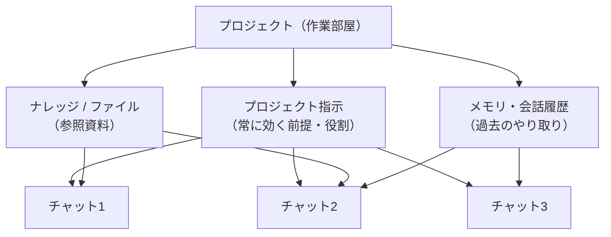

## はじめに

AIチャットを使い込むほど、「毎回同じ前提を説明し直すのが面倒」「過去のやり取りがどこにいったか分からない」という壁にぶつかります。これを解決するのが、主要サービスに実装された**プロジェクト機能**です。

本記事では、プロジェクト機能の正体（何が違うのか）、サービスごとの考え方の違い、そして「成果が変わる使い方」までを一気通貫で整理します。読み終えれば、自分の業務に合わせてプロジェクトを設計し、AIを“毎回ゼロから”ではなく“文脈を持った相棒”として使えるようになります。

> 想定読者：AIチャットを日常的に使い始めた初心者〜中級者（一部、設計の話で中級以上向けの内容を含みます）。

> **本記事の前提時点について**：AIチャットの機能・名称・提供プランは更新が非常に速い領域です。本記事は **2026年6月時点** で各サービスの公式情報を確認した内容に基づいています。利用前には必ず各サービスの公式ヘルプで最新仕様をご確認ください。

## 目次

- [対象読者](#対象読者)
- [この記事でわかること](#この記事でわかること)
- [本編](#本編)
  - [全体像](#全体像)
  - [基本概念](#基本概念)
  - [主要サービスの違い](#主要サービスの違い)
  - [プロジェクト指示の作成方法](#プロジェクト指示の作成方法)
  - [効果的な使い方の設計パターン](#効果的な使い方の設計パターン)
  - [活用シナリオ別の使い方](#活用シナリオ別の使い方)
  - [よくある落とし穴と対策](#よくある落とし穴と対策)
- [まとめと次のステップ](#まとめと次のステップ)

## 対象読者

- 毎回同じ前提や指示を入力し直すのに疲れている人
- 「プロジェクト」「Gems」「カスタム指示」の違いがよく分からない人
- ChatGPT / Claude / Gemini を業務で本格的に使い分けたい人
- チームでAIの“しゃべり方”や前提知識を揃えたい人
- 機密情報を扱うため、文脈の混ざり方が気になる人

## この記事でわかること

- プロジェクト機能と通常チャット・カスタムGPT等との違い
- 「プロジェクト指示」「ナレッジ（ファイル）」「メモリ」という3つの構成要素の役割
- 成果が安定するプロジェクト指示の書き方（テンプレート・具体例・AIと壁打ちして作るコツ）
- ChatGPT / Claude / Gemini それぞれの設計思想と用語の対応関係
- 成果が変わるプロジェクトの“分け方”と“指示の書き方”
- ナレッジに入れるべき情報・入れてはいけない情報の判断軸
- 文脈が混ざる・指示が無視されるといった典型的な失敗の回避策

## 本編

### 全体像

プロジェクト機能は、ざっくり言えば「特定の目的のために、**前提・資料・会話履歴を一箇所にまとめておく作業部屋**」です。通常のチャットが“その場限りの会話”なのに対し、プロジェクトは“文脈が持続する空間”として機能します。

構造を図にすると次のようになります。



ポイントは、**「指示」「資料」「履歴」の3つが、プロジェクト内のすべてのチャットに自動で効く**という点です。新しいチャットを開いても、前提を説明し直す必要がありません。

### 基本概念

#### プロジェクトを構成する3要素

| 要素 | 役割 | 具体例 |
|---|---|---|
| プロジェクト指示 | AIに常に守らせたい前提・役割・トーン | 「あなたは法務レビュー担当。常に常体で、リスクを箇条書きで指摘する」 |
| ナレッジ（ファイル） | 参照させたい資料・データ | 仕様書、議事録、ブランドガイドライン、過去の提案書 |
| メモリ / 会話履歴 | 過去のやり取りの記憶 | 「前回はA案で進めると決めた」などの経緯 |

この3つを意識して切り分けるだけで、プロジェクトの精度は大きく変わります。

#### 通常チャット・カスタムAIとの違い

- **通常チャット**：その会話の中だけで文脈が完結。閉じると前提はリセット。
- **カスタムAI（GPTs / Gems など）**：振る舞い（ペルソナ）を作り、**複数の用途で使い回す**もの。
- **プロジェクト**：特定タスクのために、**資料・履歴・指示をまとめる“器”**。

混同しやすいですが、この記事を通じて使う整理軸はシンプルです。

- **器（コンテナ）** ＝ ChatGPT / Claude の **Projects** のように、資料・履歴・指示をまとめる入れ物
- **ペルソナ（カスタムAI）** ＝ ChatGPT の **GPTs**、Gemini の **Gems** のように、振る舞いを定義して使い回すもの

「ペルソナを使い回したい」のがカスタムAI、「ひとつのタスクに集中したい」のがプロジェクト、と覚えると整理しやすくなります。

#### なぜ必要なのか

AIの出力品質は、結局のところ「どれだけ適切な文脈を渡せたか」でほぼ決まります。プロジェクト機能は、その文脈の供給を**毎回の手作業から自動化**してくれる仕組みです。前提入力の手間が減るだけでなく、回答のブレも減り、チームで使えば“同じ前提で会話するAI”を共有できます。

### 主要サービスの違い

主要3サービスは似た発想を持ちますが、用語・設計思想・提供範囲に違いがあります。2026年6月時点の整理は次の通りです（**仕様は頻繁に変わるため、利用前に必ず各サービスの公式情報を確認してください**）。

| 項目 | ChatGPT | Claude | Gemini |
|---|---|---|---|
| 器（コンテナ）機能 | **Projects**（無料プランでも利用可） | **Projects**（無料でも数件まで利用可） | **一般向けの「Projects」は2026年6月時点で正式提供を確認できず（展開中）。コンテナ型プロジェクトは Enterprise / Business が中心** |
| ペルソナ機能 | GPTs | （プロジェクト指示で代替） | **Gems**（全プランで無料） |
| 前提指示 | プロジェクト指示 | プロジェクト指示 | Gems の指示欄で役割を定義 |
| 資料の保持 | ファイル・チャットを保持 | ファイル（PDF/DOCX/CSV/TXT等）＋GitHubリポジトリ＋各種コネクタ | Gems のナレッジファイル |
| メモリの考え方 | プロジェクト専用 / デフォルトの2種 | プロジェクト内に閉じた文脈 | アカウントのアクティビティ準拠 |
| 特徴 | チャットをプロジェクトに移動可 | プロジェクト名・説明文はAIに読まれない | Google Workspace連携が強い |

サービスごとの“クセ”を補足します。

- **ChatGPT**：プロジェクトに**チャットとファイルをまとめて保持**でき、既存のチャットを後からプロジェクトに移動することもできます。新規プロジェクト作成時に「プロジェクト専用メモリ」を選ぶと、外部の会話や他プロジェクトと混ざらない独立空間（サンドボックス）になり、機密性の高い作業に向きます。なお、プロジェクト専用メモリの提供範囲はプランや時期により異なり（当初は Enterprise / Business 中心、その後 Web 版などへ拡大）、利用にはメモリ機能の有効化が前提となる点に注意してください。プロジェクト機能自体は無料プランでも一部利用できます。

- **Claude**：ドキュメント参照（ナレッジ）が強みで、PDF・Office系ファイル・CSV/テキストのアップロードに加え、**GitHub連携でコードベースを取り込む**ことができます。注意点として、**プロジェクト名や説明文はAIに参照されません**（公式ヘルプにも「Claude はこれらの内容にアクセスしない」と明記）。守らせたい内容は必ず「プロジェクト指示」欄に書く必要があります。無料プランでも数件のプロジェクトを作成できます。

- **Gemini**：一般ユーザー向けの確立した機能は **Gems**（振る舞いを定義したカスタムAI＝ペルソナ）です。Gems は指示・ナレッジファイルを設定でき、複数の場面で使い回せ、Google Workspace との連携が活きます。一方、**ChatGPT / Claude のような「Projects（器）」は、2026年6月時点では Enterprise / Business 向けが中心**で、コンシューマー版（個人向け Gemini アプリ）への提供は順次展開中の段階です。そのため、個人で「文脈をまとめる器」として使いたい場合は、まず Gems を起点に考えるのが現実的です。

> 用語が紛らわしいですが、**「器（Projects）」と「ペルソナ（Gems / GPTs）」は別物**という軸で見ると整理できます。ただし Gemini については、個人向けでは「器」より「ペルソナ（Gems）」が中心、という現状を押さえておきましょう。

### プロジェクト指示の作成方法

プロジェクトの成果を最も左右するのが、この**プロジェクト指示**です。ナレッジ（資料）が「AIに見せる事実」だとすれば、指示は「AIに守らせる行動ルール」。ここを丁寧に書くだけで、出力の安定感がはっきり変わります。

#### 基本テンプレート

迷ったら、次の5ブロックを上から順に埋めると過不足なくまとまります。

```text
# 役割
あなたは〇〇の専門家です。

# 目的・読者
この会話の成果物は△△です。想定読者は□□です。

# 守ってほしいルール（制約）
- 専門用語は初出時にひとことで補足する
- 推測で答える場合は「推測」と明示する
- 不確かな点は断定せず、確認すべき項目として挙げる

# 出力形式
- 結論 → 根拠 → 次のアクション の順で書く
- 重要なポイントは箇条書きにする

# やってほしくないこと
- 過度な前置きや謝罪は不要
- 指示にない情報を勝手に創作しない
```

#### 良い指示の4原則

- **役割を最初に固定する**：「あなたは〇〇」と冒頭で立場を与えると、語彙やトーンが安定します。
- **抽象語を具体化する**：「丁寧に」より「専門用語を避け、中学生にも分かる言葉で」のように、判断基準を数値・例で示します。
- **否定形だけでなく代替を示す**：「砕けすぎないで」ではなく「常体で、ただし命令口調は避ける」と、望ましい状態をセットで書きます。
- **出力形式まで指定する**：見出しの付け方、箇条書きの有無、文字数の目安まで決めると、毎回の手直しが減ります。

#### Before / After の例

同じ意図でも、書き方で結果が変わります。

| | 指示の例 |
|---|---|
| Before（曖昧） | 「ブログを書くのを手伝って。いい感じにしてね」 |
| After（具体的） | 「あなたはSaaS業界のテックライター。常体・約2,000字で、結論→具体例→まとめの構成。専門用語は初出時に補足。誇張表現と煽り表現は使わない」 |

After のように**役割・文体・構成・制約**を明示すると、初回から狙いに近い出力が得られ、修正の往復が減ります。

#### おすすめ：AIと壁打ちして指示を作る

実のところ、指示を一人でゼロから書き上げる必要はありません。**AI自身に作らせる**のが、いちばん速くて精度も高い方法です。テンプレートの空欄をうまく埋められないときほど効果的です。

進め方はシンプルです。

1. **目的を投げる**：「〇〇のためのプロジェクト指示を作りたい。完成させるために必要な質問を、いくつか返して」と頼む。
2. **質問に答える**：読者・トーン・出力形式・NG事項など、AIが聞いてくる項目に答えていく。
3. **ドラフトを出させる**：「ここまでの内容でプロジェクト指示の案を書いて」とまとめてもらう。
4. **試して直す**：実際の依頼を1〜2回流し、ズレた部分を「ここはこう直して」と伝えて反映する。

この**壁打ち（対話で詰める）**方式の利点は、自分でも言語化できていなかった要件を、AIの質問が引き出してくれる点です。完成した指示文をそのまま指示欄に貼り付ければ、すぐ運用を始められます。

> ヒント：「自分が普段この作業で“毎回”言っていること」を箇条書きで渡すだけでも、AIがそれを指示文の形に整えてくれます。なお Gemini の Gems では、書きかけの指示を AI に書き直させる補助機能も用意されています。

#### 指示を書くときの注意点

- **長すぎると一部が無視される**：あれもこれも盛り込むと優先順位が下がります。重要なルールほど上に置き、全体を簡潔に保ちます。
- **「指示」と「資料」を混同しない**：規約やスタイルガイドの“中身”はナレッジへ、それを「常に守れ」という命令はプロジェクト指示へ、と切り分けます。
- **名前や説明文に頼らない**：サービスによっては、プロジェクト名や説明文がAIに読まれません（例：Claude では公式に「名前・説明文にはアクセスしない」と明記）。守らせたい内容は必ず指示欄に書きます。
- **運用しながら育てる**：最初から完璧を狙わず、ズレた出力が出たらその原因をルールとして1行追記していくと、指示が実用的に磨かれていきます。

### 効果的な使い方の設計パターン

ここからが本題です。プロジェクトは「作って終わり」ではなく、**設計**で成果が変わります。

#### パターン1：1プロジェクト＝1目的に絞る

あれもこれも詰め込むと、AIが拾う文脈がぼやけます。「四半期レポート作成」「ブログ立ち上げ」のように、**目的単位で器を分ける**のが基本です。終わったプロジェクトはアーカイブし、文脈の汚染を防ぎます。

#### パターン2：指示・資料・履歴を役割で分けて配置する

「常に守らせたいルール」はプロジェクト指示へ、「参照させたい事実」はナレッジへ、「過去の経緯」はメモリ／履歴へ。3要素を役割で切り分けて配置すると、AIがルールを軽視したり、古い前提を引きずったりしにくくなります（指示そのものの書き方は[プロジェクト指示の作成方法](#プロジェクト指示の作成方法)を参照）。

#### パターン3：ナレッジは「安定情報」だけを置く

ナレッジには、頻繁に変わらない**前提・規約・スタイルガイド**を置くのが効果的です。逆に、その場限りの一時情報や、変動の激しいデータは会話側で都度渡す方が混乱しません。

### 活用シナリオ別の使い方

具体的なユースケースに落とすと、設計のイメージがつかみやすくなります。

| シナリオ | 指示に書くこと | ナレッジに入れるもの |
|---|---|---|
| ブログ/記事の継続執筆 | トーン、文体、NG表現、構成テンプレ | 過去記事、用語集、ブランドガイド |
| コードレビュー | レビュー観点、出力フォーマット | コーディング規約、対象リポジトリ |
| 議事録・報告書作成 | 要約の粒度、見出しの付け方 | 会議の文字起こし、過去の報告書 |
| 顧客対応の下書き | トーン、禁止表現、エスカレーション基準 | FAQ、製品仕様、過去の対応例 |

いずれも共通するのは、「**毎回言いたくない前提は指示へ、毎回見せたい事実はナレッジへ**」という原則です。

> Gemini を個人で使う場合は、上記の「指示」を **Gem の指示欄**に、「ナレッジ」を **Gem のナレッジファイル**に割り当てると、同様の運用ができます。

### よくある落とし穴と対策

実際に使い始めると遭遇しやすい失敗と、その対策をまとめます。

- **指示が無視される**
  → 指示が長すぎる可能性があります。要点を絞り、重要なルールは箇条書きで上部に。Claudeの場合、**プロジェクト名や説明文はAIに読まれない**ため、必ず指示欄に書きます。

- **文脈が混ざる / 古い前提を引きずる**
  → 目的が異なる作業を同じプロジェクトに同居させていないか確認。機密作業はChatGPTの「プロジェクト専用メモリ」のような独立空間を使い、終わった器はアーカイブします（専用メモリは作成後に変更できない場合があるため、作成時の設定に注意）。

- **ナレッジを更新したのに反映されない**
  → 古いファイルが残っていないか確認し、不要なものは削除。資料は“最新版だけ”を保つのが鉄則です。Claudeで GitHub 連携を使う場合は「同期（Sync）」で最新状態に更新します。

- **Geminiで「Projects」が見当たらない**
  → 個人向け Gemini では、ChatGPT / Claude のような「器（Projects）」が2026年6月時点でまだ正式提供されていない場合があります。その際は **Gems** を使い、指示とナレッジをまとめて運用します（コンテナ型のプロジェクトが必要なら、Enterprise / Business 系の提供状況を確認）。

- **機密情報の扱いが不安**
  → プランによって学習利用の扱いが異なります。社外秘データは、学習設定の確認・マスキング・専用メモリの活用で管理を。**出力は必ず人間が検証**する前提で運用します。

- **チーム共有でつまずく**
  → 共有は上位プランに限定される場合があります。また、アーカイブで共有権限がリセットされる仕様もあるため、運用ルールを事前に決めておきます。

## まとめと次のステップ

- プロジェクト機能は「指示・資料・履歴」をまとめる**作業部屋**。文脈供給を自動化し、出力のブレを減らす。
- 「器（Projects）」と「ペルソナ（Gems / GPTs）」は別物として整理すると理解しやすい。ただし**個人向け Gemini では「器」はまだ展開途上で、Gems（ペルソナ）が中心**という現状に注意。
- 成果を左右するのは設計。**1プロジェクト＝1目的**、**指示は役割＋制約＋出力形式**、**ナレッジは安定情報だけ**が基本。
- 機密性が高い作業は、独立メモリやアーカイブ運用で文脈の混ざりを防ぐ。
- 仕様・提供プランは頻繁に変わるため、運用前に各サービスの公式ヘルプで最新情報を確認する（本記事は2026年6月時点の情報）。

次のステップとして、まずは自分が「毎回説明していること」をひとつ洗い出し、それをプロジェクト指示（または Gem の指示欄）に移すところから始めてみてください。小さな自動化が、日々の作業時間を確実に削っていきます。

---

**免責事項**: 本記事は当社が確認した時点（2026年6月）の情報に基づく参考情報であり、正確性・完全性・最新性を保証せず、利用により生じたいかなる損害についても弊社は責任を負いません。各サービスの機能・名称・提供プランは予告なく変更される場合があります。
