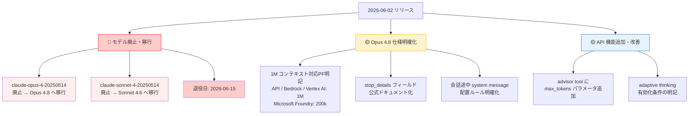
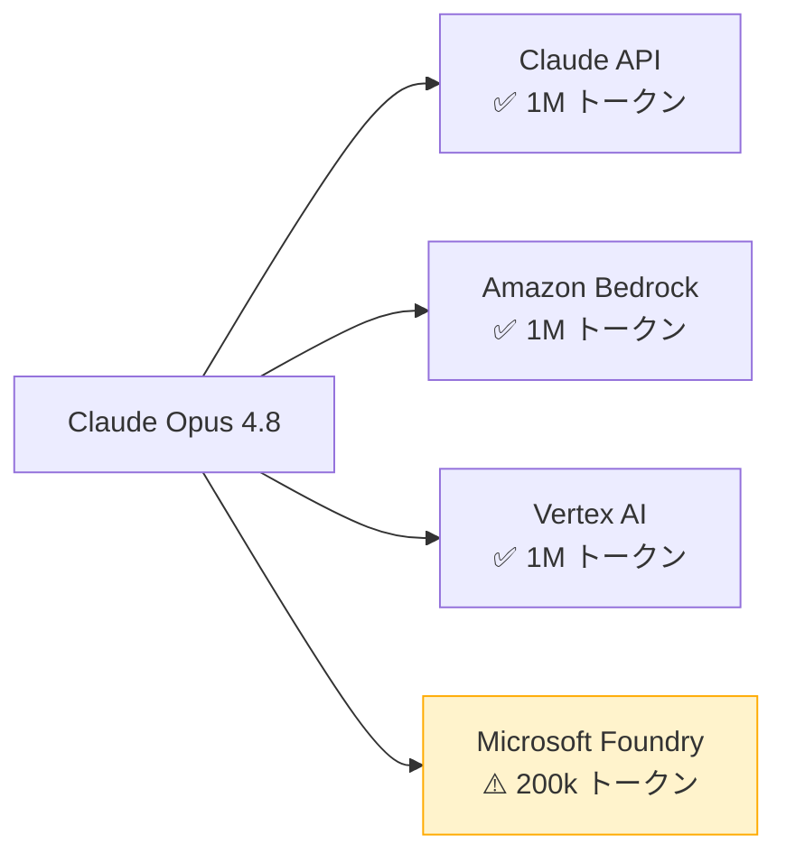
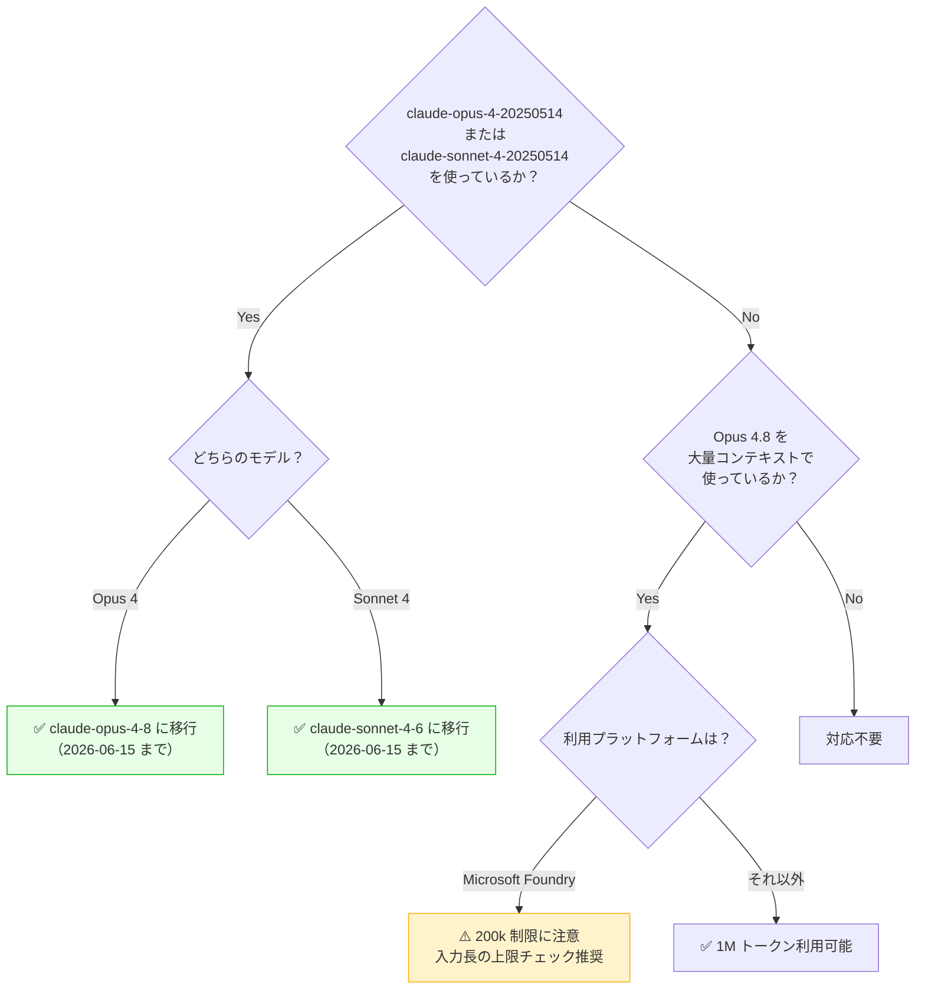

## はじめに

2026年6月2日、Anthropic は複数の重要なドキュメント更新とAPI変更を行いました。中でも **Claude Opus 4 / Sonnet 4 の廃止が2026年6月15日に迫っており、移行先推奨モデルが Opus 4.7 から Opus 4.8 に変更**されたことは、該当モデルを利用中の開発者にとって即座の対応が必要です。

また、Claude Opus 4.8 の1Mトークンコンテキストウィンドウが利用可能なプラットフォームが明記され、`stop_details` フィールドの公式ドキュメント化、`advisor tool` への `max_tokens` パラメータ追加など、実用的な改善も複数リリースされました。

> **📌 影響を受ける人**
> - `claude-opus-4-20250514` または `claude-sonnet-4-20250514` を本番利用中の開発者（**要対応**）
> - Claude Opus 4.8 を大規模コンテキストで利用中の開発者
> - 拒否応答のハンドリングロジックを実装している開発者

---

## 変更の全体像



---

## 変更内容

### 🔴 [要対応] Opus 4 / Sonnet 4 廃止：移行先が Opus 4.8 に更新

> **⚠️ Breaking Change**
> `claude-opus-4-20250514` および `claude-sonnet-4-20250514` は **2026年6月15日に Claude API から退役**します。ハードコードしている場合は今すぐ移行してください。

移行先推奨モデルが更新されました：

| 廃止モデル | 旧推奨移行先 | 新推奨移行先 | 退役日 |
|---|---|---|---|
| `claude-opus-4-20250514` | claude-opus-4-7 | **claude-opus-4-8** | 2026-06-15 |
| `claude-sonnet-4-20250514` | claude-sonnet-4-6 | claude-sonnet-4-6（変更なし） | 2026-06-15 |

Opus 4 を利用していた場合、移行先が Opus 4.7 から **Opus 4.8 に変わった**点に注意してください。Opus 4.8 は Opus 4.7 と同等のツール・プラットフォーム機能を持ちながら、デフォルトで1Mトークンコンテキストと128k最大出力トークンに対応しています。

---

### 🟡 Opus 4.8 の1Mコンテキストウィンドウ：対応プラットフォームを明記

Claude Opus 4.8 のデフォルト1Mトークンコンテキストウィンドウは、**すべてのプラットフォームで利用できるわけではありません**。



| プラットフォーム | コンテキストウィンドウ | 最大出力トークン |
|---|---|---|
| Claude API | 1M トークン | 128k |
| Amazon Bedrock | 1M トークン | 128k |
| Vertex AI | 1M トークン | 128k |
| Microsoft Foundry | **200k トークン** | 128k |

> **💡 Tips**
> Microsoft Foundry 経由で Opus 4.8 を利用している場合、長大なドキュメント処理などで想定外のコンテキスト切れが発生する可能性があります。入力長に上限を設けるか、他プラットフォームへの移行を検討してください。

---

### 🟡 `stop_details` フィールドが公式ドキュメント化

Claude Opus 4.8 が要求を拒否した際に返す `stop_details` フィールドが公式にドキュメント化されました。**beta ヘッダーは不要**で、現在すでに利用可能です。

`stop_details` の構造：

| フィールド | 型 | 値 | 説明 |
|---|---|---|---|
| `category` | string \| null | `"cyber"` | サイバーセキュリティ関連の拒否 |
| `category` | string \| null | `"bio"` | バイオ・化学兵器関連の拒否 |
| `category` | string \| null | `null` | カテゴリ非該当の拒否 |
| `explanation` | string | - | 人間が読める拒否理由の説明 |

拒否カテゴリを判別してルーティング処理を実装することで、ユーザーへの適切なフィードバックや代替フローへの誘導が可能になります。

---

### 🟡 会話途中のシステムメッセージ（mid-conversation system messages）配置ルール明確化

Claude Opus 4.8 でサポートされる会話途中へのシステムメッセージ挿入について、配置ルールが明確化されました。

**変更前の表現：**
> messages 配列の非先頭位置に `role: "system"` を送信可能

**変更後の表現：**
> ユーザーターンの後（placement rules に従う）に `role: "system"` を送信可能

つまり、`role: "system"` メッセージはユーザーターンの直後に配置する必要があります。長時間セッション中に指示が変わる場合でも、この配置ルールを守ることでプロンプトキャッシュのヒット率を維持できます。

---

### 🔵 advisor tool に `max_tokens` パラメータを追加

`tools[].max_tokens` を設定することで、advisor モデルが1回の呼び出しで生成する出力の最大長を制限できるようになりました。

フルレングスの advisor 応答が不要なワークロード（判定・分類・短い補完など）でレイテンシとコストを削減できます。

---

## 影響と対応



### 優先度別アクションリスト

**🔴 今すぐ対応（2026-06-15 まで）**
- [ ] `claude-opus-4-20250514` 使用箇所を `claude-opus-4-8` に置換
- [ ] `claude-sonnet-4-20250514` 使用箇所を `claude-sonnet-4-6` に置換
- [ ] モデルIDをハードコードしている設定ファイル・環境変数を確認

**🟡 推奨対応**
- [ ] Microsoft Foundry で Opus 4.8 を使っている場合、200k 制限の影響調査
- [ ] 拒否応答ハンドリングに `stop_details.category` を活用した分岐処理を追加

**🔵 任意対応**
- [ ] advisor tool の利用箇所で `max_tokens` によるコスト最適化を検討
- [ ] Opus 4.8 の mid-conversation system messages 活用でキャッシュヒット率を改善

---

## コード例

### モデルID移行

```python
import anthropic

client = anthropic.Anthropic()

# Before（2026-06-15 に退役）
response = client.messages.create(
    model="claude-opus-4-20250514",  # ❌ 廃止予定
    max_tokens=1024,
    messages=[{"role": "user", "content": "Hello"}]
)

# After
response = client.messages.create(
    model="claude-opus-4-8",  # ✅ 推奨移行先
    max_tokens=1024,
    messages=[{"role": "user", "content": "Hello"}]
)
```

### `stop_details` を使った拒否応答ハンドリング

```python
import anthropic

client = anthropic.Anthropic()

response = client.messages.create(
    model="claude-opus-4-8",
    max_tokens=1024,
    messages=[{"role": "user", "content": "..."}]
)

if response.stop_reason == "refusal":
    stop_details = response.stop_details
    category = stop_details.get("category")  # "cyber", "bio", または None
    explanation = stop_details.get("explanation", "")

    if category == "cyber":
        # サイバーセキュリティ関連の拒否
        print(f"セキュリティポリシーにより処理できません: {explanation}")
    elif category == "bio":
        # バイオ・化学兵器関連の拒否
        print(f"安全ポリシーにより処理できません: {explanation}")
    else:
        # その他の拒否
        print(f"リクエストを処理できません: {explanation}")
```

### advisor tool に `max_tokens` を設定

```python
tools = [
    {
        "type": "advisor",
        "name": "code_reviewer",
        "max_tokens": 256,  # 追加: advisor の出力を256トークンに制限
        # ... 他の設定
    }
]

response = client.messages.create(
    model="claude-opus-4-8",
    max_tokens=4096,
    tools=tools,
    messages=[{"role": "user", "content": "このコードをレビューしてください"}]
)
```

### mid-conversation system messages の正しい配置

```python
messages = [
    {"role": "user", "content": "タスクを開始してください"},
    {"role": "assistant", "content": "了解しました。処理を開始します。"},
    {"role": "user", "content": "追加の制約を加えてください"},
    # ✅ ユーザーターンの後に system を配置
    {"role": "system", "content": "以降の応答は100字以内にしてください"},
    {"role": "assistant", "content": "制約を適用しました。"},
    {"role": "user", "content": "続きをお願いします"},
]

response = client.messages.create(
    model="claude-opus-4-8",
    max_tokens=1024,
    messages=messages
)
```

---

## まとめ

| 変更 | 重要度 | 対応要否 |
|---|---|---|
| Opus 4 / Sonnet 4 廃止・移行先更新 | 🔴 高 | **要対応（〜6/15）** |
| Opus 4.8 コンテキスト対応PF明記 | 🟡 中 | 確認推奨 |
| `stop_details` フィールド公式化 | 🟡 中 | 活用推奨 |
| mid-conversation system messages 配置ルール | 🟡 中 | 任意 |
| advisor tool `max_tokens` パラメータ | 🔵 低 | 任意 |
| adaptive thinking 有効化条件の明記 | 🔵 低 | 任意 |

今回の変更で最も重要なのは **Opus 4 / Sonnet 4 の退役（2026年6月15日）と、移行先が Opus 4.8 に更新された点**です。移行は単純なモデルID置換で完了しますが、期限まで残り約2週間と短いため、速やかに対応してください。

また、Microsoft Foundry で Opus 4.8 を利用している場合はコンテキストウィンドウが200kに制限される点、`stop_details` フィールドが公式化されてエラーハンドリングをより細かく制御できるようになった点も、システム設計の見直しに活用できます。
