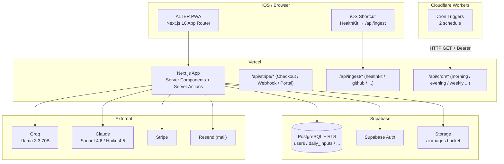
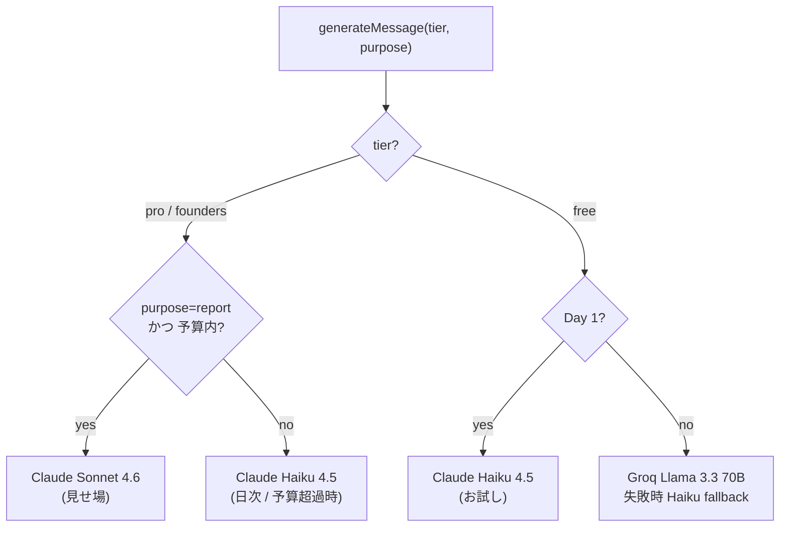
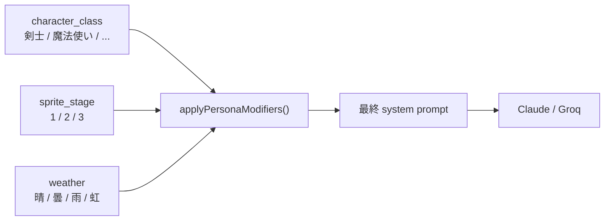
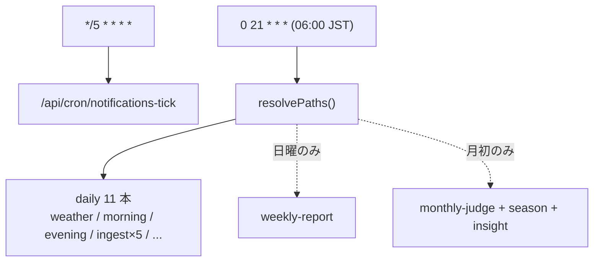

## 起点 — 迫さんの一言から始まった話

1 年と数ヶ月前、自分はこのポストを見ました。

> めちゃくちゃ痩せそうなゲーム×副業×フィットネスアプリとか AI で作りたいなぁ
>
> — 迫佑樹さん (@sako_brain) https://x.com/sako_brain/status/2054790607076499585

副業エンジニアにとって、ダイエットと副業は「どちらも続かないもの」の代表でした。食事は食事のアプリ、運動は運動のアプリ、副業の進捗はノートに手書き。記録がバラバラだと、どこかで「もう今日はいいや」が混ざって、気づくと両方止まっている。自分も何度も同じことを繰り返してきました。

迫さんのこの一言が、散らかっていた記録を「1 つのキャラに集約する」という発想に変えてくれました。そこから本気で設計して作ったのが、本記事で紹介する ALTER というアプリです。ポストの引用については、開発初期に本人へリプライで一言お伝えしてあります。

## 何を作っているか — 副業 × ダイエットを 1 つのキャラで

ALTER は、副業の commit とダイエットの歩数を、同じキャラの HP / MP / EXP に乗せる Web アプリです。Next.js + Supabase + Cloudflare Workers の PWA で、iPhone のホーム画面に置けば iOS アプリのように動きます。

機能を一言にまとめると、こうなります。

> 食事は MP、運動は HP、フロー時間は EXP、副業の動きは CHA。

ありそうで無いのが、副業 × ダイエットの両軸を 1 つのキャラに集約する設計でした。あすけんは食事だけ、Strava は運動だけ、Habitica は習慣だけ。両軸を別々のアプリで管理する苦しさは、副業エンジニアには馴染みのある感覚だと思います。

差別化の本丸は 3 つです。

1. 副業 × ダイエットを 1 つのキャラで（競合がほぼいない領域）
2. 行動が職業を決める動的な AI 判定（自分で「選ぶ」のではなく、続けた行動から「見えてくる」）
3. Habitica で挫折した人のための、焦らせないトラッカー

職業は 6 つ。剣士 / 魔法使い / 検士 / 商人 / 錬金術師 / 秘書。直近 7 日間の行動を AI が観察して判定し、月ごとに変わってもいい設計にしています。判定が確定するまでは「見習い」として、中立な伴走者がそばにいます。

## 思想 — 「静かな未来」が AI 伴走の設計を変えた

ALTER の根に置いた 4 行があります。

> **「静かな未来」**
> - 戦闘より発展
> - タスクより成長
> - 勝敗より継続

技術選定もコード設計も、すべてこの 4 行から派生しました。これは抽象論ではなく、Habitica や Duolingo で自分が挫折した経験への、直接の応答です。

Habitica ではクエストの山に押し潰されて、最後はアプリを開かなくなりました。「やらなければ HP が減る」「ストリークが切れたら積み上げがゼロに戻る」というプレッシャーは、続けたい人ほど続けられなくする。原因と結果が逆転しているように感じていました。

だから ALTER のブランドプロミスは「焦らせない、競わせない、急かさない」にしました。具体的には、こういう設計です。

- ランキングなし
- ストリーク切れのペナルティなし
- リーグ降格なし
- 「LEVEL UP!」の派手なフラッシュなし

代わりに、続いた歩みを静かに記録します。レベルが上がっても双葉がそっと灯る程度の演出に留め、ダイエットの体重変化も「達成」ではなく「健康的な範囲のキープ」を讃える方向にしました。

正直に言えば、これは運営側にはリスクの大きい選択でした。ランキングもストリークも、継続率を上げるには最も安く効く仕掛けです。それを全部外すなら、代わりに人をそっと引き留める「何か」を自前で用意しないといけません。自分が賭けたのは、数字で急かす代わりに置いた、静かに積み上がる記録と、煽らない伴走者でした。だから「焦らせない」は優しさのポーズではなく、外圧を一切使わずに継続を支えられるか、という設計上の挑戦そのものです。

ここから先の技術的な話 — アーキテクチャ、AI モデルの選び方、伴走者の口調制御 — は、すべてこの 4 行をどうコードに落とすかの工夫の集合です。なかでも AI 伴走者の層が、この思想を最も濃く反映しています。次章から、実装の中身を見ていきます。

## アーキテクチャ — Next.js + Supabase + Cloudflare Workers

ALTER は「個人開発が月 ¥0 から始められる構成」を最優先に組みました。全体像はこうです。



役割分担はシンプルです。

- **Next.js 16（App Router / Server Actions）on Vercel**：UI と API の本体。Server Actions で DB 書き込みまで完結させ、Serwist で PWA 化して iPhone のホーム画面に置けるようにしています。
- **Supabase（PostgreSQL + Auth + RLS）**：データと認証。Row Level Security で「自分の行しか読めない」を DB 層で担保し、アプリ側の認可ミスが事故に直結しないようにしています。
- **Cloudflare Workers Cron**：朝夜のメッセージ生成や外部データ取込みの定時起動役。Vercel ではなく CF に出した理由は第 7 章で書きます。
- **外部 AI**：日次は Groq の Llama 3.3 70B、見せ場は Claude。この使い分けが次章の主題です。

なぜこの組み合わせか。Vercel Hobby・Supabase Free・Cloudflare Workers Free のいずれも、個人開発の規模なら無料枠に収まり、**固定費ゼロで本番を回せる**からです。課金が発生するのは Claude / Groq の従量ぶんと Stripe 手数料くらいで、ユーザーが増えるまで身銭がほとんど要りません。技術選定の段階から「焦らずに続けられる」を、運営する自分の側にも効かせた形です。

## tier 階層化 — Free / Pro で AI モデルを切り替える

AI を売りにすると、原価がそのまま赤字に直結します。ALTER は「Free でも AI がちゃんと喋る」と「Pro でも原価が暴走しない」を両立させるため、**tier × 用途 × 月次予算**の 3 軸でモデルを解決しています。中心はこの純粋関数です。

```typescript
// lib/ai/provider.ts （抜粋）
export function resolveProvider(args: {
  tier: SubscriptionTier;
  isDay1: boolean;
  groqModelPrimary: string;
  purpose?: AiPurpose; // 'daily' | 'report'
  overBudget?: boolean; // 月次原価がソフトキャップ超過か
}): ProviderResolution {
  const purpose = args.purpose ?? 'daily';

  // Pro / Founders: 見せ場(report)だけ Sonnet、日次は Haiku で原価圧縮。
  // 月次ソフトキャップ超過時は report も Haiku に降格してコスト暴走を防ぐ。
  if (args.tier === 'founders' || args.tier === 'pro') {
    const useSonnet = purpose === 'report' && !args.overBudget;
    const model = useSonnet ? MODELS.CLAUDE_SONNET : MODELS.CLAUDE_HAIKU;
    return { primary: { name: 'anthropic', model }, fallback: null };
  }
  // Free Day 1 はお試し品質として Haiku。
  if (args.isDay1) {
    return { primary: { name: 'anthropic', model: MODELS.CLAUDE_HAIKU }, fallback: null };
  }
  // Free Day 2 以降: Groq primary(無料・速い) → 失敗時 Haiku fallback。
  return {
    primary: { name: 'groq', model: args.groqModelPrimary },
    fallback: { name: 'anthropic', model: MODELS.CLAUDE_HAIKU },
  };
}
```

フローにするとこうなります。



判断の背景を 3 つ。

1. **Free の日次は Groq（Llama 3.3 70B）**。無料枠が広く、速い。落ちたときだけ Claude Haiku に逃がして、無料ユーザーでも伴走者を沈黙させません。
2. **Pro / Founders の日次も Haiku**。朝コメントや日次スコアは高頻度なので、ここを Sonnet にすると原価が効いてきます。Haiku の入出力単価は Sonnet のおよそ 1/3（実装の原価表で Haiku = \$1 / \$5、Sonnet = \$3 / \$15 per 1M tokens）。
3. **見せ場（週次レポート・月次の取扱説明書・職業判定）だけ Sonnet 4.6**。低頻度かつ、品質がそのまま体験になる場所に予算を集中させます。

暴走対策も入れてあります。Pro / Founders には**月次の原価ソフトキャップ（1 ユーザー ¥600）**があり、超えると report でも自動で Haiku に降格します。通常利用（週次 4 回 + 月次 1 回）なら数十円で収まり到達しない安全網ですが、想定外の使われ方をしても赤字が青天井にならない作りです。「焦らせない」を、コスト管理の側の安心感としても持っておきたかった、という設計でした。

この方針が机上の空論にならないよう、AI 呼び出しは毎回モデル・入出力トークン・概算原価を `api_usage_logs` と PostHog に二重記録しています。ソフトキャップの判定も、当月の実コスト合計を DB から引いて行う実測値ベースです。`resolveProvider()` を副作用のない純粋関数にしてあるのもこのためで、「どの tier の・どの用途で・予算超過時に・どのモデルが出るか」を、ネットワークも DB も触らずにユニットテストで全パターン固定できます。原価が読めるからこそ、Free を躊躇なく無料のまま出せる。コスト設計と「焦らせない」思想は、ここで地続きになっています。

## 「静かな AI 伴走」の実装パターン

「焦らせない、競わせない、急かさない」を、伴走者の言葉づかいに落とすのがこの層です。3 つの仕掛けで作っています。

**① 7 人格を静的な TS モジュールに固定する。** ナビ（見習い期間）＋ 6 職業ぶんの伴走者を、それぞれ system prompt 付きのモジュールとして持っています。ランタイム生成せず固定なので、レビューも差分管理もコードと同じ土俵に乗ります。代表してナビの定義はこうです。

```typescript
// lib/ai/companions/navi.ts （抜粋）
export const NAVI_COMPANION: CompanionConfig = {
  characterClass: null,
  companionName: 'ナビ',
  systemPrompt:
    'あなたは「ナビ」、ALTER の旅の見守り役です。\n' +
    '【性格】中立的、観察者。励まさない、評価しない、ただ見ている。\n' +
    '【口調】「〜ですね」「〜のように見えます」「〜の気配があります」。\n' +
    '【絶対 NG】励ます定型語、命令形、体重の増減を讃える。',
  // ...
};
```

**② 天候 × 進化段階で口調を動的に変える。** 同じ人格でも、進化段階（見習い / 一人前 / 達人）と「今日の調子（天気）」に応じて、system prompt の末尾に修飾を足します。



ここが思想の効くところです。たとえば「雨が続いている（数日疲れている）」日は、口調を一段やさしくし、前進を促す煽り言葉を出さないよう明示的に縛ります。節目を踏んだ「虹」の日ですら、祝福はいつもの口調の範囲に留めます。

**③ tone-check で煽りを機械的に止める。** 生成結果は、ユーザーに出す前に純粋関数で検査します。

```typescript
// lib/ai/tone-check.ts （抜粋）
const NG_WORD_RE = /頑張|最高|素晴/;
const IMPERATIVE_RE = /(しろ|なさい|すべき|なければ)/;
const WEIGHT_PRAISE_RE = /(軽くなった|重くなった|痩せ.{0,2}|太っ)[ねよ]/;

export function checkTone(text: string, maxLen: number) {
  const reasons: ToneViolation[] = [];
  if (NG_WORD_RE.test(text)) reasons.push('ng_word');
  if (IMPERATIVE_RE.test(text)) reasons.push('imperative');
  if (WEIGHT_PRAISE_RE.test(text)) reasons.push('weight_praise');
  // emoji / 長すぎ / 感情の否定 もここで弾く
  return reasons.length === 0 ? { ok: true } : { ok: false, reasons };
}
```

プロンプトで禁止し、さらに出力でも検査する二段構えです。体重を讃える言葉や、不安・焦りを「克服しろ」と否定する言葉まで弾きます。結果として、同じユーザーが朝に開いても、晴れの日と雨の日で返ってくる言葉の温度が静かに変わる。派手な演出ではなく、この「温度の制御」こそが ALTER の伴走者の核でした。

## Cloudflare Workers Cron で 11 endpoint を 2 schedule に圧縮

ALTER は朝夜のメッセージ生成や外部データ取込みなど、定時で叩きたい API が十数本あります。ところが **Cloudflare Workers Free tier の Cron Triggers は account 単位で 5 個まで**。自分の account は別 Worker で 3 個使っていて、ALTER に割けるのは 2 個でした。

そこで、2 つの schedule で全 endpoint を fan-out する dispatcher を 1 関数に集約しました。

```typescript
// cloudflare/cron-worker/src/index.ts （抜粋）
function resolvePaths(cron: string, now: Date): string[] {
  if (cron === '*/5 * * * *') {
    return ['/api/cron/notifications-tick']; // 5 分毎
  }
  if (cron === '0 21 * * *') {
    // 毎日 06:00 JST (= 21:00 UTC)
    const paths = [
      '/api/cron/real-weather', '/api/cron/morning', '/api/cron/evening',
      '/api/ingest/github', '/api/ingest/wakatime', '/api/ingest/toggl',
      '/api/ingest/strava', '/api/ingest/rss',
      '/api/cron/hardcore-check', '/api/cron/post-subscription-survey',
      '/api/cron/day7-preview',
    ];
    if (now.getUTCDay() === 0) paths.push('/api/cron/weekly-report'); // 日曜
    if (now.getUTCDate() === 1) {
      // 月初
      paths.push('/api/cron/monthly-judge', '/api/cron/season-transition', '/api/cron/monthly-insight');
    }
    return paths;
  }
  return [];
}
```



キモは、曜日・月初の判定を `resolvePaths()` の中だけに閉じたことです。cron 枠は 2 個に固定したまま、endpoint の増減や週次 / 月次の出し分けは、この単一関数の編集で完結します。制約（5 個まで）を逆手に取って、むしろ cron 構成がシンプルになりました。Worker 側は受け取った path を順次 `fetch` し、各 endpoint には `Authorization: Bearer ${CRON_SECRET}` を付けて Vercel の API を保護しています。

## 試してみたい方へ — Founders 50 枠開放のご案内

ALTER は 2026-06-03 に一般公開します。

- **Free: ¥0** — 6 職業の判定 + AI 伴走（Groq）。これだけでも十分使えます
- **Pro: ¥980/月** — AI 画像生成 + 詳細 insight + 90 日修羅道
- **Founders: ¥500/月（永久ロックイン、50 枠限定）** — Pro の全機能を半額で

Founders 枠が埋まったら、自動で Pro（¥980/月）に切り替わります。一度入れば、料金が上がる期限はありません。公開日には「残り何枠か」が `/pricing` でリアルタイムに見えるようにしてあります。

- ALTER LP: https://alter.ponfreelance.com
- 起点になった迫さんのポスト: https://x.com/sako_brain/status/2054790607076499585

迫さん、ありがとうございました。

---

**著者**：ぽん（@pon_freelance）
