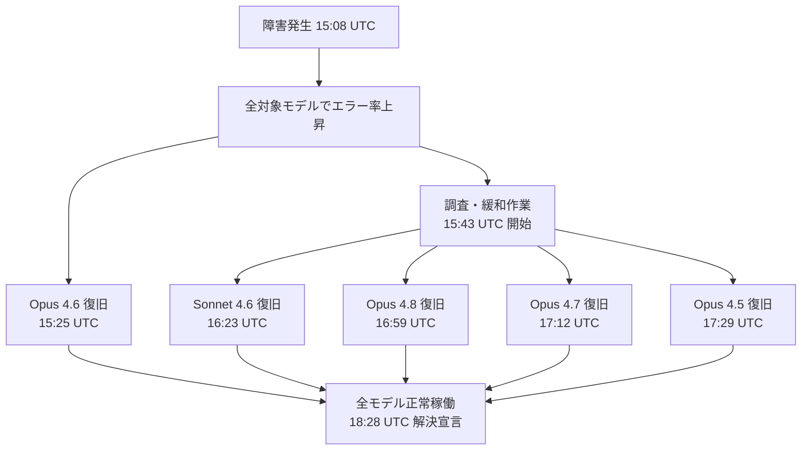

## はじめに

2026年6月5日、Anthropic の Claude API において複数のモデルでエラー率が上昇する障害が発生しました。影響を受けたのは Opus 4.5〜4.8 および Sonnet 4.6 という、現行のほぼ全フロンティアモデルです。

障害は約3時間半で完全に解決済みであり、現在は全モデルが正常稼働しています。本記事では障害のタイムライン・各モデルの復旧順序・今後の対策を整理します。

> **📌 影響を受けた人**
> - Claude API（Messages API / Batch API）を本番環境で利用している開発者・事業者
> - Opus 4.7 / 4.8 など最新フロンティアモデルに依存したアプリケーションの運用者

---

## 変更の全体像

### 障害タイムライン（UTC）

```mermaid
timeline
    title Claude API 障害タイムライン（2026-06-05 UTC）
    15:08 : 障害発生（エラー率上昇を検知）
    15:19 : Anthropic が調査開始
    15:25 : Opus 4.6 復旧
    15:43 : 原因特定・緩和作業開始
    16:23 : Sonnet 4.6 復旧
    16:59 : Opus 4.8 復旧
    17:12 : Opus 4.7 復旧
    17:13 : 全モデルの成功率が想定水準に回復
    17:29 : Opus 4.5 復旧
    18:28 : 正式解決宣言
```

### モデル別の復旧フロー



---

## 変更内容

### 障害概要

| 項目 | 内容 |
|------|------|
| 障害発生日時 | 2026-06-05 15:08 UTC（日本時間 24:08）|
| 正式解決日時 | 2026-06-05 18:28 UTC（日本時間 翌3:28）|
| 障害継続時間 | 約 **3時間20分** |
| 障害の種別 | 一時的な運用障害（仕様変更・Breaking Change なし）|
| 影響 API | Claude API（Messages API 等）|

### 影響を受けたモデルと復旧時刻

| モデル | 復旧時刻（UTC）| 復旧時刻（JST）| 障害継続時間 |
|--------|--------------|----------------|-------------|
| Opus 4.6 | 15:25 | 翌 0:25 | **約17分**（最短） |
| Sonnet 4.6 | 16:23 | 翌 1:23 | 約1時間15分 |
| Opus 4.8 | 16:59 | 翌 1:59 | 約1時間51分 |
| Opus 4.7 | 17:12 | 翌 2:12 | 約2時間4分 |
| Opus 4.5 | 17:29 | 翌 2:29 | 約2時間21分 |

> **⚠️ Breaking Change**
> 今回の障害は恒久的な仕様変更を伴いません。モデル名・APIエンドポイント・レスポンス形式への変更は一切ありません。

---

## 影響と対応

### 今回の障害で起きたこと

- API へのリクエストがエラーを返す・タイムアウトするケースが増加
- 特に Opus 4.7 / 4.8 は最新フロンティアモデルであり、障害継続時間が他モデルより長かった
- Opus 4.6 は比較的早期に復旧（17分）

### 今後の対策：障害に強いシステム設計

Claude API を本番利用している場合、今後同様の障害が発生した際に備えて以下の対策が有効です。

#### 1. ステータスページの監視

Anthropic は公式ステータスページでインシデント情報をリアルタイム公開しています。サービス監視ツール（Uptime Robot, BetterUptime 等）でステータスページの RSS フィードや Webhook を購読すると、障害を素早く検知できます。

#### 2. リトライ・フォールバック実装

```python
import anthropic
import time

client = anthropic.Anthropic()

def call_claude_with_retry(
    model: str,
    messages: list,
    max_retries: int = 3,
    backoff_base: float = 2.0,
) -> str:
    """指数バックオフ付きリトライ"""
    for attempt in range(max_retries):
        try:
            response = client.messages.create(
                model=model,
                max_tokens=1024,
                messages=messages,
            )
            return response.content[0].text
        except anthropic.APIStatusError as e:
            if e.status_code in (500, 503, 529) and attempt < max_retries - 1:
                wait = backoff_base ** attempt
                print(f"[retry {attempt + 1}] status={e.status_code}, wait={wait}s")
                time.sleep(wait)
            else:
                raise
```

#### 3. モデルフォールバック

高精度モデル（Opus 4.8）が利用できない場合に、自動的に下位モデルへ切り替える設計も有効です。

```python
FALLBACK_MODELS = [
    "claude-opus-4-8",    # 第1候補
    "claude-opus-4-7",    # 第2候補
    "claude-sonnet-4-6",  # 第3候補（軽量・高速）
]

def call_with_fallback(messages: list) -> str:
    for model in FALLBACK_MODELS:
        try:
            return call_claude_with_retry(model=model, messages=messages)
        except anthropic.APIStatusError as e:
            print(f"Model {model} unavailable: {e.status_code}, trying next...")
    raise RuntimeError("All models unavailable")
```

#### 4. タイムアウト設定

長時間の応答待ちを防ぐため、`timeout` を明示的に設定することを推奨します。

```python
import httpx

client = anthropic.Anthropic(
    timeout=httpx.Timeout(
        connect=5.0,   # 接続タイムアウト
        read=60.0,     # 読み取りタイムアウト
        write=10.0,
        pool=5.0,
    )
)
```

---

## コード例

### 障害発生時の挙動（Before）と推奨実装（After）

**Before: エラーハンドリングなし（障害時にアプリがクラッシュ）**

```python
# 障害発生中はここで例外が発生し、アプリが停止する
response = client.messages.create(
    model="claude-opus-4-8",
    max_tokens=1024,
    messages=[{"role": "user", "content": "Hello"}],
)
```

**After: リトライ + フォールバック付き（障害時も継続動作）**

```python
try:
    result = call_with_fallback(
        messages=[{"role": "user", "content": "Hello"}]
    )
    print(result)
except RuntimeError:
    # 全モデルが使用不可の場合のグレースフルデグレード
    print("AI機能は一時的に利用できません。しばらくお待ちください。")
```

---

## まとめ

| ポイント | 内容 |
|----------|------|
| 障害規模 | 現行フロンティアモデル5種が影響を受ける大規模障害 |
| 影響時間 | 最大約2時間21分（Opus 4.5）、最短17分（Opus 4.6）|
| 現在の状況 | **完全解決済み・全モデル正常稼働** |
| 仕様変更 | **なし**（コード修正不要）|
| 推奨対策 | リトライ実装・モデルフォールバック・ステータス監視 |

今回の障害は現在完全に解決されており、コードや設定の変更は不要です。ただし、Claude API を本番環境で利用している場合は、この機会にリトライロジックやフォールバック設計を見直しておくことを推奨します。Anthropic の公式ステータスページを監視する仕組みを整えておくと、次回の障害時に素早く対応できます。
