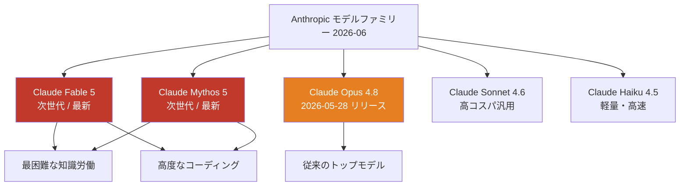
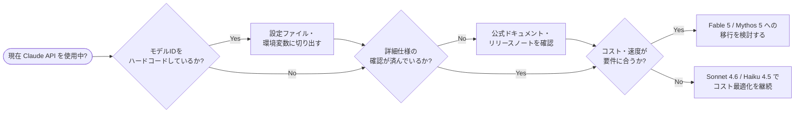

## はじめに

2026年6月9日、Anthropicが次世代モデル **Claude Fable 5** および **Claude Mythos 5** を正式発表しました。

公式アナウンスには「最も困難な知識労働とコーディング問題に向けた次世代の知能（Our next generation of intelligence for the hardest knowledge work and coding problems）」と記されており、これまでのトップモデルだった Claude Opus 4.8 を超える性能が期待されます。

このリリースは、APIを利用している開発者・AIシステムを構築・運用しているエンジニアにとって、モデル選定を見直す重要なタイミングです。

> **📌 影響を受ける人**
> - Claude API を使ったアプリケーションを開発・運用している方
> - コーディング支援・知識労働の自動化ツールを作っている方
> - モデルIDをコードにハードコードしている方
> - プロジェクトのAIコスト最適化を検討中の方

---

## 変更の全体像



Anthropicのモデルラインアップに **Fable 5** と **Mythos 5** が最上位として追加され、Opus 4.8 はその下位へ移動する形になりました。

---

## 変更内容

### 新モデルの位置づけ

| モデル | 世代 | 用途 | ステータス |
|---|---|---|---|
| Claude Fable 5 | 第5世代 | 困難な知識労働・コーディング | ✅ 新発表 (2026-06-09) |
| Claude Mythos 5 | 第5世代 | 困難な知識労働・コーディング | ✅ 新発表 (2026-06-09) |
| Claude Opus 4.8 | 第4世代 | 汎用高性能 | ⬇️ 掲載順位が下降 |
| Claude Sonnet 4.6 | 第4世代 | バランス型汎用 | 変更なし |
| Claude Haiku 4.5 | 第4世代 | 軽量・高速処理 | 変更なし |

> **⚠️ Breaking Change 予告**
> 本発表時点では、詳細な性能スペック・APIモデルID・料金体系は公式ドキュメントに掲載されていません。実運用への切り替え前に必ず公式情報を確認してください。

### Fable 5 と Mythos 5 の違いについて

現時点では両モデルの差異は公式から明示されていません。名称の慣例からは、次のような役割分担が推測されます。

- **Fable 5**: 知識集約型タスク（調査・分析・長文生成）向けの可能性
- **Mythos 5**: 複雑な推論・高度なコーディングタスク向けの可能性

ただしこれは推測であり、確定情報は公式発表をお待ちください。

### Anthropicのモデル命名規則の変化

これまでの第4世代は `Opus / Sonnet / Haiku` という詩的な名称でした。第5世代では `Fable / Mythos` という新たな命名体系が採用されており、モデル系列のアーキテクチャ刷新を示唆しています。

---

## 影響と対応

### なぜこの発表が重要なのか

Anthropicがニュース一覧のトップに掲載するモデルは「現時点でのベストモデル」を示す慣例があります。今回の Fable 5 / Mythos 5 の最上位掲載は、これらが Opus 4.8 を含む第4世代モデルを超える能力を持つことを示唆しており、特に**困難なコーディングや知識労働**に Claude を使っているプロダクトでは、移行検討の価値があります。



### 今すぐ取るべきアクション

1. **公式アナウンスを監視する**
   Anthropicの公式ブログやAPIドキュメントで詳細情報が随時更新されます。リリースノートのRSSやメール購読を設定しておくと見逃しを防げます。

2. **モデルIDのハードコードを解消する**
   `claude-opus-4-8` などをコードに直接書いている場合は、設定ファイルや環境変数に切り出しておくことで移行コストを大幅に下げられます。

3. **ベンチマーク情報を収集する**
   公式スペックだけでなく、コミュニティのベンチマーク結果も参考にしてモデル選定の判断材料を揃えましょう。

> **💡 Tips**
> 複数のモデルIDを環境変数で切り替えられる構成にしておけば、開発・ステージング・本番で異なるモデルを使い分けることができ、コスト管理と品質確保を両立しやすくなります。

---

## コード例

新モデルへの切り替えを容易にするベストプラクティスを Before/After で示します。

### Before: モデルIDのハードコード（非推奨）

```python
import anthropic

client = anthropic.Anthropic()

# モデルIDが直書き: 変更のたびにコード全体を修正する必要がある
message = client.messages.create(
    model="claude-opus-4-8",
    max_tokens=1024,
    messages=[
        {"role": "user", "content": "複雑なコードレビューをしてください"}
    ]
)
```

### After: 環境変数・定数で管理（推奨）

```python
import anthropic
import os

client = anthropic.Anthropic()

# 環境変数から取得。未設定時は Fable 5 をデフォルトに
MODEL_ID = os.getenv("CLAUDE_MODEL", "claude-fable-5")

message = client.messages.create(
    model=MODEL_ID,
    max_tokens=1024,
    messages=[
        {"role": "user", "content": "複雑なコードレビューをしてください"}
    ]
)
```

```bash
# .env（本番環境）
CLAUDE_MODEL=claude-fable-5

# .env.development（開発環境: コスト削減）
CLAUDE_MODEL=claude-haiku-4-5-20251001
```

### TypeScript / Node.js の場合: タスク別モデル分離

```typescript
import Anthropic from "@anthropic-ai/sdk";

const client = new Anthropic();

const MODEL_CONFIG = {
  // 困難な知識労働・コーディングには第5世代を選択
  heavy: process.env.CLAUDE_HEAVY_MODEL ?? "claude-fable-5",
  // 汎用タスクはコスパ重視で Sonnet を継続
  balanced: process.env.CLAUDE_BALANCED_MODEL ?? "claude-sonnet-4-6",
  // 大量処理・分類タスクは Haiku で高速化
  fast: process.env.CLAUDE_FAST_MODEL ?? "claude-haiku-4-5-20251001",
} as const;

async function runCodeReview(code: string) {
  const message = await client.messages.create({
    model: MODEL_CONFIG.heavy, // コーディングには heavy を選択
    max_tokens: 2048,
    messages: [
      {
        role: "user",
        content: `以下のコードをレビューしてください:\n\n${code}`,
      },
    ],
  });
  return message.content;
}

async function classifyDocument(text: string) {
  const message = await client.messages.create({
    model: MODEL_CONFIG.fast, // 大量分類には fast を選択
    max_tokens: 256,
    messages: [
      { role: "user", content: `このドキュメントのカテゴリを判定してください:\n\n${text}` },
    ],
  });
  return message.content;
}
```

このようにタスクの重さに応じてモデルを使い分けることで、コストと品質のバランスを最適化できます。

---

## まとめ

| ポイント | 内容 |
|---|---|
| 発表日 | 2026年6月9日 |
| 新モデル | Claude Fable 5 / Claude Mythos 5 |
| 主な用途 | 困難な知識労働・高度なコーディング |
| 詳細スペック・料金 | 未公開（公式発表待ち） |
| 旧トップモデル | Claude Opus 4.8 → 掲載順位が下降 |
| 今すぐできること | モデルIDの設定外部化、公式情報の継続監視 |

Claude Fable 5 と Mythos 5 の登場は、Anthropicの第5世代モデルの幕開けを意味します。詳細スペックや料金は今後の公式発表を待つ必要がありますが、**今のうちにコードのモデルID依存を切り離し、切り替えを容易にする設計にしておくこと**が、スムーズな移行への最善策です。

特に困難なコーディングや知識集約タスクで Claude を活用しているプロダクトでは、新モデルが提供する性能向上が大きなメリットになる可能性があります。公式情報が出次第、ベンチマーク比較も含めて記事を更新する予定です。
