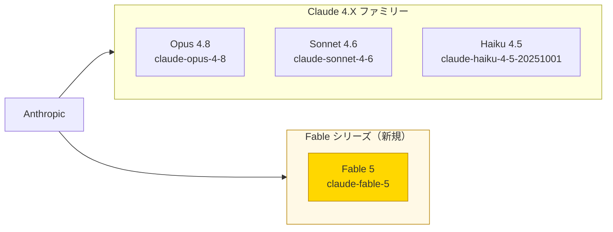
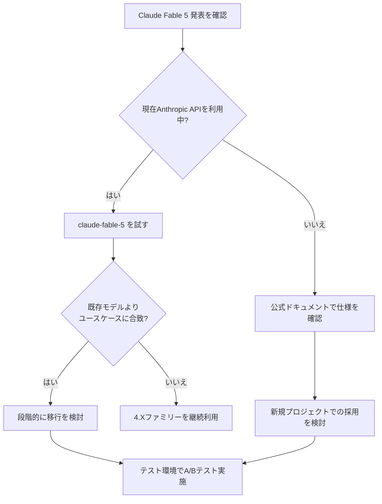

## はじめに

2026年6月9日、AnthropicがHacker Newsにて **Claude Fable 5** を発表しました。このニュースはHacker Newsで **1,102のいいね** を獲得し、AIコミュニティに大きな波紋を呼んでいます。

既存のClaude 4.Xファミリー（Opus 4.8・Sonnet 4.6・Haiku 4.5）に加え、全く新しい **「Fable」シリーズ** が誕生したことは、Anthropicのモデル戦略における重要な転換点となる可能性があります。本記事では、Claude Fable 5の概要と、APIを利用している開発者が今すぐ確認すべきポイントをまとめます。

> **📌 影響を受ける人**
> - Anthropic APIを組み込んだアプリケーションを開発・運用しているエンジニア
> - モデル選定を担うAIプロダクトマネージャー・アーキテクト
> - 最新LLMの動向を追う研究者・技術者

---

## 変更の全体像

Claude Fable 5は、既存の4.Xファミリーとは独立した新シリーズとして位置付けられています。モデルIDは `claude-fable-5` です。



4.Xファミリーはそれぞれ「重量級・汎用・軽量高速」という役割分担が明確でしたが、Fableシリーズが何を担うポジションなのかは現時点で注目のポイントです。

---

## 変更内容

### 新モデルの基本情報

| 項目 | 内容 |
|------|------|
| モデル名 | Claude Fable 5 |
| モデルID | `claude-fable-5` |
| 発表日 | 2026年6月9日 |
| 発表元 | Anthropic |
| HackerNews反応 | 1,102 likes（高関心） |

### Claudeモデルファミリー全体像（2026年6月時点）

| モデル | モデルID | シリーズ |
|--------|----------|----------|
| **Claude Fable 5** | `claude-fable-5` | Fable（最新・新シリーズ） |
| Claude Opus 4.8 | `claude-opus-4-8` | 4.X（高性能） |
| Claude Sonnet 4.6 | `claude-sonnet-4-6` | 4.X（汎用バランス） |
| Claude Haiku 4.5 | `claude-haiku-4-5-20251001` | 4.X（高速・軽量） |

HackerNewsでのいいね数1,100超えという反応は、コミュニティの期待値の高さを示しています。過去のClaude 3.5 Sonnetや4.0系のリリース時と比較しても際立った数値であり、Fableシリーズに対する注目度の高さがうかがえます。

---

## 影響と対応

### 開発者が今すぐ取るべきアクション

1. **公式ドキュメントの確認**
   AnthropicのAPIドキュメントでFable 5の詳細仕様（コンテキストウィンドウ、価格、レート制限）を確認する。

2. **APIアクセスの検証**
   `claude-fable-5` モデルIDが自分のAPIプランで利用可能かテストする。

3. **ユースケース適合性の評価**
   既存の4.Xファミリーとの使い分けを検討する。



> **💡 Tips**
> モデル移行を検討する際は、まずテスト環境で `claude-fable-5` の出力品質・レイテンシ・コストを実際のユースケースで評価しましょう。本番環境への適用は検証後に行うのが安全です。

---

## コード例

Anthropic Python SDKでClaude Fable 5にアクセスする最小構成のコードです。

**Before（既存のSonnetモデル使用時）**

```python
import anthropic

client = anthropic.Anthropic()

response = client.messages.create(
    model="claude-sonnet-4-6",  # 従来モデル
    max_tokens=1024,
    messages=[
        {"role": "user", "content": "Explain the difference between supervised and unsupervised learning."}
    ]
)
print(response.content[0].text)
```

**After（Claude Fable 5使用時）**

```python
import anthropic

client = anthropic.Anthropic()

response = client.messages.create(
    model="claude-fable-5",  # 新しいFableシリーズ
    max_tokens=1024,
    messages=[
        {"role": "user", "content": "Explain the difference between supervised and unsupervised learning."}
    ]
)
print(response.content[0].text)
```

モデルIDを切り替えるだけで利用できる点は、Anthropic APIの既存ユーザーにとって移行コストが低い優れた設計です。

> **⚠️ Breaking Change の可能性**
> Fableシリーズが4.Xと異なるAPIパラメータや出力フォーマットを持つ場合、既存のプロンプトやパーサーの調整が必要になることがあります。本番適用前に必ずテストを実施してください。

### モデル比較テストの例

複数モデルの出力を比較評価したい場合の参考実装：

```python
import anthropic

client = anthropic.Anthropic()

models = [
    "claude-fable-5",
    "claude-sonnet-4-6",
    "claude-opus-4-8",
]

prompt = "Summarize the key principles of clean code in 3 bullet points."

for model_id in models:
    response = client.messages.create(
        model=model_id,
        max_tokens=512,
        messages=[{"role": "user", "content": prompt}]
    )
    print(f"=== {model_id} ===")
    print(response.content[0].text)
    print()
```

このようなA/Bテストスクリプトを用意しておくと、ユースケースごとの最適モデル選定がスムーズになります。

---

## まとめ

Claude Fable 5発表のポイントを整理します。

| ポイント | 内容 |
|---------|------|
| **新シリーズの誕生** | 4.Xファミリーと独立したFableシリーズが登場 |
| **モデルID** | `claude-fable-5` でAPI即時アクセス可能 |
| **コミュニティ反応** | HackerNewsで1,100超のいいね、注目度は非常に高い |
| **開発者アクション** | 公式ドキュメント確認 → テスト環境で評価 → 段階的移行検討 |

Anthropicのモデル戦略はClaude 3系・4系と進化を続け、今回のFableシリーズ登場でさらに多様化しています。各モデルの特性を把握し、コスト・性能・ユースケースに応じた適切な選択が今後ますます重要になります。

Claude Fable 5がどのような強みを持つモデルなのか、公式ドキュメントや実測ベンチマークの続報に注目しましょう。
