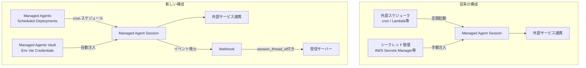
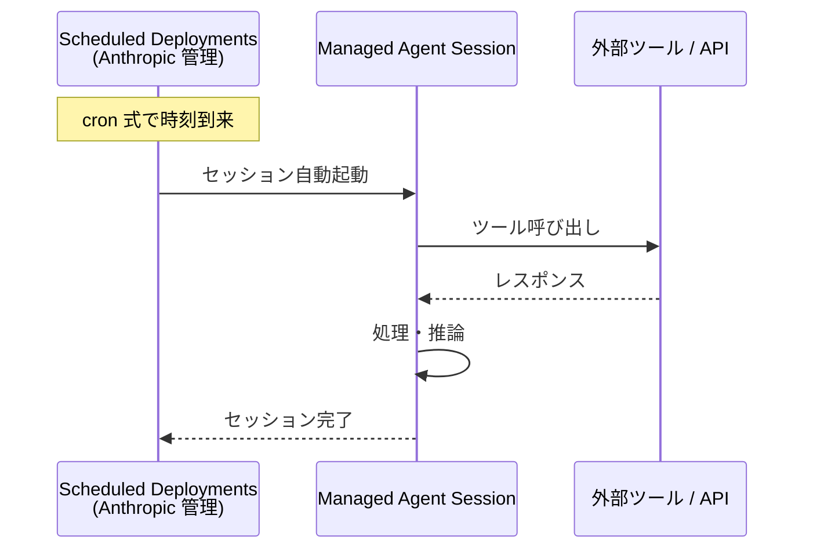
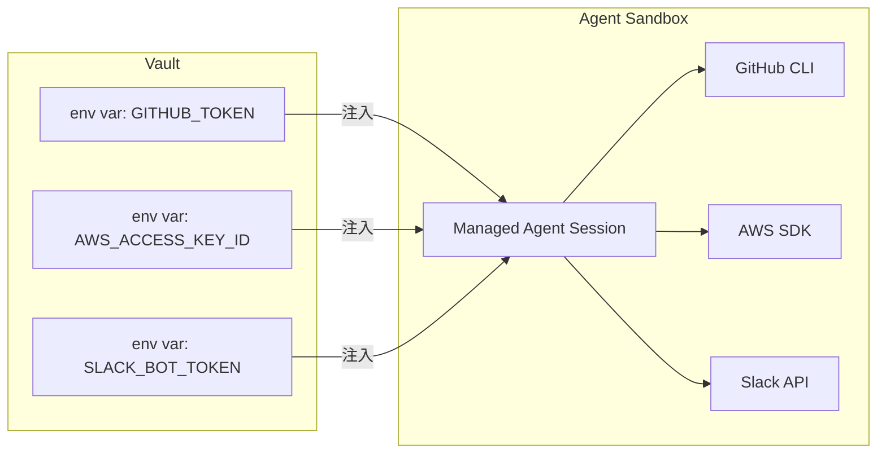
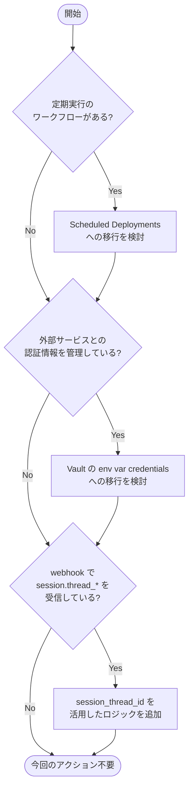

## はじめに

2026年6月9日、Anthropic は Claude Platform のリリースノートを更新し、**Claude Managed Agents** に3つの機能追加を行いました。

中でも注目すべきは次の2点です。

- **Scheduled Deployments（cron スケジュール実行）** のサポート
- **Vault への environment variable credentials 注入** のサポート

これまで「定期的にエージェントを走らせたい」「外部サービスへの認証情報を安全に渡したい」という要件には、自前のスケジューラやシークレット管理基盤が必要でした。今回の更新でその両方が Anthropic 側のインフラに委譲できるようになり、**エージェント開発者が管理すべきインフラの量が大幅に減ります**。

> **📌 影響を受ける人**
> - Claude Managed Agents を本番運用している、または導入を検討している開発者
> - 定期バッチ処理・定期レポート生成などのワークフローを自動化したい人
> - 外部 API や CLI ツールと連携するエージェントを構築している人

---

## 変更の全体像

今回の3つの変更がどのように連携するかを図で整理します。



従来は外部のスケジューラとシークレット管理基盤を別途用意する必要がありましたが、新構成では Managed Agents の機能だけでほぼ完結します。

---

## 変更内容

### 変更一覧

| # | 変更内容 | 種別 | 重要度 | アクション要否 |
|---|---------|------|--------|--------------|
| 1 | Scheduled Deployments（cron 対応） | 新機能 | 🔴 High | 任意（新機能利用時） |
| 2 | Vault の env var credentials 対応 | 新機能 | 🔴 High | 任意（新機能利用時） |
| 3 | `session.thread_*` webhook に `session_thread_id` 追加 | 改善 | 🟡 Medium | 任意（webhook 利用時） |

---

### 1. Scheduled Deployments（cron スケジュール実行）

Managed Agents でセッションを **cron スケジュールに沿って自動起動** できるようになりました。

**ユースケース例:**
- 毎朝 9:00 に最新ニュースを収集・要約してレポートを生成する
- 毎時ログを解析して異常検知を行う
- 週次でデータ集計エージェントを実行する

これまでこういったワークフローには AWS Lambda + EventBridge や Cloud Scheduler など外部のスケジューリング基盤が必要でした。今後は **Managed Agents の設定だけで完結** します。



> **💡 Tips**
> 外部スケジューラを既に運用している場合でも、移行は段階的に行えます。まず新規ワークフローから Scheduled Deployments を使い始め、安定性を確認してから既存ワークフローを移行するアプローチが安全です。

---

### 2. Vault への environment variable credentials 注入

Managed Agents の **Vault** が、環境変数形式のクレデンシャルをサポートするようになりました。

これにより、CLI ツールや SDK が環境変数で認証情報を読み込むパターン（`GITHUB_TOKEN`、`AWS_ACCESS_KEY_ID` 等）に対して、**エージェントのサンドボックスへシークレットを安全に注入** できます。

**ユースケース例:**
- GitHub CLI を使うエージェントに `GITHUB_TOKEN` を渡す
- AWS SDK を呼ぶエージェントに `AWS_ACCESS_KEY_ID` / `AWS_SECRET_ACCESS_KEY` を渡す
- Slack Bot トークンを環境変数で受け取るスクリプトと連携する



> **⚠️ Breaking Change**
> 既存の Vault 設定に変更は不要ですが、新たに env var credentials を使う場合は Vault への登録作業が必要です。シークレットをコードや設定ファイルにハードコードしている場合は、この機会に Vault 管理へ移行することを強く推奨します。

---

### 3. `session.thread_*` webhook への `session_thread_id` 追加

`session.thread_*` webhook イベントに **`session_thread_id`** フィールドが追加されました。

マルチエージェント構成では複数のスレッドが並行して動作します。これまで webhook を受信する側では「どのスレッドから来たイベントか」を識別するのが困難でしたが、`session_thread_id` によって **スレッド単位でのイベント追跡・ルーティング** が可能になります。

**変更前後の webhook ペイロード比較:**

```json
// Before（session_thread_id なし）
{
  "type": "session.thread_started",
  "session_id": "sess_abc123",
  "timestamp": "2026-06-09T10:00:00Z"
}

// After（session_thread_id 追加）
{
  "type": "session.thread_started",
  "session_id": "sess_abc123",
  "session_thread_id": "thread_xyz789",
  "timestamp": "2026-06-09T10:00:00Z"
}
```

---

## 影響と対応

### 開発者が取るべきアクション



### 優先度別アクションリスト

**今すぐ対応（推奨）:**
- 外部スケジューラでエージェントを定期実行している場合 → Scheduled Deployments への移行計画を立てる
- 環境変数でシークレットをエージェントに渡している場合 → Vault の env var credentials への移行を進める

**余裕があれば対応:**
- `session.thread_*` webhook を受信している場合 → `session_thread_id` を使ったログ・モニタリング強化を検討する

---

## コード例

### Before / After: スケジュール実行の設定

**Before: 外部スケジューラ（Lambda + EventBridge の例）**

```python
# AWS Lambda で Managed Agent を定期起動していた例
import boto3
import anthropic

def lambda_handler(event, context):
    client = anthropic.Anthropic()
    # EventBridge で毎朝 9:00 に起動していた
    session = client.beta.managed_sessions.create(
        agent_id="agent_xxx",
        input={"task": "daily_report"}
    )
    return {"session_id": session.id}
```

**After: Scheduled Deployments を使う場合（設定ベース）**

```python
# スケジュール設定を Managed Agents 側に委譲
# Lambda / EventBridge は不要になる

client = anthropic.Anthropic()

# Scheduled Deployment の作成（イメージ）
deployment = client.beta.managed_agents.deployments.create(
    agent_id="agent_xxx",
    schedule={
        "type": "cron",
        "expression": "0 9 * * *",  # 毎朝 9:00
        "timezone": "Asia/Tokyo"
    },
    input={"task": "daily_report"}
)
print(f"Scheduled deployment created: {deployment.id}")
```

---

### Before / After: クレデンシャルの渡し方

**Before: 環境変数を直接セット（セキュリティリスクあり）**

```python
# セッション起動時に環境変数を直接渡す（非推奨）
session = client.beta.managed_sessions.create(
    agent_id="agent_xxx",
    environment={
        "GITHUB_TOKEN": "ghp_実際のトークン文字列",  # ハードコード厳禁
        "AWS_ACCESS_KEY_ID": "AKIA..."
    }
)
```

**After: Vault に登録してから参照**

```python
# Step 1: Vault にクレデンシャルを登録（一度だけ）
vault_secret = client.beta.managed_agents.vaults.secrets.create(
    vault_id="vault_xxx",
    name="github_token",
    type="env_var",
    key="GITHUB_TOKEN",
    value="ghp_実際のトークン文字列"
)

# Step 2: セッション起動時は Vault を参照するだけ
session = client.beta.managed_sessions.create(
    agent_id="agent_xxx",
    vault_id="vault_xxx"
    # クレデンシャルはサンドボックスに自動注入される
)
```

> **💡 Tips**
> Vault に登録したシークレットはローテーションも Vault 側で管理できます。コードを変更せずにシークレットを更新できるため、定期的なトークンローテーションのオペレーションコストも下がります。

---

## まとめ

今回の Claude Managed Agents アップデートのポイントを整理します。

| 機能 | 解決する課題 | 主な恩恵 |
|------|------------|---------|
| **Scheduled Deployments** | 外部スケジューラの管理コスト | インフラ削減・運用シンプル化 |
| **Vault env var credentials** | シークレット管理の複雑さ | セキュリティ向上・ローテーション容易化 |
| **`session_thread_id` in webhook** | マルチエージェントのスレッド識別困難 | 監視・デバッグの精度向上 |

Managed Agents が「エージェントのロジックを書く」以外の **運用インフラまで包括的にカバー** する方向に進化しています。定期実行ワークフローや外部サービス連携を持つプロジェクトでは、自前管理のコンポーネントを順次 Managed Agents に委譲することで、開発・運用コストを大きく削減できるでしょう。
