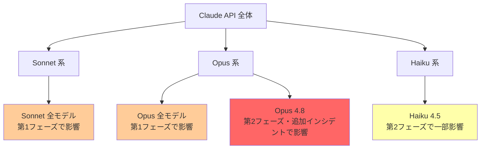
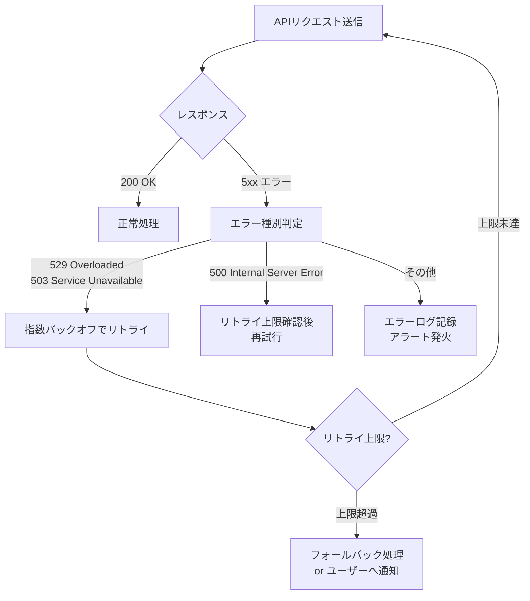

## はじめに

2026年6月16日、Anthropic の Claude API において複数モデルを同時に巻き込む大規模インシデントが発生しました。Sonnet・Opus 系の全モデルで最大約10%のエラー率上昇が確認され、断続的な二段階のフェーズを経て同日中に解決されました。

**現時点では両インシデントとも解決済みであり、コード変更等の恒久的な対応は不要です。** ただし、Claude API を本番運用している開発者にとって「障害時にどう動くか」を再確認する良い機会です。インシデントの詳細タイムラインと、今後に備えた設計上の考慮点を整理します。

> **📌 影響を受けた人**
> - Claude API（Anthropic 直接 API）を利用しているサービス・アプリケーション開発者
> - Sonnet 系・Opus 系モデルを本番環境で使用しているエンジニア
> - Claude API の SLA・信頼性を評価中の意思決定者

---

## 変更の全体像

2026年6月16日に発生した2件のインシデントは時系列的に連続しており、後半のインシデント（第2フェーズ）は前半の収束過程と重なっています。

```mermaid
timeline
    title 2026年6月16日 Claudeインシデント タイムライン (UTC)
    section 第1フェーズ (複数モデル)
        UTC 17:23 : インシデント開始
                  : Sonnet全モデル・Opus全モデル影響
                  : エラー率 最大約10%
        UTC 18:00 : 第1フェーズ収束
                  : Opus 4.8 に影響が継続
    section 第2フェーズ (Opus 4.8 / Haiku 4.5)
        UTC 18:00 : 第2フェーズ開始
                  : Opus 4.8 平均10%エラー率
                  : Haiku 4.5 でもエラー確認
        UTC 19:22 : 修正実装・監視開始
        UTC 19:32 : Resolved（解決済み）
    section 追加インシデント (Opus 4.8)
        UTC 19:59 : 再監視状態へ移行
        UTC 20:07 : Opus 4.8 エラー率上昇（約12分間）
        UTC 20:16 : Resolved（解決済み）
```

---

## 変更内容

### インシデント一覧

| # | 対象モデル | 発生時刻 (UTC) | 解決時刻 (UTC) | 継続時間 | 最大エラー率 |
|---|-----------|--------------|--------------|---------|------------|
| 1（第1フェーズ） | Sonnet 全系・Opus 全系 | 17:23 | 18:00 | 約37分 | 最大10% |
| 1（第2フェーズ） | Opus 4.8・Haiku 4.5 | 18:00 | 19:32 | 約92分 | 平均10% |
| 2 | Opus 4.8 | 19:59 | 20:16 | 約17分 | 不明（一時的上昇） |

### 影響モデルの範囲



> **⚠️ Breaking Change**
> 今回のインシデントは API の仕様変更ではありません。しかし、**エラー率が10%に達した時間帯**では、リトライなしの実装では1リクエストあたり10件に1件が失敗していた計算になります。本番稼働中のサービスは実際のエラーログを確認することを推奨します。

---

## 影響と対応

### 現時点での必要な対応

**コード変更は不要です。** 両インシデントとも同日中に解決済みです。ただし、以下の確認を推奨します。

1. **エラーログの確認**: 2026年6月16日 PT 10:23〜PT 12:53（UTC 17:23〜20:16）の間にエラーが記録されていないか確認
2. **ユーザーへの影響把握**: 該当時間帯にエンドユーザーが操作していた場合、体験を損なっていた可能性あり
3. **リトライ処理の有無確認**: エラー発生時にリトライ実装があったかを確認し、今後の設計に反映

### 今後に備えた設計上の考慮点

今回のような一時的なエラー率上昇に対して、APIクライアント側でできる対策を整理します。



---

## コード例

### Before: リトライなしの実装（障害時に脆弱）

```python
import anthropic

client = anthropic.Anthropic()

# リトライなし: インシデント中は約10%の確率で失敗
response = client.messages.create(
    model="claude-opus-4-8",
    max_tokens=1024,
    messages=[{"role": "user", "content": "Hello"}]
)
```

### After: 指数バックオフ付きリトライ実装

```python
import anthropic
import time
import random

client = anthropic.Anthropic()

def call_with_retry(model: str, messages: list, max_retries: int = 3) -> anthropic.types.Message:
    """指数バックオフでリトライするAPIコール"""
    for attempt in range(max_retries + 1):
        try:
            return client.messages.create(
                model=model,
                max_tokens=1024,
                messages=messages
            )
        except anthropic.APIStatusError as e:
            # 5xx系エラーのみリトライ対象
            if e.status_code >= 500 and attempt < max_retries:
                wait = (2 ** attempt) + random.uniform(0, 1)  # 指数バックオフ + ジッター
                print(f"Attempt {attempt + 1} failed ({e.status_code}), retrying in {wait:.1f}s...")
                time.sleep(wait)
            else:
                raise  # リトライ上限超過 or 4xx系はそのまま例外を上げる

# 使用例
try:
    response = call_with_retry(
        model="claude-opus-4-8",
        messages=[{"role": "user", "content": "Hello"}]
    )
    print(response.content[0].text)
except anthropic.APIStatusError as e:
    print(f"All retries failed: {e.status_code}")
    # フォールバック処理をここに実装
```

> **💡 Tips**
> Anthropic の公式 Python SDK（`anthropic` パッケージ v0.18.0 以降）は `max_retries` パラメータをデフォルトでサポートしています。`anthropic.Anthropic(max_retries=3)` と設定するだけで、SDK レベルのリトライが自動的に有効になります。本番運用ではまずこちらを活用しましょう。

```python
# SDK組み込みのリトライ機能を活用するシンプルな方法
client = anthropic.Anthropic(max_retries=3)  # デフォルトは2
```

---

## まとめ

| 項目 | 内容 |
|------|------|
| 発生日 | 2026年6月16日 |
| 影響モデル | Sonnet 全系、Opus 全系（特に Opus 4.8）、Haiku 4.5 |
| 最大影響 | エラー率 最大約10%、最長継続約92分 |
| 現状 | **解決済み・コード対応不要** |
| 推奨アクション | エラーログ確認・リトライ実装の見直し |

今回のインシデントは、**Claude API が本番サービスに組み込まれている場合、障害時のリカバリ設計が重要であること**を再認識させるものでした。Anthropic はステータスページ（status.claude.com）でリアルタイムに状況を公開しており、重要なサービスを構築する場合はステータスページの監視や RSS/Webhook 通知の設定も検討に値します。

日常的な API 利用においては SDK のデフォルトリトライ機能を有効化し、それ以上の信頼性が必要な場合はカスタムのバックオフ・フォールバック戦略を組み合わせることで、今回のような一時的な障害の影響を最小化できます。
