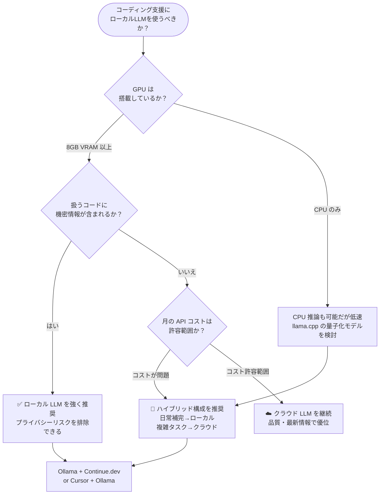

## はじめに

「Claude や GPT-4 をローカル LLM に完全移行して毎日のコーディングをこなせるか?」——この問いが Hacker News に投稿されたところ、1,200 件超のいいねを集め大きな議論になりました (2026-06-16)。

コスト・プライバシー・オフライン利用といった現実的な動機から、多くの開発者がローカル LLM への移行を検討しています。本記事では **ローカル LLM と商用 LLM API の実力差と使い分け** を整理し、あなたのワークフローに合った選択肢を見つける手助けをします。

> **📌 影響を受ける人**
> - Claude / ChatGPT API のコストが月数万円規模になってきた開発者
> - コードや社内ドキュメントをクラウドに送りたくない企業の開発チーム
> - オフライン環境や air-gapped 環境で作業する必要がある人

---

## 変更の全体像


ローカル LLM の選択肢は 2025〜2026 年にかけて急速に充実し、**コーディング特化モデル** では商用 LLM に近い品質を出せるケースも増えています。

---

## 変更内容：ローカル LLM の現状と実力

### コーディングタスク別の適合性

| タスク | ローカル LLM | クラウド LLM | 判定 |
|--------|-------------|--------------|------|
| 単一ファイルの補完・修正 | ✅ 十分実用的 | ✅ 高精度 | ローカルで代替可 |
| テスト生成・デバッグ支援 | ✅ 概ね対応可 | ✅ 高精度 | ローカルで代替可 |
| 複数ファイルにまたがるリファクタリング | ⚠️ コンテキスト制限 | ✅ 長いコンテキスト | クラウド推奨 |
| アーキテクチャ設計・複雑な推論 | ❌ 品質差が顕著 | ✅ 高精度 | クラウド必須 |
| ドキュメント生成・コメント追加 | ✅ 十分実用的 | ✅ 高精度 | ローカルで代替可 |
| SQL・シェルスクリプト生成 | ✅ 十分実用的 | ✅ 高精度 | ローカルで代替可 |
| 未知ライブラリの使い方調査 | ⚠️ 知識カットオフに依存 | ✅ 最新情報あり | クラウド推奨 |

### 代表的なローカルコーディングモデル (2026年6月時点)

| モデル | パラメータ数 | 推奨 VRAM | 特徴 |
|--------|------------|----------|------|
| DeepSeek-Coder-V3 | 7B / 33B | 8GB / 20GB | コーディングベンチマーク最高水準 |
| Qwen2.5-Coder | 7B / 14B / 32B | 8GB〜24GB | 多言語対応・コンテキスト長 |
| CodeLlama | 7B / 13B / 34B | 6GB〜24GB | Meta 製・安定した品質 |
| Mistral 7B / Mixtral | 7B / 47B(MoE) | 6GB / 32GB | 汎用だがコーディングも堅実 |

---

## 影響と対応

### ローカル LLM を導入すべきかの判断フロー



### 具体的な移行アクション

**Step 1: まず Ollama で試す（所要時間: 15分）**

```bash
# Ollama のインストール
curl -fsSL https://ollama.com/install.sh | sh

# コーディング特化モデルを取得
ollama pull deepseek-coder-v3:7b

# 動作確認
ollama run deepseek-coder-v3:7b "Pythonでfibonacci数列を返す関数を書いて"
```

**Step 2: エディタと統合する**

```bash
# VS Code 拡張 Continue.dev を使う場合
# ~/.continue/config.json に追記
```

```json
{
  "models": [
    {
      "title": "DeepSeek Coder (Local)",
      "provider": "ollama",
      "model": "deepseek-coder-v3:7b",
      "apiBase": "http://localhost:11434"
    }
  ]
}
```

---

## コード例：Before / After

### Before: クラウド API に全依存

```python
import anthropic

client = anthropic.Anthropic(api_key="sk-ant-...")

def ask_claude(prompt: str) -> str:
    message = client.messages.create(
        model="claude-sonnet-4-6",
        max_tokens=1024,
        messages=[{"role": "user", "content": prompt}]
    )
    return message.content[0].text

# 1回の呼び出しごとに課金が発生
result = ask_claude("このコードをリファクタリングして: ...")
```

### After: ローカル LLM をデフォルト・クラウドをフォールバックに

```python
import httpx
import anthropic

OLLAMA_BASE = "http://localhost:11434/api"

def ask_local(prompt: str, model: str = "deepseek-coder-v3:7b") -> str | None:
    try:
        response = httpx.post(
            f"{OLLAMA_BASE}/generate",
            json={"model": model, "prompt": prompt, "stream": False},
            timeout=60,
        )
        return response.json()["response"]
    except Exception:
        return None

def ask_cloud(prompt: str) -> str:
    client = anthropic.Anthropic()
    message = client.messages.create(
        model="claude-sonnet-4-6",
        max_tokens=1024,
        messages=[{"role": "user", "content": prompt}],
    )
    return message.content[0].text

def ask(prompt: str, prefer_local: bool = True) -> str:
    if prefer_local:
        result = ask_local(prompt)
        if result:
            return result
    # ローカルが失敗した場合のみクラウドへフォールバック
    return ask_cloud(prompt)
```

> **💡 Tips**
> `prefer_local=True` をデフォルトにしておくだけで、日常的な補完・リファクタリングのコストをほぼゼロにできます。複雑な推論が必要な場面だけ `prefer_local=False` に切り替えましょう。

---

## ローカル LLM の限界：正直に見る

> **⚠️ Breaking Change**
> ローカル LLM への**完全移行は現時点では難しい**ケースが存在します。以下の状況ではクラウド LLM が引き続き優位です。

- **大規模コンテキスト**: 数万トークン規模のコードベース全体を参照するタスク
- **最新知識**: 2024年以降にリリースされたライブラリや API の使い方
- **複雑な推論**: アーキテクチャ設計、バグの根本原因分析、セキュリティレビュー
- **マルチモーダル**: スクリーンショットや図からのコード生成

HN のディスカッションでも「**80% はローカルで賄えるが、難しい 20% にはまだクラウドが必要**」という意見が多数派を占めていました。

---

## まとめ

| 観点 | ローカル LLM | クラウド LLM |
|------|-------------|--------------|
| コスト | ほぼ無料 (電気代のみ) | 従量課金・月数千〜数万円 |
| プライバシー | コードが外部送信されない | クラウドにデータが渡る |
| レイテンシ | ローカル GPU なら低遅延 | ネットワーク遅延あり |
| 精度 | 日常タスクは実用的 | 複雑タスクで優位 |
| 最新知識 | カットオフに依存 | 継続的に更新される |
| セットアップ | 初期設定が必要 | API キーのみ |

**推奨戦略は「ハイブリッド」** です。Ollama + Continue.dev などでローカル LLM を日常的な補完・修正に使い、アーキテクチャ設計や難解なバグには Claude / GPT-4 を使い分けることで、コストとプライバシーを両立しながら生産性を維持できます。

1,200 件超のいいねが示すように、この移行トレンドは今後も加速すると予想されます。まず 15 分で Ollama を試してみることをおすすめします。
