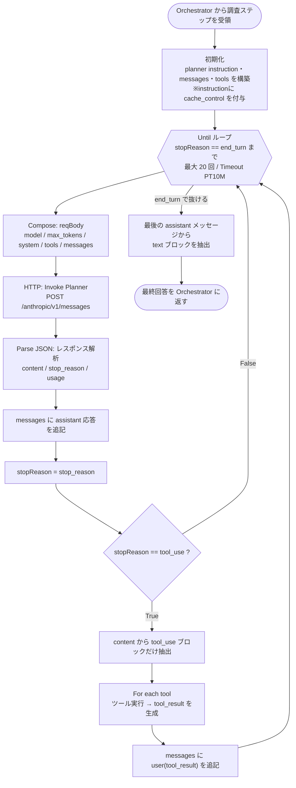

## はじめに

[前回の記事](https://qiita.com/wfan/items/56a56df162bde0127a8d) では、Microsoft Foundry (以下Foundryという) の **Workflow エージェント** で SOC アラートの自動調査オーケストレーターを構築した話を書きました。今回はその後日談として、KQL を生成している **Planner** の呼び出し方を見直した経緯をまとめます。

最初に、これまでの構成変更の流れを整理します。

1. **Workflow エージェントでオーケストレーション**していた当初の構成
2. トークン消費を抑えるため、オーケストレーションを **Logic Apps に移し、公開した Planner エージェントの Responses エンドポイントを呼び出す**構成へ変更
3. それでも入力トークンが請求の大半を占めていたため、入力トークンをさらに削減する目的で **Claude Messages API の prompt caching**に着目

本記事は、3 の段階で実装した「**Claude Messages API を直接呼び出し、ツール往復ループを Logic Apps で自作し、prompt caching を効かせる**」構成のメモです。

Claude Opus 4.7 が生成する KQL の品質には満足していたのですが、2 の構成（Logic Apps から Responses エンドポイントを呼び出す形）で運用していくと、1つ大きな課題が見えてきました。

> **Planner 単体でも、継続運用では見過ごせないトークンコストになっていた。**

原因は明確でした。Planner の Instructions（システムプロンプト）は KQL 生成ルール・テーブル知識・調査観点などで **1万トークン近く**あり、調査ループのたびにこれを **毎ターン全量**送っていたためです。

入力トークンをさらに削減する手段として有効なのが、Claude の **prompt caching**です。ただし、**検証時点では**、公開したエージェントの Responses エンドポイント経由では Claude ネイティブのキャッシュ機能をリクエストに指定できませんでした（今後のアップデートで対応される可能性はあります）。そこで、

- Foundry が公開している **Claude Messages API（`/anthropic/v1/messages`）** を Logic Apps から直接呼び出す
- エージェントのツール往復ループを **Logic Apps 側で自作する**
- system プロンプトに **cache breakpoint (`cache_control`)** を置く

という構成に作り替えました。

:::note info
 **想定読者**
 - Foundry 上で Claude を使っていて、入力トークンのコストに悩んでいる方
 - Foundry の公開されたエージェント経由ではなく、Claude 本来の Messages API 形式で直接呼び出して制御したい方
:::

---

## なぜ「Claude Messages API の直接呼び出し」なのか

Foundry 上の Claude には、大きく2つの呼び出し経路があります。**どちらも Foundry 上のエンドポイント**であり、違いは「エージェント（Application）というラッパー層を経由するかしないか」です。

| | 公開されたエージェント（Agent Application） | Claude Messages API |
|---|---|---|
| 呼び出し先 | Responses エンドポイント（`/openai/responses`） | Claude Messages API エンドポイント（`/anthropic/v1/messages`） |
| 性質 | モデルをエージェント層でラップしたエンドポイント | Claude 本来の Messages API 形式のエンドポイント |
| Instructions / ツール | エージェント側に設定 | リクエストの `system` / `tools` に毎回乗せる |
| ループ制御 | サービス側で制御される | **自分で組む** |
| prompt caching | リクエストに `cache_control` を付けられない | **`cache_control` で明示的に制御できる** |
| extended thinking など | ネイティブ機能は利用できない | ネイティブ機能を利用できる |

:::note info
**「直接呼び出し」の意味について**

 本記事でいう「直接」は、Anthropic の `api.anthropic.com` を呼び出すという意味ではありません。呼び出し先はあくまで **Foundry がホストするエンドポイント**（`https://<リソース名>.services.ai.azure.com/anthropic/v1/messages`）です。Foundry 上の Claude デプロイが公開している **Claude 本来の Messages API 形式のエンドポイント**を、**エージェント（Application）/ Responses というラッパー層を介さずに呼ぶ**、という意味での「直接」です。prompt caching などの Claude ネイティブ機能は、このラッパーを介さない経路でしか利用できないため、ラッパーを外す必要がありました。
:::

Claude のネイティブ機能（prompt caching・extended thinking など）を利用したい場合は、`/anthropic/v1/messages` の Claude Messages API を使う必要があります。

つまり、**キャッシュを効かせたい時点で、Claude Messages API を直接呼び出す構成はほぼ必須**でした。そして Claude Messages API を直接使うということは、「モデルがツールを呼ぶ → 結果を返す → 続行する」というエージェントのループも自分で実装することになります。一見手間が増えますが、

- `cache_control` をどのブロックに置くか
- `messages` 配列をどう積むか（assistant 応答・tool_result の順序）
- 何ターンで打ち切るか

を**完全に自分で制御できる**ので、コストと挙動の両面で管理しやすくなりました。

---

## 全体像（業務フロー図）

自作したエージェントループの全体像です。簡略化していますが、これ1枚で流れが追えます。



ポイントは2つです。

1. **Until ループ**が「ツールを使い切って `end_turn` になるまで」モデルとの往復を続ける。
2. 1往復ごとに `messages` 配列へ **assistant 応答**と（必要なら）**tool_result** を積み上げ、文脈を維持する。

この `messages` の積み方が、キャッシュの基盤になります。先頭が変わらない限り、何往復してもキャッシュが効き続けます。

---

## Logic Apps 実装

ここから各アクションを順に見ていきます。

### 1. 初期化 ― instruction・messages・tools を組み立てる

ループに入る前に、3つの素材を作っておきます。

- **planner instruction**: システムプロンプト本文（Compose で組み立て。中身は非公開）
- **messages**: 最初の user メッセージ
- **tools**: ツール定義の配列

最初の user メッセージは、`content` を **テキストブロックの配列**にして、末尾に `cache_control` を付けます。


```json
[
  {
    "role": "user",
    "content": [
      {
        "type": "text",
        "text": "@{outputs('Compose_-_msgPlanner')}",
        "cache_control": { "type": "ephemeral" }
      }
    ]
  }
]
```

`cache_control` は **`type` を持つ content ブロックに付けるフィールド**です。`content` を単なる文字列にすると付ける対象がないため、ブロック形式（`type: text` のオブジェクト）にする必要があり、結果として `content` は配列になります。

ここはアラートごとに内容が変わるなら、無理にキャッシュ対象にする必要はありません。コスト削減として最も効果が大きいのは、次に説明する `system` のキャッシュです。

### 2. リクエストボディ ― system にcache breakpointを置く

毎ターンのリクエストボディを Compose で組み立てます。**ここがキャッシュ設定の最も重要な部分**です。


```json
{
  "model": "claude-opus-4-7",
  "max_tokens": 8000,
  "system": [
    {
      "type": "text",
      "text": "@{outputs('Compose_-_planner_instruction')}",
      "cache_control": { "type": "ephemeral" }
    }
  ],
  "tools": @{variables('tools')},
  "messages": @{variables('messages')}
}
```

`system` を**配列**にして、巨大な instruction のブロックに `cache_control: { "type": "ephemeral" }` を置いています。これが「ここまでを固定の先頭（プレフィックス）として扱い、使い回してよい」という宣言です。

### 3. HTTP で Claude Messages API を呼び出す

組み立てた `reqBody` を、Foundry の Claude Messages API エンドポイントに POST します。


| 項目 | 値 |
|---|---|
| URI | `https://<リソース名>.services.ai.azure.com/anthropic/v1/messages` |
| Method | `POST` |
| Header | `Content-Type: application/json` |
| Header | `anthropic-version: 2023-06-01` |
| Body | `@{outputs('Compose_-_reqBody')}` |

エンドポイントは **`/anthropic/v1/messages`** で、`anthropic-version`を指定する必要があります。

認証は **Microsoft Entra ID（Managed Identity でキーレス）** か、デプロイの **API キー** のどちらかです。Logic Apps なら Managed Identity を有効化し、Foundry リソースに `Cognitive Services User` ロールを付与しておくとキー管理が不要になります。

### 4. レスポンスをパースして履歴に積む

返ってきた JSON をパースします。Claude Messages API のレスポンスは `id` / `type` / `role` / `model` / `content`（ブロック配列）/ `stop_reason` / `usage` などを持ちます。


スキーマには **`stop_reason` と `usage` を必ず含めて**おきます。`stop_reason` はループの分岐に、`usage`（`cache_read_input_tokens` など）はキャッシュが効いているかの確認に使います（後述）。

次に、assistant の応答を**そのまま** `messages` に追記します。文脈を保つための一番大事なステップです。


```json
{
  "role": "assistant",
  "content": @{body('Parse_JSON_-_Planner_response')?['content']}
}
```

そして `stop_reason` を変数に取り出します。


```
stopReason = @{body('Parse_JSON_-_Planner_response')?['stop_reason']}
```

### 5. tool_use なら ― ツールを実行して結果を返す

`stopReason` が `tool_use` なら、モデルがツール呼び出しを要求しています。


True 側で、まず content から **tool_use ブロックだけ**を抽出します。content には text ブロックも混ざっているためです。


```
From:         body('Parse_JSON_-_Planner_response')?['content']
Filter Query: item()?['type'] が tool_use と等しい
```

抽出した tool_use を **For each** で回し、それぞれツール（ここではスキーマ取得用の HTTP アクション）を実行して、結果を `tool_result` ブロックに格納します。


```json
{
  "type": "tool_result",
  "tool_use_id": "@{item()?['id']}",
  "content": "@{body('HTTP_-_Call_AIAgent_SOC_Schema_Fetch')}"
}
```

`tool_use_id` には、対応する **tool_use ブロックの `id`** を必ず入れます。

For each を抜けたら、集めた `tool_result` を **1つの user メッセージ**として `messages` に追記します。


```json
{
  "role": "user",
  "content": @{variables('toolResults')}
}
```

これで `messages` は `[user(initial_message) , assistant(tool_use), user(tool_result)]` という形になり、次のターンでモデルが結果を読んで続きを考えられます。

`stopReason` が `tool_use` 以外（False 側）の場合は何もしません。Until の条件で自然に抜けます。

### 6. Until ループで end_turn まで回す

ここまでの一連の処理を **Until ループ**でまとめます。


| 項目 | 値 | 意味 |
|---|---|---|
| Loop until | `stopReason` == `end_turn` | モデルがツールを使い切って答え切ったら終了 |
| Count | `20` | 無限ループ防止の上限 |
| Timeout | `PT10M` | 最長10分で打ち切り |

`Count` と `Timeout` は安全弁です。モデルが延々とツールを呼び続けるケースに備えて、必ず入れておくことをおすすめします。

### 7. 最終テキストを取り出す

ループを抜けたら、最後の assistant メッセージから **text ブロックだけ**を取り出して、最終回答にします。


```
From:         last(variables('messages'))?['content']
Filter Query: item()?['type'] が text と等しい
```

これを Orchestrator に返せば、Planner の1サイクルは完了です。

---

## prompt caching を効かせる

実装の本題、コスト削減の部分です。

### cache breakpointはどこに置くか

Claude の prompt caching は **プレフィックスキャッシュ**です。リクエストは内部的に **`tools` → `system` → `messages`** の順で並べられ、`cache_control` を付けたブロックの**手前までの全バイト**がキャッシュのキーになります。

つまり `cache_control` は「指示文に書く呪文」ではなく、**リクエストの構造に置く目印**です。「ここまでを固定の先頭として扱ってよい」というcache breakpointを引くものだと考えると分かりやすいです。

今回は、いちばん大きくて毎回変わらない **`system`（instruction 約1万トークン）** にcache breakpointを置きました。これが最も効果の大きい設定です。tools も毎回同じなので、自動的に system の手前として一緒にキャッシュされます。

### explicit と automatic ― キャッシュの2つの指定方式

prompt caching の指定方式には2つあります。

- **explicit（明示的なcache breakpoint）**: 個々の content ブロックに `cache_control` を置き、どこをキャッシュするかを自分で細かく制御する方式。今回採用したのはこちらで、`system` ブロックにcache breakpointを置いています。
- **automatic（自動cache）**: リクエストの**最上位に `cache_control` を1つ**置くだけの方式。システムが「最後のキャッシュ可能ブロック」に境界を自動で適用し、会話（`messages`）が伸びるにつれて境界を前へ進めてくれます。増えていく履歴をそのままキャッシュしたいマルチターン会話に向いています。

今回はキャッシュしたい対象が「巨大で不変な `system`」とはっきりしていたため、explicit を選びました。messages の履歴も含めて自動でキャッシュを伸ばしたい場合は automatic が手軽で、両者を併用することもできます。

:::note warn
**対応プラットフォームに注意**
 automatic caching が使えるのは Claude API・Claude Platform on AWS・Microsoft Foundry（beta）です。Amazon Bedrock と Vertex AI は automatic に未対応で、explicit のみとなります。今回の Foundry 構成では automatic も選べますが、対象が明確なので explicit にしています。
 なお、これは検証時点の対応状況です。アップデートにより対応する可能性があるため、最新状況は公式ドキュメントを必ず参照してください。
:::


### 料金の考え方

キャッシュには固有の料金体系があります。

| 区分 | 標準入力に対する倍率 | 意味 |
|---|---|---|
| キャッシュ読み取り（ヒット） | **約 0.1倍** | 2回目以降。約90%オフ |
| 5分キャッシュの書き込み | 約 1.25倍 | 初回だけ少し割高 |
| 1時間キャッシュの書き込み | 約 2.0倍 | TTL を延ばす場合 |

整理すると、**初回だけ満額＋少しの書き込み料、2回目以降は約1割**になります。Planner のように「同じ巨大プロンプトで何往復もする」ワークロードでは、この差が大きく影響します。instruction を1万トークン抱えていても、ループ2回目以降はその部分がほぼ無料に近づきます。

:::note info
上記の倍率は検証時点のものです。価格・倍率は変更される可能性があるため、最新の値は[公式ドキュメント](https://platform.claude.com/docs/en/build-with-claude/prompt-caching)を必ず参照してください。
:::

### キャッシュを安定してヒットさせる構造にする

注意点は **完全一致が必要**ということです。プレフィックスが1トークンでも違うとキャッシュミスになり、満額に戻ります。

なので、**顧客ごと・アラートごとに変わる値**（テナントID、アラート情報、タイムスタンプなど）を、キャッシュ対象の静的な先頭に**混ぜない**でください。

```
[ 静的な instruction（= キャッシュ対象。cache_control はここ） ]
[ その後ろに、可変の値（messages の中身など） ]
```

の順で構造化するのが基本です。今回の構成では、可変なのは `messages`（ツール結果や調査の進行）だけで、`system` は常に同じなので、自然とこの形になっています。

TTL はデフォルト **5分**で、**ヒットのたびにリセット**されます。会話が続いている限りキャッシュは有効なままなので、ループ内の往復ではまず問題になりません。長い待ち時間が挟まる場合は **1時間 TTL** も選べます（書き込みが約2倍になる代わりに長く保持されます）。

### 効いているか確認する

「効いているつもり」が最も避けたい状況なので、必ず実測します。Parse JSON のスキーマに `usage` を含めておくと、各ターンのレスポンスでキャッシュの挙動が確認できます。

| フィールド | 意味 |
|---|---|
| `input_tokens` | キャッシュ対象外として、満額で課金された入力トークン数 |
| `cache_creation_input_tokens` | キャッシュに書き込んだトークン数（初回） |
| `cache_read_input_tokens` | キャッシュから読んだトークン数（ヒット） |
| `cache_creation.ephemeral_5m_input_tokens` | 5分 TTL で書き込んだトークン数 |
| `cache_creation.ephemeral_1h_input_tokens` | 1時間 TTL で書き込んだトークン数 |

実際に初回ターンのレスポンスを見てみます。


```json
"usage": {
  "input_tokens": 6,
  "cache_creation_input_tokens": 13999,
  "cache_read_input_tokens": 0,
  "cache_creation": {
    "ephemeral_5m_input_tokens": 13999,
    "ephemeral_1h_input_tokens": 0
  },
  "output_tokens": 226
}
```

このターンでは、

- `cache_creation_input_tokens` が **13999** ＝ 約14k トークンのシステムプロンプトがまるごとキャッシュに**書き込まれた**
- `cache_read_input_tokens` が **0** ＝ 初回なのでまだヒットしていない
- `input_tokens` が **6** ＝ 満額で課金された入力はわずか6トークン
- `ephemeral_5m_input_tokens` が 13999 ＝ **5分 TTL** のキャッシュに入っている

ことが読み取れます。つまり、cache breakpointが正しく設定され、システムプロンプトが書き込みフェーズに入っていることが確認できます。この**次のターン以降**で `cache_read_input_tokens` に同じ規模（約14k）の値が乗り、`cache_creation_input_tokens` が 0 になれば、キャッシュヒットの成立です。読み取り分は標準入力の約1割で課金されます。

:::note warn
キャッシュ対象が**短すぎる**と、エラーにならず**気付かないうちに無効化**されることがあります（`usage` のキャッシュ系がすべてゼロ）。その場合はcache breakpointの手前のトークン量が最小要件に届いているか確認してください。
:::

---

## まとめ

Foundry の公開されたエージェントの Responses エンドポイント経由から、Claude Messages API の直接呼び出し＋自作ループに切り替えたことで、構成は次のように変わりました。

| 観点 | Before（Responses エンドポイント経由） | After（Claude Messages API 直接呼び出し＋自作ループ） |
|---|---|---|
| 呼び出し先 | Responses エンドポイント（`/openai/responses`） | Claude Messages API エンドポイント（`/anthropic/v1/messages`） |
| prompt caching | 利用できない | `cache_control` で明示的に制御 |
| 入力コスト | 巨大 instruction を毎ターン全量送信 | 2往復目以降は約1割 |
| ループ制御 | サービス任せ | Until で完全に制御（上限・タイムアウト付き） |
| ツール往復 | 内部処理が見えない | tool_use / tool_result を自分で組み立て |

手間は増えますが、**「何を・どの順で・どこまでキャッシュして送るか」を完全に制御できる**のが自作ループの利点です。巨大なシステムプロンプトを抱えるエージェントほど、prompt caching の恩恵は大きくなります。同じように Foundry 上で Claude のコストに悩んでいる方の参考になれば幸いです。

---

## 参考リンク

- [Deploy and use Claude models in Microsoft Foundry - Microsoft Learn](https://learn.microsoft.com/en-us/azure/foundry/foundry-models/how-to/use-foundry-models-claude)
- [Prompt caching - Claude API Docs](https://platform.claude.com/docs/en/build-with-claude/prompt-caching)
- [Claude Messages API](https://docs.claude.com/en/api/messages)
