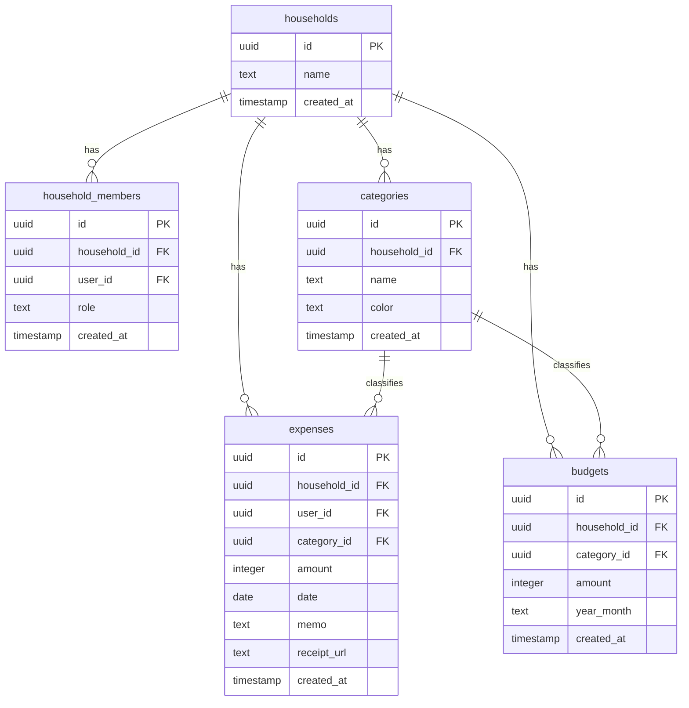

# 初めに
久々に個人開発をしようかと思います。
メモ書き程度なのであしからず。
今回は「家計簿アプリ」を作成。
https://github.com/kamaboko6214/kakeibo-app

# 背景
そろそろ無法地帯だった家庭内の収支を正しく把握するためです。
妻に使用感なども聞いて、どんどんカスタマイズしていければと思います。

# サービス内容
自分自身家計簿アプリは使用したことないのですが、一般的な家計簿サービスとほとんど
同じような機能です。
* 支出記録
* 予算登録
* 月ごとのサマリ

ただ、今回は夫婦（もしくはカップル）で、お互いがどれくらい使ったか把握できるように
２人で使用することを前提に作成しています。

# 使用技術
* **バックエンド**：supabase (触ってみたかった)
* **フロントエンド** : Next.js
* **データベース** : PostgreSQL(supabase)

# DB設計

# 進め方
基本AIに頼らず自力で進めようと思ってます！
が、気がつくとAIに質問しています。恐ろしい。
claudeと共同で作成していこうと思います。また何か進捗等あれば残そうと思います。
