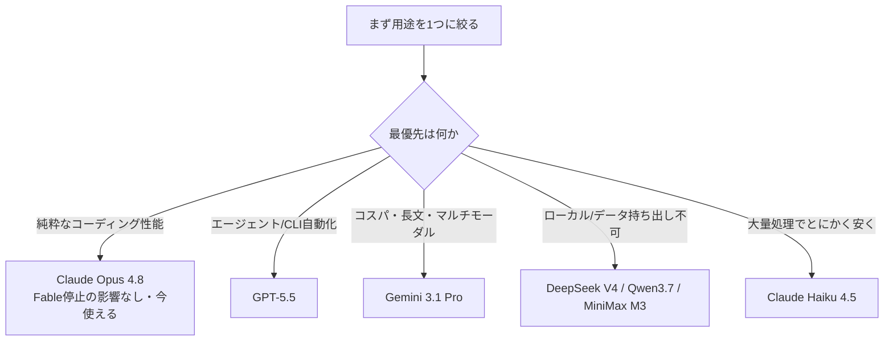
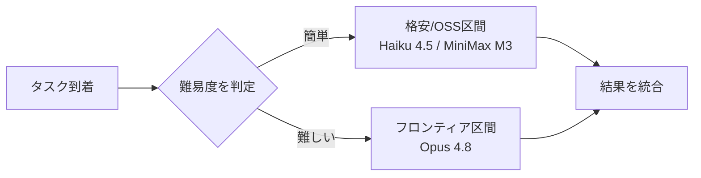
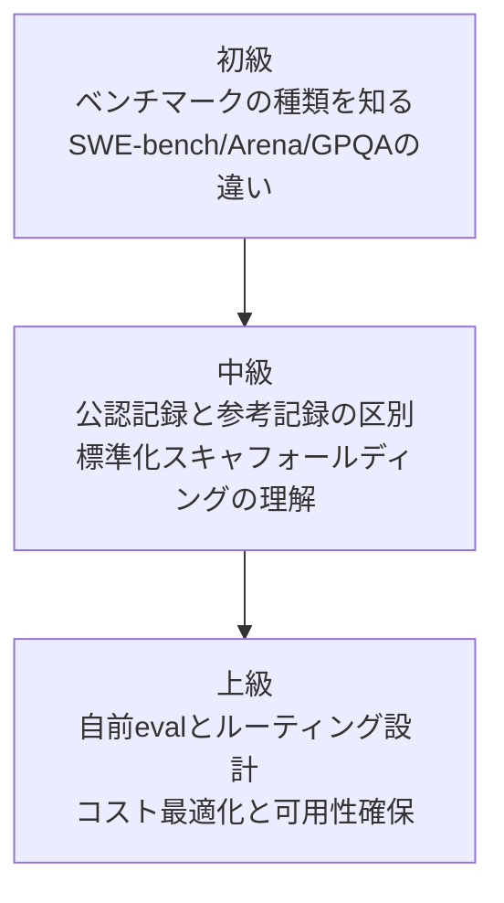

<font color="#0383ED">この記事の対象読者</font>

- 業務でLLMを使っていて、Fable 5の提供停止で代替を探しているエンジニア
- 「結局いま一番強いモデルはどれ？」を数字とソース付きで知りたい人
- ベンチマークの数字に何度も振り回されてきた人（私です）orz

## この記事で得られること

- 2026年6月時点の主要LLMの実力を、一次情報に紐づいた数字で把握できる
- 「SWE-bench Verified 95%」のような花形スコアを、鵜呑みにせず読む眼が身につく
- 用途別に「今すぐ使える最強」を選ぶための判断軸が手に入る

## この記事で扱わないこと

- 各モデルのAPIの具体的な叩き方（別記事に切り出します）
- 画像生成・音声系モデルの比較（テキスト/コーディング用途に絞ります）
- 「どのモデルが倫理的に優れているか」という議論

---

最初に、この記事を貫く一つのたとえを置いておきます。

LLMのベンチマーク競争は、**陸上競技の記録会**だと思うと一気に見通しが良くなります。モデルは選手、ベンチマークは種目、スコアは記録です。そして記録には、同じ計測条件で出した「公認記録」と、追い風参考や自己申告の「参考記録」がある。この区別を知らないまま順位表を眺めると、確実に騙されます。

以降のセクションは、すべてこの記録会のたとえで説明していきます。それでは、まず「何が起きたのか」から。

---

## 1. 事件 ─ 出走直後にトップ選手が失格になった

2026年6月9日、Anthropicは [Claude Fable 5](https://qiita.com/GeneLab_999/items/a7a491035d0177c5512c) を一般提供開始しました。Mythosクラスという最上位ティアの、初めて公開された[モデル](https://qiita.com/GeneLab_999/items/7f1bd2de313bdd7ca423)です。各種ベンチマークの花形種目をことごとく塗り替え、まさに「鳴り物入りの優勝候補」として記録会に登場しました。

ところが、わずか3日後。

:::note alert
2026年6月12日、AWSは輸出管理指令への対応として、Fable 5とMythos 5へのアクセスを全ユーザー向けに revoke しました。Anthropic自身も提供を一時停止しています。つまり今日（2026年6月15日）時点で、Fable 5は走れません。
:::

一次情報を引用します。

Anthropicの公式ステートメント（原文該当箇所）:

> We are suspending access to Claude Fable 5 and Claude Mythos 5.

和訳: 「Claude Fable 5 および Claude Mythos 5 へのアクセスを停止します」。続けて、顧客への迷惑を詫び、可能な限り早期のアクセス復旧に取り組むと述べています。

https://www.anthropic.com/news/claude-fable-5-mythos-5

AWSの告知（要約 + 和訳）: 米国政府の輸出管理指令へのコンプライアンス対応として、AnthropicがAWSにFable 5とMythos 5のアクセス取り消しを要請した、という内容です。重要なのはこの一文 ── <font color="#0383ED">Opus 4.8を含む他のモデルは影響を受けない</font>。ここが、これから代替を探す私たちにとって最大の手がかりになります。

https://aws.amazon.com/blogs/aws/anthropic-claude-fable-5-on-aws-mythos-class-capabilities-with-built-in-safeguards-now-available/

優勝候補が出走直後に失格になった記録会。観客（＝私たち）は、残った選手の中から「実際に表彰台に立てるのは誰か」を見極めるしかありません。

ここまでで「なぜ今この話題なのか」が分かりました。次は、その順位表をどう読むか ── 記録会の最大の落とし穴の話です。

---

## 2. 順位表の罠 ─ 公認記録と追い風参考記録

代替モデルを探すとき、多くの人はSWE-bench Verifiedの順位表を開きます。そこにはこう並んでいます（llm-statsトラッカー、2026年6月、ベンダー寄りの数値）。

| 選手（モデル） | SWE-bench Verified | 出力単価 | 区分 |
|---|---|---|---|
| Claude Fable 5 | 95.0% | $50 / M | 停止中 |
| GPT-5.5 Pro | 88.7% | $30 / M | 商用 |
| Claude Opus 4.8 | 88.6% | $25 / M | 商用・利用可 |
| Gemini 3.1 Pro | 80.6% | $2 / M | 商用 |
| DeepSeek V4-Pro-Max | 80.6% | $0.87 / M | OSS - MIT |
| MiniMax M3 | 80.5% | $1.20 / M | OSS |
| Qwen3.7 Max | 80.4% | — | OSS |

「95%か、さすがFable 5……でも停止中だし、次点のGPT-5.5かOpus 4.8だな」── そう結論づけたくなります。ですが、ここで記録会のたとえが効いてきます。

この数字の大半は、各陣営が自分のスタジアムで、自分のコンディションで出した記録 ── つまり**追い風参考記録や自己申告タイム**に近いものです。なぜなら、各ベンダーは自前の「足場（スキャフォールディング）」、すなわちエージェントの探索ツールやプロンプト工夫を載せた状態でスコアを測っているからです。足場は記録会でいう「シューズとコースコンディション」。同じ選手でも、これが変わると記録は2ポイント前後ブレます。

では、全選手を同じ条件で走らせた「公認記録」はどうなっているか。Scale社のSEALリーダーボード（標準化されたmini-swe-agentハーネス、同一条件）を見ると、景色が一変します。

| 選手（モデル） | SWE-bench Pro（標準化・公認記録） |
|---|---|
| gpt-5.4 | 59.10% |
| Muse Spark | 55.00% |
| Claude Opus 4.6 | 51.90% |
| qwen3-coder-480b（OSS最上位） | 38.7% |

:::note warn
花形種目の95%が、同一条件の公認記録では60%前後まで落ちます。しかもFable 5とOpus 4.8は、この公認記録にまだ登録すらされていません（2026年6月時点）。Verifiedの順位表だけを見て「最強」を決めるのは、追い風参考記録だけ見て世界記録を語るようなものです。
:::

morphllmの分析が、この乖離を端的にまとめています。標準化ハーネスとベンダー独自ハーネスの差は10〜30ポイントで、その大半は「モデルの地力」ではなく「探索・ツール利用の質」 ── つまり足場の差だ、と。

https://www.morphllm.com/swe-bench-pro

ここで一つ数式にしておきましょう。エンジニアが本当に見るべきは生スコアではなく、記録あたりのコストです。

```math
\text{コスパ指標} = \frac{\text{出力単価}\,[\$/\mathrm{M\ tokens}]}{\text{ベンチ正解率}\,[\%]}
```

この指標で見ると、最安で1ポイントを解くのはClaude Haiku 4.5（$1 / $5）で、出力換算でおよそ$0.13/ポイント。花形のフロンティアモデルとは2桁違う世界です。「最強」と「最適」は別の種目なのだと、ここで一度立ち止まっておきます。

順位表の読み方が分かったところで、次は「では結局どの種目で誰が王者なのか」を整理します。

---

## 3. 種目別の王者たち ─ 万能の金メダリストはいない

2026年4月以降、GPT-5.5・Opus 4.7/4.8・Gemini 3.1 Proがほぼ同時期に出そろい、ベンチマーク戦争は「決着」しました。その決着とは、<font color="#0383ED">単独王者の不在</font>です。種目ごとに別の選手が表彰台の真ん中に立っています。

### 3-1. コーディング（実装・長距離走）

実際のGitHub Issueを解く能力では、Claude Opus系が頭一つ抜けています。Anthropic自身のSWE-bench Pro表ではOpus 4.8が69.2%。4月時点の独立計測でも、Opus 4.7がSWE-bench Proで64.3%（GPT-5.5は58.6%、Gemini 3.1 Proは54.2%）と、6ポイント前後のリードを保っていました。ツールの連携・オーケストレーションでも安定しています。

https://medium.com/@cognidownunder/openai-gpt-5-5-b6cf7e37668e

### 3-2. エージェント／CLI自動化（障害物走）

コマンドラインで計画を立て、試行錯誤しながら走り抜ける種目はGPT-5.5の独壇場です。Terminal-Bench 2.0で82.7%（Opus 4.7は約69〜72%、Gemini 3.1 Proは68%）、Web調査のBrowseCompで90.1%。長文処理も512K〜1M領域で36.6%→74.0%へと倍増しています。[MCP](https://qiita.com/GeneLab_999/items/d1299630fc2c0325003b)経由でツールをガシガシ叩く用途なら、現状の第一候補です。

https://www.datacamp.com/blog/gpt-5-5-vs-gemini-3-1-pro

### 3-3. コスパ・速度・マルチモーダル（コスパ部門）

Gemini 3.1 Proは記録そのものより「費用対記録」で光ります。GPQA Diamond 94.3%という学力テスト最上位を、出力$2/Mという破格で出してくる。1Mコンテキストもネイティブ。大量処理や長文、画像込みの用途なら、ここが現実的な王者です。

### 3-4. 数学・推論（学力テスト）

FrontierMath Tier 4でGPT-5.5が35.4%（GPT-5.5 Proは39.6%）。Opus 4.7が22.9%、Gemini 3.1 Proが16.7%だったので、純粋な数学ではGPT-5.5が抜けています。

### 3-5. ローカル／自前ホスト（自前トラックで走る選手）

データを外に出せない、あるいは課金を避けたいなら、OSS（オープンウェイト）勢が答えになります。SWE-bench VerifiedでDeepSeek V4-Pro-Max（80.6%・MIT）、MiniMax M3（80.5%）、Qwen3.7 Max（80.4%）がGemini 3.1 Proと0.2ポイント差まで肉薄。Arenaのオープンウェイト首位はKimi K2.6（GPQA 90.5%）です。[RTX5090](https://qiita.com/GeneLab_999/items/ab544a30c2d43eeb00bb)クラスのGPUと[VRAM](https://qiita.com/GeneLab_999/items/fd49cfa1bfd30d4a1b8d) 32GBがあれば、[Ollama](https://qiita.com/GeneLab_999/items/0e8001fb329e7ca32aa2)や[vLLM](https://qiita.com/GeneLab_999/items/bdb9b1aa4a47bdecbfdf)、[llama.cpp](https://qiita.com/GeneLab_999/items/b4303a002abb4d98f929)で[GGUF](https://qiita.com/GeneLab_999/items/0b9c83eaddb7a8b5b927)量子化版を手元で走らせる現実味があります。

種目ごとに王者が違うことが分かりました。では、これを踏まえて「あなたは誰を出走させるべきか」── 選定の話に入ります。

---

## 4. 選定ガイド ─ あなたのレースに出すべき選手

「最強は誰だ」という問いは、記録会では筋が悪い質問です。正しい問いは「あなたの種目で表彰台に立てるのは誰か」です。用途を起点に選びましょう。



そして2026年の実務的な最適解は、たいてい「単一モデル」ではありません。記録会というより**駅伝**です。簡単な区間は格安・OSSの選手に走らせ、難所だけフロンティアモデルに託す。これがルーティングの考え方で、単一フロンティア運用に比べて60〜80%のコスト削減が報告されています。



:::note info
Fable 5停止という今回の事件が突きつけた教訓は、まさにここです。単一モデルにアーキテクチャを密結合させていると、提供停止の一撃で全部が止まる。フォールバック先を最初から設計に織り込んでおくこと ── これは可用性の問題であり、特定ベンダーの良し悪しとは別の話です。
:::

選び方の軸が定まりました。最後に、ここまでで踏みやすい落とし穴を表にまとめておきます。

---

## 5. よくある落とし穴と対処法

| 落とし穴 | 何が起きるか | 対処法 |
|---|---|---|
| Verifiedの花形スコアを鵜呑み | ベンダー自己申告の参考記録で意思決定 | 標準化（Scale SEAL）の公認記録と必ず突き合わせる |
| 1つのベンチで全部決める | 自分の用途と無関係な種目で選んでしまう | コーディング/エージェント/数学/コスパを分けて見る |
| Arena上位=コーディング最強と誤解 | Arenaは人間の好み（会話品質）を測る種目 | 自動ベンチと併用し、用途別カテゴリを見る |
| 価格を見ずに生スコアだけ追う | 出力$50/Mのモデルを大量処理に投入し破産 | コスパ指標（単価÷正解率）で評価する |
| 停止中モデル前提で設計 | Fable 5など、止まった瞬間に全停止 | フォールバック先を設計段階で確保する |
| OSSは一律で弱いと思い込む | DeepSeek/Qwen/MiniMaxの実力を見落とす | 0.2ポイント差の現実をデータで確認する |
| コンテキスト長を無視 | 長文タスクで途中から精度が崩れる | 512K〜1M領域の実測値を確認する |
| 公開セットの順位を私的コードに外挿 | 自社リポで再現せず期待外れ | SWE-bench Proの商用(private)セット順位も参照 |

落とし穴を避けられれば、あとは知識を体系立てて積み上げるだけです。学習の道筋を示して終わります。

---

## 6. 学習ロードマップ



- 初級: まず「種目（ベンチマーク）」の意味を覚える。SWE-benchは実装、Arenaは人間の好み、GPQAは学力。これを混同しないだけで騙されなくなります。
- 中級: 同じスコアでも「どのハーネスで測ったか」で意味が変わることを理解する。ここが本記事の核心でした。
- 上級: 公開ベンチを離れ、自分のリポジトリで小さなevalを組む。そのうえでルーティングとフォールバックを設計し、コストと可用性を両立させる。

最後に検証用の最小ルーティング擬似コードを置いておきます。

<details>
<summary>クリックで擬似コードを展開（難易度ベースのモデルルーティング）</summary>

```python
# 難易度に応じて格安モデルとフロンティアモデルを使い分ける最小例
# DRY: 判定とフォールバックをそれぞれ単一責務の関数に分離

def estimate_difficulty(task: str) -> str:
    """タスクの難易度を粗く判定する（単一責務）。"""
    hard_signals = ("multi-file", "refactor", "race condition", "並行")
    return "hard" if any(s in task for s in hard_signals) else "easy"

def pick_model(difficulty: str) -> str:
    """難易度からモデルを選ぶ（単一責務）。"""
    table = {
        "easy": "minimax-m3",   # 格安・OSS区間
        "hard": "claude-opus-4-8",  # フロンティア区間（Fable停止の影響なし）
    }
    return table[difficulty]

def run_with_fallback(task: str, call) -> str:
    """主モデルが停止/拒否した場合のフォールバックを担保する。"""
    primary = pick_model(estimate_difficulty(task))
    fallbacks = ["claude-opus-4-8", "gemini-3.1-pro"]
    for model in [primary, *fallbacks]:
        try:
            return call(model, task)
        except (ProviderSuspendedError, RateLimitError):
            continue
    raise RuntimeError("全モデルが利用不可")
```
</details>

---

## まとめ

- Fable 5は2026年6月9日にGAされたが、輸出管理指令への対応で6月12日に提供停止。今日時点で使えません。Opus 4.8は影響を受けず使えます。
- 「SWE-bench Verified 95%」のような花形数字の多くはベンダーの参考記録。標準化された公認記録だと景色が変わり、最新モデルは未登録のことすらあります。
- 種目ごとに王者は違う。コーディングはOpus系、エージェントはGPT-5.5、コスパ・長文・マルチモーダルはGemini 3.1 Pro、ローカルはOSS勢。
- 2026年の最適解は「単一最強」ではなく駅伝型のルーティング。フォールバックを設計に織り込むことが、今回の事件の最大の教訓です。

正直なところ、私もFable 5の95%という数字を見た瞬間に「これだ」と飛びつきかけました。が、調べるほどに公認記録と参考記録の溝が見えてきて(;ﾟдﾟ)ﾎﾟｶｰﾝ となった、というのが本音です。ベンチの順位表は便利ですが、最後に信じられるのは自分のリポジトリで取った自分のタイムだけ。これに尽きます。

---

## 関連記事

- [Claude Fable 5とは何か](https://qiita.com/GeneLab_999/items/a7a491035d0177c5512c)
- [ClaudeMythosの位置づけ](https://qiita.com/GeneLab_999/items/2d1948b5f6d424798960)
- [SWE-bench Verifiedの読み方](https://qiita.com/GeneLab_999/items/a557780347f52a7cda49)
- [LLMの基礎](https://qiita.com/GeneLab_999/items/7f1bd2de313bdd7ca423)
- [vLLMでローカル推論](https://qiita.com/GeneLab_999/items/bdb9b1aa4a47bdecbfdf)
- [llama.cppでローカルLLM](https://qiita.com/GeneLab_999/items/b4303a002abb4d98f929)
- [GGUF量子化](https://qiita.com/GeneLab_999/items/0b9c83eaddb7a8b5b927)
- [RTX5090でAI開発](https://qiita.com/GeneLab_999/items/ab544a30c2d43eeb00bb)

## 参考文献（一次情報・トラッカー）

- Anthropic公式: Claude Fable 5 / Mythos 5（提供停止の告知を含む） https://www.anthropic.com/news/claude-fable-5-mythos-5
- AWS News Blog: Fable 5 on AWS（アクセスrevokeの追記あり） https://aws.amazon.com/blogs/aws/anthropic-claude-fable-5-on-aws-mythos-class-capabilities-with-built-in-safeguards-now-available/
- Anthropic API Docs: Introducing Claude Fable 5 and Claude Mythos 5 https://platform.claude.com/docs/en/about-claude/models/introducing-claude-fable-5-and-claude-mythos-5
- TechCrunch: Fable 5 launch https://techcrunch.com/2026/06/09/anthropics-claude-fable-5-is-a-version-of-mythos-the-public-can-access-today/
- llm-stats: SWE-bench Verified Leaderboard https://llm-stats.com/benchmarks/swe-bench-verified
- morphllm: SWE-bench Pro / Best AI Model for Coding（公認記録とコスパ分析） https://www.morphllm.com/swe-bench-pro

---

https://x.com/geneLab_999
