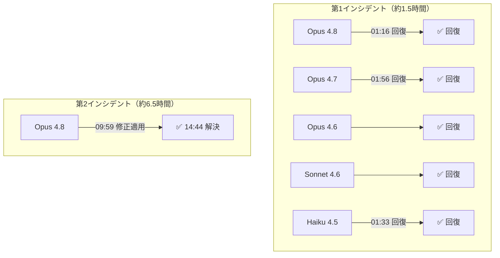
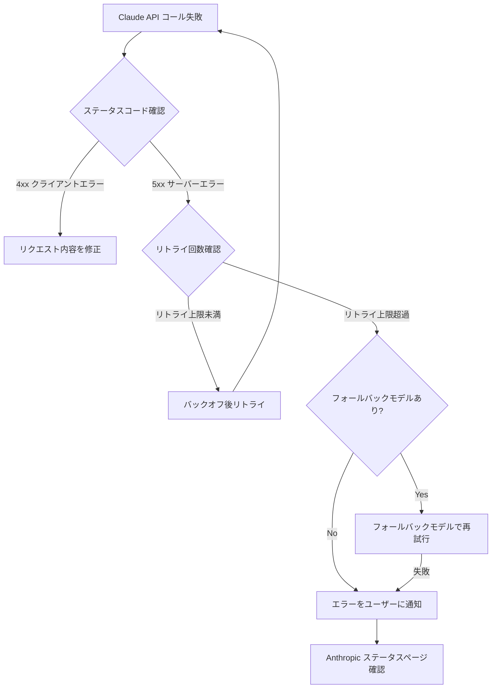

## はじめに

2026年6月22日、Anthropic の Claude API において、主要モデルが広範囲にわたってエラー率の上昇を経験するインシデントが発生しました。Opus 4.8 / 4.7 / 4.6、Sonnet 4.6、Haiku 4.5 という現在アクティブな主要モデルがほぼ同時に影響を受けたことで、本番環境で Claude API を利用する多くの開発者・サービスが一時的な障害に直面しました。

いずれのインシデントも **現在は解決済み** ですが、「なぜ広範囲に影響が出たのか」「本番環境ではどう備えるべきか」を整理することは、今後の障害対応を考える上で重要です。本記事では2件のインシデントの詳細を時系列で振り返り、開発者が取るべき対策をまとめます。

> **📌 影響を受けた人**
> Claude API（Anthropic API）を本番環境で利用しているアプリケーション開発者・MLエンジニア・プロダクトチーム。特に Opus / Sonnet / Haiku のいずれかを使っているすべてのユーザーが潜在的な影響対象でした。

---

## インシデントの全体像

今回発生したのは計2件のインシデントです。深夜帯（UTC 00:37）に始まった広範囲の第1インシデントと、その約7時間後（UTC 08:11）に発生した Opus 4.8 単体の第2インシデントです。

```mermaid
timeline
    title 2026-06-22 Claude API インシデント タイムライン (UTC)
    00:37 : 第1インシデント開始
           : Opus 4.8/4.7/4.6, Sonnet 4.6, Haiku 4.5 でエラー率上昇を検知・調査開始
    01:11 : 原因特定
           : 修正を実装開始
    01:16 : Opus 4.8 回復
    01:33 : Haiku 4.5 回復
    01:56 : Opus 4.7 回復
    02:01 : モニタリングフェーズへ移行
    02:06 : 第1インシデント 解決済み
    08:11 : 第2インシデント開始
           : Opus 4.8 単体でエラー増加を再検知・調査開始
    08:12 : 継続調査
    09:59 : 修正適用・モニタリングフェーズへ移行
    14:44 : 第2インシデント 解決済み
```



---

## インシデント詳細

### 第1インシデント：主要モデル一斉エラー率上昇

| 項目 | 内容 |
|------|------|
| 発生日時 | 2026-06-22 00:37 UTC |
| 解決日時 | 2026-06-22 02:06 UTC |
| 継続時間 | 約 **1時間29分** |
| 深刻度 | **High** |
| 影響モデル | Opus 4.8, Opus 4.7, Opus 4.6, Sonnet 4.6, Haiku 4.5 |
| 影響 API | Anthropic API |

このインシデントの特徴は、**価格帯・用途の異なる5モデルが同時に影響を受けた**点です。最上位の Opus 4.8 から軽量な Haiku 4.5 まで、ほぼすべてのアクティブモデルが対象となりました。これはフロントエンドのモデル固有の問題ではなく、API 基盤レイヤーでの共通障害だったことを示唆しています。

Anthropic チームは障害発生から **約34分で原因を特定・修正を実装** し、モデルごとに順次回復を確認しながら 02:06 UTC に解決を宣言しました。

### 第2インシデント：Opus 4.8 単体エラー再発

| 項目 | 内容 |
|------|------|
| 発生日時 | 2026-06-22 08:11 UTC |
| 解決日時 | 2026-06-22 14:44 UTC |
| 継続時間 | 約 **6時間33分** |
| 深刻度 | **Medium** |
| 影響モデル | Opus 4.8 のみ |
| 影響 API | Anthropic API |

第1インシデント解決から約6時間後、今度は Opus 4.8 単体で再びエラー率の上昇が検知されました。影響範囲は第1インシデントより限定的でしたが、**解決までに約6.5時間を要した**点でユーザーへの影響は長時間にわたりました。Opus 4.8 はコスト面で最上位モデルに位置するため、Opus 4.8 を主要モデルとして利用しているサービスへの影響は相対的に大きかったと考えられます。

---

## 影響と対応

今回のインシデントはいずれも **解決済み**のため、現時点でユーザー側の緊急対応は不要です。ただし、同種の障害が将来再発した際に備え、以下の対策を検討してください。

### 短期対応：障害発生時のリトライ設計

```python
import anthropic
import time
from anthropic import APIStatusError, APIConnectionError

client = anthropic.Anthropic()

def call_claude_with_retry(
    model: str,
    messages: list,
    max_retries: int = 3,
    base_delay: float = 1.0,
):
    """
    エクスポネンシャルバックオフ付きリトライ。
    500系エラー（サーバー側障害）のみリトライ対象とする。
    """
    for attempt in range(max_retries):
        try:
            response = client.messages.create(
                model=model,
                max_tokens=1024,
                messages=messages,
            )
            return response
        except APIStatusError as e:
            if e.status_code >= 500 and attempt < max_retries - 1:
                delay = base_delay * (2 ** attempt)
                print(f"Server error {e.status_code}, retry {attempt + 1}/{max_retries} in {delay}s")
                time.sleep(delay)
            else:
                raise
        except APIConnectionError as e:
            if attempt < max_retries - 1:
                delay = base_delay * (2 ** attempt)
                print(f"Connection error, retry {attempt + 1}/{max_retries} in {delay}s")
                time.sleep(delay)
            else:
                raise
    return None
```

### 中期対応：フォールバックモデルの導入

今回のインシデントで Opus 4.8/4.7/4.6、Sonnet 4.6、Haiku 4.5 が同時に影響を受けたことは、**同一ベンダーのモデルへの依存リスク**を改めて示しました。

```python
FALLBACK_MODELS = [
    "claude-opus-4-8",    # プライマリ
    "claude-sonnet-4-6",  # フォールバック1
    "claude-haiku-4-5-20251001",  # フォールバック2（最軽量・最速）
]

def call_with_fallback(messages: list):
    """広範囲障害時はモデルを順に試す"""
    for model in FALLBACK_MODELS:
        try:
            return call_claude_with_retry(model=model, messages=messages)
        except APIStatusError as e:
            if e.status_code >= 500:
                print(f"Model {model} unavailable, trying next...")
                continue
            raise
    raise RuntimeError("All fallback models exhausted")
```

> **💡 Tips**
> 同一ベンダー内のフォールバックは「共通基盤障害」には効果が薄い場合があります。クリティカルなサービスでは、他ベンダーの LLM をフォールバックとして組み合わせることも検討してください。

### 長期対応：ステータスページの監視

Anthropic はインシデント情報を公式ステータスページで公開しています。本番環境では以下の対応が有効です。

- **ステータスページのサブスクリプション**：インシデント発生時にメール・Slack 通知を受け取れます
- **定期的なヘルスチェック**: Claude API への疎通確認を監視ツール（Datadog, New Relic 等）に組み込む
- **エラー率アラート**: 自サービスの Claude API エラー率が閾値を超えた場合に即時アラートを発報する



---

## モデル別影響サマリー

| モデル | 第1インシデント | 第2インシデント | 備考 |
|--------|----------------|----------------|------|
| Claude Opus 4.8 | ✅ 影響あり（01:16 回復） | ✅ 影響あり（14:44 解決） | 両インシデントで影響 |
| Claude Opus 4.7 | ✅ 影響あり（01:56 回復） | — | 第1のみ |
| Claude Opus 4.6 | ✅ 影響あり | — | 第1のみ |
| Claude Sonnet 4.6 | ✅ 影響あり | — | 第1のみ |
| Claude Haiku 4.5 | ✅ 影響あり（01:33 回復） | — | 第1のみ |

> **⚠️ Breaking Change**
> 今回のインシデントは機能変更・API 仕様変更ではありませんが、**Opus 4.8 を含むサービスが6.5時間以上エラーを経験した**事実は、SLA 設計において Claude API の可用性を過信しないことの重要性を示しています。

---

## まとめ

2026年6月22日に発生した2件の Claude API インシデントのポイントを整理します。

1. **第1インシデント（00:37〜02:06 UTC）**: Opus 4.8/4.7/4.6・Sonnet 4.6・Haiku 4.5 の主要5モデルが同時にエラー率上昇。約34分で原因特定・修正適用、1時間半で完全解決。

2. **第2インシデント（08:11〜14:44 UTC）**: Opus 4.8 単体で再発。解決まで約6.5時間を要した。

3. **現在はいずれも解決済み**。ユーザー側の緊急アクションは不要。

4. **今後の備えとして**、リトライ実装・フォールバックモデル設計・ステータスページ監視の3点が有効。

広範囲な基盤障害が発生した場合、同一ベンダー内のモデル切り替えでは回避できないケースがあることを念頭に置き、障害に強いアーキテクチャ設計を意識しましょう。
