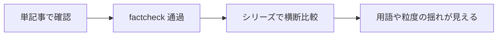
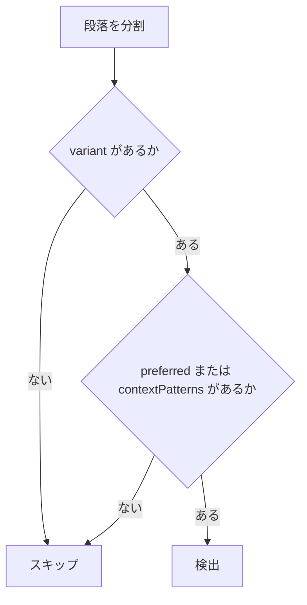
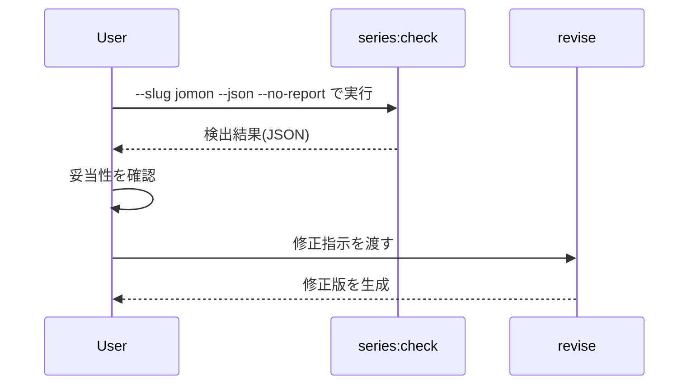

# 単記事では気づけない横断の不整合を、glossary と series:check で検出する設計と実装

シリーズ記事は、1本ずつ見ればどれも成立しているのに、並べて読むと急に統一感が崩れることがあります。

たとえば、

- **竪穴建物** と **竪穴住居**
- 三内丸山遺跡の所在地を **青森市** と書く記事、**青森県** と書く記事
- 縄文中期の終端年代の書き方
- Q&A の体裁の有無

こうしたものは、単記事の中だけを見れば必ずしも誤りではありません。factcheck も通るかもしれません。ですが、シリーズ全体として読むと、「この連載はどの粒度・どの語彙で統一しているのか」が揺れて見えます。

Qiita のように単記事流入が多い媒体では、各記事がそれぞれ正しいだけでは不十分です。読者はある記事を起点に別の記事も読むので、シリーズ横断での読み心地や一貫性が効いてきます。

この記事では、この **一貫性** の問題がなぜ factcheck では拾えないのかを整理したうえで、人が決めた `glossary.yaml` を正本にし、`series:check` で機械照合する設計と実装を解説します。対象は **llm-task-router 0.2.55** 時点の挙動です。

シリーズ作成フローそのもの、つまり voice 凍結・member・order・create→evaluate→factcheck→revise→export は既知である前提で進めます。これらは llm-task-router シリーズ運用の用語で、たとえば canonical は記事生成の本線パスを指します。本記事ではその詳細説明には立ち入らず、既知前提として扱います。

本記事で新しく扱うのは、主に次の論点です。

- `glossary.yaml` の考え方
- `terms` と `nouns` の分け方
- 段落単位の照合
- factcheck と `series:check` の責務分離
- 実測結果を再現可能に読むための JSON 出力

手順書というより、**なぜそう設計したか** を含めた設計の読み物として読んでください。

## 前提とこの記事の射程

まず前提を明確にしておきます。

- 対象は **llm-task-router 0.2.55**
- 主題は **シリーズ管理における一貫性チェック**
- 単記事の品質管理全般ではなく、**シリーズ横断でしか見えない不整合** をどう扱うかに絞る

既存フローに対して、本記事が追加で説明する範囲は次の通りです。

| 項目 | 本記事で扱うか | 内容 |
| --- | --- | --- |
| create / evaluate / factcheck / revise / export | 既知前提 | 基本フローそのもの |
| glossary | 扱う | 正本としての辞書設計 |
| terms / nouns | 扱う | 一般用語と固有名詞の分離 |
| 段落単位照合 | 扱う | 誤検出を抑えるための最小仕様 |
| 責務分離 | 扱う | factcheck と `series:check` の住み分け |
| 実測 JSON の読み方 | 扱う | 検出結果を追試可能に確認する方法 |

この記事は「こう操作すれば動く」というだけの説明ではありません。なぜその責務に切り出したか、なぜ LLM 判定ではなく機械照合を優先したか、といった判断の理由まで扱います。

また、本記事は実装コードそのものは載せず、設計判断・最小仕様・実測の読み方に絞ります。コード例は `glossary.yaml` と CLI / JSON が中心で、実行可能な TypeScript プログラムは扱いません。

## 導入：単記事では正しいのに、シリーズで並べると破綻する

縄文シリーズのレビューでは、実際に次のような揺れが出ました。

1. **竪穴建物** と **竪穴住居**
2. 三内丸山遺跡の所在地が **青森市** と **青森県**
3. 縄文中期の終端年代の揺れ
4. 記事によって Q&A 体裁があったりなかったりする

ここで重要なのは、各記事が単体ではそれなりに成立していたことです。しかも、少なくとも一部は factcheck を通していました。

つまり問題は「この文章は誤りか」ではなく、「シリーズとして見たときに揃っているか」です。



単記事ベースの品質管理だけでは、この D の問題は取りこぼします。Qiita のような媒体では、読者は必ずしも第1回から順に読んでくれるわけではありません。それでも、複数記事を渡り歩いたときに「このシリーズは統一されている」と感じられる必要があります。

## なぜ factcheck では拾えないのか：事実の正誤と一貫性は別の軸

ここを曖昧にすると設計がぶれます。

factcheck の責務は、**各記事の中で事実として誤っていないか** を確認することです。一方、シリーズ横断で表記が揃っているかは、別の品質軸です。

たとえば三内丸山遺跡について、

- **青森市** と書く
- **青森県** と書く

のどちらも、文脈によっては誤りとは言えません。後者は粒度が粗いだけで、事実として間違いではないからです。

つまりこれは、正誤というより **粒度と統一性** の問題です。

この整理をすると、設計上の役割分担がはっきりします。

- **factcheck** は正誤判定
- `series:check` は一貫性判定

そして `glossary.yaml` における `variants` は、誤記一覧ではありません。あくまで **揺れ側**、つまり **非推奨側** の表現です。

:::note info
`variants` に入る語が常に「間違い」なわけではありません。シリーズ内での統一方針に対して非推奨、という意味で扱うのがポイントです。
:::

## 設計の核：4つの判断

この仕組みの設計では、特に次の4つを早めに固定しました。

### 1. 正本は glossary.yaml に置く

何を正とするかは、機械に決めさせません。人が `glossary.yaml` に `preferred` と `variants` を書きます。

- `preferred`: シリーズで採用する表記
- `variants`: 検出対象にしたい揺れ側の表記

この判断は編集方針そのものなので、人の責任で持つべきです。

### 2. 判定は LLM 任せにせず、まず機械照合にする

表記ゆれの検出は、一見すると LLM にやらせたくなります。ですが第1段ではそうしませんでした。

理由はシンプルです。

- 再現性が必要
- 判定基準を固定したい
- 偽陽性を抑えたい

LLM は将来、補助判定には向いています。しかし最初の土台としては、**人が決めた辞書を機械照合する** ほうが運用しやすいです。

### 3. `series:check` は read-only にする

`series:check` は本文を書き換えません。検出だけを行う **read-only** の工程です。

これは `final.md` を直接編集しない原則と整合しています。修正が必要なら、変更は必ず `revise` を経由させます。


この分離により、チェック系コマンドが勝手に原稿へ副作用を持つことを防げます。

### 4. canonical 工程には混ぜない

記事生成の必須パスに混ぜるのではなく、シリーズ管理の補助パスとして分けました。

- canonical: 生成の本線
- `series:check`: 横断管理の補助

この分離は地味ですが重要です。責務が増えるほど、必須パスの見通しが悪くなります。シリーズ管理上あると便利なものを、記事生成の本線に無理に押し込まない判断です。

## glossary.yaml の最小設計

最初から巨大な辞書を作る必要はありません。むしろ逆です。**実際に痛みが出た項目だけ** を最小単位で登録するのが現実的でした。

設計上は、大きく `terms` と `nouns` に分けます。

- `terms`: 一般用語の揺れ
- `nouns`: 固有名詞にぶら下がる属性の揺れ

たとえば、

- **竪穴建物 / 竪穴住居** は `terms`
- 三内丸山遺跡の `location` は `nouns`

という切り方です。

最小構成の完全例は次の通りです。

```yaml
schemaVersion: 1
seriesId: jomon
terms:
  - preferred: 竪穴建物
    variants: [竪穴住居]
    firstUseAlias: per-article
nouns:
  - canonical: 三内丸山遺跡
    attributes:
      location:
        preferred: 青森市
        variants: [青森県]
        contextPatterns: [三内丸山遺跡, 所在地]
```

トップレベルでは `schemaVersion` が必須で、`seriesId` を持ちます。内容の版を管理したい場合は、任意で `revision` を追加できます。

`terms` では、各項目に `preferred`、`variants`、`firstUseAlias` を持たせます。初出例外は入れ子の設定ではなく、`firstUseAlias: per-article` という単一フィールドで表します。

`nouns` 側では `canonical` の下に `attributes` を持たせ、各属性に次を定義します。

- `preferred`
- `variants`
- `contextPatterns`

この設計にしておくと、固有名詞そのものの揺れではなく、「その固有名詞の何についての表記か」を表現できます。

たとえば `location` のほかにも、将来的には次のような属性がありえます。

- `period`
- `nickname`
- `notation`

ただし第1段では広げすぎないことが大切です。辞書は増やすことより、**意味の単位が崩れないこと** を優先します。

## 照合の最小仕様：何を「揺れ」と定義したか

辞書があっても、照合ルールが雑だとノイズだらけになります。そこで第1段では、誤検出を抑えるためにかなり保守的な仕様にしました。

### マッチング方式

第1段のマッチングは、**正規化なしの単純な部分文字列一致** です。

- `preferred` / `variants` / `contextPatterns` は文字列としてそのまま照合
- 全角半角の吸収なし
- 活用形の吸収なし
- 送り仮名の揺れ吸収なし
- 同義語推定なし

つまり、自然言語理解ではなく辞書照合です。精度を欲張らず、再現性を優先しています。

また、**青森市 / 青森県 / 青森** や **三内丸山 / 三内丸山遺跡** のような部分文字列の包含関係は、この最小仕様では想定内です。だからこそ、`nouns` では単独語一致ではなく `contextPatterns` と組み合わせて扱います。

:::note warn
活用や送り仮名、表記正規化をまだ扱わないため、日本語の表記ゆれ全般を網羅できるわけではありません。第1段では「拾える揺れを狭く明確にする」方針です。
:::

### 段落単位で見る

照合単位は文でも記事全体でもなく、**段落** にしました。

理由は、記事全体を対象にすると離れた位置の語がつながってしまい、文脈のない検出が増えるからです。逆に文単位だと、箇条書きや補足説明との関係を拾いにくいことがあります。

### 段落分割規則

本記事で前提にしている最小規則は次の通りです。

1. コードフェンス内部は対象外にする
2. 空行でブロック分割する
3. 見出し行は 1 行で独立段落とみなす
4. 箇条書きの各項目は独立段落とみなす
5. Markdown テーブルは各行を独立段落とみなす
6. 通常の本文ブロックは、そのブロック全体を 1 段落とみなす
7. 最小仕様の範囲として、ネスト要素（リスト内コードフェンスなど）は扱わない

Markdown テーブルは各行を独立段落とみなすため、表のセル内に `variant` が出れば原理的には検出対象になりえます。ただし、今回の縄文 6 本では本文の表が原因の検出は問題化しませんでした。

擬似コードで書くと次のイメージです。

```text
for each markdown block:
  if block is fenced code:
    skip
  else if block is heading:
    paragraph = block
  else if block is list:
    each item => paragraph
  else if block is table:
    each row => paragraph
  else:
    paragraph = block
```

この規則により、見出し・箇条書き・表の隣接要素の巻き込みを抑えます。

### context OR 方式

検出条件は概ねこうです。

- 同一段落内に `variant` がある
- かつ、同一段落内に次のどちらかがある
  - `preferred`
  - `contextPatterns`

これを **context OR** と呼びます。



### 文脈語はどこで定義するか

`contextPatterns` は `glossary.yaml` の `nouns[].attributes.<attribute>.contextPatterns` に置きます。

さきほどの例だと、

- `preferred`: **青森市**
- `variants`: **青森県**
- `contextPatterns`: **三内丸山遺跡**、**所在地**

です。

このとき、同一段落での判定は次のようになります。

| 段落 | 判定 | 理由 |
| --- | --- | --- |
| 三内丸山遺跡は青森県にある | 検出 | `variant` と `contextPatterns` が同段落にある |
| 三内丸山遺跡の所在地は青森県だ | 検出 | `variant` と `contextPatterns` が同段落にある |
| 後期の青森県で知られる合掌土偶 | 非検出 | `variant` はあるが三内丸山文脈ではない |
| 三内丸山遺跡は青森市にある | 非検出 | `preferred` であり `variant` がない |

この定義を明示しておくと、三内丸山の所在地は拾い、合掌土偶文脈の **青森県** は拾わない挙動を再現できます。

### 初出例外を設ける

記事の初回 1 回だけは、説明のために `preferred` と `variant` を併記したいことがあります。

たとえば、

- 竪穴建物（いわゆる竪穴住居）
- 「竪穴建物」を採用し、以後は「竪穴住居」を使わない

のようなケースです。

このため、**記事単位 × glossary 項目単位で最初の 1 出現だけ** は、同一段落内で `preferred` と `variant` が併記されている場合に限って許容する設計にしました。

つまり初出例外の判定軸は次の通りです。

- 記事単位
- glossary 項目単位
- 最初の 1 回だけ
- 同一段落内で `preferred` と `variant` が両方出ていること

この初出例外は `firstUseAlias` で表せます。今回の縄文 6 本の試走では、**この初出例外は発動しませんでした**。つまり、合計 11 件という実測値は、初出例外による抑制が **0 件** の状態で得られた結果です。

### false negative は許容し、false positive を最小化する

これが一番重要な方針です。

- 多少取りこぼしてもよい
- でも、過検出で毎回うるさくなるのは避けたい

完璧な自然言語理解ではなく、**再現可能で低ノイズな検出** を優先した設計です。

## 実データ試走：縄文 6 本で何が拾え、何を拾わなかったか

最小 glossary として、

- `terms`: 竪穴建物 / 竪穴住居
- `nouns`: 三内丸山遺跡の `location`

だけを登録し、次のコマンドで試走しました。

```bash
llm-task-router series:check --slug jomon --json --no-report
```

この実行は **read-only** で、整形レポートは出力していません。結果は **合計 11 件** でした。これは **0.2.55 時点の実測値** です。

ここで用語を先にそろえておきます。

- **真陽性**: 実際に直すべき表記ゆれを正しく検出したもの
- **偽陽性**: 検出されたが、実際には直さなくてよいもの
- **既知ノイズ**: 偽陽性のうち、原因が把握できていて現仕様では許容しているもの

今回の既知ノイズは、いずれも機械生成の **「## 参考」** にあるソース正式名「**青森県公式**」を noun 属性として拾ったものです。**本文の表記揺れではありません**。

### 11 件の内訳

記事ごとの実内訳は次の通りです。

| 記事（slug） | 総件数 | term（竪穴住居） | noun（青森県 / location） | 内訳の中身 |
| --- | ---: | ---: | ---: | --- |
| jomon-intro | 1 | 0 | 1 | noun 1件は本文の揺れではなく、参考章のソース正式名「（青森県公式）」を拾った既知ノイズ |
| jomon-people | 3 | 1 | 2 | term 1件は **竪穴住居**。noun 2件のうち 1件は本文 para21 の三内丸山文脈の **青森県** で真陽性、もう 1件は参考章のソース名で既知ノイズ |
| jomon-environment | 1 | 1 | 0 | term 1件は **竪穴住居** |
| jomon-life | 6 | 6 | 0 | term 6件は **竪穴住居** |
| jomon-crafts | 0 | 0 | 0 | 検出なし |
| jomon-ritual | 0 | 0 | 0 | 本文に「後期の青森県で知られる」はあるが、三内丸山 / 所在地の文脈が同一段落に無いため非検出 |
| **合計** | **11** | **8** | **3** | term 計 8・noun 計 3 |

ここで集計軸をつないでおくと、term 8件はすべて真陽性です。noun 3件は「真陽性 1件（`jomon-people` 本文 para21 の三内丸山文脈の **青森県**）＋ 既知ノイズ 2件（参考章ソース名）」に分かれるので、**真陽性 9 = term 8 + noun 真陽性 1**、**既知ノイズ 2 = noun のうち参考章由来** となります。

分類だけを抜き出すと次の通りです。

| 区分 | 件数 | 説明 |
| --- | ---: | --- |
| 真陽性 | 9 | term 8件 + noun 真陽性 1件 |
| 既知ノイズ | 2 | 参考章ソース正式名「（青森県公式）」由来の noun 検出 2件 |
| 合計 | 11 | `series:check` の総検出数 |

今回の実測では、**真陽性 9 件・既知ノイズ 2 件・合計 11 件** です。ここは設計説明よりも重要な実値なので、表ごとそのまま押さえておくと再確認しやすいです。

### 拾えたもの

代表例は次の 2 種類です。

- term の代表例: **竪穴住居**
  - `jomon-life` に 6件
  - `jomon-people` に 1件
  - `jomon-environment` に 1件
  - 合計 **8件**
- noun の代表例: `jomon-people` 本文 para21 の「三内丸山遺跡（...青森県にある...）」
  - 同一段落に `contextPatterns` の **三内丸山遺跡** があるため、`location` の `variant` である **青森県** を検出
  - noun の真陽性はこの **1件** が本丸

前者は一般用語の揺れ、後者は固有名詞の属性に紐づく揺れとして拾えています。

### 拾わなかったもの

一方で、`jomon-ritual` の「後期の青森県で知られる」は **非検出** でした。

これは三内丸山遺跡の所在地を述べているのではなく、合掌土偶の文脈だからです。同一段落に三内丸山 / 所在地の `contextPatterns` がないため、context OR が成立しません。

この非検出は、**検出漏れではなく、過検出回避の意図した結果** です。

また、`jomon-crafts` は検出 **0件** でした。

さらに、今回の `series:check` が最初から見ていない対象もあります。

- slug など本文外の命名規約
- 数値の揺れ（中期の終端年代）
- Q&A 形式

これらは「未検出」ではなく、**対象外** です。

### 既知ノイズ

既知ノイズは **2件** あります。

- `jomon-intro` の noun 1件
- `jomon-people` の noun 2件のうち 1件

どちらも、機械生成の参考章にあるソース正式名「**青森県公式**」を `location` の `variant` として拾ったものです。**本文の表記揺れではありません**。

第1段ではこのノイズは許容し、参考ブロック除外は将来候補と考えるのが実務上は妥当でした。

:::note warn
ノイズをゼロにしようとして対象範囲を急に広げると、かえって false positive が増えたり、運用コストが上がったりします。第1段では「何を拾わないか」を明示するほうが重要です。
:::

## CLI と JSON 出力の読み方

入口としては、まずレポート生成なしで機械可読な結果を見ます。

```bash
llm-task-router series:check --slug jomon --json --no-report
```

最低限、読者が気にしやすいのは次の 3 点です。

| 観点 | 内容 |
| --- | --- |
| 対象シリーズ | `--slug jomon` で縄文シリーズを対象に走査する |
| glossary の解決 | シリーズ設定に紐づく `glossary.yaml` を参照する |
| 出力 | `--json` で機械可読、`--no-report` で整形レポートを省略 |

検出は失敗ではなく警告として扱うため、検出ありでも終了コードは 0 を返します。これは read-only チェッカーとしての設計意図です。

CI 観点では、終了コードも重要です。

| 状態 | 終了コード |
| --- | ---: |
| 実行成功・検出 0 件 | 0 |
| 実行成功・検出あり | 0 |
| 設定不備や実行失敗 | 非 0 |

この表は **0.2.55 時点の実測** です。将来のバージョンでは振る舞いが変わりうるため、運用時は対象バージョンで再確認する前提が安全です。

CI で失敗させたい場合は、JSON の `totalFindings` を見て呼び出し側で判定します。

たとえばシェル上では次のように扱えます。

```bash
llm-task-router series:check --slug jomon --json --no-report > findings.json
jq '.totalFindings' findings.json
```

このコマンドで、シリーズ横断チェックの結果を JSON で受け取れます。最初から整形済みレポートを見るより、**どの記事のどの段落で何が起きたか** を先に機械可読で確認できるのが利点です。

なお、本文中で触れた version の 2 軸化は、設計上は **schemaVersion** と **revision** を分けて持つ考え方です。`schemaVersion` はファイル形式の版、`revision` は内容の版です。`series:check` のレポートでは、監査キーとして `glossary.hash` と `glossary.schemaVersion` が載り、`revision` があればそれも併記されます。

## 実測 JSON サンプルで検出結果を読む

以下は、実測出力の構造をそのまま説明できるように、記事本文の抜粋を短くした **サンプル JSON** です。  
`members[].findings[]` は **11 件中 3 件のみの抜粋** で、**term 8件のうち1件・noun 真陽性1件・既知ノイズ1件** を載せています。

```json
{
  "seriesId": "jomon",
  "missingGlossary": false,
  "glossary": { "hash": "0cfef4bbacb6...", "schemaVersion": 1 },
  "checkedAt": "2026-06-25T...",
  "members": [
    {
      "order": 4,
      "slug": "jomon-life",
      "runId": "2026-06-24-jomon-life",
      "findings": [
        { "kind": "term", "preferred": "竪穴建物", "found": "竪穴住居", "paragraphIndex": 80, "snippet": "縄文時代の住まいとして代表的なのが、竪穴住居です。" }
      ]
    },
    {
      "order": 2,
      "slug": "jomon-people",
      "runId": "2026-06-24-jomon-people",
      "findings": [
        { "kind": "noun", "preferred": "青森市", "found": "青森県", "attribute": "location", "paragraphIndex": 21, "snippet": "…三内丸山遺跡（…青森県にある…）…" }
      ]
    },
    {
      "order": 1,
      "slug": "jomon-intro",
      "runId": "2026-06-24-jomon-intro",
      "findings": [
        { "kind": "noun", "preferred": "青森市", "found": "青森県", "attribute": "location", "paragraphIndex": 85, "snippet": "- [S006] 三内丸山遺跡とは（青森県公式）…" }
      ]
    }
  ],
  "totalFindings": 11,
  "warnings": []
}
```

ここで重要なのは、前述の通り `version` を 1 つに潰さず、**2 軸で持つ** ことです。

- `schemaVersion`: ファイル形式の版
- `revision`: 内容の版

そして出力側の `glossary` には、監査キーとして `hash` と `schemaVersion` が載り、`revision` があればそれも併記されます。

読み方は単純です。

- member `slug: jomon-life`、`runId: 2026-06-24-jomon-life`
  - `kind: term` の検出
  - `found` は **竪穴住居**
  - `snippet` で該当段落の文脈を確認できる
  - term 8件のうちの 1件を抜粋

- member `slug: jomon-people`、`runId: 2026-06-24-jomon-people`
  - `kind: noun` の検出
  - `attribute: location`
  - `found` は **青森県**
  - `snippet` は本文 para21 の「三内丸山遺跡（...青森県にある...）」に対応
  - noun 真陽性 1件の本丸を抜粋

- member `slug: jomon-intro`、`runId: 2026-06-24-jomon-intro`
  - 同じく `kind: noun`
  - `attribute: location`
  - `found` は **青森県**
  - `snippet` は参考章ソース名「三内丸山遺跡とは（青森県公式）」に対応
  - 既知ノイズ 2件のうち 1件を抜粋

`snippet` があると、その場で本文を開かなくても大まかな状況を把握できます。

運用としては、

1. JSON を見る
2. 真陽性か既知ノイズかを確認する
3. 必要なら `revise` に渡す

という流れになります。



ここでも `series:check` 自体は本文を触らない、という設計が効いています。

## 実装そのものより大事だった進め方

今回、実装そのものと同じくらい重要だったのが進め方でした。

進行はおおむね次の順でした。

1. 提案
2. 設計レビュー
3. 実装
4. 実装レビュー
5. 実データ試走
6. 公開

この流れの中で、AI に複数回の設計レビューをさせたのが効きました。たとえば次のような穴は、反復レビューの中で埋まっています。

- `schemaVersion` と `revision` の分離
- `seriesId` 一致検証
- glossary 未設定時の扱い
- 段落分割の詳細

重要なのは、AI に「正しさを決めさせた」のではなく、**設計を駆動させ、穴を批評させた** ことです。

役割分担としてはこう整理できます。

| 役割 | 人 | AI |
| --- | --- | --- |
| 何を正とするか決める | 担当する | 担当しない |
| 設計案を出す | 担当する | 担当する |
| 設計の穴を洗う | 補助する | 強く担当する |
| 実装する | 担当する | 補助する |
| 実データで評価する | 担当する | 補助する |

最初から完璧な一般解を狙わず、

- 何を拾うか
- 何を拾わないか
- どこに既知ノイズがあるか

を明示しながら段階導入すること自体が、実務上の大きな学びでした。

## 限界と今後の課題

現時点で未対応、もしくは対象外としているものは明確にあります。

- 数値の揺れ
- Q&A などの形式揺れ
- slug 等の命名規約
- 参考ブロック除外
- 表記正規化
- 活用形や送り仮名の揺れ

これらは今後の拡張候補ではありますが、第1段で一気に広げるべきではないと判断しました。理由は明確で、範囲を広げるほど false positive が増えやすいからです。

参考ブロック除外のような改善は、既知ノイズを減らす意味では有効です。ただし、それを入れることで段落判定や構造解析が複雑になり、運用の透明性が下がるなら本末転倒です。

将来的な方向性としては、たとえば次が考えられます。

- 参考ブロックの除外
- 数値揺れ専用の別ルール
- LLM による補助判定
- 形式揺れの別チェッカー化
- 正規化ありマッチングの導入

ただし現時点では、**機械照合の責務を広げすぎない** ことを優先します。

## まとめ：最小辞書から始めるシリーズ横断チェック

シリーズ記事の表記ゆれは、各記事の事実が正しいかどうかとは別の、**一貫性** という品質軸の問題です。単記事の factcheck を通しても、シリーズ全体の読み心地までは保証できません。

そこで、

- 人が `glossary.yaml` で何を正とするか決める
- `series:check` が機械照合する
- 検出は段落単位・context OR・初出例外で保守的に行う
- 修正は `revise` に分離する

という構成にすると、単記事では見えない横断の崩れを、再現可能かつ低コストで検出できます。

今回の試走では、最小辞書で **11 件** を検出し、その内訳は **真陽性 9 件・既知ノイズ 2 件** でした。また、設計上は重要な初出例外については、今回の 6 本では **発動 0 件** であることも確認できました。

第1段では false positive を抑えるために対象を絞り、拾わないものや既知ノイズを明示することが重要でした。最初から大辞書を作る必要も、万能チェッカーを目指す必要もありません。

まずは自分のシリーズで、glossary 項目を **1 つだけ** 作ってみてください。そして `series:check --slug jomon --json --no-report` のように試走してみる。それだけでも、単記事では気づかなかった揺れが見えてくるはずです。

## 追記：その後（0.2.56）

本文は 0.2.55 時点です。その後の 0.2.56 では、将来候補としていた参考ブロック除外を実装しました。機械生成の参考章（sources のコメントマーカーで囲まれたブロック）を優先して除外し、無ければ `## 参考` / `参考リンク` / `出典` 見出しから次の同階層以上の見出し、または EOF までを照合対象外にします。これにより §5 の既知ノイズ 2 件、参考章ソース正式名「青森県公式」は検出されなくなりました。

あわせて縄文記事側の表記も是正し、本文の三内丸山は **青森市** に統一、**竪穴建物** に統一しました。さらに再レビューで、`jomon-people` の見出しと Q&A 行の 2 か所に「人びと／人々」の揺れが見つかり、glossary に **人びと**（variants: 人々）を追加（B1a）して機械で拾えるようにしています。その結果、同じ `series:check` の検出は **11 件から実害 2 件（人々）・既知ノイズ 0 件** になりました。ただし、この **11 → 2** は参考ブロック除外（A）単独ではなく、①縄文記事側の表記是正、②参考ブロック除外（A）、③「人びと／人々」の glossary 追加（B1a）を合わせた結果です。これは、本文で述べた「発見 → 人が正本決定 → glossary 登録 → 機械が守る」ループの実例です。数値・Q&A 体裁・slug などが対象外である点と、段階導入の方針は変わっていません。

## 参考

<!-- sources:begin -->
- [S001] 特別史跡 三内丸山遺跡 | 青森市（primary, retrieved: 2026-06-25）
  https://www.city.aomori.aomori.jp/bunka_sports_kankou/bunka_geijutsu/1005024/1005084/1005085/1005086.html
- [S002] 特別史跡「三内丸山遺跡」（青森県公式）（primary, retrieved: 2026-06-25）
  https://sannaimaruyama.pref.aomori.jp/
- [S003] 三内丸山遺跡 - 世界遺産 北海道・北東北の縄文遺跡群（secondary, retrieved: 2026-06-25）
  https://jomon-japan.jp/learn/jomon-sites/sannai-maruyama
- [S004] 国宝「合掌土偶」| 八戸市（primary, retrieved: 2026-06-25）
  https://www.city.hachinohe.aomori.jp/bunka_sports/bunka/zekawajomonnosato_hakkutsuchosa/9917.html
- [S005] 土偶（青森県八戸市風張1遺跡出土） - 青森県庁（primary, retrieved: 2026-06-25）
  https://www.pref.aomori.lg.jp/soshiki/kyoiku/e-bunka/kokuho_kouko_1.html
- [S006] 竪穴式住居 - Wikipedia（secondary, retrieved: 2026-06-25）
  https://ja.wikipedia.org/wiki/%E7%AB%AA%E7%A9%B4%E5%BC%8F%E4%BD%8F%E5%B1%85
- [S007] 縄文時代 - Wikipedia（secondary, retrieved: 2026-06-25）
  https://ja.wikipedia.org/wiki/%E7%B8%84%E6%96%87%E6%99%82%E4%BB%A3
<!-- sources:end -->
