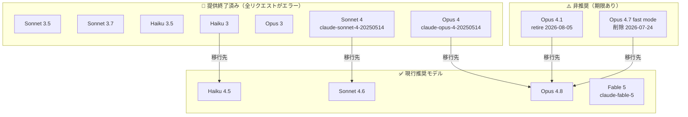
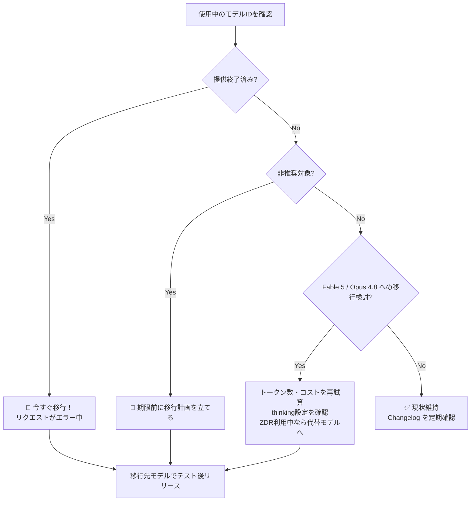

## はじめに

2025年8月〜2026年6月にかけて、Anthropic の Claude API に大規模なアップデートが行われました。**Claude Fable 5・Claude Opus 4.8** などの次世代モデルが登場する一方、Sonnet 4・Opus 4・Haiku 3 などの旧モデルが相次いで提供終了（retire）となっています。

対応を怠ると**全リクエストがエラーになる**ため、利用中のモデルIDを今すぐ確認することが重要です。この記事では、開発者が取るべきアクションを中心に整理します。

> **📌 影響を受ける人**
> - `claude-sonnet-4-20250514` / `claude-opus-4-20250514` を使用中の開発者 → **即時対応必須（既にエラー）**
> - `claude-3-haiku-20240307` を使用中の開発者 → **既にエラー発生中**
> - `claude-opus-4-7` で `speed:"fast"` を使っている開発者 → **2026年7月24日削除**
> - `claude-opus-4-1-20250805` を使用中の開発者 → **2026年8月5日 retire**

## 変更の全体像



## 変更内容

### 🚨 即時対応必須：提供終了モデル一覧

> **⚠️ Breaking Change**
> 以下のモデルへのリクエストは現在すでにエラーを返します。コードベースを検索して即座に差し替えてください。

| 提供終了モデル | 終了日 | 移行先推奨モデル |
|---|---|---|
| `claude-sonnet-4-20250514` | 2026-06-15 | `claude-sonnet-4-6` |
| `claude-opus-4-20250514` | 2026-06-15 | `claude-opus-4-8` |
| `claude-3-haiku-20240307` | 2026-04-20 | `claude-haiku-4-5` |
| `claude-3-opus-20240229` | 2026-01-05 | `claude-opus-4-5` |
| `claude-3-7-sonnet-20250219` | 2026-02-19 | `claude-sonnet-4-6` |
| `claude-3-5-haiku-20241022` | 2026-02-19 | `claude-haiku-4-5` |
| `claude-3-5-sonnet-*` (2モデル) | 2025-10-28 | `claude-sonnet-4-5` |

研究目的でのアクセス継続が必要な場合は、External Researcher Access Program に申請できます。

### ⏰ 期限付き対応：非推奨モデル

| 非推奨対象 | 削除・retire 予定日 | 移行先 |
|---|---|---|
| `claude-opus-4-1-20250805` | 2026-08-05 | `claude-opus-4-8` |
| `claude-opus-4-7` の `speed:"fast"` | 2026-07-24 | `claude-opus-4-8` の fast mode |

### 🆕 新モデル：Claude Fable 5 / Mythos 5（2026年6月9日）

最も高性能な一般提供モデル **Claude Fable 5**（`claude-fable-5`）と、Project Glasswing 参加者向けの **Claude Mythos 5**（`claude-mythos-5`）が発表されました。

| 機能 | Fable 5 / Mythos 5 |
|---|---|
| コンテキストウィンドウ | 1M トークン（デフォルト） |
| 最大出力トークン | 128k |
| 思考モード | **適応的思考（Adaptive Thinking）のみ** |
| トークナイザー | Opus 4.7 と同じ（旧モデル比 **約30%トークン増**） |
| ゼロデータ保持（ZDR） | **利用不可**（30日データ保持が必須） |
| 拒否時の課金 | **出力生成前の拒否は課金なし** |

> **⚠️ Breaking Change**
> Fable 5 / Mythos 5 で `thinking:{type:"disabled"}` や手動の拡張思考予算、assistant prefill を指定すると **400エラー** が返ります。

> **⚠️ Breaking Change**
> Fable 5 / Mythos 5 は同じテキストでも旧モデルより**約30%多くのトークン**を消費します。コスト試算には token counting API を使って再計算してください。

Fable 5 固有の機能として、**fallbacks パラメータ**（beta）で拒否されたリクエストを別モデルで自動再実行できます（Claude API / Claude Platform on AWS で利用可能）。

### 🆕 新モデル：Claude Opus 4.8（2026年5月28日）

| 機能 | Opus 4.8 |
|---|---|
| コンテキストウィンドウ | 1M（Claude API / Bedrock / Vertex）、200k（Microsoft Foundry） |
| 最大出力トークン | 128k |
| effort デフォルト | `high` |
| 最小キャッシュ可能長 | 1,024 トークン（Opus 4.7 より低い） |
| 対応 | task budgets / advisor / computer use / 高解像度画像 |

mid-conversation system messages（会話途中での `role:"system"` 追加）が Opus 4.8 でサポートされ、長時間セッション中に指示を変更してもプロンプトキャッシュのヒットを維持できます。

### 📊 レート制限のティア統合（2026年6月26日）

Sonnet・Haiku のレート制限が各ティアで Opus と同水準に引き上げられ、利用ティアが **Start / Build / Scale** の3段階に統合されました。従来より制限が**下がる組織はなく、対応は不要**です。現在のティアは Claude Console（platform.claude.com）の Limits ページで確認できます。

### 🔧 code_execution_20260120 の SDK サポート（2026年6月18日）

Python / TypeScript / Go / Java / Ruby / PHP / C# の各 SDK が `code_execution_20260120` をサポートしました。

- REPL 状態の永続化（セッション内で変数・関数を再利用可能）
- プログラマティックツール呼び出しの最小バージョン
- betaヘッダー不要

対応モデル：Claude Fable 5、Mythos 5、Opus 4.5 以降、Sonnet 4.5 以降

## 影響と対応



### ケース別の対応方針

**Sonnet 4 / Opus 4 を使っている場合（最優先）**
現在すでにエラーが発生しています。コードベースで `claude-sonnet-4-20250514` / `claude-opus-4-20250514` を検索し、`claude-sonnet-4-6` / `claude-opus-4-8` へ置き換えてください。

**Opus 4.7 の fast mode を使っている場合**
2026年7月24日以降、`speed:"fast"` + `claude-opus-4-7` の組み合わせはエラーになります。`claude-opus-4-8` の fast mode へ切り替えてください。

**Opus 4.1 を使っている場合**
2026年8月5日に提供終了です。`claude-opus-4-8` への移行を計画してください。

**ZDR 構成で Fable 5 を検討している場合**
Fable 5 は ZDR で利用できません。ZDR が必要な場合は `claude-opus-4-8` 等を使用してください。

## コード例

### Before / After：モデルID移行

```python
import anthropic

client = anthropic.Anthropic()

# ❌ Before（エラー：提供終了済み）
response = client.messages.create(
    model="claude-sonnet-4-20250514",
    max_tokens=1024,
    messages=[{"role": "user", "content": "こんにちは"}]
)

# ✅ After
response = client.messages.create(
    model="claude-sonnet-4-6",
    max_tokens=1024,
    messages=[{"role": "user", "content": "こんにちは"}]
)
```

### Before / After：Fable 5 の thinking 設定

```python
# ❌ Before（Fable 5 では 400 エラー）
response = client.messages.create(
    model="claude-fable-5",
    max_tokens=8000,
    thinking={"type": "disabled"},  # Fable 5 では非対応
    messages=[{"role": "user", "content": "分析してください"}]
)

# ✅ After（adaptive thinking はデフォルトで有効、指定不要）
response = client.messages.create(
    model="claude-fable-5",
    max_tokens=8000,
    messages=[{"role": "user", "content": "分析してください"}]
)
```

> **💡 Tips**
> Fable 5 のマルチターン会話では、レスポンスに含まれる `thinking` ブロックを次のリクエストにそのまま渡す必要があります。省略すると正常に動作しません。

### code_execution_20260120 の利用例

```python
# betaヘッダーなしで利用可能
response = client.messages.create(
    model="claude-sonnet-4-6",
    max_tokens=4096,
    tools=[
        {"type": "code_execution_20260120"}
    ],
    messages=[{"role": "user", "content": "フィボナッチ数列を計算して"}]
)
```

> **💡 Tips**
> Sonnet 4.6 以降では、Web検索 / Web取得ツールとコード実行を併用する場合、**コード実行は無料**です。コスト削減のためにこの組み合わせを活用しましょう。

## まとめ

| 優先度 | アクション | 期限 |
|---|---|---|
| 🔴 即時 | `claude-sonnet-4-20250514` → `claude-sonnet-4-6` | 期限切れ済み |
| 🔴 即時 | `claude-opus-4-20250514` → `claude-opus-4-8` | 期限切れ済み |
| 🔴 即時 | `claude-3-haiku-20240307` → `claude-haiku-4-5` | 期限切れ済み |
| 🟠 至急 | `claude-opus-4-7` fast mode の廃止 | 2026-07-24 |
| 🟡 計画 | `claude-opus-4-1-20250805` → `claude-opus-4-8` | 2026-08-05 |
| 🟢 検討 | Fable 5 / Opus 4.8 への移行（新機能活用） | — |

**モデルID移行先早見表：**
- Sonnet 4 → **Sonnet 4.6**
- Opus 4 / Opus 4.1 → **Opus 4.8**
- Haiku 3 / Haiku 3.5 → **Haiku 4.5**
- Sonnet 3.5 / 3.7 → **Sonnet 4.6**
- Opus 3 → **Opus 4.5**（1/3のコストで高性能）

今後も Anthropic のリリースノートと Claude Console の Limits / Deprecations ページを定期確認することを推奨します。
