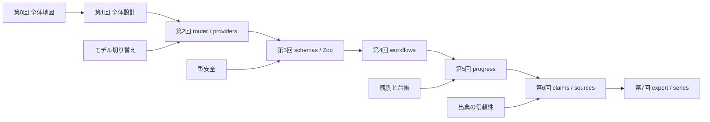

**使い方ではなく設計を読む ― 壊れにくいLLM記事生成パイプラインの全体地図**

この第0回は、`@rex0220/llm-task-router` の使い方解説ではありません。GitHub で公開されている OSS を題材に、LLM を使った記事生成パイプラインの設計を読むための入口です。対象は、単発の文章生成ではなく、生成・評価・改稿・裏取り・公開をまたぐ運用です。シリーズ自体も、この CLI で生成・検証・公開される対象です。ここで扱うのは説明用の抽象論ではなく、実際にこの連載を運ぶための実装でもあります。つまり、このシリーズは、解説対象であるパイプライン自身を使って作られた記事群です。

重要なのは、これを一発のプロンプトに寄せず、工程を分けて「止まれる・戻れる・追える」形にしていることです。どこで失敗したかを切り分け、必要な工程だけを再実行し、判断の履歴を後から追えるようにする。たとえば、改稿を無制限に回して収束せず、LLM が存在しない URL を出典に書く、といった失敗は現実に起きます。この回では、その失敗をどう避けるかの地図を先にそろえます。

## このシリーズで扱う問題 ― 7つの問い

1. 失敗したとき、どこから再実行するのか（第1回）
2. OpenAI / Anthropic など複数モデルをどう切り替えるのか（第2回）
3. LLM の出力をどう型安全に受け取るのか（第3回）
4. 自動改稿ループをどこで止めるのか（第4回）
5. 工程の進捗やコストをどう記録するのか（第5回）
6. LLM に嘘の出典を書かせないにはどうするのか（第6回）
7. 公開・更新・シリーズ管理をどう壊れにくくするのか（第7回）

## 各回の概要

| 回 | テーマ | 読むポイント |
| --- | --- | --- |
| [第1回](https://qiita.com/rex0220/items/434341bda70a9b0ed1ea) | 全体設計 | 工程分割、ファイルベース台帳、`first-write-wins` をどう置くか |
| [第2回](https://qiita.com/rex0220/items/d3113e70af8fd43214f7) | router / providers | 複数 LLM の切り替え、フォールバック、エラー正規化をどう設計するか |
| [第3回](https://qiita.com/rex0220/items/083d1b7c486de3c192c8) | schemas / Zod | LLM の自由出力をどこでスキーマ検証し、型安全に受け取るか |
| [第4回](https://qiita.com/rex0220/items/c98696ef59cd9c3558bf) | workflows | `create` / `evaluate` / `revise` / `refine` と、止まれる自動改稿をどう組むか |
| [第5回](https://qiita.com/rex0220/items/616625739f8e517ec8c8) | progress | `progress.events.jsonl` による工程観測と、イベントソーシング的な見方 |
| [第6回](https://qiita.com/rex0220/items/60114b19f74a511c028f) | claims / sources | 嘘の出典を防ぐために、主張と出典をどう台帳化するか |
| [第7回](https://qiita.com/rex0220/items/d87051b551b1ccfcc1fe) | export / series | 公開、版管理、更新、シリーズ管理をどう壊れにくくするか |

## 読む順番

基本は、第1回から第7回まで順に読むのが最短です。土台になるのは第1回で、以降の回はその責務境界の上に積み上がります。一方で、関心が明確なら途中から入っても構いません。

上段が基本ルート、下段が関心別の入口です。各回は単体でも読めますが、順に追うと、個別の工夫ではなく同じ失敗モードに対する一貫した設計判断として見えます。

## 先にそろえる最小用語

- **工程**: 生成、評価、改稿、裏取り、公開判定のような再実行と停止の単位です。
- **台帳**: 工程の事実と判断根拠を再利用可能な形で残す記録です。
- **`first-write-wins`**: 最初に確定した書き込みを正として扱い、安易な上書きを避ける方針です。

:::note info
本シリーズでいう台帳の代表例が `progress.events.jsonl` です。単なるログではなく、後から追跡・比較・再開に使うための記録として扱います。
:::

## 7回を貫く4つの考え方

問いと各回の対応は上で示しました。ここでは、それらを貫く設計原則として再整理します。

### 1. 工程を分ける

生成・評価・修正・裏取り・公開を分離し、失敗時にどこで止めるか、どこからやり直すかを明確にします。詳細な責務分担は第1回と第4回で扱います。

### 2. 台帳に残す

途中成果物や判断をファイルとして残し、後から経路を追えるようにします。観測可能性と再実行の前提は第5回で掘り下げます。

### 3. LLM に決めさせすぎない

本文生成と、ID・出典・公開判定のような厳密さが必要な領域を分離します。自由記述に任せない境界の置き方は第3回、第6回、第7回の主題です。

### 4. 自動化しても止まれるようにする

自動改稿やフォールバックは使いますが、無制限には回しません。停止条件と公開前ゲートを明示し、制御可能な自動化に寄せます。これは第4回と第7回で詳しく扱います。

## 記事運びと制約

このシリーズは、使い方ではなく設計を読む構成です。OpenAI と Anthropic は対等に扱い、どちらか専用の道具としては説明しません。URL を本文に手書きせず、相互参照は「第N回」でそろえます。なお、この回は内容上は第0回ですが、シリーズは後から先頭に記事を差し込んでも順序管理が壊れにくい設計であり、詳細は第7回で扱います。この第0回は後から追加した入口記事です。読む順番は本文で案内する「第0回 → 第1回 → … → 第7回」を基準にしてください。

## おわりに

第0回の役割は地図を渡すことです。次の第1回から、工程分割、ファイルベース台帳、`first-write-wins` という土台に入ります。まずは第1回から読むと、このシリーズ全体の設計判断が最もつながって見えるはずです。

## 参考

<!-- sources:begin -->
- [S001] rex0220/llm-task-router — GitHub repository（primary, retrieved: 2026-06-27）
  https://github.com/rex0220/llm-task-router
- [S009] package.json — @rex0220/llm-task-router（primary, retrieved: 2026-06-27）
  https://github.com/rex0220/llm-task-router/blob/2b8656e94beab67014d986febb8a8dacda485163/package.json
- [S010] src/providers/OpenAIProvider.ts（primary, retrieved: 2026-06-27）
  https://github.com/rex0220/llm-task-router/blob/2b8656e94beab67014d986febb8a8dacda485163/src/providers/OpenAIProvider.ts
- [S011] src/providers/AnthropicProvider.ts（primary, retrieved: 2026-06-27）
  https://github.com/rex0220/llm-task-router/blob/2b8656e94beab67014d986febb8a8dacda485163/src/providers/AnthropicProvider.ts
- [S012] src/schemas/ClaimsSchema.ts（primary, retrieved: 2026-06-27）
  https://github.com/rex0220/llm-task-router/blob/2b8656e94beab67014d986febb8a8dacda485163/src/schemas/ClaimsSchema.ts
- [S013] src/workflows/createQiitaArticle.ts（primary, retrieved: 2026-06-27）
  https://github.com/rex0220/llm-task-router/blob/2b8656e94beab67014d986febb8a8dacda485163/src/workflows/createQiitaArticle.ts
- [S014] src/progress/RunProgress.ts（primary, retrieved: 2026-06-27）
  https://github.com/rex0220/llm-task-router/blob/2b8656e94beab67014d986febb8a8dacda485163/src/progress/RunProgress.ts
<!-- sources:end -->
