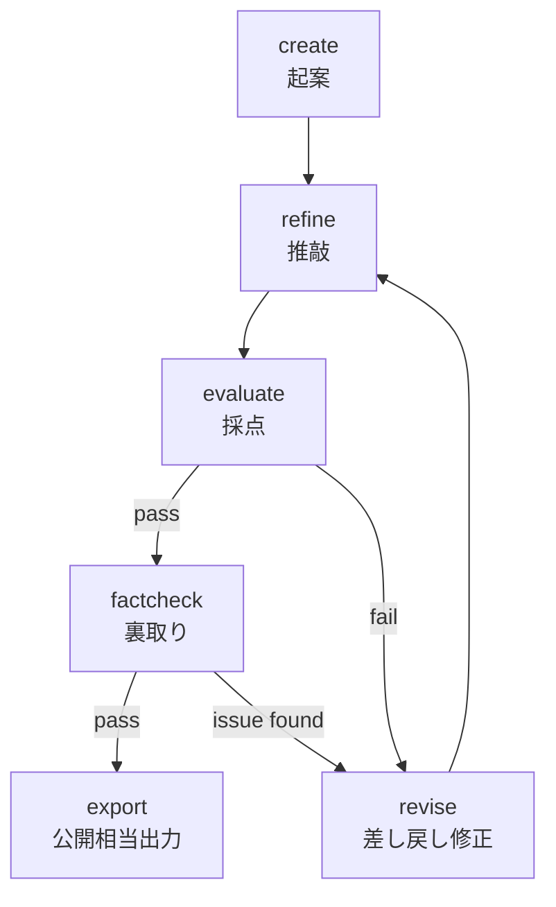
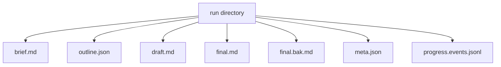
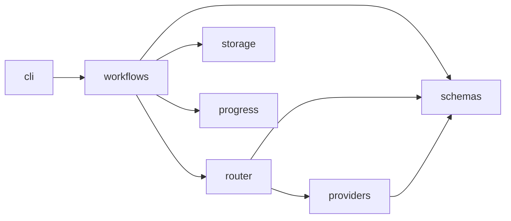

**ファイルベース台帳 × CLI工程分割で「壊れにくい」生成パイプラインを作る**

## 対象読者

この記事は `llm-task-router` の「使い方（セットアップ・コマンドの叩き方）」ではなく、その**内部設計**を読むシリーズです。使い方の説明は本シリーズの対象外とし、ここでは設計判断と責務分離に焦点を当てます。

- LLM を使った CLI / ツールを設計したい人
- 生成AIパイプラインの状態管理・再実行・監査に関心がある人
- TypeScript / Node.js で LLM アプリを作っている、または作ろうとしている人
- `llm-task-router` のソース構成そのものを読みたい人

LLMで記事や文書を生成するとき、最初は「1回のプロンプトでそれっぽい出力を得る」ところから始まりがちです。ですが、実運用に乗せると、すぐに別の問題が立ち上がります。

- 品質をどこで担保するのか
- 失敗したらどこから再実行するのか
- なぜその出力になったのかをどう追うのか
- 人間の判断とモデルの判断をどう分離するのか

本シリーズでは、`@rex0220/llm-task-router` のソースを題材に、LLMを「たまたま動くスクリプト」ではなく、**壊れにくく監査しやすい生成パイプライン**として設計する考え方を追います。第1回の本稿では、個別実装の深掘りには入らず、まず設計思想と全体地図に絞ります。

## 導入：この記事はこのツール自身で生成されている

題材の `llm-task-router` は、記事生成を複数工程に分割し、OpenAI / Anthropic など複数プロバイダをまたぎながら進める**ファイルベースのCLI**です。記事生成は、たとえば `create → refine → evaluate → revise → factcheck → export` のような段階を踏みます。

- `create`: 起案
- `refine`: 推敲
- `evaluate`: judgeモデルによる評価
- `revise`: 差し戻し修正
- `factcheck`: 裏取り
- `export`: 公開向け整形

`@rex0220/llm-task-router` は GitHub で公開されている OSS で、実体は [https://github.com/rex0220/llm-task-router](https://github.com/rex0220/llm-task-router) にあります。OpenAI / Anthropic にまたがって `brief → outline → draft → review → final` を回すファイルベース CLI であり、本シリーズはそのソースを読み解く解説です。

重要なのは、本シリーズの記事自体がこのパイプライン上で生成されていることです。つまり本稿も、単なる説明文ではなく、実際にこのツールの工程を通って出てきた成果物です。設計の良し悪しが、そのまま記事品質・再現性・監査可能性に効きます。

この主張をレトリックで終わらせないために、run台帳に残るイベントのイメージを先に示します。実際の値やイベント名は実装差分で変わりえますが、少なくとも設計としては次のような記録が残る前提です。

```json
{"ts":"2026-06-26T10:12:03.000Z","stage":"create","kind":"started","runId":"series-01"}
{"ts":"2026-06-26T10:12:41.000Z","stage":"create","kind":"completed","artifact":"draft.md"}
{"ts":"2026-06-26T10:15:09.000Z","stage":"evaluate","kind":"completed","score":4.2,"passed":false}
{"ts":"2026-06-26T10:18:55.000Z","stage":"revise","kind":"completed","artifact":"draft.md"}
{"ts":"2026-06-26T10:21:17.000Z","stage":"evaluate","kind":"completed","score":4.7,"passed":true}
{"ts":"2026-06-26T10:25:02.000Z","stage":"factcheck","kind":"completed","issues":1}
```

ここで重要なのは、**どの工程で止まり、何を根拠に通し、どこで差し戻したかが台帳から追える**ことです。単発スクリプトなら「今回うまく出た」で終われますが、CLIとして何度も回す道具にするなら、状態管理と責務分離の設計が主役になります。

本稿では、その「なぜこの形なのか」を先に押さえます。コードは要点の抜粋に留めますが、どこで何を守っているかは見えるようにします。

## なぜ「1プロンプト」ではなく「工程分割」なのか

結論から言うと、**生成品質を運用可能な形で扱うには、工程分割が必要**です。

単発の大きなプロンプトでも、たまたま良い文章が出ることはあります。ですが、次の3点を満たそうとした瞬間に限界が見えます。

- 途中から再開できること
- 工程ごとに品質判定できること
- 人間とLLMの責務を切り分けられること

ここでは、生成を次のような工程連鎖として考えます。

| 工程 | 役割 |
| --- | --- |
| `create` | 素材や指示から初稿を起こす工程です。 |
| `refine` | 構成・文体・論理を整え、初稿を推敲する工程です。 |
| `evaluate` | judgeモデルで採点し、品質基準を満たすか判定する工程です。 |
| `revise` | 評価結果や人間の指示に基づいて差し戻し修正する工程です。 |
| `factcheck` | 事実主張やAPI名、仕様記述などを裏取りする工程です。 |
| `export` | 公開向けに整形し、最終成果物として出力する工程です。 |

工程の流れは、概念的には次のようになります。



`evaluate` で fail した場合も、`factcheck` で issue found になった場合も、戻り先は一意に `revise → refine` です。つまり `revise` を経た後は必ず `refine` から再通過し、`refine → evaluate → factcheck` の品質ゲートを迂回できません。

この分割の狙いは明確です。

### 1. 途中から再実行できる

たとえば `factcheck` で止まったなら、`create` から全部やり直す必要はありません。`revise` で修正してから `factcheck` を再実行できるほうが、時間・コスト・監査性のバランスが良いです。

### 2. 工程境界で品質ゲートを置ける

`evaluate` や `factcheck` は、単なる後処理ではなく**停止可能な品質ゲート**です。ここで止められるから、「見た目はそれっぽいが公開には危ない」状態を外部に出力しにくくなります。

### 3. 人間とLLMの責務を分離できる

どこまでをモデル判断に任せ、どこで人間がレビューするかを工程境界で切れます。単発プロンプトだと、構成決定・執筆・自己評価・修正が一塊になり、何が誰の判断だったか追いづらくなります。

一方で、工程分割には当然コストがあります。工程ごとにLLM呼び出しが増えるため、総コストと総レイテンシは単発生成より増える方向に働きます。どこまで細かく分けるかは、品質ゲートで得る運用上の利得と、その追加コストが見合う範囲を探る設計判断です。

また、工程を増やすほどオーケストレーションと状態管理も複雑になります。だからこそ、次節で扱う**台帳設計**が必要になります。

## ファイルベース台帳：状態をrunディレクトリに集約する

このCLIの中心的な設計判断のひとつが、**1記事 = 1 run** として状態を `run` ディレクトリ配下に集約することです。ここでいう *run* は、1回の生成対象に対応する単位です。記事1本、あるいはそれに準ずる生成ジョブ1件と考えるとよいです。

責務の中核には、たとえば次のような層があります。

- `src/storage/RunStore.ts`
- `src/storage/meta.ts`

この設計では、`brief`、`outline`、`draft`、`final`、`meta`、`progress` のような状態を、DBではなくファイル群としてrun配下に保存します。

概念的な構造は次のようになります。



どれが成果物で、どれが台帳かを分けて読むのがポイントです。

| ファイル | 役割 |
| --- | --- |
| `brief.md` | 入力要件や題材の整理です。 |
| `outline.json` | 構成案や見出し計画です。 |
| `draft.md` | 生成途中の本文案です。 |
| `final.md` | 現在の最終成果物です。 |
| `final.bak.md` | 最終成果物の退避です。 |
| `meta.json` | run単位の前提条件や設定値です。 |
| `progress.events.jsonl` | 進捗・判断・工程イベントの台帳です。 |

この方式を採る理由は、主に4つあります。

### 可搬性

DBセットアップなしでrunごと持ち運べます。ローカルでもCIでも扱いやすく、成果物と履歴をひとまとめにできます。

### 透明性

ファイルを開けば中身がそのまま読めます。ブラックボックス化しにくく、問題発生時に人間が目視で追えます。

### 壊れても復旧しやすい

DB破損より、テキストファイルの一部崩れのほうが復旧しやすい場面は多いです。少なくとも「何が入っていたか」が人間に見えます。

### 依存が軽い

個人または少人数の運用では、外部DBや複雑な永続化基盤を導入するコストが重いことがあります。ファイルベースなら、その重さを避けられます。

もちろん代償もあります。

- 横断検索や集計クエリは弱い
- 多数runを高頻度に並列更新する用途には向かない
- 排他制御やスケール戦略はDBより素朴になりやすい

ここで前提を明示しておきます。本設計は、**同一runに対する同時並行更新を基本的に想定しない**、単一プロセスまたは逐次実行寄りの運用に最適化しています。複数ワーカーが同一runへ高頻度に追記する設計ではありません。この前提を置くことで、ファイルベースでも監査性と復旧性を優先できます。

つまりこれは「一般に最強」ではなく、**少人数の記事生成パイプラインに最適化した判断**です。本シリーズでは、この種の判断を「どこに最適化しているか」まで含めて見ていきます。

また、運用原則として重要なのが、`final.md` を直接編集して正本を増やさないことです。修正は `revise` を経由して台帳へ戻し、必要なら `final.bak.md` を残す。こうすると「今どの工程の出力が正なのか」が曖昧になりません。

要するに、設計の芯は**正本を一箇所に寄せる**ことです。LLMパイプラインで壊れやすいのは、しばしばモデルそのものよりも、どのファイルが最新なのか分からなくなる状態です。

### 壊れにくさをどこで守るか

第1回なので全文は追いませんが、`storage` 層が最低限守るべき性質は明確です。ここだけ少し具体に寄るのは、全体地図の段階でも「正本をどこで守るか」が設計の芯に直結するためです。永続化保証の厳密な詰めは、storage を深掘りする回で改めて扱います。

- `pathOf(name)` を通して、run配下へのパス解決を一元化する
- `rename` による置き換えで、正本の中途半端な上書きを避ける
- 置き換え前の正本を退避できる
- 追記系の台帳は後から読める形で残す

その骨格は、たとえば次のように表せます。

```ts
// src/storage/RunStore.ts
import { promises as fs } from "node:fs";
import { dirname, join, parse } from "node:path";

export class RunStore {
  constructor(private readonly runDir: string) {}

  pathOf(name: string): string {
    return join(this.runDir, name);
  }

  async readText(name: string): Promise<string | null> {
    try {
      return await fs.readFile(this.pathOf(name), "utf8");
    } catch (error: unknown) {
      const e = error as NodeJS.ErrnoException;
      if (e.code === "ENOENT") return null;
      throw error;
    }
  }

  private backupNameOf(name: string): string {
    const p = parse(name);
    return join(p.dir, `${p.name}.bak${p.ext}`);
  }

  async writeTextAtomic(name: string, content: string): Promise<void> {
    const target = this.pathOf(name);
    const tmp = `${target}.tmp`;
    await fs.mkdir(dirname(target), { recursive: true });

    let handle: Awaited<ReturnType<typeof fs.open>> | null = null;
    try {
      handle = await fs.open(tmp, "w");
      await handle.writeFile(content, "utf8");
      await handle.sync();
      await handle.close();
      handle = null;

      await fs.rename(tmp, target);

      // 厳密なクラッシュ耐性が必要なら、
      // rename 後に親ディレクトリの fsync も検討対象です。
    } finally {
      if (handle) {
        await handle.close().catch(() => undefined);
      }
      await fs.rm(tmp, { force: true }).catch(() => undefined);
    }
  }

  async backupThenReplace(
    name: string,
    nextContent: string,
    backupName = this.backupNameOf(name)
  ): Promise<void> {
    const current = await this.readText(name);
    if (current !== null) {
      await this.writeTextAtomic(backupName, current);
    }
    await this.writeTextAtomic(name, nextContent);
  }

  async appendJsonl(name: string, event: unknown): Promise<void> {
    const line = `${JSON.stringify(event)}\n`;
    await fs.appendFile(this.pathOf(name), line, "utf8");
  }
}
```

この抜粋で見せたいのは実装の細部ではなく、**どこで何を守るか**です。

- `pathOf`: run配下への相対名を実パスへ変換する
- `writeTextAtomic`: 一時ファイルへ書いて同期し、その後 `rename` で正本を置き換える
- `backupThenReplace`: 正本更新前に退避を取る
- `appendJsonl`: 台帳を追記専用で積む

ここで1点、パス解決の責務は意識して読んだほうがよいです。`backupNameOf(name)` は `parse(name)` を使って退避名を組み立てていますが、返しているのは**絶対パスではなく、最終的に `writeTextAtomic` の `pathOf` に渡される相対名**です。たとえば `name = "final.md"` なら `final.bak.md`、`name = "nested/final.md"` なら `nested/final.bak.md` になります。

つまり、この設計は「退避名を作る責務」と「run配下の実パスへ解決する責務」を分けています。`backupThenReplace` が `backupName` をそのまま `writeTextAtomic(...)` に渡していても、実際の配置先は `writeTextAtomic` 内部の `pathOf(name)` によって `runDir` 配下へ寄せられます。抜粋だけ見ると `backupNameOf` がそのままファイルシステム上のパスを返しているように見えやすいので、ここは誤読しやすいポイントです。

:::note info
`backupNameOf` が返す値は「run配下で使う相対ファイル名」です。`readText`、`appendJsonl`、`writeTextAtomic` はいずれも `pathOf(name)` を通す前提で揃えておくと、run外へ書く経路を作りにくくなります。
:::

また、ここでいう「Atomic」は少し慎重に読む必要があります。`rename` 自体は同一ファイルシステム内で原子的に扱えることが多い一方、クラッシュ耐性まで完全に保証するには永続化タイミングの扱いが重要です。本稿では「正本の中途半端な上書きを避ける」設計意図を押さえるに留め、より厳密な永続化保証の範囲は storage 回で掘り下げます。

:::note warn
`rename` を使った置き換えは有効ですが、それだけで完全なクラッシュ安全性を主張するのは強すぎます。厳密には、tmpファイルの `fsync`、必要に応じて親ディレクトリの `fsync`、失敗時の tmp クリーンアップまで含めて初めて、より強い永続化保証に近づきます。本稿では「正本の中途半端な上書きを避ける」ことを主眼としており、ファイルシステム障害や電源断まで含む厳密保証は別途検討事項です。
:::

`final.md` の更新に `backupThenReplace` を使えば、公開用ファイルの上書きで直前状態を失いにくくなります。`progress.events.jsonl` はスナップショットではなくイベント列として積むので、「今どうなっているか」だけでなく「どうなってきたか」も追えます。

:::note warn
`appendFile` だけで完全な並行更新耐性が得られるわけではありません。ここでは、同一runへの高頻度並列追記を前提にしない代わりに、実装と運用を単純化しています。並列ワーカー前提へ拡張するなら、ロックファイルや外部台帳への移行を別途検討すべきです。
:::

なお、退避ファイルの命名規則は本文中で `final.bak.md` に統一します。`final.md` に対して `.bak` を拡張子の前へ差し込む形です。ここはコード例と説明を揃えておかないと、復旧手順や運用規約が曖昧になります。

## first-write-wins：不変フィールドで「後から書き換え」を封じる

このCLIで特徴的なのが、run単位の前提条件に**first-write-wins**を採ることです。これは、最初に確定した値を正として保存し、後続工程からの上書きを基本的に認めない、という方針です。

対象になりうるのは、たとえば次のような値です。

- `--editor-model`
- `referencesHeading`

こうした値は、後から変えられると一見便利です。ですが、LLM駆動のパイプラインでは、その柔軟性がそのまま監査困難さになります。

たとえば `create` ではAモデルを使い、途中で `editor-model` がBに変わり、さらに参考章見出しのルールも後で変わったとします。すると、最終成果物が「なぜその形になったのか」を追うときに、runの前提条件が揺れてしまいます。

そこで、runの前提は最初に焼きます。以後の工程は、その前提の上で出力を積み上げます。

```ts
// src/storage/meta.ts
export type RunMeta = {
  editorModel?: string;
  referencesHeading?: string;
};

export function applyFirstWriteWins(
  meta: RunMeta,
  input: { editorModel?: string; referencesHeading?: string }
): { next: RunMeta; rejected: string[] } {
  const rejected: string[] = [];

  if (meta.editorModel && input.editorModel && meta.editorModel !== input.editorModel) {
    rejected.push("editorModel");
  }

  if (
    meta.referencesHeading &&
    input.referencesHeading &&
    meta.referencesHeading !== input.referencesHeading
  ) {
    rejected.push("referencesHeading");
  }

  return {
    next: {
      editorModel: meta.editorModel ?? input.editorModel,
      referencesHeading: meta.referencesHeading ?? input.referencesHeading,
    },
    rejected,
  };
}
```

この設計によって得られるものは、単なる「上書き防止」ではありません。

### 出自の一貫性

どの前提条件でこのrunが走り始めたのかを固定できます。

### 進捗と評価の整合性

評価結果やコスト記録を、揺れない前提に結びつけやすくなります。

### 事故耐性

後工程が意図せず前提を書き換えて、過去出力との関係が壊れる事故を防ぎやすくなります。

また、上書き要求が来た事実そのものを無視しないことも重要です。監査性を重視するなら、拒否した項目を `progress.events.jsonl` にイベントとして残せる設計のほうが一貫しています。

```ts
// src/workflows/initMeta.ts
const { next, rejected } = applyFirstWriteWins(meta, input);
await saveMeta(store, next);

if (rejected.length > 0) {
  await store.appendJsonl("progress.events.jsonl", {
    stage: "init",
    kind: "meta-overwrite-rejected",
    rejected,
  });
}
```

この発想は、イベントソーシングや追記専用ログに近いものです。後から「状態を好きに書き換える」より、**確定した前提の上に履歴を積む**ほうが、LLMパイプラインでは扱いやすい場面が多いです。これは後に出てくる `progress.events.jsonl` を正本として扱う考え方にもつながります。

ただし、完全な不変化が常に正しいわけではありません。何を固定し、何を可変にするかは設計判断です。固定しすぎれば運用が窮屈になりますし、可変にしすぎれば監査性が崩れます。本シリーズでは、以降の回でその線引きを具体コードとともに見ていきます。

## 層の地図：責務境界と依存関係

全体像を読むうえで重要なのは、「どこに何の責務を置いているか」です。このCLIは、概ね次の層に分かれていると読むと把握しやすくなります。

| 層 | 役割 |
| --- | --- |
| `cli` | コマンド定義、引数解釈、入出力の配線です。 |
| `workflows` | 各工程をどう組み立てるかを定義する層です。 |
| `router` | モデル選定やフォールバック戦略を担う層です。 |
| `providers` | OpenAI / Anthropic などの差異を吸収する層です。 |
| `schemas` | 構造化出力のスキーマ検証を担う層です。 |
| `storage` | runディレクトリへの永続化を担う層です。 |
| `progress` | 進捗台帳、イベント記録を担う層です。 |

依存関係の主線は次のように捉えると整理しやすいです。



重要なのは、`cli → workflows → router → providers` が主線であり、`storage` / `progress` / `schemas` が横断的に支えることです。

- `cli` は配線に徹する
- `workflows` は工程ロジックを持つ
- `router` はどのモデル・どの戦略で回すかを決める
- `providers` は各ベンダーAPIの違いを吸収する
- `schemas` は構造化出力の壊れやすさを抑える
- `storage` は状態を永続化する
- `progress` は何が起きたかを記録する

この分離の利点は、変更影響範囲を局所化できることです。たとえばプロバイダ差異への対応を直したいなら `providers` / `router` に閉じ込めやすく、保存形式を見直したいなら `storage` に寄せやすい。工程ロジックまで巻き込まなくて済む設計にしています。

依存ルールも明示しておきます。基本方針は、**上位層から下位層への一方向依存のみを許可し、下位層から上位層を参照しない**ことです。`schemas` のような共有モジュールは複数層から参照されますが、ワークフローやCLIの都合を内側へ持ち込まないようにします。これにより、循環依存と責務漏れを抑えやすくなります。

CLIの配線盤にあたるのは、たとえば `src/index.ts` のようなエントリです。実装全体をここで見せる必要はなく、骨格としては次のイメージで十分です。

```ts
// src/index.ts
import { Command } from "commander";

const program = new Command();

program
  .command("create")
  .description("create draft")
  .action(async () => {
    // workflows.create(...) を呼ぶ
  });

program
  .command("refine")
  .description("refine draft")
  .action(async () => {
    // workflows.refine(...) を呼ぶ
  });

program
  .command("evaluate")
  .description("evaluate quality")
  .action(async () => {
    // workflows.evaluate(...) を呼ぶ
  });

program.parse();
```

ここでCLI自体に業務ロジックを詰め込まないのが重要です。`Commander` はあくまで配線盤であり、実際の工程責務は `workflows` 以下に落とす。そうすると、CLI引数の変更と工程ロジックの変更を分離しやすくなります。

## シリーズの見取り図：第2回以降でどこを掘るか

本稿は全体地図の回なので、個々の層の詳細には踏み込みません。代わりに、以降どこを掘るのかを先に示しておきます。

### 第2回：`router` + `providers`

OpenAI / Anthropic など、ベンダー差異をどう吸収するかを扱います。モデル選定、フォールバック、失敗時の切り替え戦略が主題です。

### 第3回：`schemas`

Zod などを用いた構造化出力を扱います。なぜスキーマ検証が「壊れにくさ」に効くのかを、単なる型安全ではなく運用設計として見ます。

### 第4回：生成工程そのもの

`create / refine / evaluate / revise` を追います。文章生成をどう工程として分解し、どこに品質判断を置くのかを具体的に見ます。`evaluate` の score がどのスケールで、どのしきい値で pass / fail を分け、評価軸をどう持つかもこの回で扱います。

### 第5回：`progress` 台帳

`progress.events.jsonl` を中心に、追記専用ログとしての設計を見ます。状態のスナップショットではなく、イベント列として何を残すべきかが焦点です。

### 第6回：`factcheck` と参考章

裏取り工程と、参考章まわりの設計を扱います。「本文生成」と「根拠管理」をどう結合し、どう分離するかを掘ります。

### 第7回：`export` とシリーズ管理

最終公開向けの整形、シリーズ記事としての連携、出力責務の切り出しを扱います。

この順序にしているのは、実装を下から順に読むためではありません。**壊れにくさに効いている設計ポイントから先に追う**ためです。まずモデル差異吸収、その次に構造化出力、そして工程ロジック、台帳、裏取り、公開整形という流れで見たほうが、設計意図がつながって理解しやすくなります。

## まとめ：壊れない生成パイプラインを支える3本柱

本稿の結論はシンプルです。LLMを実運用の生成パイプラインとして扱うなら、次の3本柱が効きます。

### 1. 工程分割

工程分割は、再実行性と品質ゲートをもたらします。単発生成では扱いにくい停止・再開・差し戻しを可能にします。

### 2. ファイルベース台帳

ファイルベース台帳は、可搬性と透明性を優先します。少人数運用に向いた、監査しやすい状態管理を実現します。

### 3. first-write-wins

first-write-wins は、runの前提条件を不変に保ちます。後工程による前提の書き換えを防ぎ、一貫した履歴を残しやすくします。

この3つを組み合わせることで、LLMを**たまたま動くスクリプト**ではなく、**壊れにくい生成パイプライン**として扱えます。これが第1回の結論です。

ただし、「壊れない」を強く言い切るなら、保存処理の保証範囲は用語どおりに詰める必要があります。特に `storage` 層では、renameによる置き換え、永続化、退避ファイル命名、失敗時クリーンアップ、そして `pathOf` を通じたパス解決責務の一貫性まで含めて、設計意図と実装を一致させることが重要です。こうした永続化詳細は全体地図の本稿では深入りせず、以降の storage 回で保証範囲とトレードオフを整理します。

次回からは個別層の実装に入ります。まずは `router` と `providers` を題材に、ベンダー差異の吸収とフォールバック戦略を具体コードとともに追います。

## 参考

<!-- sources:begin -->
- [S001] rex0220/llm-task-router (GitHub リポジトリ)（primary, retrieved: 2026-06-26）
  https://github.com/rex0220/llm-task-router
- [S004] Node.js File System (fs) ドキュメント（primary, retrieved: 2026-06-26）
  https://nodejs.org/api/fs.html
- [S005] Commander.js (tj/commander.js)（primary, retrieved: 2026-06-26）
  https://github.com/tj/commander.js
- [S006] Zod (TypeScript-first schema validation)（primary, retrieved: 2026-06-26）
  https://github.com/colinhacks/zod
- [S009] src/providers/ (OpenAIProvider.ts / AnthropicProvider.ts / ModelProvider.ts)（primary, retrieved: 2026-06-26）
  https://github.com/rex0220/llm-task-router/tree/2b8656e94beab67014d986febb8a8dacda485163/src/providers
- [S010] src/ 層構成（cli/workflows/router/providers/schemas/storage/progress）（primary, retrieved: 2026-06-26）
  https://github.com/rex0220/llm-task-router/tree/2b8656e94beab67014d986febb8a8dacda485163/src
<!-- sources:end -->
