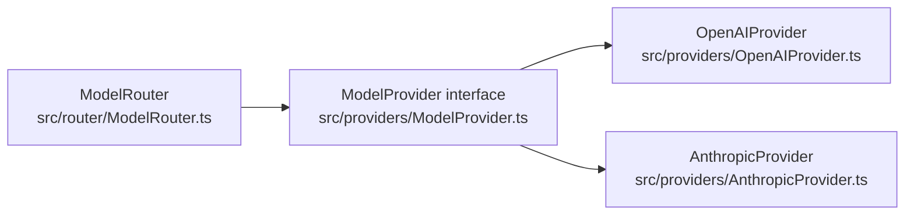
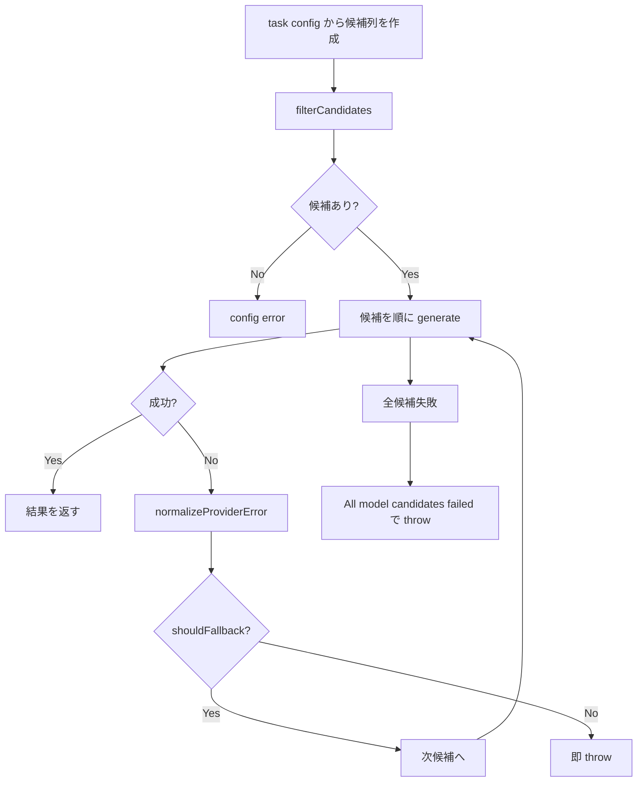
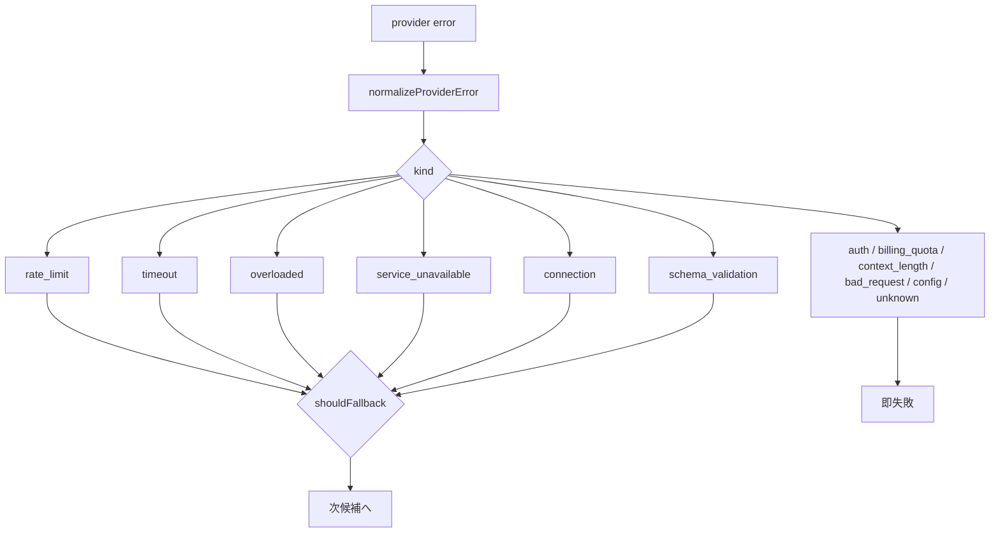

**薄い provider 抽象 × 候補列フォールバック × エラー正規化で「壊れにくい」モデル切り替えを作る**

## 対象読者

この記事は `llm-task-router` の使い方ではなく、内部設計をソースから読むシリーズの第2回です。第1回で扱った設計思想と全体像のうち、ここでは `router` / `providers` をズームインします。第2回単体でも読める構成にしています。

第1回での前提を短く再掲すると、このツールは**複数工程の記事生成を OpenAI / Anthropic にまたいで回すファイルベース CLI**です。その中で `router` / `providers` は、各工程が「どのモデル候補をどう試し、provider 差をどこで吸収するか」を担う層に当たります。

想定しているのは、次のような読者です。

- 複数 provider を 1 つの抽象で扱いたい人
- フォールバックとエラー分類の責務境界を設計したい人
- TypeScript で LLM クライアントや実行基盤を書いている人
- `llm-task-router` の `router` / `providers` の実ソースを読みたい人

使い方の説明は対象外です。本文中では外部リンクに依存しません（読める範囲で自己完結させます）。参照は末尾の参考章にまとめて置きます。

## この層が解く問題

複数の LLM provider を併用する構成で難しいのは、「OpenAI と Anthropic を両方呼べること」自体ではありません。難しいのは、失敗したときにどこで何を判断するかです。

呼び出し側に provider ごとの条件分岐を持ち込むと、すぐに次のようなコードになります。

- OpenAI ならこの SDK メソッドを呼ぶ
- Anthropic ならこのパラメータ名に変換する
- 429 なら別候補へ進める
- 400 なら即失敗にする
- 打ち切り判定や usage の取り方は provider ごとに変える

この分岐が task ごとに散ると、モデル差し替えや障害対応のたびにアプリケーション全体へ修正が波及します。つまり問題の本質は、**モデル呼び出しの都合が上位層へ漏れること**です。

`llm-task-router` のソースは、この問題をかなり明確に分割しています。

1. provider 抽象は `generate()` 1 メソッドに絞る
2. provider 実装の中で API 差とレスポンス差を吸収する
3. router 側で候補列フォールバックとエラー政策を一元化する
4. モデル選択は YAML 設定から与える

先に結論を書くと、壊れにくさの核は「多機能な抽象」ではなく、**薄い provider 抽象 + router 側の保守的な失敗判断**です。

## 全体の依存関係

まず、実ソース上の責務を図で押さえます。



`ModelRouter` は具象 provider に直接依存せず、`ModelProvider` インターフェースだけを見ます。provider ごとの差は `src/providers/*` の内側へ閉じ込める、という構造です。

## 薄い抽象としての `ModelProvider`

実ソースの共通インターフェースは `src/providers/ModelProvider.ts` にあります。ここはかなり短く、責務がはっきりしています。

```typescript
// src/providers/ModelProvider.ts
export type ProviderRequest = {
  model: string;
  system?: string;
  input: string;
  temperature?: number;
  maxTokens?: number;
  timeoutMs?: number;
  abortSignal?: AbortSignal;
  responseFormat?: {
    type: "text" | "json_schema";
    schemaName?: string;
    jsonSchema?: unknown;
  };
};

export type ProviderResponse = {
  text: string;
  usage?: {
    inputTokens?: number;
    outputTokens?: number;
  };
  truncated?: boolean;
};

export interface ModelProvider {
  generate(request: ProviderRequest): Promise<ProviderResponse>;
}
```

`ProviderResponse.usage` は実ソースでは `src/router/types.ts` の `ModelUsage` に対応しており、少なくともここで示す共通型には `totalTokens` はありません。

重要なのは次の点です。

- 入力は `prompt` ではなく `input`
- `system` は別フィールド
- `responseFormat.type` は `"text" | "json_schema"`
- 返り値は `text` / `usage?` / `truncated?`
- インターフェースは `generate()` 1 メソッドだけ

この薄さは意図的です。messages 配列、tool use、streaming、provider 固有オプションまで共通化していません。なぜなら、このシリーズの対象である router は「複数 provider を切り替えながらテキスト生成を行う基盤」であって、万能チャット抽象ではないからです。

採らなかった代替案は、会話履歴や provider 固有機能まで最初から共通インターフェースへ押し込む設計です。その方向は一見柔軟ですが、実際には条件分岐を抽象の内側へ持ち込むだけになりやすいです。本ソースは逆に、**共通に扱える最小公倍数だけを interface に残す**方針を取っています。

## provider 実装で API 差を吸収する

この薄い抽象を成立させるには、OpenAI と Anthropic の API 差を provider 実装側で吸収する必要があります。実ソースの要点は次の 2 ファイルです。

- `src/providers/OpenAIProvider.ts`
- `src/providers/AnthropicProvider.ts`

ここで router が知る必要があるのは最終的な `ProviderResponse` だけです。SDK の戻り値構造やパラメータ名の差を router へ漏らさない、というのがこの層の責務です。

## `OpenAIProvider` の実装要点

OpenAI 側は `client.responses.create(...)` を呼びます。ここで `ProviderRequest` の各項目を OpenAI 向けに変換します。

- `input` → `input`
- `system` → `instructions`
- `maxTokens` → `max_output_tokens`

抜粋すると、設計上の焦点は次のような形です。

```typescript
// src/providers/OpenAIProvider.ts
function supportsOpenAITemperature(model: string): boolean {
  const lower = model.toLowerCase();
  if (lower.startsWith("o")) return false;
  if (lower.startsWith("gpt-5")) return false;
  if (lower.includes("reasoning")) return false;
  return true;
}

export class OpenAIProvider implements ModelProvider {
  async generate(request: ProviderRequest): Promise<ProviderResponse> {
    const body: Record<string, unknown> = {
      model: request.model,
      input: request.input,
    };

    if (request.system) body.instructions = request.system;
    if (request.maxTokens) {
      body.max_output_tokens = request.maxTokens;
    }
    if (request.responseFormat?.type === "json_schema") {
      body.text = { format: { type: "json_object" } };
    }
    if (
      request.temperature !== undefined &&
      supportsOpenAITemperature(request.model)
    ) {
      body.temperature = request.temperature;
    }

    const response = await this.client.responses.create(body, {
      signal: request.abortSignal,
    });

    const truncated =
      response.status === "incomplete" &&
      response.incomplete_details?.reason === "max_output_tokens";

    const text =
      response.output_text ??
      response.output
        ?.flatMap((item) => item.content ?? [])
        .filter((part) => part.type === "output_text")
        .map((part) => part.text ?? "")
        .join("\n") ??
      "";

    return {
      text,
      usage: {
        inputTokens: response.usage?.input_tokens,
        outputTokens: response.usage?.output_tokens,
      },
      truncated,
    };
  }
}
```

ここで最重要なのは temperature の扱いです。実ソースには `supportsOpenAITemperature(model)` というヒューリスティックがあり、モデル名を小文字化したうえで次に当てはまると `false` を返します。

- `o` で始まる
- `gpt-5` で始まる
- `reasoning` を含む

つまり、この実装ではそれらのモデル名に対して `temperature` を送らない、という判断をしています。

ただし、これは**このツールのコード上のヒューリスティック**です。モデル名の部分一致にもとづく実装上の選択であって、各 API 仕様の一般論として断定すべきではありません。ここで言えるのは「`llm-task-router` の OpenAI provider はこう判定している」ということまでです。

また、構造化出力の指定も実ソースに即して読む必要があります。`responseFormat.type === "json_schema"` のときでも、この実装が OpenAI に渡しているのは `body.text = { format: { type: "json_object" } }` だけです。`name` や `schema` はここでは渡していません。OpenAI 公式にある Structured Outputs の `json_schema` 形式とは別の形であり、本実装の正本は `json_object` です。

また、打ち切り判定も実ソースに忠実です。OpenAI 側は

- `response.status === "incomplete"`
- かつ `response.incomplete_details?.reason === "max_output_tokens"`

のとき `truncated: true` に正規化します。

テキスト抽出も `output_text` を優先し、無ければ `output` 配列側を走査するフォールバックを持ちます。つまり provider 層は、OpenAI のレスポンス構造差を吸収したうえで、上位へは単なる `text` を返します。

## `AnthropicProvider` の実装要点

Anthropic 側は `client.messages.create(...)` を呼びます。こちらではパラメータ名が異なり、`max_tokens` を使います。既定値が 4000 である点も実装上の特徴です。

```typescript
// src/providers/AnthropicProvider.ts
function supportsTemperature(model: string): boolean {
  const lower = model.toLowerCase();
  if (lower.includes("opus")) return false;
  if (lower.includes("sonnet-4")) return false;
  if (lower.includes("haiku-4")) return false;
  if (lower.includes("fable")) return false;
  return true;
}

export class AnthropicProvider implements ModelProvider {
  async generate(request: ProviderRequest): Promise<ProviderResponse> {
    const body: Record<string, unknown> = {
      model: request.model,
      messages: [{ role: "user", content: request.input }],
      max_tokens: request.maxTokens ?? 4000,
    };

    if (request.system) body.system = request.system;
    if (
      request.temperature !== undefined &&
      supportsTemperature(request.model)
    ) {
      body.temperature = request.temperature;
    }

    const response = await this.client.messages.create(body, {
      signal: request.abortSignal,
    });

    const text = response.content
      .map((block) => (typeof block.text === "string" ? block.text : ""))
      .filter(Boolean)
      .join("\n");

    return {
      text,
      usage: {
        inputTokens: response.usage?.input_tokens,
        outputTokens: response.usage?.output_tokens,
      },
      truncated: response.stop_reason === "max_tokens",
    };
  }
}
```

こちらにも temperature のヒューリスティックがあります。モデル名を小文字化し、次を含むと `false` です。

- `opus`
- `sonnet-4`
- `haiku-4`
- `fable`

これも同じく、Anthropic API の普遍的事実を本文で断定するのではなく、**この実装ではこう扱っている**と読むべき箇所です。コードはモデル名の部分一致で `temperature` を送るかどうかを決めています。

打ち切り判定は `stop_reason === "max_tokens"` です。OpenAI 側とは判定条件が異なりますが、返り値としては同じ `truncated?: boolean` にそろいます。

また、テキスト抽出も「`block.type === "text"` のものだけ」ではなく、実装上は **`text` フィールドが文字列の block を拾って空を落とし、改行で連結する**形です。ここも provider ごとの戻り値差を上位へ漏らさないための吸収層になっています。

## provider 層の設計意図

この 2 実装を見ると、provider 層の責務はかなり明確です。

- SDK 呼び出しの差を吸収する
- パラメータ名の差を吸収する
- text 抽出を共通化する
- usage を `inputTokens` / `outputTokens` へ寄せる
- 打ち切りを `truncated` へ寄せる

その結果、上位の router は OpenAI と Anthropic の違いをほぼ知りません。知る必要があるのは `generate()` が `ProviderResponse` を返すことだけです。

これは「抽象を厚くしない代わりに provider 実装に寄せる」設計です。代償として provider 側には個別知識が必要ですが、その知識を 1 箇所に閉じ込められます。router に API 差を持ち込むより保守しやすい、という判断です。

## `ModelRouter` の候補列フォールバック

次に `src/router/ModelRouter.ts` を見ます。この層がやることは、想像より限定的です。

- task config から候補列を作る
- 除外条件を適用する
- 候補を順に試す
- 失敗を正規化する
- fallback 可否だけを判断する

流れを図にするとこうです。



この router に、自前 retry 層や複雑な backoff 制御はありません。実ソースにあるのは、**候補列を順に回す run()** です。

実装の骨格は次のように読めます。

```typescript
// src/router/ModelRouter.ts
import { normalizeProviderError, shouldFallback } from "./errors";
import { withAbortableTimeout } from "../utils/timeout";

export class ModelRouter {
  async run(request: RunRequest): Promise<ProviderResponse> {
    const task = this.tasks[request.task];
    const candidates = filterCandidates(
      [task.primary, ...(task.fallback ?? [])],
      request.excludeProviders,
      request.excludeCandidates,
    );

    if (candidates.length === 0) {
      throw new Error("No model candidates remain ...");
    }

    let lastError: RouterError | undefined;

    for (const candidate of candidates) {
      const provider = this.providers[candidate.provider];

      try {
        return await withAbortableTimeout(request.timeoutMs, (abortSignal) =>
          provider.generate({
            model: candidate.model,
            system: request.system,
            input: request.input,
            temperature: task.temperature,
            maxTokens: task.maxTokens,
            timeoutMs: request.timeoutMs,
            abortSignal,
            responseFormat: request.responseFormat,
          }),
        );
      } catch (error) {
        const normalized = normalizeProviderError(error);
        lastError = normalized;

        if (!shouldFallback(normalized.kind)) {
          throw normalized;
        }
      }
    }

    throw new Error(
      `All model candidates failed: ${lastError?.message ?? "unknown"}`,
    );
  }
}
```

ここでの設計判断は明快です。router は「どのエラーなら次候補へ進むか」だけを決めます。同一候補への再試行や複雑な待ち時間制御をこの層へ入れていません。そのぶん挙動が追いやすく、候補列の説明可能性が高いです。

### 候補列の作り方

候補列は task config から次の順で組まれます。

- `primary`
- `...(fallback ?? [])`

つまり primary が先頭、fallback 群が後続です。さらに `filterCandidates` が `excludeProviders` / `excludeCandidates` を適用します。ここで候補が空になったら、実ソースは早期に config エラーとして落とします。本文で重要なのは、**候補が無いまま unknown failure へ進まない**ことです。

## タイムアウトは `withAbortableTimeout`

timeout 周りも実ソースへ忠実に読む必要があります。router は `src/utils/timeout.ts` の `withAbortableTimeout(request.timeoutMs, (abortSignal) => ...)` を使います。

ここで重要なのは、**timeout が候補列全体の単一 deadline ではなく、各候補の `generate` 呼び出しごとに `timeoutMs` として適用される**ことです。実装上は候補ループの内側で `callProvider` 相当の呼び出しを `withAbortableTimeout(...)` で包んでいるため、1 候補目が timeout して fallback したあと、2 候補目にもあらためて同じ `timeoutMs` が効きます。

つまり設計上のポイントは次です。

- timeout は各候補の `generate` 呼び出しごとに効く
- provider には `abortSignal` を渡す
- 中断可能な形で generate を実行する
- 候補列全体を一括で締める単一 deadline ではない

ここでも、timeout は `withAbortableTimeout` に集約されており、独自の deadline ヘルパーは実ソースにはありません。

## エラー正規化は `src/router/errors.ts` に集約される

本シリーズの topic として外せないのが `src/router/errors.ts` です。実ソースの `RouterErrorKind` は 12 種です。

- `rate_limit`
- `timeout`
- `overloaded`
- `service_unavailable`
- `connection`
- `auth`
- `billing_quota`
- `context_length`
- `schema_validation`
- `bad_request`
- `config`
- `unknown`

この粒度は、障害分析用の完全分類というより、**router が fallback 可否を決めるための分類**です。

図にすると次のようになります。



この図は、**正規化後の kind から fallback 判定へ進むフロー骨格**だけを示したものです。12 種の個別写像と 6 種 / 6 種の fallback 可否は、直後の写像説明と表を参照してください。図の役割は「router が何を見て次候補へ進むか」を簡潔に示すことにあります。

読み方は単純です。正規化された kind のうち、ごく一部だけが fallback 対象です。残りはその場で止めます。この保守性が router の中核です。

## `normalizeProviderError(error)` の写像

`normalizeProviderError(error)` は、status code / code / type / name / message などを手がかりに種別を決めます。本文でもこの対応は実ソースどおりにしておくべきです。

おおまかには次の写像です。

- 401 / 403、または auth / permission 系 → `auth`
- insufficient_quota / billing / payment / credit 系 → `billing_quota`
- 429 / rate_limit 系 → `rate_limit`
- timeout / abort、`DOMException` の `AbortError` を含む → `timeout`
- 529 / overloaded 系 → `overloaded`
- 503 / 502 / 504 もしくは一般の 5xx → `service_unavailable`
- connection / network / `econnreset` など → `connection`
- 400 / invalid_request 系 → `bad_request`
- context_length / too_large / token 系 → `context_length`
- それ以外 → `unknown`

なお `RouterErrorKind` 12 種のうち `schema_validation` と `config` はこの provider エラー写像には現れません。`schema_validation` は出力検証層（`validateAndMaybeRepair`）から、`config` は設定読込・候補解決側から入る kind だからです。`normalizeProviderError` は provider 呼び出しで投げられた例外を写像する関数なので、この 2 つはここでは扱いません。

ここでの意図は「provider ごとの例外クラスを完全に理解する」ことではありません。router が使うのは最終的な `kind` だけなので、正規化層では **制御政策に必要な粒度**へ押しつぶします。

### `shouldFallback(kind)` は 6 種だけ true

特に重要なのが `shouldFallback(kind)` です。実ソースでは true になるのは次の 6 種だけです。

- `rate_limit`
- `timeout`
- `overloaded`
- `service_unavailable`
- `connection`
- `schema_validation`

それ以外は false です。

- `auth`
- `billing_quota`
- `context_length`
- `bad_request`
- `config`
- `unknown`

この線引きが「壊れにくさ」の核です。なぜなら、後者は別候補へ回しても改善しにくいからです。

- `auth`: 認証や権限の問題で、偶然別 provider で通っても設定不備を隠しやすい
- `billing_quota`: 課金・クォータ不足は一時的切替で解決しないことが多い
- `context_length`: 入力が大きすぎるならモデルを変えても同じ問題が起きやすい
- `bad_request`: リクエスト不正は再送や切替で直らない
- `config`: 設定ミスは運用側で直すべき
- `unknown`: 分類できない失敗を安易に流すと不具合を隠す

逆に true の 6 種は、一時的・局所的な障害として別候補へ逃がす合理性があります。`schema_validation` をここに含めるのは、構造化出力の遵守度がモデルや provider によって揺れうるためです。ある候補で期待した構造に乗らなくても、別モデルや別 provider なら妥当な JSON で返る可能性があるので、router はこれを「次候補で直りうる失敗」として扱います。

表にするとこうです。

| kind | 意味の要約 | fallback |
| --- | --- | --- |
| `rate_limit` | 一時的なレート制限 | 可 |
| `timeout` | タイムアウト・中断 | 可 |
| `overloaded` | 過負荷 | 可 |
| `service_unavailable` | 一時的なサービス不調 | 可 |
| `connection` | 接続・ネットワーク障害 | 可 |
| `schema_validation` | 構造化出力の検証失敗 | 可 |
| `auth` | 認証・権限エラー | 不可 |
| `billing_quota` | 課金・クォータ不足 | 不可 |
| `context_length` | コンテキスト長超過 | 不可 |
| `bad_request` | 不正リクエスト | 不可 |
| `config` | 設定不備 | 不可 |
| `unknown` | 未分類の失敗 | 不可 |

この設計は保守的です。しかし、router 層としてはこの保守性が重要です。原因が入力や設定にある失敗を「とりあえず他候補へ流す」と、問題が隠れて挙動説明が難しくなります。

## `safeMessage` による安全なログ化

`src/router/errors.ts` でもう 1 つ重要なのが `safeMessage` です。実ソースはエラーメッセージをそのままログや例外文言へ載せません。

- `sk-[A-Za-z0-9_-]+` を `[redacted]` に置換
- 先頭 300 字に切り詰める

`errorForLog` も `safeMessage` を通します。

これは小さな実装ですが、実運用ではかなり重要です。provider SDK が返した生メッセージをそのまま出すと、API キー断片や過度に長い入力がログへ漏れる可能性があります。router の責務は制御政策だけではなく、**失敗を安全に可視化すること**まで含んでいます。

## config 駆動のモデル選択

次に、候補列の元になる config を見ます。実体は

- `src/router/types.ts`
- `src/router/config.ts`

です。task ごとの `primary` / `fallback` / `temperature` / `max_tokens` / `timeout_ms` は `config/models.yaml` で宣言され、Zod で検証してから内部型へ変換されます。

ここで重要なのは、設定ファイルが snake_case で、内部では TypeScript の型として扱うことです。設定をそのまま無検証で流し込むのではなく、**YAML → Zod 検証 → 内部型**という段階を持っています。

設計上の効用は明快です。

- モデル構成の変更がコード修正ではなく設定変更で済む
- task ごとの primary / fallback を宣言的に見渡せる
- 入力設定の不備を起動時または読込時に落とせる

この点でも OpenAI と Anthropic は対等です。どちらか一方を中心にした「ついでの fallback」ではなく、config 上の候補として並列に扱われます。

## `createProviders` は「参照される provider だけ」を初期化する

provider 生成は `src/providers/index.ts` の `createProviders` が担います。ここも設計意図がはっきりしています。

- config が実際に参照する provider だけ生成する
- API キーが env にあるときだけ生成する
- 使わない provider の鍵を要求しない
- env 名は `resolveApiKeyEnv("openai" | "anthropic", config)` で解決する

これは地味ですが、運用上かなり効きます。たとえば OpenAI しか使わない task 構成なら、Anthropic の鍵をローカル開発や CI に要求しません。逆も同様です。

採らなかった代替案は、全 provider を無条件に初期化し、必要な鍵を全部必須にする方法です。そのほうが実装は単純ですが、設定変更や段階導入の自由度が落ちます。本ソースは、**config が参照するものだけを起動する**方を選んでいます。

## schema 検証も fallback の一種として扱う

第3回へつながる点として、`schema_validation` をここで軽く押さえておきます。

構造化出力の検証は `validateAndMaybeRepair` で行われ、失敗時には temperature=0 で 1 回だけ修復を試みます。なお失敗したら `schema_validation` エラーです。もし原因が `truncated` なら、「`max_tokens` を上げて再実行する」方向へ誘導します。

本稿で重要なのは詳細な repair ロジックではなく、**router が `schema_validation` を fallback 対象に含めている**ことです。構造化出力はプロンプトやスキーマだけでなく、モデルごとの追従性にも影響されます。したがって、ある候補でスキーマ不一致が出ても、別候補では期待する構造で返る可能性があり、router はそこに逃がす余地を残しています。

Zod スキーマや修復戦略の本格解説は第3回で扱います。ここでは「schema 検証失敗も router の政策に接続されている」とだけ押さえれば十分です。

## この設計で何を採り、何を採らないか

ここまでの実ソースから読める設計判断を整理します。

### 採っているもの

- `ModelProvider` は `generate()` 1 メソッドだけ
- provider 実装で API 差・レスポンス差を吸収する
- router は候補列の順次実行と fallback 判断に集中する
- エラーは 12 種の `RouterErrorKind` に正規化する
- fallback は true の 6 種に限定する
- エラーメッセージは `safeMessage` でサニタイズする
- モデル選択は YAML + Zod で config 駆動にする

### 採っていないもの

- provider 共通の巨大インターフェース
- 実ソースに無い retry 層や backoff 層
- router 内での provider 固有分岐
- 未分類エラーへの楽観的 fallback
- 全 provider の無条件初期化

要するに、この基盤は「高機能」より「責務境界が明確で壊れにくい」ことを優先しています。実コードを読むと、そこにかなり一貫性があります。

## まとめ

`llm-task-router` の `router` / `providers` は、provider 差と制御政策を意図的に分離しています。API 差やレスポンス差は provider 実装へ閉じ込め、router は候補列の順次実行と fallback 判断だけを見る設計です。

また、fallback は「一時的・候補依存で改善しうる失敗」に絞られています。`schema_validation` を含めて 6 種だけを次候補へ進め、設定不備や不正入力、未分類エラーはその場で止めるため、障害を隠しにくい挙動になります。

timeout も候補列全体の曖昧な制限ではなく、各候補の `generate` 呼び出しごとに適用されます。これにより、候補切替の単位と中断の単位が一致し、実行モデルを追いやすくしています。

さらに、モデル選択は YAML + Zod の config 駆動で、provider 初期化も参照されるものに限定されます。コード変更なしで候補列を差し替えられる一方、設定不備は早めに表面化します。

この設計の本質は、複雑さを消すことではなく、**複雑さを置く場所を決めること**です。API 差は provider に、候補列の政策判断は router に、モデル構成は config に分ける。その境界が明確だから、モデル切替や障害時の挙動を説明しやすい基盤になります。

第1回で見た全体像に対して、本稿はその中核である `router × providers` を実ソースに即して読む回でした。次の第3回では、ここで触れた `schema_validation` と `validateAndMaybeRepair` を中心に、構造化出力の検証と修復を掘り下げます。

## 参考

<!-- sources:begin -->
- [S011] Reasoning models / Responses API（OpenAI 公式）（primary, retrieved: 2026-06-26）
  https://platform.openai.com/docs/guides/reasoning
- [S012] Structured model outputs（OpenAI 公式）（primary, retrieved: 2026-06-26）
  https://developers.openai.com/api/docs/guides/structured-outputs
- [S013] Stop reasons and fallback（Anthropic 公式）（primary, retrieved: 2026-06-26）
  https://docs.anthropic.com/en/api/handling-stop-reasons
- [S014] src/providers/OpenAIProvider.ts（題材実ソース・ローカル）（primary, retrieved: 2026-06-26）
  https://github.com/rex0220/llm-task-router/blob/2b8656e94beab67014d986febb8a8dacda485163/src/providers/OpenAIProvider.ts
- [S015] src/providers/AnthropicProvider.ts（題材実ソース・ローカル）（primary, retrieved: 2026-06-26）
  https://github.com/rex0220/llm-task-router/blob/2b8656e94beab67014d986febb8a8dacda485163/src/providers/AnthropicProvider.ts
- [S016] src/router/errors.ts（題材実ソース・ローカル）（primary, retrieved: 2026-06-26）
  https://github.com/rex0220/llm-task-router/blob/2b8656e94beab67014d986febb8a8dacda485163/src/router/errors.ts
- [S017] src/router/ModelRouter.ts（題材実ソース・ローカル）（primary, retrieved: 2026-06-26）
  https://github.com/rex0220/llm-task-router/blob/2b8656e94beab67014d986febb8a8dacda485163/src/router/ModelRouter.ts
- [S018] src/providers/ModelProvider.ts（題材実ソース・ローカル）（primary, retrieved: 2026-06-26）
  https://github.com/rex0220/llm-task-router/blob/2b8656e94beab67014d986febb8a8dacda485163/src/providers/ModelProvider.ts
- [S019] src/router/types.ts（題材実ソース・ローカル）（primary, retrieved: 2026-06-26）
  https://github.com/rex0220/llm-task-router/blob/2b8656e94beab67014d986febb8a8dacda485163/src/router/types.ts
- [S020] src/router/config.ts（題材実ソース・ローカル）（primary, retrieved: 2026-06-26）
  https://github.com/rex022
