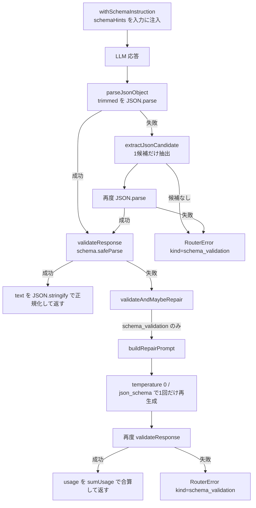
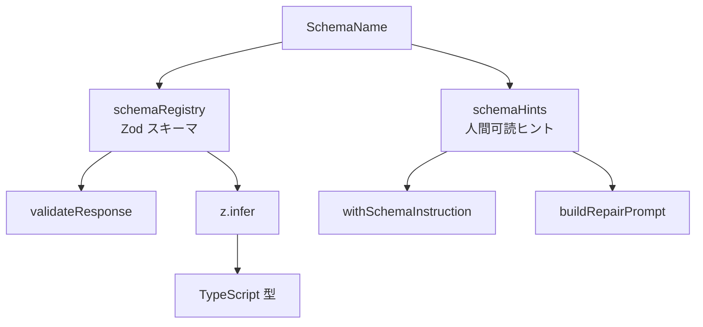

「**寛容に読み、厳密に検証し、1回だけ直す**」 ― 構造化出力を型保証された値にする

## 対象読者

この記事は、使い方ではなく `llm-task-router` の内部設計をソースから読むシリーズの第3回です。第2回では router と providers の接続を見て、provider に `responseFormat: { type: "json_object" }` を渡しつつ、`schema_validation` をフォールバック対象に含めていたことを確認しました。本稿はその“出口側”、つまり返ってきたテキストをどう検証し、必要ならどう1回だけ修復するかを扱います。本文中では外部リンクに依存せず、参照は末尾の参考に集約される前提で進めます。

想定読者は次のような実装者です。

- LLM 出力をアプリケーションで型安全に扱いたい人
- 構造化出力の検証と修復を、失敗理由まで含めて設計したい人
- TypeScript と Zod で、曖昧なテキストを堅い値に落とし込みたい人

Zod 未経験でも読めるように要点は補いますが、説明は実ソースに寄せます。`safeParse` は例外を投げず、`{ success, data, error }` で結果を返します。`z.infer<typeof Schema>` はスキーマから TypeScript 型を導くための仕組みです。一般論として抽象化しすぎず、このリポジトリが何を採り、何を採らないかを見ます。

## この層が解く問題

LLM に JSON を返すよう指示しても、そのまま後続処理へ流せるとは限りません。よくある崩れは次のとおりです。

- JSON の前後に説明文が付く
- コードフェンスが混ざる
- JSON としては読めるがキー名が違う
- `enum` にしたい語彙が揺れる
- 必須項目が欠ける
- `max_tokens` 打ち切りで途中切れになる

ここで重要なのは、「JSON っぽい」ことと「このツールが採用してよい値」であることは別だという点です。第2回で見たとおり、この router は provider 側に `json_object` を要求します。しかし本稿で見るコードは、そこで止まりません。`json_object` を送ったうえで、返ってきたテキストを必ず Zod で検証します。

この設計の結論は明確です。

- 入口では `withSchemaInstruction` で期待形状を明示する
- 出口では `parseJsonObject` で寛容に JSON を救出する
- 採用判定は `validateResponse` の `safeParse` に一本化する
- 検証失敗は `schema_validation` として扱い、1回だけ修復する

まず全体像を図で見ます。



この経路に、複数候補を順に舐めるループや、`json_parse_error` / `schema_error` の二分はありません。実装はもっと単純です。`JSON.parse` を1回試し、だめなら1候補だけ救出し、再度 `JSON.parse` と Zod 検証を行います。

## このプロジェクトでの Zod の位置づけ

このプロジェクトの `package.json` では Zod は `^3.25.67`、つまり Zod v3 系です。本稿のコードと説明も v3 の API に合わせます。

ここで使っている Zod の語彙はかなり限定されています。この限定された語彙だけで検証層が成立しており、それが後述の `formatZodIssues` が `issue.path` と `issue.message` しか見ない設計と対応しています。

- 構造定義
  - `z.object`
  - `z.string`
  - `z.array`
  - `z.enum`
  - `z.number`
  - `z.boolean`
  - `.optional()`
  - `.default()`
- 検証実行
  - `safeParse`
  - `z.ZodError`
  - `error.issues`
  - `issue.path`
  - `issue.message`
- 型導出
  - `z.infer`

ここで大事なのは、issue の `code` で細かく分岐していないことです。実ソースの `formatZodIssues` が使うのは `path` と `message` だけです。つまり、この router は Zod の詳細な分類体系に強く依存せず、読める検証メッセージを組み立てるところに留めています。

## registry と hints が担う責務

本論の土台になるのは `src/schemas/index.ts` と `src/router/types.ts` です。

- `src/router/types.ts`
  - `SchemaName`
  - `SchemaRegistry`
- `src/schemas/index.ts`
  - `schemaRegistry`
  - `schemaHints`
  - `hasSchema`

まず関係を図にします。



`schemaRegistry` は実行時検証の正本です。`SchemaName` から Zod スキーマを引き、`validateResponse` がそれを `safeParse` にかけます。一方の `schemaHints` は、人間に読ませるための簡潔な仕様です。`withSchemaInstruction` と `buildRepairPrompt` が参照し、モデルに「どういう JSON を返してほしいか」を伝えます。

この二層構成の意図ははっきりしています。Zod をそのまま JSON Schema 化して長い仕様を毎回プロンプトへ埋め込むのではなく、モデルに読ませやすい短いヒントを別で持つ、という判断です。利点は次のとおりです。

- プロンプトに載せる文を短くできる
- 修復プロンプトを読みやすく保てる
- モデルに見せる仕様と、アプリが採用判定する仕様を役割分担できる

ただし代償もあります。`schemaHints` と Zod 定義は二重管理になるため、ずれる可能性があります。たとえば必須・任意や enum 語彙を片方だけ更新すると、モデルへの説明と採用判定が食い違います。このリスクを完全には消していません。代わりに「最終判定は必ず Zod に戻す」という責務境界で制御しています。

実際に `schemaRegistry` に登録されているのは次の5つです。

| SchemaName | 役割 |
|---|---|
| `ArticleBrief` | 記事の要約・概要生成系で使う構造 |
| `ArticleOutline` | セクション列を持つアウトライン |
| `ReviewResult` | レビュー結果の判定と指摘 |
| `EditorialReview` | 編集レビューの本体 |
| `EditorialReviewContinuation` | 継続レビュー時の追跡情報 |

注記として、`ClaimsSchema` はファイルとして存在しますが、`schemaRegistry` には登録されていません。したがって registry 経由の検証対象は上の5つです。この点は、ファイルがあることと router が実際に検証に使うことを分けて読む必要があります。

また、TypeScript 型は Zod から `z.infer<typeof SomeSchema>` で導出します。実行時検証と静的型の単一情報源化を狙っており、「型だけ別定義してずれる」構成を避けています。

## 入口の予防線：`withSchemaInstruction`

出口の検証が本命だとしても、入口で何も伝えない設計は採っていません。`src/router/ModelRouter.ts` の `withSchemaInstruction(input, schemaName)` は、元の入力に schema 用の指示を連結します。

役割は次の3つです。

- 出力は JSON スキーマに厳密に従うことを明示する
- 指定キーのみを含む JSON を返すよう促す
- コードフェンスや説明文を付けないよう促す

さらに、その末尾に `schemaHints[schemaName]` を `join("\n")` でつなぎます。つまり、LLM に見せる仕様の実体は `schemaHints` です。

ここでの設計判断は、「入口で崩れを減らす」ための予防線を張ることです。採らなかった代替案は、プロンプトを最小限にして出口の修復に寄せる構成です。その場合でも動きはしますが、初回失敗率が上がり、修復回数とトークン消費が増えます。

ただし、ここで強制力が生まれるわけではありません。プロンプトは従わせるためのヒントであって、保証ではありません。だからこそ、この後段に `validateResponse` が必要です。

## 寛容パースは `parseJsonObject` の範囲に限定する

現実の LLM 出力は、素の `JSON.parse` 一発で通るとは限りません。このプロジェクトは `src/utils/json.ts` に、その救出ロジックを置いています。

- `parseJsonObject`
- `extractJsonCandidate`

重要なのは、実装が「複数候補を集めて順番に試す」形ではないことです。流れは次の3段だけです。

1. `text.trim()` をそのまま `JSON.parse`
2. 失敗したら `extractJsonCandidate(trimmed)` を1回だけ呼ぶ
3. 候補が取れたら、その1件を `JSON.parse`

実装の要点を抜粋します。

実ソース抜粋（`src/utils/json.ts`）

```ts
import { RouterError } from "../router/errors";

export function parseJsonObject(text: string): unknown {
  const trimmed = text.trim();

  try {
    return JSON.parse(trimmed);
  } catch {
    const extracted = extractJsonCandidate(trimmed);
    if (!extracted) {
      throw new RouterError(
        "Model output was not valid JSON",
        "schema_validation"
      );
    }

    try {
      return JSON.parse(extracted);
    } catch {
      throw new RouterError(
        "Model output JSON could not be parsed",
        "schema_validation"
      );
    }
  }
}

export function extractJsonCandidate(text: string): string | undefined {
  const fenced = text.match(/```(?:json)?\s*([\s\S]*?)```/i);
  if (fenced?.[1]) return fenced[1].trim();

  const firstObject = text.indexOf("{");
  const lastObject = text.lastIndexOf("}");
  if (firstObject !== -1 && lastObject !== -1 && firstObject < lastObject) {
    return text.slice(firstObject, lastObject + 1);
  }

  const firstArray = text.indexOf("[");
  const lastArray = text.lastIndexOf("]");
  if (firstArray !== -1 && lastArray !== -1 && firstArray < lastArray) {
    return text.slice(firstArray, lastArray + 1);
  }

  return undefined;
}
```

読み解きは単純です。最初に全文を信じて `JSON.parse` し、だめなら「コードフェンス」「最初の `{` から最後の `}`」「最初の `[` から最後の `]`」の順で、最初に当たった1件だけを救出します。候補を列挙して総当たりする設計ではありません。

ここで失敗種別も整理しておきます。実在する失敗は `RouterError(..., "schema_validation")` だけです。`json_parse_error` や `schema_error` といった二分はありません。JSON の救出失敗も、救出後の再 parse 失敗も、router 全体から見れば `schema_validation` として扱われます。第2回で確認したとおり、`schema_validation` は `shouldFallback` が true を返す6種（`rate_limit` / `timeout` / `overloaded` / `service_unavailable` / `connection` / `schema_validation`）の1つです。検証失敗も「やり直す価値のある失敗」として扱う前提が、ここに直結しています。

この方針は「入力には寛容、採用には厳密」という趣旨に沿っていますが、実装はあくまで最小限のヒューリスティックです。落とし穴も明確です。

- 本文中に `{` を含む説明文があると、意図しない範囲を切り出しうる
- 複数の JSON が並んでいると、最初と最後の括弧でまとめて囲んでしまいうる
- balanced brace matching はしていない
- フェンス内の整形やネスト解析もしていない

つまり、これは「救出」であって「厳密な JSON 抽出器」ではありません。この脆さを出口の Zod 検証で受け止める構成です。

## `validateResponse` が採用判定の正本になる

実際に値として採用するかを決めるのは `src/router/ModelRouter.ts` の `validateResponse(response, schemaName)` です。

処理は次の順です。

1. `schemaRegistry[schemaName]` を引く
2. 見つからなければ `RouterError(..., "config")`
3. `parseJsonObject(response.text)` で JSON を得る
4. `schema.safeParse(parsed)` を実行
5. 成功なら `text` を正規化して返す
6. 失敗なら `formatZodIssues` を使って `schema_validation`

抜粋です。

実ソース抜粋（`src/router/ModelRouter.ts`）

```ts
import { z } from "zod";
import { parseJsonObject } from "../utils/json";
import { schemaRegistry } from "../schemas";
import { RouterError } from "./errors";

// ...

private validateResponse(
  response: ModelResponse,
  schemaName: SchemaName
): ModelResponse {
  const schema = schemaRegistry[schemaName];
  if (!schema) {
    throw new RouterError(
      `Schema is not registered: ${schemaName}`,
      "config"
    );
  }

  const parsed = parseJsonObject(response.text);
  const validated = schema.safeParse(parsed);

  if (!validated.success) {
    throw new RouterError(
      `Model output did not match schema ${schemaName}: ${this.formatZodIssues(validated.error)}`,
      "schema_validation"
    );
  }

  return {
    ...response,
    text: JSON.stringify(validated.data, null, 2) + "\n",
  };
}
```

ここで注目すべき点は2つあります。

1つ目は、成功時に `validated.data` を `JSON.stringify(..., null, 2) + "\n"` で正規化し直して返すことです。つまり、下流に流れる `response.text` は「検証済みかつ整形済み」の JSON 文字列になります。単に型だけ確認して元のテキストをそのまま流していません。

2つ目は、失敗時のメッセージを `formatZodIssues` で短くまとめることです。Zod の issue 全量をそのまま出すのではなく、先頭3件だけをフィールドパス付きで整形します。

実ソース抜粋（`src/router/ModelRouter.ts`）

```ts
private formatZodIssues(error: z.ZodError): string {
  const shown = error.issues.slice(0, 3).map(issue => {
    const path = issue.path.length > 0 ? issue.path.join(".") : "(root)";
    return `${path}: ${issue.message}`;
  });

  const more =
    error.issues.length > 3
      ? ` (+${error.issues.length - 3} more)`
      : "";

  return shown.join("; ") + more;
}
```

この形式だと、たとえば `sections.1.points: Required` や `approved: Expected boolean, received string` のように、どこがずれたかを即座に読めます。LLM 出力の検証では、「キー違いなのか」「値型違いなのか」「配列要素が壊れたのか」を一目で切り分けられることが重要です。詳細を全部出すより、短く要点を返すほうが修復プロンプトにも載せやすいという判断です。

## 検証失敗を1回だけ修復する `validateAndMaybeRepair`

この router は、検証に失敗したら必ず即終了するわけではありません。`validateAndMaybeRepair` が、条件付きで1回だけ修復します。

設計上の要点は次のとおりです。

- `schemaName` が無ければ素通し
- まず `validateResponse` を試す
- `normalizeProviderError(firstError).kind === "schema_validation"` のときだけ修復する
- 修復は1回だけ
- 修復後も必ず再度 `validateResponse` する

修復リクエストの条件も固定されています。

- `temperature: 0`
- `responseFormat: { type: "json_schema", schemaName }`

ここで初回は `json_object` を使っていたとしても、修復では `json_schema` を指定しています。設計意図は、崩れた自由出力をもう一度自由に書き直させるのではなく、より狭い制約へ寄せて再生成させることです。ただし、それでも採用判定は最後に Zod で行います。プロバイダやモードの保証に委ね切らない点は一貫しています。

さらに重要なのが usage の扱いです。修復に進んだ場合、返り値の usage は初回と修復後の2回分を `sumUsage` で合算します。`elapsedMs` も合算し、`truncated` は OR を取ります。つまり、呼び出し側から見える usage は「実際にこの run が消費した総量」です。これは第5回で扱う progress のトークン・コスト集計に直接効くため、単なる付帯情報ではありません。

再検証も失敗した場合のメッセージも実務的です。`response.truncated || repairedResponse.truncated` が真なら、例外メッセージの末尾に次の誘導を付けます。

` — output was truncated at max_tokens; raise max_tokens for this task and rerun`

打ち切りが原因なら、キー修正の再依頼をしても根本解決しません。ここを明示することで、「修復が弱い」のではなく「そもそも出力が途中で切れた」問題だと切り分けられます。

この設計は、成功するまで何度も回す再試行ループを採っていません。代替案としてはありえますが、次の不利益があります。

- コストの上限が読みにくい
- レイテンシが悪化する
- 失敗原因がぼやける
- 同種の誤りを繰り返すとループしやすい

そのため本稿のコードは、修復を救済策に限定しています。第2回と接続すると、`schema_validation` は `shouldFallback` の true 6種の1つでした。つまり router 全体としては「やり直す価値のある失敗」ですが、1回の provider 呼び出し内では無制限に粘りません。

## 修復プロンプトの組み立て

修復でモデルへ返す入力は `buildRepairPrompt(schemaName, invalidOutput)` で作られます。内容は概ね次の4点です。

- 前回出力がスキーマ不一致だったこと
- キーを正確に直した JSON だけ返すこと
- コードフェンスやコメントを付けないこと
- `schemaHints[schemaName]` と無効出力そのもの

ここでも参照するのは `schemaHints` です。修復時に Zod の issue を細かくルール変換して渡すのではなく、「どういう JSON に直すべきか」を簡潔に再提示し、直前の無効出力もそのまま見せます。

粒度を合わせるため、構造だけ分かる最小限のイメージを置いておきます。

説明用の簡略イメージ

```ts
[
  "The previous output did not match the required JSON schema.",
  "Rewrite it so that it matches the schema exactly.",
  "Return JSON only. Do not include code fences or commentary.",
  ...schemaHints[schemaName],
  "",
  invalidOutput,
].join("\n")
```

この構成の利点は、修復の責務を「意味を書き換える」ではなく「形式を整える」に寄せやすいことです。一方で、欠点は `schemaHints` の二重管理リスクをここでも背負うことです。もし hints が Zod とずれていれば、修復プロンプトは誤った方向へモデルを誘導しえます。したがって、採用判定は最後まで Zod 側に置く必要があります。

## 実スキーマから読む設計判断

ここからは `src/schemas/*Schema.ts` にある実スキーマを見て、何を型で縛り、何をアプリ側に残しているかを確認します。

### `ArticleOutlineSchema`: 欠落を空配列へ正規化する

`ArticleOutlineSchema` は `z.object` と `z.array` を中心とした素直な構造です。ポイントは `sections[].points` が `z.array(z.string()).default([])` になっていることです。

これは、モデルが `points` を省略した場合でも、採用後の値を空配列に正規化する設計です。`optional()` にして下流で毎回 `undefined` を見るより、生成物の揺れを入口で吸収してしまうほうが後続処理は単純になります。

実ソース抜粋（`src/schemas/ArticleOutlineSchema.ts`）

```ts
import { z } from "zod";

export const ArticleOutlineSchema = z.object({
  title: z.string(),
  sections: z.array(
    z.object({
      heading: z.string(),
      points: z.array(z.string()).default([]),
      // ...（summary, codeExample など）
    })
  ),
  // ...（introduction, conclusion など）
});
```

この `.default([])` は、「モデルに厳密さを求めすぎず、アプリが使いやすい正規形へ寄せる」判断です。欠落を完全にエラーにする代わりに、意味を壊さない範囲で正規化しています。

### `ReviewResultSchema`: 判定語彙を enum で固定する

`ReviewResultSchema` では、判定語彙と任意項目の境界がそのまま Zod に落ちています。自由文字列ではなく enum に閉じているので、後続の分岐や集計がプロンプト依存になりません。

実ソース抜粋（`src/schemas/ReviewResultSchema.ts`）

```ts
import { z } from "zod";

export const ReviewResultSchema = z.object({
  issues: z.array(
    z.object({
      severity: z.enum(["critical", "major", "minor", "suggestion"]),
      // ...（location, problem, recommendation など）
    })
  ),
  approved: z.boolean().optional(),
  // ...（summary など）
});
```

ここでの要点は2つです。

- `severity` は `issues` 配列要素の `z.enum(["critical", "major", "minor", "suggestion"])`
- `approved` はトップレベルの `z.boolean().optional()`

つまり承認有無は場合によって出ても出なくてもよいが、出るなら boolean でなければならない、という設計です。レビュー結果のように後続で集計や分岐に使う値は、自由文字列にしないほうがよいです。`"high"`、`"important"`、`"must fix"` のような揺れを残すと、下流のロジックがプロンプト依存になります。このスキーマはその余地を閉じています。

### `EditorialReviewSchema`: judge 系の採点語彙をさらに狭める

`EditorialReviewSchema` の weakness severity は `z.enum(["major", "minor", "preference"])` です。ここでは `ReviewResultSchema` の `critical` や `suggestion` とは別の語彙を採っています。これはスキーマが用途別であり、同じ「severity」でも責務に応じて許可語彙を変えていることを示します。

実ソース抜粋（`src/schemas/EditorialReviewSchema.ts`）

```ts
import { z } from "zod";

export const EditorialReviewSchema = z.object({
  weaknesses: z.array(
    z.object({
      severity: z.enum(["major", "minor", "preference"]),
      // ...（location, problem, recommendation など）
    })
  ),
  // ...（verdict, scores, strengths, summary など）
});
```

この種の enum 制約は第4回で扱う evaluate 入力ともつながります。judge モデルに自由なラベルを発明させるのではなく、パイプライン側が期待する分類語彙へ閉じるための型です。

### `EditorialReviewContinuationSchema`: ID を発明させない

このシリーズで特に重要なのは `EditorialReviewContinuationSchema` です。

- `trackedWeaknesses[].id` は `z.string()`
- `newWeaknesses` には `id` フィールドがない

この形は偶然ではありません。`trackedWeaknesses` は「既知の weakness を参照する」ための構造であり、LLM は渡された既知 ID を返すだけです。一方、`newWeaknesses` は新しく見つけた弱点を書く場所ですが、そこで ID をモデルに振らせていません。採番はパイプライン側の責務です。第1回で見た first-write-wins と同じく、識別子はアプリケーション側で決め、LLM に発明させないという線引きです。

実ソース抜粋（`src/schemas/EditorialReviewContinuationSchema.ts`）

```ts
import { z } from "zod";

export const EditorialReviewContinuationSchema = z.object({
  trackedWeaknesses: z.array(
    z.object({
      id: z.string(),
      // ...（status, evidence など）
    })
  ),
  newWeaknesses: z.array(
    z.object({
      severity: z.enum(["major", "minor", "preference"]),
      // ...（location, problem, recommendation など）
    })
  ),
  // ...（verdict, scores, strengths, summary など）
});
```

この判断の利点は明確です。

- 同じ weakness に対する重複 ID 発明を避けられる
- 監査時に「どこで ID が決まったか」を追える
- 後続の結合や更新処理が安定する

代わりに、パイプライン側には採番処理が必要です。しかし一意性管理をアプリで持つなら、そのコストは妥当です。

## 失敗種別を増やさない設計の意味

この router では、JSON 抽出失敗、再 parse 失敗、Zod 不一致を細かく別 kind に分けていません。いずれも `schema_validation` に畳みます。

これは情報を捨てているように見えるかもしれませんが、router の責務としては合理的です。第2回で見たフォールバック判定にとって重要なのは、「この失敗が再実行や代替モデルで回復しうるか」であって、「どの段で壊れたか」の詳細ではありません。詳細はエラーメッセージに残しつつ、制御フローで見る kind は増やしすぎない、という設計です。

採らなかった代替案は、`json_parse_error` と `schema_error` を別 kind にすることです。その場合は観測性が少し上がる一方で、フォールバック条件やリトライ条件の分岐が増えます。本プロジェクトはそこを単純化し、`schema_validation` へ寄せています。

## JSON mode の線引き

ここで JSON mode についても位置づけを整理します。一般論として何が保証されるかを断定するのではなく、このツールの設計前提として言うと、`responseFormat: json_object` は入口の補助です。だからこのコードは、その指定を送ったうえで、必ず `validateResponse` で Zod 検証します。

provider 側にも準拠保証に寄せたモードは存在しますが、この router は最終的な採用判定を Zod に置きます。

つまり、

- provider には JSON らしい出力を期待する
- しかし採用判定は provider ではなく router 側で行う

という二段構えです。修復時に `json_schema` を使うのも同じ文脈で、出力品質の改善には使うが、最終保証はアプリ側に残します。OpenAI でも Anthropic でも、この router の境界はそこにあります。

## 注意点とトレードオフ

この設計は堅実ですが、万能ではありません。実装を読むなら弱点もそのまま押さえるべきです。

### `schemaHints` と Zod の二重管理

利点はプロンプト可読性ですが、同期ずれの危険があります。たとえば enum を Zod だけ更新し、hints を直し忘れると、モデルに古い仕様を見せたまま厳しい検証にかけることになります。現状はこのリスクを受け入れています。最終判定を Zod に戻すことで破綻は防げますが、初回成功率は落ちえます。

### JSON 救出ヒューリスティックの脆さ

`extractJsonCandidate` は簡潔ですが、構文木を読んでいるわけではありません。説明文に `{}` が含まれる、複数 JSON が並ぶ、配列とオブジェクトが混在する、といったケースでは誤救出が起こりえます。balanced brace matching や専用パーサを実装する代替案もありますが、現状はそこまで複雑化していません。

### 修復は1回だけ

回収率だけ見れば、2回、3回と粘りたくなる場面はあります。ただしコスト・レイテンシ・原因の明確さを考えると、1回で切る判断は妥当です。失敗を無限に吸収しようとするより、「直らないなら上位へ失敗を返す」ほうが運用しやすい場面は多いです。

### ライブラリ代替はありうるが、本稿の論点ではない

実行時検証ライブラリは Zod 以外にもあります。`io-ts` や `valibot` のような代替も選択肢です。ただし本稿の要点はライブラリ比較ではなく、このリポジトリが Zod v3 を前提に `schemaRegistry`・`schemaHints`・修復1回という構成を採っていることです。優劣を一般化するより、責務分離を読むほうが重要です。

## まとめ

本稿の設計は、自由出力をそのまま信じないための最小限の境界づけです。

- 入口では `withSchemaInstruction` が `schemaHints` を注入し、崩れを予防する
- `src/utils/json.ts` の `parseJsonObject` は、全文 parse → 1候補救出 → 再 parse までを担当する
- `validateResponse` が `schemaRegistry` の Zod を正本として `safeParse` し、成功時は整形済み JSON に正規化する
- `validateAndMaybeRepair` は `schema_validation` のときだけ、`temperature: 0` と `json_schema` で1回だけ修復する
- usage は `sumUsage` で合算し、打ち切り時は `max_tokens` を上げるべきことを明示する

設計判断として一番大きいのは、モデルへの説明と採用判定を分離していることです。`schemaHints` はあくまで読ませるための仕様、Zod は採用のための仕様です。この境界があるから、LLM の自由出力を後続処理へ渡せる値へ変換できます。

また、`EditorialReviewContinuationSchema` に見えるように、識別子の発明や採番を LLM に委ねないという姿勢も一貫しています。これは第1回の first-write-wins、第2回のフォールバック設計、第4回の evaluate 入力ともつながる思想です。生成モデルに任せる部分と、アプリ側で台帳的に固定すべき部分を分ける。その分離が、この router 全体の堅さを支えています。

## 参考

<!-- sources:begin -->
- [S011] Zod v3 Documentation (safeParse, ZodError, issues)（primary, retrieved: 2026-06-27）
  https://v3.zod.dev/
- [S012] OpenAI Structured model outputs guide（primary, retrieved: 2026-06-27）
  https://developers.openai.com/api/docs/guides/structured-outputs
- [S013] Anthropic Claude Structured outputs docs（primary, retrieved: 2026-06-27）
  https://platform.claude.com/docs/en/build-with-claude/structured-outputs
- [S014] llm-task-router package.json (dependencies.zod ^3.25.67)（primary, retrieved: 2026-06-27）
  https://github.com/rex0220/llm-task-router/blob/2b8656e94beab67014d986febb8a8dacda485163/package.json
- [S015] src/utils/json.ts (parseJsonObject / extractJsonCandidate)（primary, retrieved: 2026-06-27）
  https://github.com/rex0220/llm-task-router/blob/2b8656e94beab67014d986febb8a8dacda485163/src/utils/json.ts
- [S016] src/router/ModelRouter.ts (validateResponse / validateAndMaybeRepair / withSchemaInstruction / buildRepairPrompt / formatZodIssues / sumUsage)（primary, retrieved: 2026-06-27）
  https://github.com/rex0220/llm-task-router/blob/2b8656e94beab67014d986febb8a8dacda485163/src/router/ModelRouter.ts
- [S017] src/router/types.ts (SchemaName / SchemaRegistry)（primary, retrieved: 2026-06-27）
  https://github.com/rex0220/llm-task-router/blob/2b8656e94beab67014d986febb8a8dacda485163/src/router/types.ts
- [S018] src/schemas/index.ts (schemaRegistry / schemaHints / hasSchema)（primary, retrieved: 2026-06-27）
  https://github.com/rex0220/llm-task-router/blob/2b8656e94beab67014d986febb8a8dacda485163/src/schemas/index.ts
- [S019] src/schemas/ArticleOutlineSchema.ts（primary, retrieved: 2026-06-27）
  https://github.com/rex0220/llm-task-router/blob/2b8656e94beab67014d986febb8a8dacda485163/src/schemas/ArticleOutlineSchema.ts
- [S020] src/schemas/ReviewResultSchema.ts（primary, retrieved: 2026-06-27）
  https://github.com/rex0220/llm-task-router/blob/2b8656e94beab67014d986febb8a8dacda485163/src/schemas/ReviewResultSchema.ts
- [S021] src/schemas/EditorialReviewSchema.ts（primary, retrieved: 2026-06-27）
  https://github.com/rex0220/llm-task-router/blob/2b8656e94beab67014d986febb8a8dacda485163/src/schemas/EditorialReviewSchema.ts
- [S022] src/schemas/EditorialReviewContinuationSchema.ts（primary, retrieved: 2026-06-27）
  https://github.com/rex0220/llm-task-router/blob/2b8656e94beab67014d986febb8a8dacda485163/src/schemas/EditorialReviewContinuationSchema.ts
- [S023] src/router/errors.ts (shouldFallback / RouterErrorKind)（primary, retrieved: 2026-06-27）
  https://github.com/rex0220/llm-task-router/blob/2b8656e94beab67014d986febb8a8d
