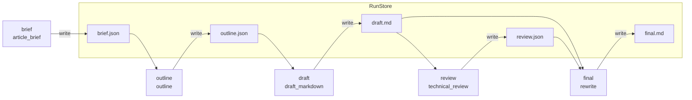
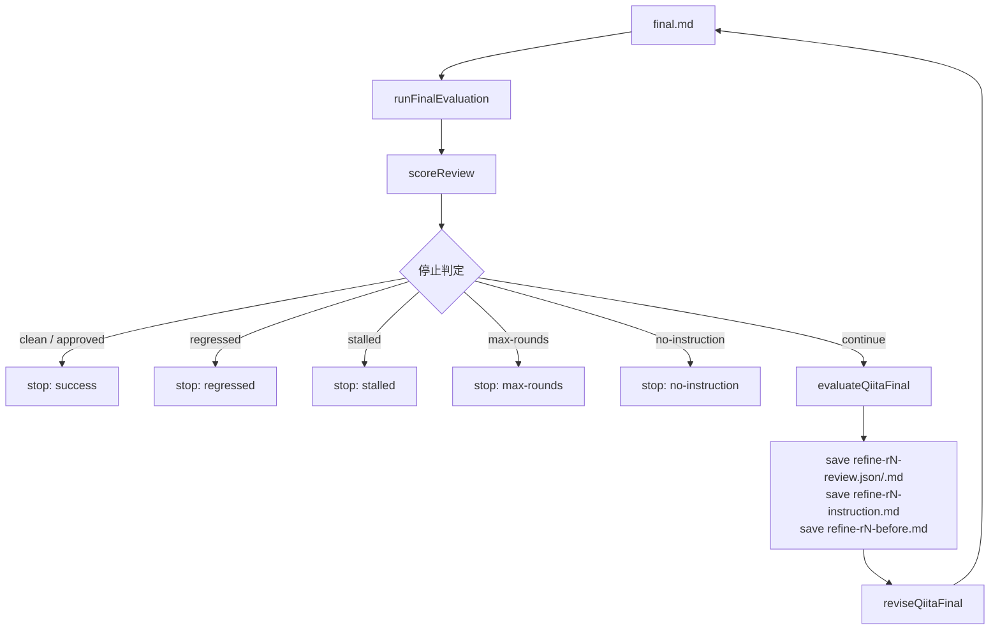

**工程は宣言として並べ、評価を数値化し、自動改稿ループを停止条件で止める**

## 対象読者

本稿は、使い方ではなく内部設計をソースから読むシリーズの第4回です。第2回の router、第3回の schemas を読んでいると接続が見えやすく、第1回で扱ったファイルベース台帳はここで出てくる各工程の土台です。未読でも本稿だけで追えるように書きますが、第1〜3回を読むと前提の意図はよりつかみやすくなります。

想定読者は次の3層です。

- 多段 LLM 生成をパイプライン化したい人
- 自動改稿ループの停止条件を設計したい人
- 品質判定を数値化したい人

## はじめに：1回の生成を賢くするより、連鎖と停止を設計する

記事生成を実装するとき、難所は「よい draft を出すこと」だけではありません。むしろ実運用に近づくほど重要なのは、生成を工程に分け、評価を機械可読にし、改稿ループを止める条件を明示することです。

`llm-task-router` の Qiita 向けワークフローは、まさにそこをコードに落としています。create で本文を一発生成して終わりではなく、工程の連鎖、レビューの数値化、改稿、再評価までを `run` 配下の成果物として残しながら進めます。

ここでいう `run` は、1回の生成処理を表す単位です。各工程の成果物は `brief.json`、`outline.json`、`draft.md`、`review.json`、`final.md` のように run 配下のファイルへ残され、その読み書きを `RunStore` が担います。本稿で扱う create / evaluate / revise / refine は、第1回で見たファイルベース台帳の上に載る工程群です。

本稿で見る論点は3つです。

- 工程を `qiitaSteps` 配列として宣言する
- `ReviewResult` を `scoreReview` で比較可能な数値に変換する
- `refineQiitaFinal` で自動改稿ループを停止条件つきで回す

結論を先に言うと、この設計の核は「どう直すか」より「どこで止めるか」です。LLM に直させ続けるループは、放っておくと止まらない、振動する、悪化する、のいずれかに寄りがちです。そこで `maxRounds`、`minSeverity`、`until`、そしてヒステリシス相当の判定を組み合わせ、止まる自動化にしています。

## create：工程は `qiitaSteps` に宣言する

Qiita 記事生成の工程定義は `src/workflows/qiitaSteps.ts` にあります。ここで重要なのは、工程が手続き的な `if` の連鎖ではなく、`QiitaStep` の配列として表現されていることです。

実装を読むうえでまず見るべき型はこれです。以下は説明用の抜粋・簡略ですが、名前と責務は実ソースに合わせています。

```ts
// src/workflows/qiitaSteps.ts
export type QiitaStep = {
  name: "brief" | "outline" | "draft" | "review" | "final";
  task: ModelTask;
  schemaName?: SchemaName;
  file: string;
  buildInput(context: StepContext): Promise<string>;
};

// ...
export const qiitaSteps: QiitaStep[] = [
  // brief, outline, draft, review, final
];
```

ポイントは3つあります。

1. `name` は工程名そのものです
2. `task` は router に渡す `ModelTask` です
3. `buildInput` はオブジェクトではなく **文字列** を返します

ここは誤読しやすい箇所です。ありがちな抽象化では `buildInput` が JSON を返しそうに見えますが、実ソースではプロンプトに流し込む入力文字列を組み立てる責務です。また、フィールド名も `schema` や `outputPath` ではなく、`schemaName` と `file` です。この命名の揺れを持ち込まないことが、ソース読解ではかなり重要です。

### 5工程の実体

このワークフローは4工程ではなく、`review` を含む5工程です。実ソースに合わせて並べると次の通りです。

| name | task | schemaName | file |
| --- | --- | --- | --- |
| `brief` | `article_brief` | `ArticleBrief` | `brief.json` |
| `outline` | `outline` | `ArticleOutline` | `outline.json` |
| `draft` | `draft_markdown` | なし | `draft.md` |
| `review` | `technical_review` | `ReviewResult` | `review.json` |
| `final` | `rewrite` | なし | `final.md` |

ここでの設計判断は明快です。`review` を create の一部に入れることで、本文生成とその初回レビューを同じ run の成果物として揃えています。draft を書いてすぐ final に行かず、いったん `review.json` を残すため、後段の revise/refine だけを別コマンドで回すときにも入力が揃います。

採らなかった代替案は、review を create の外に完全分離することです。分離自体はありえますが、その場合は「初回生成の品質診断」を別導線で扱う必要が出ます。ここでは create 時点で `review.json` を残すほうが、run 配下の監査可能性と接続がよい、という選択です。

### RunStore を経由した工程の連鎖

各工程はメモリ上で直接つながるのではなく、RunStore 経由でファイルを読み書きします。図にすると次のようになります。



この図の読みどころは、工程が単に順番に並んでいるだけでなく、各工程が具体的な成果物ファイルを契約としている点です。`brief.json`、`outline.json`、`draft.md`、`review.json`、`final.md` という実名が run 直下に残るため、途中からの再開や、どこで品質が崩れたかの切り分けがしやすくなります。

## `STRONG_EMPHASIS_RULE`：Markdown 崩れをプロンプトで予防する

Qiita 向け Markdown 生成には、一般的な「よい文章を書け」以外の実務ルールがあります。その代表例が、日本語と強調記法 `**...**` の組み合わせで起きる崩れです。

実ソースでは、これを `src/workflows/qiitaSteps.ts` の `STRONG_EMPHASIS_RULE` として定義しています。役割は、draft / final / revise で本文を生成させる際に、CommonMark のフランキング規則に引っかかりやすい書き方を避けさせることです。

趣旨は次の通りです。

- 強調 `**…**` の内端、つまり開き直後と閉じ直前に約物を置かない
- 括弧、引用符、読点は強調の外に出す

典型例はこれです。

- `×**「太陽系の化石」**の` → `○「**太陽系の化石**」の`
- `×**約5.4g（少量）**と` → `○**約5.4g**（少量）と`

このルールをプロンプトに入れる理由は、公開前に壊れた強調を直す手間を減らすためです。ただし、ここで重要なのは「プロンプトに書いたから守られる」とは考えていない点です。実装は二層防御になっています。

- 第1層: `STRONG_EMPHASIS_RULE` を本文生成プロンプトに注入して予防する
- 第2層: `src/utils/text.ts` の `detectBrokenStrongEmphasis` で検出する

後者は verify-artifacts 系の公開前ゲートとつながるため、設計としては「お願いして守らせる」ではなく「予防しつつ機械でも見る」です。この役割分担は、第6回・第7回の検証レイヤとも自然に接続します。未読でも本稿の理解には支障ありませんが、読むとこの二層構造の位置づけがより明確になります。

採らなかった代替案は、検出だけに寄せることです。検出だけでも事故は拾えますが、draft / final / revise の各段で同じ崩れを毎回作り直されると、改稿コストが無駄に増えます。逆に予防だけでも不十分です。LLM の出力は揺れるので、最終的には機械検査が必要です。

## `createQiitaArticle`：工程配列を順に回す

工程定義を持つだけでは足りません。実際にそれを回して成果物に落とすオーケストレーションが `src/workflows/createQiitaArticle.ts` の `createQiitaArticle` です。

ここで注目すべきなのは、実行側が工程ごとの固有ロジックを極力持たないことです。個々の差分は `qiitaSteps` 側に閉じ込め、`createQiitaArticle` 側は「工程を順に実行し、結果をファイルへ保存する」ことに寄せています。

この分離の利点は次の通りです。

- 工程追加・差し替え時に、実行骨格を書き換えにくくて済む
- どの工程が何を読んで何を書くかが、定義側でまとまる
- `resumeQiitaArticle` のような再開ロジックを同じ工程配列に対して適用しやすい

代替案として、`createQiitaArticle` の中に `brief`、`outline`、`draft`、`review`、`final` の処理を順番に直書きする方法もあります。小規模なら読めますが、resume、監査、個別再実行、工程差し替えまで入ってくると、工程定義と実行制御が絡みやすくなります。本シリーズの文脈では、宣言としての工程配列を先に置くほうが拡張に強いです。

## `scoreReview`：レビューを違反コストとして数値化する

自動改稿ループを組むなら、レビュー結果は文章だけでは足りません。比較のための数値軸が要ります。その役割を持つのが、同じく `src/workflows/createQiitaArticle.ts` にある `scoreReview` です。

まず、severity の語彙は実ソースでは次の4段階です。

- `suggestion`
- `minor`
- `major`
- `critical`

`low` / `medium` / `high` ではありません。この違いは小さく見えて、停止条件や issue 抽出条件を読むときに直接効いてきます。

実装の前提になる順序は `severityRank` です。

```ts
// src/workflows/createQiitaArticle.ts
const severityRank = {
  suggestion: 0,
  minor: 1,
  major: 2,
  critical: 3,
} as const;
```

そしてスコア計算に使う重みは、rank を指数化した `severityWeight` です。

```ts
// src/workflows/createQiitaArticle.ts
const severityWeight = {
  suggestion: 1,
  minor: 2,
  major: 4,
  critical: 8,
} as const;
```

値は `1 / 2 / 4 / 8` です。ここを `1 / 3 / 7 / 15` のように勝手に読まないことが重要です。重みは線形ではなく、`2 ** severityRank` で定義されています。

`scoreReview` 自体はかなり素直です。

```ts
// src/workflows/createQiitaArticle.ts
export function scoreReview(review: ReviewResult): number {
  return review.issues.reduce(
    (sum, issue) => sum + (severityWeight[issue.severity] ?? 0),
    0,
  );
}
```

設計上の意味は明確です。これは品質点ではなく、**違反コストの合計**です。したがって **低いほどよい** 指標になります。

- issue が減ると下がる
- 重い issue が減ると大きく下がる
- `0` は issues が空であることを意味する

この数値化の狙いは、レビューを完全に点数化することではありません。自動ループに必要な比較軸を用意することです。レビュー文だけだと「前回より少しよいのか」「むしろ悪化したのか」を機械的に判断しにくいですが、違反コスト合計なら改善幅・悪化幅を計算できます。

採らなかった代替案は、カテゴリ別の複雑な重み付けや、summary を含んだ総合点のような設計です。それらは人間には説明しやすいこともありますが、自動停止判定には過剰になりがちです。ここでは severity のみを使う単純合算に寄せ、判断軸を透明にしています。

## `runFinalEvaluation` と `evaluateQiitaFinal`：評価を改稿指示へつなぐ

final の評価は `runFinalEvaluation` が担います。役割は、`final.md` を judge モデルに渡し、`task` として `final_review`、`schemaName` として `ReviewResult` を使ってレビューさせ、その結果を自動ループで使える形に整えることです。

返す情報の要点は次の3つです。

- `score`: `scoreReview(review)` の結果
- `issueCount`: `severity >= minSeverity` の issue 件数
- `approved`: `review.approved`

ここで `issueCount` が全 issues 数ではなく、`minSeverity` 以上に絞った件数であることが重要です。自動ループは、軽微な指摘をどこまで追うかを境界で決めます。そのため、停止条件で見るべき件数も同じ境界で揃える必要があります。

さらに `evaluateQiitaFinal` は、評価結果をそのまま返すだけでなく、`minSeverity` 以上の issue を次の改稿に使える指示文へ落とす橋渡しをします。ここで出てくるのが後続の revise に渡す instruction です。単発の evaluate 経路では `revise-instruction.md` を保存し、refine ループ経路では各ラウンドで `refine-r{N}-instruction.md` を保存します。責務としてはどちらも、「レビュー結果をそのまま渡す」のではなく「改稿対象だけを絞り込んで渡す」です。

この分離の利点は、評価器の出力形式と改稿器の入力形式を疎結合にできることです。review は review の都合で型づけし、revise は revise の都合で読める instruction に変換する。評価と改稿を直結しないので、途中で人手レビューや別ゲートを挟みやすくなります。

## `reviseQiitaFinal`：改稿の安全策はここに置く

改稿を担うのは `src/workflows/createQiitaArticle.ts` の `reviseQiitaFinal` です。役割は単純に見えますが、ここには自動改稿ループの安全策が入っています。

### 1. 改稿前に `final.bak.md` へ退避する

既定のバックアップ先は `final.bak.md` です。`final.backup.md` ではありません。関数オプションの `backupTo` 既定値が `"final.bak.md"` で、`null` を渡すと退避をスキップできます。

この設計の意味は、改稿処理そのものに最低限の復元可能性を持たせることです。rewrite は失敗しうるし、意図しない悪化もありえます。少なくとも直前状態を残しておけば、手動調査や復旧がしやすくなります。

### 2. `STRONG_EMPHASIS_RULE` を改稿でも使う

draft / final だけでなく revise でも同じ強調規則を注入します。これは自然です。せっかく create で規約違反を予防しても、改稿時に別プロンプトで崩してしまっては意味がありません。本文を生成する経路が複数あるなら、規約注入も複数経路に揃える必要があります。

### 3. task は `rewrite`

改稿専用に task 名が分かれているのではなく、本文最終化と同じく `rewrite` を使います。ソースを読むときは、「新規生成」と「既存本文の書き換え」が task 上でどう切られているかを、名前の印象ではなく実コードで追う必要があります。

### 4. 空振りを `text !== current` で検出する

改稿の空振り検出は、実ソースでは次の比較です。

```ts
const changed = text !== current;
```

変数名も含めてここが実体です。`before` / `after` ではありません。LLM がまったく同じ本文を返した場合、それは「直したつもり」ではなく「変わっていない」として扱えます。自動ループでは、この判定がかなり大事です。改善指示を渡しても本文が変わらないなら、次ラウンドで同じことを繰り返す可能性が高いからです。

### refine からは `backupTo: null` で呼ぶ

`refineQiitaFinal` では、各ラウンドの before スナップショットを `refine-r{N}-before.md` に残します。そのため、revise 内でさらに `final.bak.md` を毎回更新する責務は不要です。ここで `reviseQiitaFinal(..., { backupTo: null })` として呼び分けることで、バックアップ責務の置き場所を呼び出し側で切り替えています。

これはよい責務分解です。単発の revise では関数内バックアップを使い、refine のようにラウンド台帳を残す場面では外側で管理する。常に一箇所で済ませるのではなく、呼び出し文脈に応じて切り替えられる設計です。

## `refineQiitaFinal`：止め方こそが自動改稿の本体

ここが本稿の中心です。`refineQiitaFinal` は、final を評価し、必要なら改稿し、再度評価するループを回します。実装を読むと分かる通り、この機能の本体は「改稿させること」ではなく「どこで止めるか」にあります。

### 3つの停止軸

既定値を含めた停止軸は次の3つです。

- `maxRounds`: 既定 `3`
- `minSeverity`: 既定 `"major"`
- `until`: `"clean" | "approved"`

`until` は数値ではありません。`untilScore` のような閾値指定ではなく、停止目標を意味で表します。

- `"clean"`: `minSeverity` 以上の issue が 0 件なら停止
- `"approved"`: `review.approved === true` なら停止

`minSeverity` 既定が `"major"` なのも重要です。つまり既定では `suggestion` と `minor` は自動ループ継続の対象外です。ここは「軽微な指摘を無視する」のではなく、「どの重大度から先を自動で追うかを明示する」境界です。

### ヒステリシス相当のチューニング値

さらに、改善・悪化の振る舞いを見るために次の定数があります。

- `REFINE_IMPROVE_REL = 0.05`
- `REFINE_IMPROVE_ABS = 1`
- `REFINE_REGRESS_REL = 0.25`
- `REFINE_REGRESS_ABS = 2`
- `REFINE_STALL_STREAK = 2`

これらは CLI フラグにせず、実運用ログを見ながら調整するチューニング値として置かれています。ここを絶対的な推奨値として読むべきではありません。プロンプト、judge の癖、記事長、review の出方で適正値は動きます。

設計判断として妥当なのは、値の存在を固定しつつ、外向けの大仰な設定面を増やさないことです。細かい数値を全部 CLI に出すと柔軟性は増えますが、運用者にとっては「どれを触ると何が起きるか」が見えにくくなります。この種の定数は、まず実運用でログを観測し、必要ならコード側で調整する、という運用のほうが安定しやすいです。

### 停止理由の順序

停止判定の順序も重要です。`refineQiitaFinal` はおおむね次の優先順位で止めます。

1. until 成功
2. regressed
3. stalled
4. max-rounds
5. no-instruction

この順序には意味があります。

- まず成功条件を最優先する
- 成功していないなら、悪化していないかを見る
- 悪化ではないが改善が止まっているなら stalled とする
- そこまで来ても続ける理由がなければラウンド上限で止める
- 次ラウンドで直すべき issue がなければ no-instruction とする

スコアの向きはここでも同じで、**低いほどよい**です。したがって概念的には、前ラウンドのスコア − 今ラウンドのスコアが正なら改善です（概念式であり、実装の変数名そのものではありません）。

### 改善・悪化判定は ABS と REL の AND で見る

ここは本文だけ読むと誤解しやすい箇所なので、合成ルールを明示します。改善も悪化も、絶対閾値と相対閾値の **どちらか** ではなく、**両方** を満たしたときに初めて有意とみなします。スコアは低いほどよい前提です。

| 判定 | 条件 |
| --- | --- |
| 改善 | `drop = prev - cur` が `drop >= REFINE_IMPROVE_ABS`（=1）**かつ** `drop / prev >= REFINE_IMPROVE_REL`（=0.05） |
| 悪化 | `rise = cur - prev` が `rise >= REFINE_REGRESS_ABS`（=2）**かつ** `rise / prev >= REFINE_REGRESS_REL`（=0.25） |

`prev = 0` のときは比率をそのまま使えないので、実装上は改善なら `drop > 0`、悪化なら `rise > 0` を特別扱いします。基準は前ラウンドスコアです。

擬似式で書くと次のイメージです。

- 改善: `drop >= 1 && drop / prev >= 0.05`
- 悪化: `rise >= 2 && rise / prev >= 0.25`

このように ABS と REL を両方満たすようにしているのは、小さいスコア帯での誤判定を避けるためです。絶対差だけ、あるいは相対差だけで判定すると、片方では大きく見えても実際には有意でない変動を拾いやすくなります。

### regressed と stalled を分ける理由

停止設計でありがちな単純化は、「前回よりよくなったかだけを見る」ことです。しかしそれだと、次の2種類をうまく扱えません。

- 明確に悪化したケース
- ごく小さな改善を繰り返して実質停滞しているケース

そこで `regressed` と `stalled` を分けています。

- `regressed`: 有意な悪化と判定されたら止める
- `stalled`: 有意な改善と判定できない状態が `REFINE_STALL_STREAK = 2` 回続いたら止める

この分離は実務的です。悪化は1回でも止めたいことが多い一方、停滞は1回で止めると早すぎる場面があります。そこで stalled には連続回数を入れ、ヒステリシスを持たせています。

### ラウンド成果物を全部残す

refine では各ラウンドの成果物を run 配下に残します。

- `refine-r{N}-review.json`
- `refine-r{N}-review.md`
- `refine-r{N}-instruction.md`
- `refine-r{N}-before.md`

最後に `refine-summary.md` も残ります。

これは単なるログではありません。第1回の台帳設計、第5回の進捗観測と接続する監査可能性の基盤です。未読でも本稿の理解には支障ありませんが、読むと「なぜファイルを細かく残すのか」がより見えます。自動改稿は「なぜこの版で止まったのか」が後から説明できないと運用しにくいので、各ラウンドで何を評価し、何を直そうとし、直前本文が何だったかを残します。

全体像を図にすると次の通りです。



この図の読みどころは、改稿より先に停止判定が中心に据えられていることです。自動ループは、評価して直す処理の繰り返しではありますが、設計の核心は「何をもって続行とみなすか」です。success だけでなく、悪化・停滞・上限到達・指示なしも明示的な停止理由として扱っています。

## 停止設計のトレードオフ：止まりやすさと取りこぼし

この設計は保守的です。既定の `minSeverity` が `"major"` なので、`minor` や `suggestion` が残っていても自動では追いません。また stalled や regressed で早めに打ち切るため、理論上はあと1回で改善したかもしれないケースも止めます。

これは欠点でもあります。自動ループが慎重すぎると、取りこぼしは増えます。

一方で、止まりにくいループはもっと扱いづらいです。

- 軽微な指摘を追い続けてコストだけ増える
- 評価器の揺れで前後に振動する
- 悪化した版をさらに改稿して状況を読みにくくする

本実装は、このトレードオフで「少し早めに止まる」側を選んでいます。自動化の価値は最大改善幅ではなく、予測可能に終わることにある、という判断です。ここは好みではなく運用設計の問題で、特に CI や定期生成に載せるなら妥当な寄せ方です。

## `resumeQiitaArticle` と冪等：途中成果物があるから再開できる

`src/workflows/createQiitaArticle.ts` には `resumeQiitaArticle` もあります。これが成立する前提は、第1回で扱った通り、工程結果が run 直下のファイルに残ることです。

要するに、create 系ワークフローは「どこまで進んだか」を成果物から判断できます。`brief.json`、`outline.json`、`draft.md`、`review.json`、`final.md` が実体としてあるから、途中から再開する余地が生まれます。これは「再実行できる工程」の具体例です。

ただし制約もあります。import run は `brief` から `review` までの生成系成果物を持たないため、create 系の resume/review には使えません。その場合は `article:evaluate`、`article:refine`、`article:revise` を使うことになります。

この制約は自然です。resume は「同じ工程契約の成果物が残っている」ことに依存するので、入力経路が違う run にまで一般化はできません。

もちろん、再開できるからといって何でも安全ではありません。

- モデルが変われば同じ工程名でも意味が変わる
- プロンプトや `STRONG_EMPHASIS_RULE` が変われば出力の性質も変わる
- スキーマ変更後に古い `review.json` を読むと判定を誤りうる
- 壊れた成果物ファイルがあると再開判定を誤りうる

したがって、resume は冪等性を補助しますが、意味的な同一性まで保証するものではありません。この控えめさは重要です。台帳ベース設計は強力ですが、過信しないほうが実装として健全です。

## 実装を読むときのチェックリスト

重複説明は省いて、読解順だけに絞ると次の順で追うのが分かりやすいです。

- `src/workflows/qiitaSteps.ts`
  - `qiitaSteps` 配列を開き、5工程の `task` / `schemaName` / `file` を確認する
  - あわせて `STRONG_EMPHASIS_RULE` の定義を見る
- `src/workflows/createQiitaArticle.ts`
  - `createQiitaArticle` を開き、工程配列をどう実行しているかを追う
  - `scoreReview` と `severityWeight` を見て、`1 / 2 / 4 / 8` の違反コスト化を確認する
  - `runFinalEvaluation` → `evaluateQiitaFinal` の順に見て、評価から instruction 化への流れを確認する
  - `refineQiitaFinal` を開き、停止理由の順序と改善/悪化/停滞判定を追う
  - `reviseQiitaFinal` を見て、`final.bak.md` と `changed = text !== current` を確認する

## まとめ

本稿で見た設計をまとめます。

- create は `qiitaSteps` に5工程を宣言し、RunStore 経由で `brief.json` から `final.md` までを連鎖させます
- 本文生成では `STRONG_EMPHASIS_RULE` を注入し、日本語 Markdown の強調崩れを予防します
- review は `ReviewResult` で受け、`scoreReview` で `1 / 2 / 4 / 8` の違反コストに変換します
- revise は `final.bak.md` 退避と `text !== current` による空振り検出を持ちます
- refine は `maxRounds`、`minSeverity`、`until`、そしてヒステリシス相当の判定で自動改稿ループを止めます

重要なのは、LLM に何度も直させること自体ではありません。止まらない、振動する、悪化する可能性を前提に、止め方をコードにしていることです。`llm-task-router` の Qiita ワークフローは、生成の賢さを語るというより、工程・評価・停止を run の成果物として監査可能に組み立てている点に価値があります。

次に見るべき関心は自然に2つです。ひとつは、第5回につながる進捗と観測の設計。もうひとつは、第6回・第7回につながる verify-artifacts の公開前ゲートです。これらも未読で本稿の理解はできますが、読むとパイプライン全体の責務分担がより立体的に見えてきます。生成パイプラインを実務に寄せるうえで、工程を回すことと同じくらい、止めることと検査することが本体になります。

## 参考

<!-- sources:begin -->
- [S006] CommonMark Spec - Emphasis and strong emphasis (delimiter run / left-right flanking)（primary, retrieved: 2026-06-27）
  https://spec.commonmark.org/0.31.2/
- [S007] llm-task-router src/workflows/qiitaSteps.ts（primary, retrieved: 2026-06-27）
  https://github.com/rex0220/llm-task-router/blob/2b8656e94beab67014d986febb8a8dacda485163/src/workflows/qiitaSteps.ts
- [S008] llm-task-router src/workflows/createQiitaArticle.ts（primary, retrieved: 2026-06-27）
  https://github.com/rex0220/llm-task-router/blob/2b8656e94beab67014d986febb8a8dacda485163/src/workflows/createQiitaArticle.ts
- [S010] llm-task-router src/utils/text.ts（primary, retrieved: 2026-06-27）
  https://github.com/rex0220/llm-task-router/blob/2b8656e94beab67014d986febb8a8dacda485163/src/utils/text.ts
<!-- sources:end -->
