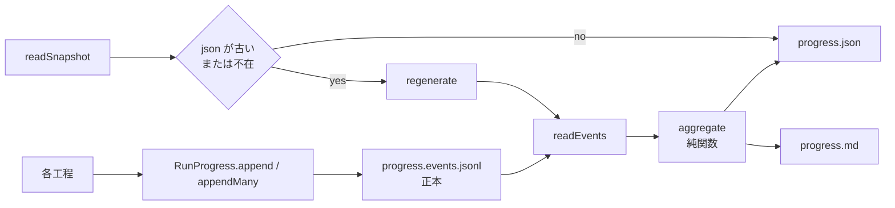
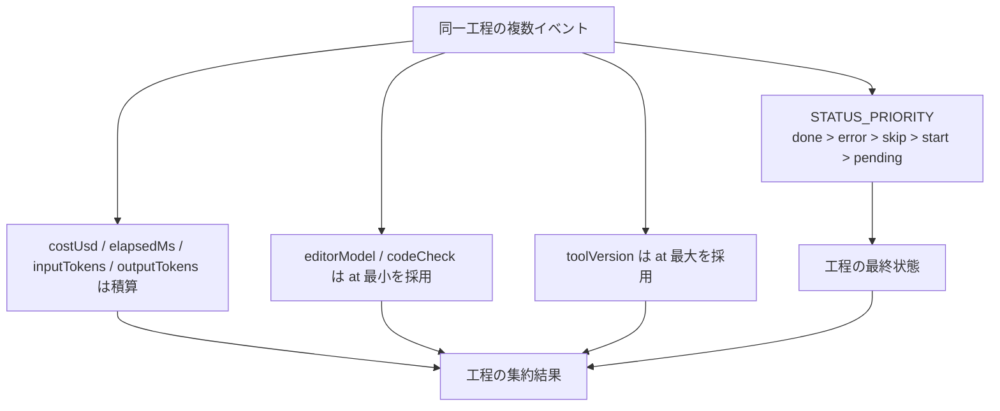

**events.jsonl を正本に、純関数で集約する** ― 状態優先度・コスト積算・first-write-wins で畳む

## 対象読者

本記事は、llm-task-router の使い方ではなく内部設計をソースから読むシリーズの第5回です。第1回で扱った first-write-wins と台帳設計、第4回で扱った「各工程がイベントを出す」実装を受けて、今回はそのイベントを受け止める **観測層** を見ます。

想定読者は次のような実装者です。

- 多工程処理の進捗・コストを記録したい人
- クラッシュ耐性のあるログを設計したい人
- イベントソーシングを小さく実装したい人

結論を先に置きます。llm-task-router の progress 層は、`progress.events.jsonl` を正本にし、`src/progress/aggregate.ts` の純関数で `progress.json` / `progress.md` を再生成する構成です。分散イベント基盤ではなく、**1ファイル追記 + 純関数集約**という最小実装ですが、状態優先度、コスト積算、first-write-wins、canonical 工程の固定を明示しているため、再試行や別名工程を含む run でも「いま何が終わったか」「どれだけ使ったか」「何が対象外だったか」を説明可能に保てます。

一方で、万能ではありません。`appendFile` は `fsync` を伴う永続化保証ではなく、append-only ログも無限には伸びません。壊れた行の読み飛ばしも、最後の1件を失う可能性を受け入れる設計です。本稿では、その利点と代償の両方を実ソースに沿って確認します。

## 進捗台帳が解く問題

多工程パイプラインでは、少なくとも次の観測が必要です。

- どの工程まで進んだか
- どの工程を `skip` したか
- どれだけ時間がかかったか
- 概算コストがいくらか
- 完成後に追加の修正や再検証が走ったか

これを単一の `progress.json` 上書きで持つと、現在状態は見やすい一方で、履歴と再生成可能性が弱くなります。たとえば `create` の重い `done` の後に軽い追記が来ると、後勝ち上書きではコストが過小表示になりえます。再試行中に `start` や `error` が混ざると、どの状態を最終状態として見せるかも曖昧になります。

llm-task-router の progress 層は、ここを「観測層」として分離しています。第4回で見た各工程はイベントを出すだけに留め、記録・順序づけ・集約・表示生成は `src/progress/...` に寄せます。責務を分けることで、工程側は処理本体に集中でき、progress 側は台帳としての一貫性に集中できます。

## 正本は `events.jsonl`、表示は派生物

まず全体像です。実体は次の4ファイルに分かれています。

- `src/progress/RunProgress.ts`
  - `append` / `appendMany` / `readEvents` / `readSnapshot` / `regenerate`
- `src/progress/aggregate.ts`
  - `aggregate` / `computePostCompletion` / `STATUS_PRIORITY`
- `src/progress/types.ts`
  - `ProgressEventStatus` などの型
- `src/progress/stepOrder.ts`
  - `QIITA_CANONICAL_STEPS` / `STEP_ALIASES` / `resolveCanonicalKey`

設計の中心は、`progress.events.jsonl` を **正本** とし、`progress.json` と `progress.md` を **派生物** として扱うことです。派生物は壊れても再生成できればよく、正本は append-only に保ちます。



この図で重要なのは、正本が1つに固定されていることです。`progress.json` を直接更新するのではなく、イベント列から毎回作り直せる形にしているため、表示形式を変更してもログの意味は変わりません。

あわせて、`regenerate` が書き出すのは **派生物だけ** です。`progress.events.jsonl` は読むだけで、書き換えません。`readSnapshot` は、`events.jsonl` と `progress.json` の `mtime` を比較し、events のほうが新しい、あるいは `progress.json` が存在しない場合に `regenerate` を呼びます。完全同期ではありませんが、派生物の stale 化を小さく抑える実装です。

## `RunProgress.ts` の責務は「追記」と「再生成」

`src/progress/RunProgress.ts` は、記録の入口と読み出しを引き受けます。ここで重要なのは、呼び出し側に時刻やバージョンの管理をさせないことです。

```ts
// src/progress/RunProgress.ts
type ProgressEventInput =
  Omit<ProgressEvent, "at" | "runId" | "version"> & { at?: string };

export class RunProgress {
  async append(runId: string, input: ProgressEventInput): Promise<void> {
    return this.appendMany(runId, [input]);
  }

  async appendMany(
    runId: string,
    inputs: ProgressEventInput[],
  ): Promise<void> {
    const events = inputs.map((input) =>
      withoutUndefined({
        ...input,
        runId,
        at: input.at ?? new Date().toISOString(),
        version: this.version,
      }),
    );

    const body = events.map((event) => JSON.stringify(event)).join("\n") + "\n";
    await appendFile(this.eventsPath, body, "utf8");
  }

  // ...
}
```

説明用の抜粋・簡略ですが、ポイントは実装どおりです。

- `append` / `appendMany` は第1引数に **`runId`** を取る
- 入力型は `ProgressEventInput = Omit<ProgressEvent, "at" | "runId" | "version"> & { at?: string }`
- `append` は **`appendMany(runId, [input])` に委譲**する
- `version` は **`RunProgress` 側で付与**する
- `at` は `input.at ?? new Date().toISOString()` で stamp する
- `withoutUndefined` で未定義フィールドを落とす
- **`seq` は存在しない**

ここは誤読しやすい箇所です。順序づけの主役は `seq` ではありません。実ソースに `seq` フィールドはなく、`appendMany` のバッチローカル順序を別キーで刻む実装にもなっていません。したがって、「`seq` により全順序を保証する」という説明は成り立ちません。本実装が採っている順序規則は、読み出し時に `at` とファイル内出現順を使うものです。順序づけは後述の `readEvents` で担います。

この責務分離は妥当です。イベントの意味を知っているのは工程側ですが、記録形式を知っているのは progress 層です。`version` を呼び出し側に渡させないことで、「台帳に何を保存するか」を progress 側で統制できます。

## `readEvents` は壊れた行を握りつぶして読む

append-only を採ると、次に必要なのは「どこまで壊れても読めるか」です。実ソースの `readEvents` は、JSONL の各行を読み、壊れた行はすべてスキップします。典型例は末尾の書きかけです。

```ts
// src/progress/RunProgress.ts の readEvents メソッドを説明用に寄せた抜粋
async readEvents(): Promise<ProgressEvent[]> {
  const text = await readFile(this.eventsPath, "utf8").catch(
    (error: NodeJS.ErrnoException) => {
      if (error.code === "ENOENT") return "";
      throw error;
    },
  );

  const parsed: Array<ProgressEvent & { i: number }> = [];
  const lines = text.split("\n");

  for (let i = 0; i < lines.length; i += 1) {
    const line = lines[i]?.trim();
    if (!line) continue;

    try {
      parsed.push({ ...(JSON.parse(line) as ProgressEvent), i });
    } catch {
      continue;
    }
  }

  parsed.sort((a, b) => (a.at === b.at ? a.i - b.i : a.at < b.at ? -1 : 1));
  return parsed.map(({ i: _i, ...event }) => event);
}
```

ここでの順序規則は明快です。

- まず JSONL の **ファイル内出現順** を `i` として持つ
- 壊れた行は `catch` で **無視して先に進む**
- 最後に **`(at, 出現index)` で安定ソート** する
- 同一 `at` の tie-break は **ファイル内の出現順**

つまり、順序の説明は「`at` が先、同一 `at` ならファイルで先に現れたほうが先」です。`seq` のような架空キーは使いません。

この設計の利点は、append-only の現実に合っていることです。末尾が書きかけでも、読める行までは活かせます。`ENOENT`、つまり events ファイル自体がまだ無い場合に空配列を返すのも、初回実行を自然に扱うためです。

一方で代償もあります。壊れた行を握りつぶすので、その1件は失われます。特に最後に追記しようとしたイベントが途中で切れた場合、その run の最新状態が一時的に見えなくなる可能性があります。ここでは「1件を落としても残りを活かす」を採っています。厳密な監査証跡を優先するなら、壊れた行で停止する設計もありえますが、本実装は可用性寄りです。

:::note warn
`appendFile` は追記 API ですが、`fsync` を伴う永続化保証ではありません。プロセスクラッシュ時に既に書けた行を救いやすい一方、OS クラッシュや電源断では未フラッシュ分を失う可能性があります。
:::

## `readSnapshot` は events を見て再生成する

派生物である `progress.json` / `progress.md` は、古ければ再生成します。`readSnapshot` の責務はそこです。

```ts
// src/progress/RunProgress.ts
async readSnapshot(): Promise<ProgressSnapshot> {
  const eventsMtime = await stat(this.eventsPath)
    .then((s) => s.mtimeMs)
    .catch(() => undefined);
  const jsonMtime = await stat(this.jsonPath)
    .then((s) => s.mtimeMs)
    .catch(() => undefined);

  if (
    jsonMtime === undefined ||
    eventsMtime === undefined ||
    eventsMtime > jsonMtime
  ) {
    await this.regenerate();
  }

  const text = await readFile(this.jsonPath, "utf8");
  return JSON.parse(text) as ProgressSnapshot;
}

async regenerate(): Promise<void> {
  const events = await this.readEvents();
  const snapshot = aggregate(this.runId, events);

  await writeFile(this.jsonPath, JSON.stringify(snapshot, null, 2), "utf8");
  await writeFile(this.mdPath, renderProgressMarkdown(snapshot), "utf8");
}
```

これは「events が正本で、json/md はキャッシュに近い」という立場をはっきり示しています。`readSnapshot` は json を鵜呑みにせず、events の `mtime` が新しければ再生成します。加えて、events の `mtime` が取れない場合も再生成します。events 不在でも `readEvents()` は空配列を返せるため、空の snapshot を再構成できます。

ただし、これも完全ではありません。

- `mtime` 精度はファイルシステム依存です
- `regenerate` 中に新しいイベントが追記されれば、その回の json には未反映になりえます
- stale 化を減らす仕組みであって、厳密同期ではありません

ここは意図的な軽量化です。progress 層は表示用派生物まで二相コミットする設計にはしていません。正本を events に絞り、派生物は必要時に再生する。その割り切りで十分という判断です。

## 集約の中心は `aggregate.ts`

正本がイベント列なら、現在の進捗は純関数で作れます。それが `src/progress/aggregate.ts` の `aggregate` です。I/O を持たないので、イベント列だけあれば同じ snapshot を再現できます。これが event sourcing 的な部分です。

ここで重要なのは、**すべてを後勝ち上書きにしていない**ことです。状態、数値、不変属性で採取規則を分けています。



読み方は単純です。同じ工程に複数イベントが来ても、何を最終状態とするか、何を積むか、何を最初の宣言として固定するかを別々に決めています。これがあるから、resume や review を含む run でも snapshot の意味が安定します。

### 状態は `STATUS_PRIORITY` で決める

実ソースでは、`STATUS_PRIORITY` は `src/progress/aggregate.ts` の **モジュール内 const** として定義されています。

```ts
// src/progress/aggregate.ts
const STATUS_PRIORITY: Record<ProgressStepStatus, number> = {
  pending: 0,
  start: 1,
  skip: 2,
  error: 3,
  done: 4,
};
```

相対順序は次のとおりです。

- `done(4)`
- `error(3)`
- `skip(2)`
- `start(1)`
- `pending(0)`

ここで整理しておくべきなのは型の役割です。記録されるイベント状態である `ProgressEventStatus` は `start` / `done` / `skip` / `error` の4状態で、**`pending` は含みません**。`pending` を持つのは、集約後の表示状態型である **`ProgressStepStatus = ProgressEventStatus | "pending"`** 側です。したがって、`pending` は表示専用で events には現れませんが、優先度表には必要です。

実装上は、同一工程のイベントを走査し、`STATUS_PRIORITY[ev.status] >= STATUS_PRIORITY[a.finalStatus]` のとき最終状態と代表イベントを更新します。つまり、**同優先度では後勝ち**です。

```ts
// src/progress/aggregate.ts
for (const ev of stepEvents) {
  // ...

  if (STATUS_PRIORITY[ev.status] >= STATUS_PRIORITY[a.finalStatus]) {
    a.finalStatus = ev.status;
    a.finalEvent = ev;
  }

  // ...
}
```

これが効く場面は具体的です。

- `error` の後に再実行して `done` したら、最終状態は `done`
- `done` の後に `skip` が来ても、`done` が勝つ
- 同じ `error` が複数回出たら、後の `error` の note や output が代表値になる

単純な時系列後勝ちだけでは「軽い resume が重い create を消す」問題が出ますし、逆に単純な最強状態固定だけでも同優先度内の更新を拾えません。優先度 + 同優先度後勝ちの組み合わせは、その中間です。

### コストと時間は積算する

数値項目は上書きではなく積算です。対象は次の4つです。

- `costUsd`
- `elapsedMs`
- `inputTokens`
- `outputTokens`

```ts
// src/progress/aggregate.ts
if (ev.costUsd !== undefined) {
  a.costUsd = Number(((a.costUsd ?? 0) + ev.costUsd).toFixed(6));
}
if (ev.elapsedMs !== undefined) {
  a.elapsedMs = (a.elapsedMs ?? 0) + ev.elapsedMs;
}
if (ev.inputTokens !== undefined) {
  a.inputTokens = (a.inputTokens ?? 0) + ev.inputTokens;
}
if (ev.outputTokens !== undefined) {
  a.outputTokens = (a.outputTokens ?? 0) + ev.outputTokens;
}
```

ここで **`totalTokens` は積算しません**。実ソースの `ModelUsage` に合わせ、入力・出力だけを足します。これは第2回の設計と整合しています。

なぜ積算か。理由は単純で、1工程が複数イベントから成るからです。たとえば `create` 本体で大きな token 消費があり、その後の review 的な `done` が軽量でも、最終イベントだけを表示するとコストが過小になります。工程の総消費を見たいなら積算が必要です。

もちろん、代償として重複追記に弱くなります。同じ課金イベントを誤って二重に append すれば、そのまま二重計上です。本実装はイベント ID による冪等化までは持ち込みません。ここでは「実際の追加消費は積むが、重複再送はしない」という前提を採っています。

### `editorModel` と `codeCheck` は first-write-wins

属性ごとに採取規則が違う例として、`editorModel` と `codeCheck` があります。実装は、該当値を持つイベントから **`at` 最小** を採ります。

```ts
// src/progress/aggregate.ts
const codeCheck =
  codeCheckEvents.length > 0
    ? codeCheckEvents.reduce((a, b) => (a.at <= b.at ? a : b)).codeCheck
    : undefined;

const editorModel =
  editorModelEvents.length > 0
    ? editorModelEvents.reduce((a, b) => (a.at <= b.at ? a : b)).editorModel
    : undefined;
```

これは第1回で扱った first-write-wins が、progress 集約に具体化された箇所です。意味としてはこうです。

- `codeCheck`
  - その run で build 検証を対象にするかという前提。後続の小さなイベントで書き換えない
- `editorModel`
  - 記録時点で編集長が明示したモデル名。最初の宣言を固定する

特に `editorModel` は注意が必要です。これは **自己申告の観測値** であって、厳密な監査値ではありません。実行環境が自動的に証明した値ではなく、「この run はこのモデルで進めた」と台帳に載せるためのメタデータです。ここを監査ログと混同しないことが大事です。

### `toolVersion` は at 最大を採る

一方で `toolVersion` は逆です。値を持つイベントから **`at` 最大** を採ります。

```ts
// src/progress/aggregate.ts
const toolVersion =
  versionEvents.length > 0
    ? versionEvents.reduce((a, b) => (a.at >= b.at ? a : b)).version
    : undefined;
```

これは last-write-wins 相当です。理由は、`toolVersion` が「この台帳が最終的にどの版の記録ツールを通ったか」を見る属性だからです。`editorModel` や `codeCheck` のような開始時前提とは意味が違います。属性ごとに規則を変えているのは、揺れではなく設計判断です。

## canonical 工程で現在地を安定させる

進捗表示で難しいのは、イベント名の揺れや追加工程に引きずられず「何工程中の何番目か」を保つことです。ここを担うのが `src/progress/stepOrder.ts` です。

### `QIITA_CANONICAL_STEPS` は9工程

実ソースの canonical 工程は9つです。

- `create`
- `refine`
- `direction`
- `factcheck`
- `build-verify`
- `editorial`
- `claims-normalize`
- `verify-artifacts`
- `export`

これらは label 付きで定義され、snapshot の主要な工程表はこの順序で並びます。現在地計算もこの canonical 群を基準に行います。

### `STEP_ALIASES` で別名を畳む

実運用では工程名が揺れます。そこで `STEP_ALIASES` を通して canonical key に解決します。

```ts
// src/progress/stepOrder.ts
export const STEP_ALIASES: Record<string, string> = {
  brief: "create",
  outline: "create",
  draft: "create",
  review: "create",
  final: "create",
  evaluate: "refine",
  "review-editorial": "editorial",
  editorial_review: "editorial",
  "claims-recheck": "claims-normalize",
  "direction-check": "direction",
};

export function resolveCanonicalKey(step: string): string {
  return STEP_ALIASES[step] ?? step;
}
```

畳み先は次のとおりです。

- `brief` / `outline` / `draft` / `review` / `final` → `create`
- `evaluate` → `refine`
- `review-editorial` / `editorial_review` → `editorial`
- `claims-recheck` → `claims-normalize`
- `direction-check` → `direction`

これにより、ログ上の step 名が少し揺れても、現在地としては同じ工程に畳めます。

### canonical に無い工程は末尾に出す

`resolveCanonicalKey` 後も canonical に含まれない工程、たとえば `revise` のような追加工程は消しません。snapshot では **追加工程** として末尾に、登場順で並びます。

この設計はバランスがよいです。標準工程の現在地は canonical によって安定させつつ、実際に起きた追加作業も失いません。追加工程が canonical の進捗カウンタを乗っ取らない点が重要です。

### 現在地は canonical の未完だけを見る

`currentIndex` と `complete` の判定は、canonical 工程だけを対象にします。未完とみなすのは canonical かつ次の状態です。

- `pending`
- `start`
- `error`

つまり `done` と `skip` は決着済みです。`complete` は **全 canonical が `done` または `skip`** になったときに真になります。

ここで `error` を未完扱いにするのは妥当です。失敗は「終わった」ではなく「止まっている」だからです。逆に `skip` を決着済みに含めるのは、「対象外」という判断も工程としては完了だからです。

### `build-verify` の synthetic skip

`build-verify` には特例があります。`codeCheck === false` で、かつその工程の実イベントが存在しない場合、snapshot 側で **`status: "skip"` の行** を作り、`note` を付けて表示上は「対象外」と扱います。

これは小さいですが効く実装です。code 検証が不要な run で `build-verify` の実イベントが無いと、素朴には「未着手」に見えてしまいます。しかし実際には対象外です。そこで snapshot 側で対象外の skip 行を補い、未実施の必須工程に見せないようにしています。complete 判定でも決着済みとして扱えるため、`codeCheck = false` の run が常に未完になることも防げます。

なお、ここで区別しているのはフィールドではなく由来です。実イベント由来の `skip` と、`build-verify` 既定オフにより snapshot 側で補われた対象外の `skip` は意味が違いますが、その違いは `note` と生成経路で表現されます。

## `postCompletion` は完成後の実操作を残す

canonical 工程が全部終わった後にも、`revise` や追加の `factcheck` が走ることがあります。これを主工程表に混ぜると、「完了したはずなのにまた進捗が戻った」ように見えてしまいます。

そこで `aggregate.ts` の `computePostCompletion` は、**全 canonical が初めて `done` / `skip` を満たした境界**を求め、それ以降のイベントを `postCompletion` として生の時系列で残します。

考え方は次のとおりです。

- 主工程表
  - canonical 工程として、どこまで決着したか
- `postCompletion`
  - 完成後に何を追加で回したか

これにより、「記事としては完成したが、その後に事実確認を追加した」「完成後に revise を入れた」といった運用が進捗表を壊しません。完成境界の前後でビューを分けるのは、観測目的が違うからです。

ここで重要なのは、完成境界は **最初に全 canonical が揃った時点で確定し、戻らない** ことです。実装は `allComplete` を初めて満たしたイベントで break するため、その後に canonical 工程の再イベントが来ても、それらは `postCompletion` 側に入ります。たとえば全 canonical 完了後に `revise` を実行し、その流れで `factcheck-scope` の再イベントが追加されても、完成境界そのものは動かず、それ以降のイベントとして `postCompletion` に並びます。

この処理は `readEvents` の順序、つまり `at` ソート + 同一 `at` は出現順、を前提に決定的に動きます。ここでも架空の比較関数は不要で、events の読み出し順がそのまま基礎になります。

## 型設計のポイント

`src/progress/types.ts` では、イベントと snapshot の責務が分かれています。ここで押さえるべき点だけ挙げます。

- `ProgressEventStatus` は記録される4状態 `start` / `done` / `skip` / `error` を表す
- `ProgressStepStatus` は `ProgressEventStatus | "pending"` で、表示上の未着手を含む
- イベントには `step` / `status` / `at` / `version` と各種メタデータが乗る
- snapshot 側は canonical 工程表、集約済み数値、`complete`、`currentIndex`、`postCompletion` を持つ

特に `pending` は、「永続イベントとして何度も append する値」というより、snapshot 上の未着手表現と結びついた状態です。progress 層はイベント保存と表示生成を分けているため、この種の状態を混同しにくくなっています。

## なぜこれを「小さなイベントソーシング」と呼べるのか

ここまで見ると、やっていることは大げさではありません。

- 正本は append-only な JSONL
- 表示用 snapshot は純関数で再生
- 属性ごとに畳み方を変える
- canonical 工程で進捗表示を安定化

これだけです。ただし、この小ささが重要です。分散ログ基盤やイベントストアを持ち込まなくても、1 run の観測という範囲なら十分な説明力が出ます。第1回で触れた first-write-wins が属性規則として使われ、第4回で見た「各工程がイベントを出す」がここで集約される。シリーズ全体としても筋が通っています。

一方で、権威化しすぎる必要はありません。これは単一ファイル追記 + 純関数集約の最小実装です。複数ホスト・厳密耐障害・強い冪等性が必要なら、設計は別物になります。

## 設計の代償と限界

利点だけでなく、採っている代償も明示しておきます。

- `readSnapshot` の再生成判定は `mtime` ベースです。したがって stale を完全には防げず、近似判定として割り切っています。
- `appendFile` は durability を保証しません。append-only でも、電源断や OS クラッシュまで含めて安全になるわけではありません。
- `readEvents` は壊れた行をスキップするため、台帳全体を止めない代わりに最新1件を失う可能性があります。
- `editorModel` は自己申告メタデータであり、モデル使用の厳密証跡ではありません。
- append-only ログは保持期間や run 数が増えると肥大化します。個人記事スケールではそのままで足りる場合が多い一方、保管期間や再生成コストが無視できなくなったら compaction を検討する余地があります。どの時点で必要になるかは、実運用の保持方針で判断すべきです。

## まとめ

本稿の要点は次の4つです。

- 正本は `progress.events.jsonl`、`progress.json` / `progress.md` は派生物
- `readEvents` は壊れた行をスキップし、`(at, 出現index)` で安定順序を作る
- `aggregate` は状態優先度、数値積算、first-write-wins、`toolVersion` の at 最大採用を使い分ける
- canonical 9工程と alias 解決で、現在地表示を揺らさない

これにより、llm-task-router の progress 層は「工程が出した事実の列」を「読める進捗表」に変換しています。単なるログ保存ではなく、何を固定し、何を積み、何を表示補助として補うかを明示した観測設計です。

第4回では各工程がどうイベントを出すかを見ました。本稿はその受け皿です。次の第6回では、この progress 台帳を前提に、さらに上位の運用や生成物側の整合をどう扱うかを見ると、シリーズ全体の責務分割がつながって見えてきます。

## 参考

<!-- sources:begin -->
- [S005] llm-task-router src/progress/types.ts（primary, retrieved: 2026-06-27）
  https://github.com/rex0220/llm-task-router/blob/2b8656e94beab67014d986febb8a8dacda485163/src/progress/types.ts
- [S006] llm-task-router src/progress/aggregate.ts（primary, retrieved: 2026-06-27）
  https://github.com/rex0220/llm-task-router/blob/2b8656e94beab67014d986febb8a8dacda485163/src/progress/aggregate.ts
- [S007] llm-task-router src/progress/RunProgress.ts（primary, retrieved: 2026-06-27）
  https://github.com/rex0220/llm-task-router/blob/2b8656e94beab67014d986febb8a8dacda485163/src/progress/RunProgress.ts
- [S008] llm-task-router src/progress/stepOrder.ts（primary, retrieved: 2026-06-27）
  https://github.com/rex0220/llm-task-router/blob/2b8656e94beab67014d986febb8a8dacda485163/src/progress/stepOrder.ts
<!-- sources:end -->
