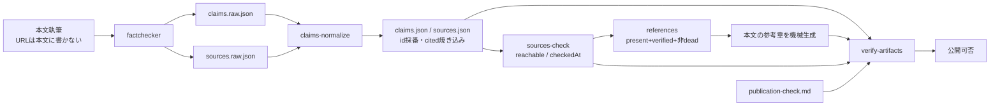
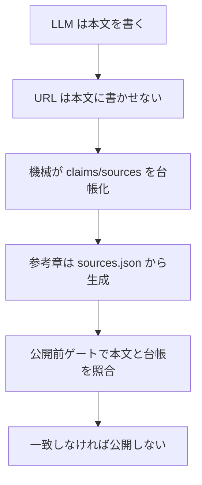

**書き手に URL を書かせず、機械が台帳化し、公開前ゲートで本文と台帳を照合する**

## 対象読者

使い方ではなく内部設計をソースから読むシリーズの第6回です。未読でも本稿は読めますが、第3回で扱った構造化出力と第5回で扱った追記専用台帳を読むと、`claims` / `sources` 台帳がどう地続きになっているかを追いやすくなります。本文中では外部リンクに依存せず、参照は末尾の機械生成された参考章に集約します。

想定読者は次の通りです。

- LLM 出力の出典を仕組みで担保したい人
- 偽 URL や誤事実を機械で弾きたい人
- 検証台帳と公開前ゲートを設計したい人

## この回が解く問題

LLM に本文と出典を同時に書かせると、もっともらしいが存在しない URL、古い API 名、誤ったバージョンが混ざります。しかも見た目は自然なので、人手レビューだけでは漏れます。

本稿の結論は明確です。**出典の正本を本文に置かない**ことです。本文執筆、裏取り、台帳化、到達確認、参考章生成、公開前検証を分離し、URL の正本化と公開判定をコード側に寄せます。

ここで扱うのは、単なる factcheck の運用論ではありません。`llm-task-router` のソースでは、次の 4 点が一続きの設計になっています。

- 書き手に URL を書かせない
- `claims` / `sources` を二段の台帳として残す
- 参考章を `sources.json` から機械生成する
- 公開前に本文と台帳の整合を機械ゲートで弾く

重要なのは、どこか一箇所で「賢く」することではありません。混入経路を減らし、識別子と証跡を機械側で固定し、最後に drift を検出することです。

## まず前提：factchecker の自己申告も信用しない

本文執筆モデルを信用しない、という話はよくあります。本シリーズではさらに一歩進めて、**factchecker の自己申告もそのままは信用しません**。

factchecker も LLM を含む工程です。したがって、

- 「この URL は有効です」
- 「この claim は verified です」
- 「この参考章で合っています」

といった申告を、そのまま公開物の根拠にはしません。

必要なのは、自己申告と客観確認を同じ場所に置かないことです。これが `claims` / `sources` 台帳、`sources-check`、`references`、`verify-artifacts` を分離している理由です。

第1回で触れた first-write-wins は、後段で効く識別子を最初の確定値で固定し、後から自由記述で上書きさせない考え方でした。ここでも同じで、LLM に公開系の識別子や判定を発明させません。第3回の Continuation では、構造化出力の継続性をモデルではなく機械で担保しましたが、本稿でもモデルは素材を出す側に留め、整合性は機械に寄せます。

## 全体像：裏取りから参考章までのデータフロー

まず全体の流れを見ます。



この流れの読み方は単純です。本文、台帳、参考章、公開判定を同じ自由記述に乗せない、ということです。

- LLM は本文や raw 台帳の素材を出す
- 機械が id を採番し、参照関係を確定する
- 別工程が URL 到達を確認する
- 参考章は正式台帳から再生成する
- 最後に整合と宣言の有無だけをゲートで見る

責務分離を表にすると次の通りです。

| 役割 | 責務 | やらないこと |
| --- | --- | --- |
| 本文執筆 | 文章を書く | URL を本文に直接書かない |
| factchecker | claim 分解と source 候補の抽出 | 公開判定しない、到達性を確定しない |
| `claims-normalize` | id 採番、参照関係の確定、`cited` 焼き込み | fact の真偽を再判定しない |
| `sources-check` | URL 到達確認、`reachable` / `checkedAt` の stamp | 本文の意味解釈をしない |
| `references` | `sources.json` から参考章を機械生成 | 本文中の任意 URL を信用しない |
| `verify-artifacts` | 台帳・本文・宣言の整合検査 | factcheck の中身を再判定しない |

## 偽 URL 防止の要点は 3 つだけ

偽 URL 防止の要点だけを抜き出すと、柱は次の 3 つです。



一つずつは地味ですが、組み合わせると効きます。URL の正本を本文から剥がし、参考章を手書きから剥がし、最後に drift を弾く。これで「自然に見える偽 URL」が公開物へ混ざる経路をかなり絞れます。

## 本論1：二段台帳 ― raw と正式台帳を分ける理由

中核になるのが、`claims` / `sources` を raw と正式台帳に分ける設計です。

- `RawClaim` / `RawSource`: LLM が出した素材
- `Claim` / `Source`: normalize 後の正式台帳

ここで重要なのは、**LLM に識別子を発明させない**ことです。source の `key` は raw での参照用に留め、公開系で使う `id` は機械が採番します。claim 側も同様で、最終的に使うのは `C...` 形式の id です。

この設計は第3回の構造化出力と同じ思想です。第3回では、モデルに識別子を発明させず、検証結果を型に収めたうえで継続性を機械に寄せました。ここでもモデルには「何があるか」を出させますが、「何番で管理するか」は機械が決めます。こうしておくと、後段が raw の自由記述に依存しません。

採らなかった代替案は、本文モデルや factchecker に最終 id や公開用の参照関係まで持たせる設計です。これは短期的には工程が少なく見えますが、識別子の安定性、重複排除、drift 検出の責務が曖昧になります。本シリーズの方針とは逆です。

## 本論2：`ClaimsSchema.ts` ― 公開系の不変条件を固定する

schema の不変条件として前提になるのが、`src/schemas/ClaimsSchema.ts` が何を固定しているかです。ここは公開系の全工程の土台になります。

この抜粋で確認したいのは、公開判定に効く enum、id 形式、`verified` に対する出典必須、source 側の保守的な既定値です。

```ts
// src/schemas/ClaimsSchema.ts
import { z } from "zod";

const CLAIM_ID = /^C\d{3}-[0-9a-f]{8}$/;
const SOURCE_ID = /^S\d{3}$/;
const ANCHOR_HASH = /^[0-9a-f]{8}$/;
const YYYY_MM_DD = /^\d{4}-\d{2}-\d{2}$/;

export const CLAIM_STATUSES = [
  "unverified",
  "verified",
  "needs-source",
  "incorrect",
] as const;

export const CLAIM_LIFECYCLES = ["present", "removed"] as const;

export const SEVERITIES = [
  "critical",
  "major",
  "minor",
  "suggestion",
] as const;

export const CLAIM_TYPES = [
  "api",
  "price",
  "version",
  "technical",
  "general",
] as const;

export const SOURCE_TYPES = ["primary", "secondary"] as const;
export const REACHABILITY = ["ok", "dead", "unknown"] as const;

const ClaimStatus = z.enum(CLAIM_STATUSES);
const ClaimLifecycle = z.enum(CLAIM_LIFECYCLES);
const Severity = z.enum(SEVERITIES);
const ClaimType = z.enum(CLAIM_TYPES);
const SourceType = z.enum(SOURCE_TYPES);
const Reachability = z.enum(REACHABILITY);

export const RawClaimSchema = z.object({
  claim: z.string().min(1),
  location: z.object({
    heading: z.string(),
  }),
  type: ClaimType,
  status: ClaimStatus,
  sourceRefs: z.array(z.string()),
  severity: Severity,
  note: z.string().optional(),
}).refine(
  (claim) => claim.status !== "verified" || claim.sourceRefs.length > 0,
  {
    message: "verified claim must have at least one sourceRef",
    path: ["sourceRefs"],
  },
);

export const RawSourceSchema = z.object({
  key: z.string(),
  url: z.string().url(),
  title: z.string(),
  retrievedAt: z.string().regex(YYYY_MM_DD),
  sourceType: SourceType.default("secondary"),
  summary: z.string(),
  reachable: Reachability.optional(),
  checkedAt: z.string().optional(),
  replacedByKey: z.string().optional(),
});

export const ClaimSchema = z.object({
  id: z.string().regex(CLAIM_ID),
  claim: z.string().min(1),
  location: z.object({
    heading: z.string(),
    anchorHash: z.string().regex(ANCHOR_HASH),
  }),
  type: ClaimType,
  status: ClaimStatus,
  lifecycle: ClaimLifecycle,
  sourceIds: z.array(z.string().regex(SOURCE_ID)),
  severity: Severity,
  note: z.string().optional(),
  cited: z.boolean(),
}).refine(
  (claim) => claim.status !== "verified" || claim.sourceIds.length > 0,
  {
    message: "verified claim must have at least one sourceId",
    path: ["sourceIds"],
  },
);

export const SourceSchema = z.object({
  id: z.string().regex(SOURCE_ID),
  url: z.string().url(),
  title: z.string(),
  retrievedAt: z.string().regex(YYYY_MM_DD),
  sourceType: SourceType,
  summary: z.string(),
  reachable: Reachability.optional(),
  checkedAt: z.string().optional(),
  replacedBy: z.string().regex(SOURCE_ID).optional(),
  cited: z.boolean().optional(),
});

// ...
```

ここで見るべき点は 4 つあります。

### 1. `severity` は `critical | major | minor | suggestion`

この enum は公開可否に効くので、曖昧にできません。`low` / `medium` / `high` ではありません。blocking 判定と接続する以上、実ソースの列挙値に忠実である必要があります。

### 2. claim は `type` を持つ

`CLAIM_TYPES = ["api", "price", "version", "technical", "general"]` です。単に本文断片を列挙するのではなく、どの種別の主張かを持たせます。これで後段は「API 名やバージョンの claim を重点的に見る」といった運用をしやすくなります。

### 3. source は `sourceType` を持つ

`SOURCE_TYPES = ["primary", "secondary"]` です。`RawSource` は `sourceType` を持ち、default は `"secondary"` です。これは「明示しなければ二次情報として扱う」という保守的な設計です。

### 4. `verified` には出典必須を schema 自体へ入れる

これは補助関数ではなく `ClaimSchema` の refine に入っています。理由は単純で、公開系のどこかが `ClaimSchema` を直接読むなら、その時点で不変条件が効いていてほしいからです。別 export の検査関数だけにすると、呼び忘れの余地が残ります。

また、正式台帳の `id` は `C\d{3}-[0-9a-f]{8}` です。この後半 8 桁は `location.anchorHash` と対応する値です。つまり claim id のハッシュ部は位置由来であり、固定のプレースホルダを埋める前提ではありません。

## 本論3：`claims-normalize` ― raw を正式台帳へ変換する

`src/cli/claimsNormalize.ts` の責務は、raw 台帳を公開用の正式台帳へ変換することです。ここでやるのは fact の再判定ではなく、識別子と参照関係の確定です。

具体的には次を行います。

- raw source の `key` を正式台帳の `id`、つまり `S\d{3}` へ解決する
- claim の `sourceRefs` を `sourceIds` に変換する
- `cited` を焼き込む
- 死リンク置換用の `replacedByKey` を `replacedBy`、つまり `S...` に解決する

要するに、**LLM は素材を出し、機械が id を付けて台帳に載せる**工程です。第3回の Continuation では、生成途中の継続性を自由記述に頼らず機械で担保しましたが、ここでも同じで識別子の継続性は機械側で持ちます。第1回の first-write-wins も、最初に確定した管理情報を後から揺らさないための設計でした。ここでモデルに管理番号を発明させないのは、その延長です。

この抜粋で確認したいのは、`key` から `S...` への解決、`C...` の採番、`cited` が派生値として焼き込まれていることです。

```ts
// src/cli/claimsNormalize.ts
type RawClaim = {
  claim: string;
  location: { heading: string };
  type: "api" | "price" | "version" | "technical" | "general";
  status: "unverified" | "verified" | "needs-source" | "incorrect";
  sourceRefs: string[];
  severity: "critical" | "major" | "minor" | "suggestion";
  note?: string;
};

type RawSource = {
  key: string;
  url: string;
  title: string;
  retrievedAt: string;
  sourceType: "primary" | "secondary";
  summary: string;
  reachable?: "ok" | "dead" | "unknown";
  checkedAt?: string;
  replacedByKey?: string;
};

type Claim = {
  id: `C${string}`;
  claim: string;
  location: { heading: string; anchorHash: string };
  type: RawClaim["type"];
  status: RawClaim["status"];
  lifecycle: "present" | "removed";
  sourceIds: `S${string}`[];
  severity: RawClaim["severity"];
  note?: string;
  cited: boolean;
};

type Source = {
  id: `S${string}`;
  key: string;
  url: string;
  title: string;
  retrievedAt: string;
  sourceType: "primary" | "secondary";
  summary: string;
  reachable?: "ok" | "dead" | "unknown";
  checkedAt?: string;
  replacedByKey?: string;
  replacedBy?: `S${string}`;
};

export function normalizeClaimsAndSources(
  rawClaims: RawClaim[],
  rawSources: RawSource[],
) {
  const sources: Source[] = rawSources.map((source, index) => ({
    id: `S${String(index + 1).padStart(3, "0")}`,
    ...source,
  }));

  const sourceIdByKey = new Map(sources.map((source) => [source.key, source.id]));

  for (const source of sources) {
    if (source.replacedByKey) {
      source.replacedBy = sourceIdByKey.get(source.replacedByKey);
    }
  }

  const claims: Claim[] = rawClaims.map((rawClaim, index) => {
    const anchorHash = computeAnchorHash(rawClaim.location, rawClaim.claim);
    const sourceIds = Array.from(
      new Set(
        rawClaim.sourceRefs
          .map((ref) => sourceIdByKey.get(ref))
          .filter((id): id is `S${string}` => Boolean(id)),
      ),
    );

    return {
      id: `C${String(index + 1).padStart(3, "0")}-${anchorHash}`,
      claim: rawClaim.claim,
      location: {
        heading: rawClaim.location.heading,
        anchorHash,
      },
      type: rawClaim.type,
      status: rawClaim.status,
      lifecycle: "present",
      sourceIds,
      severity: rawClaim.severity,
      note: rawClaim.note,
      cited: sourceIds.length > 0,
    };
  });

  return { claims, sources };
}

// ...
```

ここで大事なのは、`cited` が独立した真実ではないことです。`cited` は `sourceIds.length > 0` から導ける派生値であり、normalize が焼き込みます。source 側の `cited` も同様に派生値で、正本は claims、つまり claim の `sourceIds` から再導出できる情報です。

また、この工程を通した後、公開系の CLI は raw の `key` や `sourceRefs` を見なくてよくなります。以降の工程は `S...` と `C...` を前提に動きます。責務境界が明確です。

運用上は、blocking な claim が残っている限り公開できません。具体的な NO-GO 条件は次の 3 条件の AND です。

| 条件 | 値 |
| --- | --- |
| lifecycle | `present` |
| severity | `critical` または `major` |
| status | `unverified` / `needs-source` / `incorrect` |

この判定は claims-normalize 後の正式台帳で blocking として見える形になり、公開前ゲートの判断とも連動します。判定主体が工程をまたぐので、ここを散文で曖昧にしないことが重要です。

## 本論4：参考章生成 ― 正本は `sources.json`

偽 URL 防止という観点で出力面に最も効くのはここです。**参考章の正本は `sources.json`** です。`src/cli/references.ts` は、この正式台帳から参考章を再生成します。

つまり、公開物に載る URL は本文執筆モデルの生成物ではありません。検証工程を通った台帳の派生物です。これで「本文中のもっともらしい URL」を正本扱いしなくて済みます。

### `selectReferenceSources` が載せるもの

参考章に載る source は、台帳に source があるだけでは足りません。`selectReferenceSources(claims, sources)` は次の条件を通したものだけを返します。

- `lifecycle: "present"` な claim から参照されている
- その claim が `status: "verified"` である
- source が `reachable === "dead"` ではない
- id 昇順
- 重複排除

つまり、`cited` と参考章掲載は別概念です。

- `cited`: その claim が source を持つか
- 参考章掲載: `present + verified + 非dead` を通った source か

この区別は重要です。`cited: true` の claim があっても、`verified` でなければ参考章には載りません。逆に source 自体が `dead` なら、参照は残っていても参考章へ焼きません。

この抜粋で確認したいのは、参考章への掲載条件が `present + verified + 非dead` に限定されていることです。

```ts
// src/cli/references.ts
type ReferenceClaim = {
  lifecycle: "present" | "removed";
  status: "unverified" | "verified" | "needs-source" | "incorrect";
  sourceIds: string[];
};

type ReferenceSource = {
  id: string;
  title: string;
  url: string;
  reachable?: "ok" | "dead" | "unknown";
};

export function selectReferenceSources(
  claims: ReferenceClaim[],
  sources: ReferenceSource[],
): ReferenceSource[] {
  const selectedIds = new Set<string>();

  for (const claim of claims) {
    if (claim.lifecycle !== "present") continue;
    if (claim.status !== "verified") continue;

    for (const sourceId of claim.sourceIds) {
      selectedIds.add(sourceId);
    }
  }

  return sources
    .filter((source) => selectedIds.has(source.id))
    .filter((source) => source.reachable !== "dead")
    .sort((a, b) => a.id.localeCompare(b.id));
}
```

このロジックは単純ですが、出典の正本を台帳へ寄せるうえで十分に強いです。本文に URL があっても、それは参考章の入力になりません。

### マーカーブロックで差し替える理由

参考章の本文差し替えは、`sources:begin` / `sources:end` というマーカーコメントで管理します。

このブロック単位で再生成すれば、人が前後に書いた本文や補足を壊しにくく、再実行も冪等です。見出しはブロックの外に置きます。既定は `## 参考` ですが、run 単位でカスタムできます。しかも first-write-wins なので、見出しの採用は早い段階で固定されます。

大事なのは、**検証ゲートは見出しに依存しない**ことです。実際に照合するのはマーカーブロックの中身です。したがって、見出し文言の揺れは公開判定の本質ではありません。

### LLM が勝手に書いた参考節は除去する

`stripLlmReferenceSections` は、LLM が本文に書いた参考節を消します。対象は `## 参考リンク`、`## 出典`、`## References` のような見出しを持ち、かつ URL を含む節です。

重要なのは `hasUrl` ガードです。同名の散文を誤って消さないため、URL を含むときだけ除去します。また、機械生成の `## 参考` 節は、マーカーブロックを持つので保護されます。つまり「参考」という見出し名だけで一律削除はしません。

この抜粋で確認したいのは、機械生成ブロックを保護しつつ、LLM が手書きした参考節だけを除去していることです。

```ts
// src/cli/references.ts
const SOURCES_BEGIN = "<!-- sources:" + "begin -->";
const SOURCES_END = "<!-- sources:" + "end -->";

export function stripLlmReferenceSections(markdown: string): string {
  const sections = splitSections(markdown);

  return sections
    .filter((section) => {
      if (section.body.includes(SOURCES_BEGIN)) return true;

      const looksLikeRefs =
        /^(参考リンク|参考|出典|references?)$/i.test(section.heading.trim());
      const hasUrl = /https?:\/\/\S+/.test(section.body);

      return !(looksLikeRefs && hasUrl);
    })
    .map(renderSection)
    .join("\n\n");
}

// ...
```

この設計で、「LLM に URL を書かせない」は単なるお願いではなくなります。書いてしまっても、その節は strip され、正本は `sources.json` から再生成されます。

なお、自リポジトリ内のコード参照を commit SHA permalink で固定する方針も、外部 URL の検証とは別に、内部コード参照の版ずれを防ぐという意味で同じ文脈にあります。本文に手書きの参考リスト節を置かず、参考章は `article:references` に一本化する方が drift を減らせます。

## 本論5：`sources-check` ― URL 到達性を保守的に stamp する

`src/cli/sourcesCheck.ts` は、URL の HTTP 到達を確認して `reachable` と `checkedAt` を stamp する工程です。ここは外部通信を行う公開前の標準工程です。

設計の肝は一つです。**到達の確定 `ok` は機械だけが書ける**ことです。

factchecker が「この URL は生きている」と言っても、それは自己申告です。`ok` を書けるのは、実際に通信した `sources-check` だけです。逆に、factchecker が出せるのは「この URL は dead かもしれない」というヒントまでで、未確認 source の `reachable` は省略できます。

ここで `reachable` に default を付けないのも重要です。区別したいのは次の 2 つだからです。

- 省略: まだ確認していない
- `unknown`: 確認したが `ok` / `dead` に確定できなかった

この差は証跡として意味があります。default で `unknown` を埋めると、未確認と確認済み不明が潰れます。

### 判定は保守的にする

実装の判定は保守的です。

| ステータス | 判定 | 理由 |
| --- | --- | --- |
| 2xx | `ok` | 到達を確認できたため |
| 404 / 410 | `dead` | リソース不存在を比較的強く言えるため |
| NXDOMAIN（リトライ後も再現） | `dead` | 名前解決不能が継続し、到達先が存在しないと判断しやすいため |
| 5xx | `unknown` | 一時障害の可能性があるため |
| 401 / 403 | `unknown` | リソースは存在しても認証・権限・bot ブロックでアクセス不可の可能性が高いため |
| 未解決 3xx / timeout / 接続拒否 / TLS エラー | `unknown` | 一過性または環境依存の失敗を断定しないため |

これは **偽 dead を出さない** ためです。存在しないと強く言えるときだけ `dead` にし、それ以外は `unknown` に寄せます。

この抜粋で確認したいのは、`ok` と `dead` の確定条件を狭く取り、それ以外を `unknown` に倒していることです。

```ts
// src/cli/sourcesCheck.ts
type Reachable = "ok" | "dead" | "unknown";

type Source = {
  id: string;
  url: string;
  reachable?: Reachable;
  checkedAt?: string;
};

async function checkReachability(url: string): Promise<Reachable> {
  const head = await fetch(url, {
    method: "HEAD",
    redirect: "follow",
  }).catch(() => null);

  if (head && head.status >= 200 && head.status < 300) return "ok";
  if (head && (head.status === 404 || head.status === 410)) return "dead";

  const get = await fetch(url, {
    method: "GET",
    redirect: "follow",
  }).catch(() => null);

  if (get && get.status >= 200 && get.status < 300) return "ok";
  if (get && (get.status === 404 || get.status === 410)) return "dead";

  return "unknown";
}

export async function sourcesCheck(sources: Source[]): Promise<Source[]> {
  const checkedAt = new Date().toISOString().slice(0, 10);

  return Promise.all(
    sources.map(async (source) => ({
      ...source,
      reachable: await checkReachability(source.url),
      checkedAt,
    })),
  );
}
```

この抜粋で伝えたいのは詳細な HTTP クライアント実装ではありません。`ok` は外部通信の結果としてだけ付く、という責務境界です。実装詳細としては、HEAD のみで決めず GET にフォールバックすること、総予算やリトライを持つこと、NXDOMAIN を保守的に扱うことが効いてきます。

## 本論6：`verify-artifacts` ― 整合だけを見る公開前ゲート

最後の砦が `src/cli/verifyArtifacts.ts` です。ここでの役割は、各検証をやり直すことではありません。**整合性と宣言の有無を機械チェックする**ことです。

これは責務分離として重要です。factcheck の再判定、editorial 判断、build の中身までここで再解釈すると、責務が重複し、どこが真の判定者かが曖昧になります。`verify-artifacts` はあくまで公開前ゲートです。

主な検査項目は次の通りです。

- 参考マーカーブロック内のリンクが `sources.json` と一致するか
- `cited` 焼き込みが claims の再導出、つまり `sourceIds.length > 0` と一致するか
- dangling な `sourceId`、つまり `sources.json` に無い参照がないか
- 各ゲート、たとえば factcheck / editorial などが `publication-check.md` で `done | skipped` を必ず宣言しているか
- `done` なら成果物必須、`skipped` なら理由、つまり summary 必須になっているか
- GO / NO-GO の記載があるか
- `**...**` の壊れがないか。第4回では Markdown 崩れを検出側と生成側の二層で防ぐ方針を扱いましたが、ここはそのうち検出側に当たります

この抜粋で確認したいのは、真偽の再判定ではなく、参照整合・成果物・宣言の有無だけを見ていることです。

```ts
// src/cli/verifyArtifacts.ts
type VerifyClaim = {
  id: string;
  sourceIds: string[];
  cited: boolean;
};

type VerifySource = {
  id: string;
  title: string;
  url: string;
};

function deriveCited(claim: VerifyClaim): boolean {
  return claim.sourceIds.length > 0;
}

function extractSourcesBlock(markdown: string): string {
  const pattern = new RegExp(
    `${SOURCES_BEGIN}([\\s\\S]*?)${SOURCES_END}`,
    "m",
  );
  const match = markdown.match(pattern);
  return (match?.[1] ?? "").trim();
}

export function verifyArtifacts(input: {
  markdown: string;
  claims: VerifyClaim[];
  sources: VerifySource[];
  publicationCheck: string;
  expectedGates: string[];
}) {
  const errors: string[] = [];

  const actualReferences = extractSourcesBlock(input.markdown);
  const expectedReferences = renderReferences(input.sources).trim();

  if (actualReferences !== expectedReferences) {
    errors.push("references block does not match sources.json");
  }

  const sourceIds = new Set(input.sources.map((source) => source.id));

  for (const claim of input.claims) {
    if (claim.cited !== deriveCited(claim)) {
      errors.push(`cited drift: ${claim.id}`);
    }

    for (const sourceId of claim.sourceIds) {
      if (!sourceIds.has(sourceId)) {
        errors.push(`dangling sourceId: ${claim.id} -> ${sourceId}`);
      }
    }
  }

  for (const gate of input.expectedGates) {
    const state = readGateState(input.publicationCheck, gate);
    if (!state) {
      errors.push(`missing gate declaration: ${gate}`);
      continue;
    }

    if (state === "done" && !hasGateArtifact(input.publicationCheck, gate)) {
      errors.push(`missing artifact for done gate: ${gate}`);
    }

    if (state === "skipped" && !hasSkipSummary(input.publicationCheck, gate)) {
      errors.push(`missing summary for skipped gate: ${gate}`);
    }
  }

  if (!/\bGO\b|\bNO-GO\b/.test(input.publicationCheck)) {
    errors.push("publication-check.md must declare GO/NO-GO");
  }

  if (hasBrokenStrong(input.markdown)) {
    errors.push("broken strong marker detected");
  }

  return errors;
}
```

ここで見てほしいのは、「何を見ないか」です。

- claim が本当に正しいか
- source の解釈が正しいか
- editorial 判断が妥当か

これらは各担当工程の仕事です。ゲートはそれを再判定しません。見るのは、成果物があるか、宣言があるか、相互参照が壊れていないかです。この責務分離がないと、機械ゲートが万能審判のように膨らみます。

また、silent skip を禁止している点も重要です。ゲートを通さなかったなら、黙って欠落させるのではなく `skipped` と理由を明示させます。証跡が残るので、後で運用を点検できます。

## 本論7：`factcheck-scope` ― 再検証コストを絞る

ここまでの設計は堅牢ですが、本文を少し変えるたびに全件再 factcheck すると重いです。`src/cli/factcheckScope.ts` は、このコストを抑える補助です。

考え方は単純で、claim 位置の `anchorHash` を見て差分を判定します。結果は次の 3 種類です。

- `full`: 全件再 factcheck
- `skip`: 再 factcheck 不要
- `diff`: 差分範囲だけ再 factcheck

`factcheck-stamp` で baseline を受理しておき、差分ゼロなら `skip`、位置差分だけなら `diff`、基準が無ければ `full` にします。非事実差分、たとえば体裁調整だけなら、再検証を省けます。

第5回で扱った追記専用台帳は、工程ごとの証跡を後から上書きせず積むための設計でした。ここでも同じく、比較基準を台帳側に置くことで、再検証範囲の判定を本文の印象ではなく記録済みハッシュ差分に寄せています。

この抜粋で確認したいのは、再検証判断が本文の自由記述比較ではなく、`anchorHash` の集合比較に寄っていることです。

```ts
// src/cli/factcheckScope.ts
type Scope = "full" | "skip" | "diff";

export function decideFactcheckScope(params: {
  previousAnchorHashes: st
