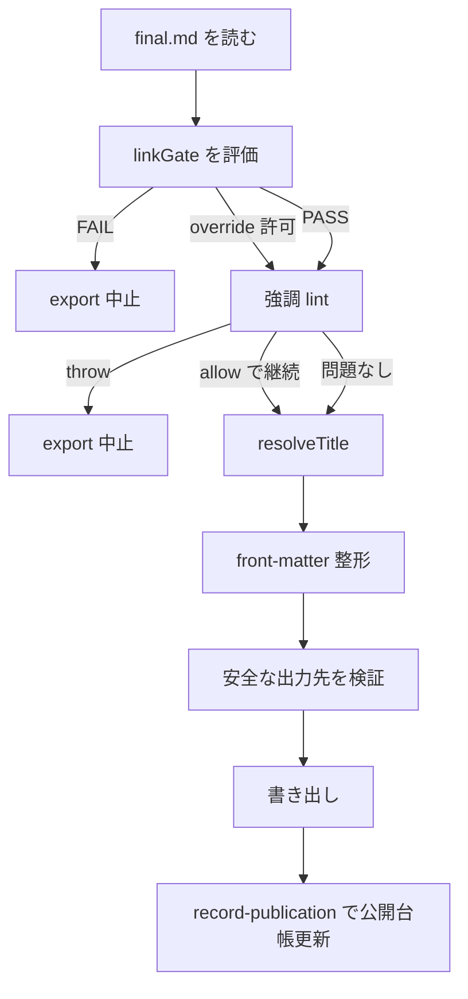
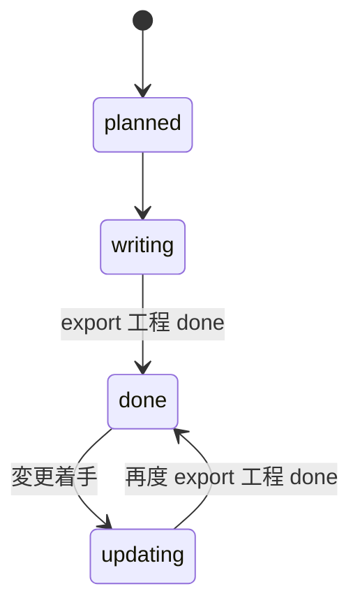

**不可逆な公開を最終ゲート・公開台帳・差分更新・シリーズ凍結で壊れにくくする**

## 対象読者

本稿は、使い方ではなく内部設計をソースから読むシリーズの第7回（最終回）です。第1回で見た first-write-wins と台帳、第6回で見た verify-artifacts と `linkGate` を受けて、公開までをどう閉じるかを扱います。第6回の `linkGate` が「到達性をどう確かめるか」なら、本稿の `export` は「その結果を公開可否へどう接続するか」の層です。本文中では外部リンクに依存せず、参照は末尾参考に集約される前提で進めます。

想定読者は次のとおりです。

- 成果物の公開を不可逆操作として設計したい人
- 公開台帳と版管理を作りたい人
- 複数記事をシリーズで束ねたい人

:::note info
本シリーズで前提とする概念を、ここだけ短く再掲します。

- first-write-wins: 最初に確定した不変属性を、後段で不用意に書き換えない方針です。
- 台帳: run 配下や共有ストアに、履歴・判断根拠・公開記録をファイルとして残す設計です。
- `linkGate`: 参考リンクの到達性を公開可否へ接続するゲートです。第6回で扱いました。
- `progress`: `progress.events.jsonl` に追記専用で残す進捗台帳です。工程の done や再開判断の信号になります。
- factcheck-scope: 更新時に差分へ再検証を集中させ、全文を毎回揺らさないための範囲制御です。
:::

公開は、記事生成パイプラインの最後にある単なる出力操作ではありません。いったん外へ出した成果物は参照され、共有され、完全には回収できない場合があります。だからこの最終回では、生成の巧拙ではなく、**公開前に止める仕組み**、**公開した事実を残す仕組み**、**更新とシリーズを壊さず継続する仕組み**を見ます。

本シリーズの締めとしての結論を先に置くと、ここで守っているのは「内容が常に正しいこと」ではありません。守っているのは、公開可否のゲート、公開記録の一貫性、更新経路の事故面積、シリーズ運用の秩序です。内容の最終判断と GO/NO-GO は人が持ちます。

## export の責務は「何でも出す」ことではない

この節で嬉しいのは、公開対象の境界を `final.md` に固定し、途中成果物の誤公開を出口で止められることです。

`src/cli/export.ts` の責務は、生成物を片っ端から書き出すことではありません。ここでやるのは、**公開対象として認めた最終成果物だけを、公開先向けの形式へ整形し、最後のゲートを通したうえで出力すること**です。

最初に押さえるべき点は、公開対象が `final.md` に限定されていることです。ドラフト、中間検証物、途中の Markdown は対象にしません。公開入口を狭くすることで、どの成果物に最終ゲートを掛けるのかを曖昧にしないためです。



この流れでは、公開前に止めるべきものを止め、例外的に通す場合も stamp を残します。要点は、例外運用をなくすことではなく、例外を黙って通さないことです。

### `exportFinalArticle` が扱うのは `final.md` だけ

実体は `src/cli/export.ts` の `exportFinalArticle` です。架空の `exportArticle` ではありません。ここで出すのは `final.md` のみで、中間成果物は公開物として扱いません。

この制約は保守的ですが、公開操作としては妥当です。公開対象が複数になると、どの段階の生成物が読者向けの正本かが揺れます。すると次の曖昧さが生じます。

- どの工程まで通れば公開してよいのか
- どのファイルを版管理の対象とみなすのか
- 検証途中の成果物が誤って出ないか

`final.md` の一本化は柔軟性を削りますが、公開物の境界を明確にします。本シリーズ全体の方針と同じく、ここでも「何でもできる」より「間違えにくい」を採っています。

### 出力先は安全側に制約する

`exportFinalArticle` は出力前に `assertSafeOutputPath` で出力先を制約します。さらに既存ファイルがある場合は `--force` でのみ上書き可能です。エラーメッセージも明示的で、`Output already exists: ... (use --force to overwrite)` という形です。

公開系 CLI では、内容そのものよりも「どこへ書いたか」の事故が現実的です。似たファイル名、シリーズ記事の連番、プラットフォーム別出力が並ぶ環境では、意図しない上書きのコストが高いからです。ここを出口で一元化しているのは、保守的ですが筋がよい設計です。

## 第6回の `linkGate` は export の入口で効く

この節で嬉しいのは、参考リンクの到達性を「確認したほうがよい」から「公開前に止める」に格上げできることです。

第6回で扱った到達性確認は、本稿では `export` の前提条件として効きます。実コードの関数は `src/cli/linkGate.ts` の `linkGate(claims, sources, opts): LinkGateResult` で、`opts.mode` は `"export"` または `"bulk"` です。`runLinkGate` という名前の関数は実ソースにありません。

`src/cli/export.ts` ではこの評価を `evaluateLinkGate` で呼び、公開前ゲートとして使います。要するに第6回の `reachable` の出口です。

### export モードでは cited な未検証リンクを原則止める

ルールは明快です。本文中で `cited` として使っている参考リンクに、未検証・不明・死亡が混ざっていれば、`mode: "export"` では export を止めます。具体的には、cited な参考リンクに次のいずれかがあれば中止です。

- 未検証
- `unknown`
- `dead`

これは「リンク検査をしたほうがよい」程度の話ではなく、公開可否のゲートに昇格させています。読者に見せる本文が参考リンクを根拠として使っているなら、その根拠の到達性を無視したまま公開しない、という判断です。

### override は理由つきでだけ許す

ただし例外運用はあります。`--allow-unverified-links --note` を明示したときだけ override 可能で、その理由は `link-gate-stamp.json` に残されます。重要なのは、allow フラグだけでは足りず、`note` を要求していることです。

例外を許すかどうかよりも、**誰が、なぜ、その例外を通したかを後から追えること**を優先しています。このシリーズで繰り返してきた「台帳・証跡で持つ」という方針が、公開直前にもそのまま出ています。

:::note warn
override は到達性確認を不要にする仕組みではありません。公開判断を人が引き受ける代わりに、その理由を stamp として残す逃げ道です。
:::

### 旧 run の救済は `LINK_GATE_SINCE` で後方互換に寄せる

`src/cli/export.ts` には `LINK_GATE_SINCE` があり、値は `"2026-06-25"` です。ここより前に作られた旧 run で、しかも `checkedAt` を一度も持たないものに限り、export 時の扱いを warning に降格します。新しい gate を導入したあとで過去 run を一律 `FAIL` にすると、既存資産の運用が詰まるためです。

ここで信頼源にしているのは、ファイルの `mtime` のような揺れる値ではなく、meta の `createdAt` です。公開可否ゲートの後方互換判定を、再保存で変わる属性に依存させないためです。これは細部ですが重要です。ゲート導入後の移行設計として、かなり実務的です。

## 強調 lint は公開直前の最終検出として置く

この節で嬉しいのは、生成途中で取りこぼした Markdown 崩れを、公開直前でもう一度止められることです。

`export` はリンクだけを見ていればよいわけではありません。`src/cli/export.ts` は `src/utils/text.ts` の `detectBrokenStrongEmphasis` / `strongEmphasisWarnings` も使います。架空の `lintStrongEmphasis` は実ソースにありません。

ここでの扱いは、第4回で見た二層防御の最終地点です。予防として生成時の指示を入れるだけでなく、**公開直前に検出して止める**層を置きます。

### `detectBrokenStrongEmphasis` は throw で止める

front-matter を付ける前の raw な `final.md` を `detectBrokenStrongEmphasis` で検査し、開閉できない `**` があれば書き出さずに throw します。メッセージも明示的で、`final.md に開閉できない強調 ** が N 件あります（export 中止）` という形です。

ここで狙っているのは、Markdown を完全に構文解析することではありません。もっと限定的です。生成過程で混入しやすく、公開先のレンダラ差分で見た目事故になりやすい強調崩れを、最後に止めています。

### allow 時も stamp を残す

`--allow-broken-markdown` を使えば継続できますが、その場合も `markdown-lint-stamp.json` に記録します。到達性ゲートと同じで、例外を黙って通さないことが主眼です。

この配置は妥当です。強調崩れは、途中工程で検出しても、その後の編集や revise で再混入し得ます。だから最終検出は export に置く必要があります。第4回で見た「予防と検出の二層防御」が、ここで閉じます。

## タイトル決定は本文 H1 を正本に寄せる

シグネチャは `resolveTitle(body, meta)` です。引数は 2 引数で、`resolveTitle(body)` ではありません。

公開先向けに front-matter を作る以上、タイトルの正本をどこに置くかは重要です。ここでの実装は `resolveTitle(body, meta)` です。

結論から言うと、`resolveTitle` は `firstH1(body)` を優先します。`meta.articleTitle` と食い違う場合は warning を出しつつ、本文 H1 を採用します。警告も明示的で、`Warning: 本文 H1 と meta.articleTitle が異なります。H1 を採用します…` という趣旨です。

### なぜ H1 を正本にするのか

理由は運用にあります。`meta.articleTitle` は create 時に固定され、reviser が本文を改題しても自動追随しません。つまり meta を正本にすると、本文は新タイトルなのに export 時の front-matter だけ古い、というズレが起きます。

本文 H1 を正本にすれば、読者に実際に見せるタイトルと公開メタデータの整合を取りやすくなります。本シリーズの運用でも、この warning は繰り返し出ます。だからこそ warning 止まりにして H1 を採る設計が効きます。ズレは可視化しつつ、公開物としては本文側を正本に寄せるわけです。

## front-matter は公開先向けの整形層

この節で嬉しいのは、本文の意味と公開先の入力形式を分離し、プラットフォーム差分を export 層に閉じ込められることです。

`src/cli/export.ts` には `buildQiitaFrontMatter` と `buildZennFrontMatter` があります。役割は、記事本文の意味を変えることではなく、公開先が受け取る入力形式へ整形することです。

ここで注意すべきなのは、以下に挙げる項目が「Qiita や Zenn の仕様そのもの」だと断定しているわけではない点です。正確には、**このコードが出力するフィールド**の説明です。

### このコードが出力する front-matter

Qiita 向けでは、次のフィールドを出力します。

| フィールド | 値 |
| --- | --- |
| `title` | 解決済みタイトル |
| `tags` | 指定タグ |
| `private` | `false` |
| `updated_at` | `""` |
| `id` | `null` |
| `organization_url_name` | `null` |
| `slide` | `false` |
| `ignorePublish` | `false` |

`id` と `updated_at` は、このコードが空・null で出力するフィールドです。qiita-cli 側が同期時に埋める想定で使われることがありますが、これは外部ツールの挙動なので、バージョンにより異なりえます。

Zenn 向けでは次のフィールドを出力します。

| フィールド | 値 |
| --- | --- |
| `title` | 解決済みタイトル |
| `emoji` | `📝` |
| `type` | `tech` |
| `topics` | 指定タグ相当 |
| `published` | `false` |

ここでも重要なのは、Zenn の一般仕様をここで断定することではなく、**このコードが出力する front-matter** を押さえることです。

### 本文先頭 H1 は front-matter タイトルへ一本化する

公開先によっては front-matter のタイトルが UI で表示されるため、本文先頭に H1 を残すと二重タイトルになります。したがって export は、本文 H1 を front-matter タイトルへ一本化する方向に整形します。

ここで重要なのは、本文構造と公開先形式の間にある変換責務を `export` が明示的に持つことです。架空の `stripLeadingH1IfNeeded` を新設して説明する必要はありません。実際には `src/cli/export.ts` の中で、`firstH1` と `resolveTitle` を使いながら二重タイトル回避の整形をしています。

## `src/cli/export.ts` の要点

以下は実ソースに沿った説明用の概念抜粋です。全文転載ではなく、責務の流れだけを示します。

```ts
// src/cli/export.ts
import { access } from "node:fs/promises";
import { detectBrokenStrongEmphasis } from "../utils/text";
// ... この // ... は export に必要な他 import の省略です

export async function exportFinalArticle(/* ... */) {
  // final.md を読む
  // ... この // ... は run 配下の final.md と関連メタデータを読む処理です

  // linkGate を export モードで評価
  const gate = await evaluateLinkGate(/* ... */);
  if (!gate.ok) {
    throw new Error(/* ... */);
  }

  // raw final.md に対して強調崩れを最終検出
  const broken = detectBrokenStrongEmphasis(body);
  if (broken.length > 0) {
    throw new Error(
      `final.md に開閉できない強調 ** が ${broken.length} 件あります（export 中止）`,
    );
  }

  // タイトルは本文 H1 優先
  const title = resolveTitle(body, meta);

  // プラットフォーム別 front-matter を構築
  const frontMatter =
    platform === "qiita"
      ? buildQiitaFrontMatter(title, tags)
      : buildZennFrontMatter(title, tags);

  // 出力先の制約は assertSafeOutputPath が担う
  assertSafeOutputPath(outputPath, cwd);

  // 既存ファイル検査と --force 判定は別ロジックで行う
  const exists = await access(outputPath).then(
    () => true,
    () => false,
  );
  if (exists && !force) {
    throw new Error(
      `Output already exists: ${outputPath} (use --force to overwrite)`,
    );
  }

  // 本文先頭 H1 の二重化を避けて書き出す
  // ... この // ... は front-matter と本文を整形してファイルへ書く処理です
}
```

この層の設計意図は一貫しています。公開前に止めるべきものを止め、タイトルと front-matter を整え、安全な場所にだけ出す。公開は不可逆なので、柔軟に何でも通すのではなく、出口を絞り込んでいます。

## 公開台帳は `export/index.json` を正本にする

この節で嬉しいのは、公開先の状態だけに依存せず、更新履歴と版の判断根拠をローカルでも追跡できることです。

公開後に必要なのは「URL を覚えること」だけではありません。同じ記事への更新を安全に継続し、版の退行や誤登録を防ぐ必要があります。その中心が `src/storage/ExportIndex.ts` です。

ここで管理する `export/index.json` は、**slug → ExportIndexEntry の逆引き台帳**です。構造は次のとおりです。

```ts
type ExportIndexData = {
  version: 1;
  articles: Record<string, ExportIndexEntry>;
};

type ExportIndexEntry = {
  runId: string;
  url: string;
  articleId: string;
  version: number;
  updatedAt: string;
};
```

重要なのは、`contentHash` も、entry 内の `slug` フィールドも実在しないことです。slug は `articles` のキーで持ちます。この点は説明時に盛りがちなところですが、実装に忠実に押さえる必要があります。

### なぜ公開台帳をローカルに持つのか

公開先 API に毎回問い合わせれば済むようにも見えますが、それだけに依存すると次の問題が出ます。

- ローカルで監査しにくい
- オフラインでの追跡や移送に弱い
- 「なぜこの更新判定になったか」の経緯が残りにくい
- 複数プラットフォームや複数記事を束ねると判断が散る

ファイルベース台帳は派手ではありませんが、可搬性と監査性が高いです。本シリーズで `progress.events.jsonl` を使ってきた流れの延長にあります。

## 版退行ガードは no-op と更新だけを通す

シグネチャは `assertNoVersionRegression(existing, candidate, force): void` です。

この節で嬉しいのは、同一内容の再記録は冪等に通しつつ、版の逆戻りや同 version 内容差を記録前に拒否できることです。

公開台帳の中核は `assertNoVersionRegression(existing, candidate, force): void` です。戻り値で更新種別を返す設計ではありません。許可なら何も返さず、拒否なら throw します。`PublicationUpdateKind` のような型も実ソースにはありません。

分岐は実装どおり、次のように読むのが正確です。

1. `existing` が無い → 許可
2. `entryContentEqual(existing, candidate)` → no-op として許可
3. `candidate.version > existing.version` → 通常更新として許可
4. `force` がある → 意図的訂正として許可
5. それ以外 → throw

| 条件 | 判定 | 防ぐ事故 |
| --- | --- | --- |
| `existing` が無い | 許可 | 初回公開を不要に止めない |
| `entryContentEqual(existing, candidate)` | no-op として許可 | 再実行で同じ記録が二重更新されることを防ぐ |
| `candidate.version > existing.version` | 通常更新として許可 | 正常な版上げを阻害しない |
| `force` がある | 意図的訂正として許可 | 例外的修正を黙ってではなく明示操作に限定する |
| それ以外 | throw | version 退行や同 version 内容差の誤記録を防ぐ |

エラーメッセージも、退行や同 version 内容差をまとめて `Refusing to record version ... (use --force to override a non-increasing version)` という方向です。

### no-op 判定で `updatedAt` は比較しない

`entryContentEqual` は `runId` / `url` / `articleId` / `version` を見ますが、`updatedAt` は比較に含めません。理由は冪等性です。同じ公開記録を再実行しただけで no-op 判定が崩れると、冪等な再記録ができなくなります。

ここで守っているのは「いつ公開した内容が正しいか」ではなく、「同じ公開記録を再適用したときに同じ状態へ収束すること」です。台帳層の責務を、版の一貫性と冪等性に絞っています。

## 壊れた台帳は黙って空扱いしない

`export/index.json` が壊れていたとき、空台帳として扱って継続する設計もありえます。しかし実装はそうしません。明確に throw します。

理由は単純で、壊れた台帳を「未公開」と誤認すると、他 slug まで巻き込んで空台帳から再構築したり、既存版を踏み潰したりするからです。公開台帳の破損は、静かに回復してよい種類の故障ではありません。

内部では `articles` を `Object.create(null)` で持ちます。これはトップレベルのキー衝突や prototype 由来の被害面を狭める緩和策として有効ですが、「prototype 汚染を完全に防ぐ」とまでは言えません。必要ならキー検査を追加すべきです。この留保は、実装の射程を言い過ぎないために重要です。

## 公開記録は二相更新でメタと台帳を揃える

この節で嬉しいのは、拒否条件を副作用前に潰し、再実行時も同じ最終状態へ収束させやすいことです。

公開記録を持つ CLI は `src/cli/record-publication.ts` です。ここで更新する対象は少なくとも 2 つあります。

- `meta.published`
- `export/index.json`

この更新は**二相**で行います。まず検証フェーズで reject 条件を副作用なしに調べ、その後に書き込みフェーズへ進みます。`assertNoVersionRegression` は前者で呼ばれます。書いてから失敗に気づくのではなく、拒否は必ず書き込み前に起こす構成です。

### 冪等性は「同じ引数で同じ最終状態へ収束する」こと

`record-publication` では、同じ引数の再実行で同じ最終状態へ収束するようにしています。完全一致なら no-op として扱い、既存の `updatedAt` を再利用します。つまり再記録しても時刻が無意味に更新されません。

一方で、version 上昇や明示的な訂正では、新しい記録として台帳を更新します。ここで大事なのは、no-op の据え置きロジックが `assertNoVersionRegression` の戻り値ではなく、`record-publication` 側の責務として表現されることです。実装にない更新種別 enum を持ち込まず、void/throw の検証関数と記録側の分岐を分けています。

### 不整合は警告に残しつつ修復を継続する

`meta.published` と `export/index.json` が食い違っているケースでは、`onWarn` に監査ログを残しつつ継続します。完全停止より、痕跡を残して修復を優先する設計です。

ここでも守っているのはトランザクション完全性ではありません。ファイルベースである以上、絶対的な原子性には限界があります。それでも、検証を先に済ませ、不整合は可視化し、同じ再実行で同じ状態に寄せる。この積み上げで運用上の事故を小さくしています。

### `record-publication` の要点

以下は説明用の概念抜粋です。実在しない補助関数は足さず、二相と冪等の考え方だけを抜き出します。

```ts
// src/cli/record-publication.ts
import { assertNoVersionRegression } from "../storage/ExportIndex";
// ... この // ... は CLI 入出力やストレージ読み書きに必要な import の省略です

export async function recordPublication(/* ... */) {
  // 第1相: 検証フェーズ
  // - meta と export/index.json を読む
  // - candidate を組み立てる
  // - assertNoVersionRegression(existing, candidate, force) を呼ぶ
  // - 不整合は onWarn へ記録する

  // 第2相: 書き込みフェーズ
  // - 完全一致 no-op なら既存 updatedAt を再利用
  // - meta.published を更新
  // - export/index.json を更新
}
```

この分割により、版退行ガード、冪等性、不整合監査が互いに混ざりすぎません。公開記録の責務境界が見えやすい構成です。

## 更新は全面リライトではなく差分で扱う

この節で嬉しいのは、公開済み本文の安定部分を固定し、変更箇所にだけ検証とレビュー密度を寄せられることです。

公開済み記事を更新するとき、毎回全文を再生成して再審査する設計もありえます。しかし本実装はそうしません。更新の起点は `src/cli/import.ts` で、公開済み本文を `update-base.md` として固定し、その上に差分だけを重ねます。

この流れでは、import で公開済み本文を `update-base.md` に固定し、変更点だけを revise したうえで `update-diff` に検証を集中させます。承認後は `export` と `record-publication` を通し、同一 URL の新 version として記録します。

更新では、`update-diff` に検証を集中させます。ここでの思想は第6回の factcheck-scope と同じです。**factcheck は必須**にしつつ、構文チェックや型チェックは既定オフです。検証を軽くするのではなく、変化したところに密度を寄せて二度手間を避けています。

承認後は、新規公開と同じく `export` と `record-publication` を通します。同一 URL の更新として version を上げる形です。つまり更新は別系統の特例ではなく、版管理された公開プロセスの再利用です。

### `import` の抜粋は概念例として読む

以下はあくまで説明用の概念例です。補助名は実装説明のための便宜であり、実ソースの関数名そのものを断定するものではありません。

```ts
// src/cli/import.ts 周辺の説明用の概念例
async function prepareUpdate(/* ... */) {
  // 公開済み本文を取得して update-base.md に固定
  // 変更点だけを revise 対象にする
}

async function verifyUpdateDiff(/* ... */) {
  // factcheck は必須
  // 構文/型チェックは既定オフ
}
```

ここでの `// ...` は、公開先との入出力や run 配下への保存など、更新準備の周辺処理を省略しているという意味です。

ここで重要なのは関数名ではなく、**更新の正本を固定して差分だけを見る**という責務分割です。公開済み資産を毎回作り直さないことが、この設計の核です。

## シリーズ管理は `series.json` を機械の正本にする

複数記事をシリーズとして束ねるとき、README の一覧だけでは足りません。機械が更新する状態と、人が読む表示を分ける必要があります。ここで中心になるのが `src/storage/SeriesStore.ts` と `src/storage/seriesMeta.ts` です。

まず大きな判断は、`series.json` を正本、`README.md` を派生ビューにすることです。runs/ とは独立しています。機械の正本と人間向けビューを分けることで、表示都合の Markdown 編集が状態管理を壊しにくくなります。

README 正本案は人間には分かりやすいですが、機械処理には不安定です。並び替え、見出し変更、表記揺れが、そのまま状態表現に混ざるからです。シリーズ運用を続けるなら、この分離は堅い選択です。

## voice 凍結は no-op と版上げの 2 分岐

シグネチャは `freezeVoice(slug, newContent)` です。force オプションはありません。

シリーズ管理で series らしさが最も出るのが voice の凍結です。実ソースのシグネチャは `freezeVoice(slug, newContent)` で、force オプションはありません。

挙動は first-write-wins 系ですが、厳密には次の 2 分岐です。

- **同内容の再 freeze** → no-op として拒否  
  `Refusing to re-freeze identical voice content (no-op)`
- **別内容の freeze** → 旧版を `voice-v<N>.md` に退避し、version を 1 つ進めて更新

ここは「明示操作なしには上書きしない」と曖昧に書くより、実装どおりに書くべきです。つまり、同内容は no-op、別内容は退避と版上げを伴って更新されます。明示の force は不要です。

これは第1回で扱った first-write-wins の別バリエーションとして読むと分かりやすいです。一度焼き込んだ文体を各記事の `meta.style` に持たせつつ、必要時には旧版を捨てずに更新履歴を残します。

## メンバー状態は 4 値で、run 側の進捗から導出する

シリーズメンバー状態は `src/storage/seriesMeta.ts` の `SeriesMemberStatus` で、次の 4 値です。

- `planned`
- `writing`
- `updating`
- `done`

意味は次のとおりです。

| 状態 | 意味 |
| --- | --- |
| `planned` | 未作成枠。`runId = null` |
| `writing` | run はあるが、まだ export 工程 done ではない |
| `done` | export 工程 done が信号 |
| `updating` | `done` 後に変更へ着手した状態 |

重要なのは、状態を架空の `progress.exported && progress.updating` のような決め打ちで説明しないことです。実際には、**run 側の進捗から状態を導出する**のがポイントで、特に `done` への遷移は export 工程の done を信号にします。第5回の progress と地続きです。

また、`parseMemberStatus` は未知値や欠落を `planned` に倒します。これは破損耐性です。ただし 4 値を保持し、`writing` や `updating` を黙って downgrade しないのが実装上の要点です。



この状態遷移は、人手入力のフラグ管理ではなく、既存の進捗情報を読んで導く設計です。状態を二重管理しないぶん、シリーズ側の責務が軽く保たれます。

## `series.json` の更新は直列化して競合を避ける

シリーズ管理では、複数プロセスが同時にメンバー追加や順序更新を行うと、`order` の二重採番や lost update が起きます。そこで `series.json` の read-modify-write は直列化します。

実現手段は実装依存で、ロックファイルかもしれませんし、別の制御かもしれません。重要なのは、**シリーズ状態の更新が競合しうる**ことを認識し、それを直列化で抑えている点です。

ただし、ここも言い過ぎは避けるべきです。NFS などではファイルロックの意味が弱い場合があり、ファイルベース直列化には限界があります。保証できる範囲を広く言いすぎず、現実的な留保を置くのが正確です。

## メンバー export は自動命名で秩序を保つ

シリーズの公開物は `<seriesId>-<NN>-<slug>[-platform].md` という自動命名規約を持ちます。本シリーズなら `llmrouter-0N-...` です。

これは見た目の整頓以上の意味があります。ファイル名だけでシリーズ所属と順序が分かるため、保守、棚卸し、プラットフォーム別出力の管理がしやすくなります。シリーズ管理を `series.json` に閉じ込めず、外部へ出る成果物にも秩序を持ち込んでいます。

## 採った設計と採らなかった代替案

ここまでの設計判断を、採らなかった案と対で整理しておきます。

### 中間成果物も export 可能にする案

柔軟ですが、公開対象の境界が曖昧になります。どのゲートをどこに掛けるかも揺れます。本実装は `final.md` に限定して、公開物の一意性を優先しました。

### `meta.articleTitle` をタイトル正本にする案

メタデータ一元化としては自然ですが、改題追随漏れに弱いです。本文 H1 を正本にし、ズレは warning で可視化するほうが運用に合います。

### 壊れた台帳を空扱いして継続する案

復旧しやすく見えますが、公開済み記録を未公開と誤認するリスクが高すぎます。実装は throw を選び、静かな誤回復を避けています。

### 更新を毎回全文リライトする案

一見厳密ですが、変更していない箇所まで揺らし、レビュー範囲を広げます。本実装は `import` と `update-base.md` を起点に、差分へ検証を集中させます。

### README をシリーズ正本にする案

人間には見やすいですが、機械処理の入力としては不安定です。`series.json` を正本、`README.md` を派生ビューに分けるほうが責務境界が明確です。

## 7 回を貫いた柱は 4 つある

最終回なので、シリーズ全体を短く総括します。各回で扱ったテーマは異なりますが、通底していた柱は次の 4 つです。

### 1. 工程分割

run を軸に工程を分け、途中成果物とゲートを置く設計です。生成、検証、整形、公開を一段で済ませません。どこで止まり、どこから再実行するかを明確にします。

### 2. ファイルベース台帳

`progress.events.jsonl`、`export/index.json`、`series.json` のように、判断根拠と履歴をファイルで持ちます。可搬性、監査性、ローカルでの透明性を重視した選択です。

### 3. first-write-wins と不変属性

第1回で見た first-write-wins は、記事メタだけでなく voice 凍結のような形でも現れます。一度決めた属性を後段で不用意に壊さないことが中心思想です。

### 4. LLM を信用しすぎず仕組みで担保する

本シリーズの中核はここです。出力がもっともらしく見えても、そのまま公開しません。到達性確認、強調崩れ検出、差分検証、台帳記録、公開前ゲートを通して、信用を工程へ置き換えます。

## 限界も明示しておく

ここまでの仕組みは、整合性と証跡を守るためには有効です。ただし、守れるものには限界があります。

- 台帳やゲートが守るのは、公開記録と工程の一貫性です
- version 退行ガードや冪等性が守るのは、台帳の整合であって内容の良し悪しではありません
- 公開判断、GO/NO-GO、最終責任は人にあります

この設計は、Qiita や Zenn への**全自動公開**を目指していません。対等な対応プラットフォーム例として両方に整形層を持ちますが、必ずゲートと承認を挟みます。不可逆な公開を、機械だけで決めないためです。

## まとめ

本稿で見た要点は次のとおりです。

- `exportFinalArticle` は `final.md` だけを対象にし、公開前ゲートを出口へ集約する
- `resolveTitle(body, meta)`、front-matter 整形、`export/index.json`、`record-publication` が、公開後も更新可能な正本経路を作る
- 更新は `import` 起点の差分運用で扱い、シリーズは `series.json`、`freezeVoice`、4 状態で秩序を保つ

要するに、公開・更新・シリーズ管理は別機能ではありますが、どれも「不可逆な操作をどう壊れにくくするか」という同じ問題に答えています。

本シリーズ自身も、この export と series の仕組みを通って公開され、`llmrouter` として束ねられています。

## 参考

<!-- sources:begin -->
- [S010] src/cli/export.ts（exportFinalArticle / evaluateLinkGate / resolveTitle / buildQiita|ZennFrontMatter / LINK_GATE_SINCE）（primary, retrieved: 2026-06-27）
  https://github.com/rex0220/llm-task-router/blob/2b8656e94beab67014d986febb8a8dacda485163/src/cli/export.ts
- [S011] src/cli/linkGate.ts（linkGate / LinkGateResult / LinkGateMode / legacyGrace）（primary, retrieved: 2026-06-27）
  https://github.com/rex0220/llm-task-router/blob/2b8656e94beab67014d986febb8a8dacda485163/src/cli/linkGate.ts
- [S012] src/storage/ExportIndex.ts（ExportIndexEntry / assertNoVersionRegression / entryContentEqual）（primary, retrieved: 2026-06-27）
  https://github.com/rex0220/llm-task-router/blob/2b8656e94beab67014d986febb8a8dacda485163/src/storage/ExportIndex.ts
- [S013] src/cli/record-publication.ts（recordPublication 二相・冪等・onWarn）（primary, retrieved: 2026-06-27）
  https://github.com/rex0220/llm-task-router/blob/2b8656e94beab67014d986febb8a8dacda485163/src/cli/record-publication.ts
- [S014] src/cli/import.ts（更新リライト起点・update-base.md・codeCheck 既定オフ）（primary, retrieved: 2026-06-27）
  https://github.com/rex0220/llm-task-router/blob/2b8656e94beab67014d986febb8a8dacda485163/src/cli/import.ts
- [S015] src/storage/SeriesStore.ts（freezeVoice / withLock）（primary, retrieved: 2026-06-27）
  https://github.com/rex0220/llm-task-router/blob/2b8656e94beab67014d986febb8a8dacda485163/src/storage/SeriesStore.ts
- [S016] src/storage/seriesMeta.ts（SeriesMemberStatus / parseMemberStatus）（primary, retrieved: 2026-06-27）
  https://github.com/rex0220/llm-task-router/blob/2b8656e94beab67014d986febb8a8dacda485163/src/storage/seriesMeta.ts
- [S017] src/utils/text.ts（detectBrokenStrongEmphasis / strongEmphasisWarnings）（primary, retrieved: 2026-06-27）
  https://github.com/rex0220/llm-task-router/blob/2b8656e94beab67014d986febb8a8dacda485163/src/utils/text.ts
- [S018] src/cli/inputs.ts（assertSafeOutputPath）（primary, retrieved: 2026-06-27）
  https://github.com/rex0220/llm-task-router/blob/2b8656e94beab67014d986febb8a8dacda485163/src/cli/inputs.ts
<!-- sources:end -->
