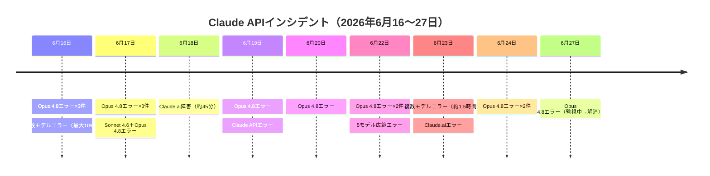
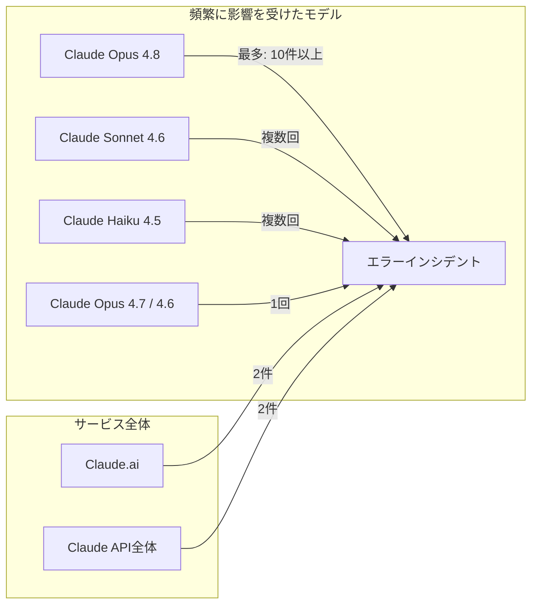
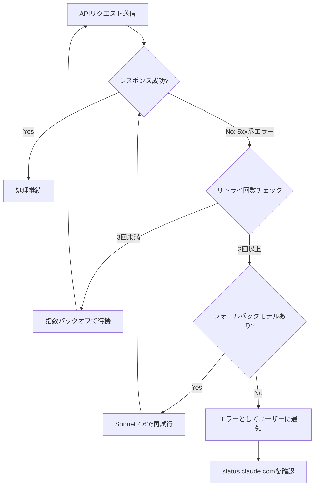

## はじめに

2026年6月16日〜27日の約12日間で、Anthropicのサービスに**計20件のインシデント**が記録されました。そのすべてが現在は解消済みですが、特にClaude Opus 4.8に集中したエラーレート上昇は、本番環境でClaude APIを利用するサービスに影響を与えた可能性があります。

新機能や料金変更はなく、今回の期間はひたすら「運用安定性に関する一時的な障害」の連続でした。本記事では、この障害トレンドを整理し、API利用者が今後取るべき対策を具体的なコードと合わせて解説します。

> **📌 影響を受ける人**
> - Claude APIを使ったアプリケーションを本番運用している開発者
> - Claude.aiをビジネスで利用しているチーム
> - LLMサービスの可用性・SLAを設計・評価している方

## 変更の全体像



影響を受けたモデルの関係を見ると、Claude Opus 4.8が突出して多くのインシデントに関わっています。



## 変更内容

### インシデント一覧

| 日時 (UTC) | 影響対象 | 重大度 | 概要 |
|---|---|---|---|
| 6/16 12:41 | Opus 4.8 | low | エラーレート上昇（約12分） |
| 6/16 17:23 | 多数モデル | **high** | 最大10%エラーレート・2フェーズ構成（約2時間） |
| 6/16 20:45 | Opus 4.8 | low | エラー増加（約13分） |
| 6/17 00:47 | Sonnet 4.6, Opus 4.8 | medium | 2モデル同時エラー（約2時間） |
| 6/17 04:59 | Opus 4.8 | medium | エラー増加（約42分） |
| 6/17 08:24 | Opus 4.8 | medium | エラー増加（約100分） |
| 6/17 15:34 | Opus 4.8 | medium | エラー発生（約54分） |
| 6/18 06:55 | Claude.ai | **high** | サービス障害（約45分） |
| 6/19 06:07 | Opus 4.8 | medium | エラー発生（約70分） |
| 6/19 08:17 | Claude API | medium | エラーレート上昇（約28分） |
| 6/20 17:07 | Opus 4.8 | medium | エラー発生（約55分） |
| 6/22 00:37 | Opus 4.8/4.7/4.6, Sonnet 4.6, Haiku 4.5 | **high** | 5モデル広範エラー（約89分） |
| 6/22 08:11 | Opus 4.8 | medium | エラー増加（**約6.5時間**・最長） |
| 6/22 19:14 | 多数モデル | **high** | エラー増加（約31分） |
| 6/23 06:28 | Opus 4.8 | medium | エラー増加（約137分） |
| 6/23 14:08 | 複数モデル | **high** | エラーレート上昇（約85分） |
| 6/23 18:24 | Claude.ai | **high** | エラーレート上昇（約8分） |
| 6/24 13:16 | Opus 4.8 | medium | エラーレート上昇（約100分） |
| 6/24 18:22 | Opus 4.8 Fast | medium | エラー増加（約11分） |
| 6/27 (監視中) | Opus 4.8 | medium | エラー増加→解消済み |

### 特に注目すべき高severity インシデント

#### 6月16日：2フェーズ障害（最大エラーレート約10%）

単日最大規模の障害で、2フェーズに分かれて展開しました。

- **第1フェーズ（17:23〜18:00 UTC）**：全SonnetおよびOpusモデルが影響を受け、エラーレートが約10%に
- **第2フェーズ（18:00〜19:20 UTC）**：Opus 4.8を中心に平均約10%のエラーレートが継続

6月16日だけで**Opus 4.8に関する障害が3件**発生しており、同モデルの不安定さが初日から顕著でした。

#### 6月22日：5モデル同時広範障害

複数世代にわたる5モデルが同時に影響を受けたインシデント。各モデルが段階的に回復しています。

```
00:37 UTC  調査開始
01:11 UTC  原因特定
01:16 UTC  Opus 4.8 回復
01:33 UTC  Haiku 4.5 回復
01:56 UTC  Opus 4.7 回復
02:06 UTC  全体解消
```

同日08:11 UTCのOpus 4.8障害は修正適用（09:59 UTC）から解消（14:44 UTC）まで**約4.7時間**を要し、今回の期間で最も長期化したインシデントになりました。

#### 6月23日：2連続障害（複数モデル → Claude.ai）

同日14:08〜15:33 UTCに複数モデルでエラーレートが上昇（約85分）したあと、18:24〜18:32 UTCにはClaude.ai全体でも障害が発生。単日で異なる範囲の障害が2件連続しました。

## 影響と対応

現時点で**すべてのインシデントは解消済みのため、即時のコード変更は必須ではありません**。しかし今回のインシデント群が示すトレンドから、以下の対策を強く推奨します。

### 1. リトライロジックの整備

エラーレート上昇は数分〜数時間スパンで繰り返し発生しています。指数バックオフを伴うリトライを実装することで、一時的なエラーをアプリケーション側で透過的に吸収できます。

### 2. フォールバックモデルの検討

Claude Opus 4.8が今回の期間で最も頻繁に不安定でした。品質要件が許す場面では、Sonnet 4.6等をフォールバックとして設定することで可用性を高められます。

### 3. ステータスページの監視

`status.claude.com` をRSSや通知で購読しておくと、インシデント発生時に速報を受け取れます。SLAを意識したサービスでは必須の対応です。



## コード例

### Before：リトライなしの単純な実装

```python
import anthropic

client = anthropic.Anthropic()

def generate_text(prompt: str) -> str:
    message = client.messages.create(
        model="claude-opus-4-8",
        max_tokens=1024,
        messages=[{"role": "user", "content": prompt}]
    )
    return message.content[0].text
```

この実装では6月の障害期間中、エラーがそのままユーザーに露出します。

### After：リトライ + フォールバック付き実装（Python）

```python
import anthropic
import time
from anthropic import APIStatusError, APIConnectionError

client = anthropic.Anthropic()

PRIMARY_MODEL = "claude-opus-4-8"
FALLBACK_MODEL = "claude-sonnet-4-6"
MAX_RETRIES = 3
BASE_DELAY = 1.0

def generate_text(prompt: str, use_fallback: bool = False) -> str:
    model = FALLBACK_MODEL if use_fallback else PRIMARY_MODEL

    for attempt in range(MAX_RETRIES):
        try:
            message = client.messages.create(
                model=model,
                max_tokens=1024,
                messages=[{"role": "user", "content": prompt}]
            )
            return message.content[0].text

        except APIStatusError as e:
            # 5xx系のみリトライ。4xx（認証エラー等）はリトライしても無意味
            if e.status_code >= 500 and attempt < MAX_RETRIES - 1:
                delay = BASE_DELAY * (2 ** attempt)
                print(f"サーバーエラー ({e.status_code})。{delay}秒後にリトライ ({attempt + 1}/{MAX_RETRIES})")
                time.sleep(delay)
            else:
                raise

        except APIConnectionError:
            if attempt < MAX_RETRIES - 1:
                time.sleep(BASE_DELAY * (2 ** attempt))
            else:
                raise

    if not use_fallback:
        print(f"{PRIMARY_MODEL} で失敗。{FALLBACK_MODEL} にフォールバック")
        return generate_text(prompt, use_fallback=True)

    raise RuntimeError("すべてのリトライとフォールバックが失敗しました")


try:
    result = generate_text("AIについて100字で説明してください")
    print(result)
except RuntimeError:
    print("サービスが利用できません。https://status.claude.com を確認してください")
```

### TypeScript版

```typescript
import Anthropic from "@anthropic-ai/sdk";

const client = new Anthropic();
const PRIMARY_MODEL = "claude-opus-4-8";
const FALLBACK_MODEL = "claude-sonnet-4-6";

async function generateText(
  prompt: string,
  useFallback = false,
  attempt = 0
): Promise<string> {
  const model = useFallback ? FALLBACK_MODEL : PRIMARY_MODEL;
  const maxRetries = 3;

  try {
    const message = await client.messages.create({
      model,
      max_tokens: 1024,
      messages: [{ role: "user", content: prompt }],
    });
    return (message.content[0] as { text: string }).text;
  } catch (error) {
    if (error instanceof Anthropic.APIStatusError && error.status >= 500) {
      if (attempt < maxRetries - 1) {
        const delay = 1000 * Math.pow(2, attempt);
        await new Promise((resolve) => setTimeout(resolve, delay));
        return generateText(prompt, useFallback, attempt + 1);
      }
      if (!useFallback) {
        return generateText(prompt, true, 0);
      }
    }
    throw error;
  }
}
```

> **💡 Tips**
> - `4xx`エラー（認証エラー・レート制限等）はリトライしても解決しません。ステータスコードで必ず分岐してください。
> - Anthropic公式SDKには `max_retries` パラメータも存在しますが、フォールバックモデルの切り替えはカスタム実装が必要です。
> - 本番環境ではリトライ間隔にジッタ（ランダムなズレ）を加えると、同一エラー発生時のリクエスト集中（thundering herd）を防げます。

## まとめ

| 項目 | 内容 |
|---|---|
| 総インシデント数 | 20件 |
| すべて解消済み | ✅ |
| 最も影響を受けたモデル | Claude Opus 4.8（10件以上） |
| 最大影響範囲 | 5モデル同時（6/22 00:37 UTC） |
| 最長継続時間 | 約6.5時間（6/22 Opus 4.8） |
| 最大エラーレート | 約10%（6/16） |
| 新機能・料金変更 | なし |

**開発者向けアクションまとめ：**

1. **即時アクション不要**（全インシデント解消済み）
2. **推奨対策**：指数バックオフリトライ + フォールバックモデルの実装
3. **モニタリング**：`status.claude.com` の購読でインシデント速報を受け取る

今回の期間でClaude Opus 4.8が短期間に集中して不安定だった点は気になりますが、Anthropicは多くのインシデントを30分〜2時間以内に解消しており、対応スピード自体は迅速です。とはいえ、20件という件数は「たまに起きる」というレベルではなく**ほぼ毎日**何らかの障害が発生していた状態です。本番システムではリトライ・フォールバックの実装を前提に設計することを強くお勧めします。
