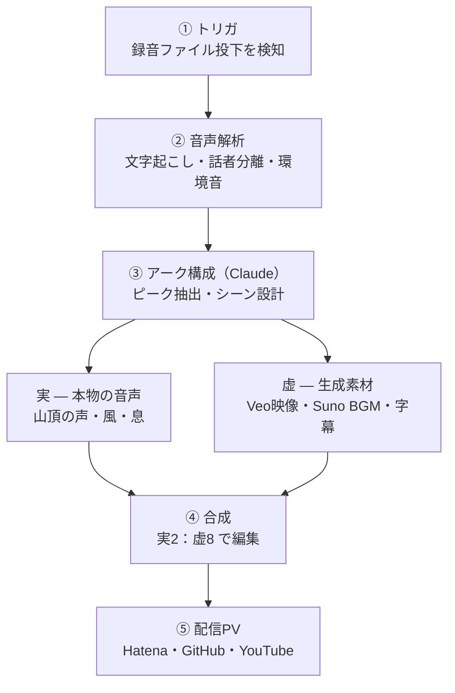

## TL;DR

- 一日のイベントを録った **音声データだけ** を入力に、最後に1本のプロモーションPVを吐くシステムを設計した。
- **実写映像は一切使わない。** 音が「事実」を持ち、絵はAIに想像させる。
- 出来上がるのはドキュメンタリーではなく「記憶を美化したイメージPV」。比率は **実2 : 虚8** のハイブリッド。
- 肝は、イベントの種類（山・カラオケ・飲み会・街歩き）によって *PVを運ぶ主役が変わる* という設計。
- 全体の頭脳は「アーク構成」モジュール一点に集約し、そこを Claude（Agent SDK）に任せる。

---

## 背景：なぜ「音声だけ」なのか

イベントの記録をPVにしたい。でも一日中カメラを構えて良い画を撮るのは無理がある。山なら登りで息が上がっているし、飲み会で人にレンズを向けるのも野暮だ。

そこで発想を逆にした。**撮るのは音だけにする。**

音声onlyには、地味だが効く利点が揃っている。

- ポケットにレコーダー（やスマホ）を入れっぱなしで、丸一日撮りっぱなしにできる
- 構図・撮影の「構え」が一切いらない
- 人の顔が写らない（プライバシー）
- そして —— **絵を完全に自由に作れる**

最後の一点が、このシステムの性格を決めている。

---

## コンセプト：音=事実、絵=翻訳

その日に何が起きたかは、ぜんぶ音に残っている。誰が何を言ったか、どこで笑ったか、山頂の風、下りの息づかい。**意味と事実は音声側にある。**

だから絵は、その事実を「写す」必要がない。事実をもとに、AIが描き直した理想の風景でいい。

記憶って、実際そういうものだ。あとから振り返ると、実際より少しきれいに見えている。あの感じを意図的に作る。

これを具体的なルールに落とすと、二層構造になる。

- **実（じつ）** = 感情のピークで録れた *本物の声と環境音*。山頂の「着いたー」、稜線の風、下りの息。ここは加工せず生で挿す。これが真実味の錨。
- **虚（きょ）** = シーンの間をつなぐ *生成映像・BGM・美化された風景*。これが記憶の美化、流れ。

目安は **実2 : 虚8**。実が点で刺さって、虚が全体を運ぶ。これが「ドキュメンタリーではないが、嘘くさくもない」のバランスになる。

> ダイジェストの「名シーン」は必ず事実ベースで選ぶ。ここで嘘の感動を盛らない、というのが実パートを残す理由でもある。

---

## 「絵がさえないイベント」こそ価値が出る

ここで一回ひっくり返したい。

普通に考えると「絵が地味なイベント（飲み会、愚痴の言い合い）はPVに向かない」と思える。実際、実写でやればその通りだ。しょぼい居酒屋の映像はしょぼい。

ところが **音声onlyだと、退屈な現実をそのまま写す義務がない。** 事実は音が持っているので、絵は別物に翻訳できる。

つまり構図はこうなる。

- **山** は実景がもう強いので、ほぼ *想像いらず*。
- **飲み会・パーティ** こそ、*想像で救う*。

絵が弱いイベントほど、この仕組みの価値が出る。

### PVを運ぶ「主役」はイベントで変わる

ただし、何が一本のPVを引っ張るか（主役）はイベントごとに違う。ここを取り違えると、どのイベントもさえなくなる。

| イベント | PVを運ぶ主役 | 絵の作り方 |
| --- | --- | --- |
| 山 | 風景 | 実景中心・王道のエモ。想像はほぼ不要 |
| カラオケ大会 | 歌・音 | MV風。ステージ照明・シルエット・リズムカット |
| 既婚者パーティ／飲み会 | 言葉・関係 | 人は写さない。抽象・字幕・ムードで魅せる |
| 街歩き | 断片＋発見 | 街の点描＋拾った小ネタ。中間タイプ |

カラオケは実は一番ラクだ。音楽が最初からそこにあるので、MVの文法がそのまま使える。

問題児の「愚痴・つまらない会話」も、捨てネタではない。二択で化ける。

1. **あるある共感ネタ化** —— テンポよく短く切って字幕で見せると、退屈な飲み会は喜劇になる。
2. **一瞬の本音を拾う** —— 90分の愚痴の中から、ふと出る本音・優しさ・笑いを一瞬だけ拾い、それを「実」の錨にする。

退屈な録音から30秒の宝を選り出す。それがこのシステムの本当の仕事だ。

---

## アーキテクチャ

全体は素直なパイプライン。録音ファイルの投下をトリガに、5段で回る。



ポイントは、③が全体の頭脳で、ほかは差し替え可能な手足だということ。

---

## 中核は③「アーク構成」

③は、音声解析の結果（タイムスタンプ付きの発話・環境音イベント列）を受け取り、**「その日の物語」を構成する** モジュール。出力は1本の中間JSONだ。

- 感情のピークを3〜6個選ぶ
- 各ピークに、使う *実音声クリップ*（秒数）を割り当てる
- 各シーンの *画づくりプロンプト* と *字幕* を生成する
- 全体に合う *BGMプロンプト*（Suno用）を出す

中間JSONのイメージ（抜粋）:

```json
{
  "event_type": "mountain",
  "title": "塔ノ岳・大倉尾根",
  "mood": "静かな達成感",
  "duration_sec": 75,
  "bgm_prompt": "downtempo, acoustic, hopeful, mountain morning ...",
  "scenes": [
    {
      "id": 1,
      "role": "peak",
      "start_sec": 40,
      "end_sec": 52,
      "carrier": "scenery",
      "real_audio": { "source_start": 1872.4, "source_end": 1875.1 },
      "caption": "やっと着いた",
      "image_prompt": "idealized mountain summit at dawn, sea of clouds ..."
    }
  ]
}
```

このJSONさえ決まれば、下流（映像生成・BGM・合成）はぜんぶ差し替え自由になる。だから **PVの「物語の質」は、ほぼここで決まる。**

山行はこの工程が一段ラクになる。登山は物語アークが最初から決まっているからだ。出発（暗・静）→登り（息・無言）→稜線（風・開放）→山頂（達成・声）→下り（疲労・余韻）→下山（安堵）。GPSログか山名さえあれば、標高プロファイルにそのまま感情曲線を重ねられる。

イベントタイプは音から自動判定もできる。歌が続けばカラオケ、乾杯＋多人数のガヤなら飲み会、足音＋息＋風なら山。判定して、さっきの主役マトリクスに振り分ける。

---

## 技術スタック

既存の個人開発資産にほぼそのまま乗る構成にした。

| 層 | 採用 |
| --- | --- |
| トリガ | ファイル監視（watchdog） |
| 文字起こし | Whisper（faster-whisper / large-v3） |
| 話者分離 | pyannote.audio |
| 環境音検出 | 笑い・息・風・水音・無音の検出（PANNs / YAMNet など） |
| アーク構成 | Claude（claude-agent-sdk） |
| 映像生成 | Veo |
| BGM生成 | Suno |
| 合成 | ffmpeg / MoviePy |
| 配信 | Hatena / GitHub Pages / YouTube |

---

## 最小プロトの作り方

全部いっぺんに作らない。**③のアーク構成だけ先に切り出す** のが一番効く。

一本の音声を食わせて、上の中間JSONを吐くところまでをMVPにする。ここでPVの良し悪しが全部決まるので、検証も差し替えも一番安いところから回せる。映像・BGM・合成は、JSONが固まってから後付けでいい。

---

## まとめ

- 入力は音声だけ。**事実は音が持ち、絵はAIが翻訳する。**
- 絵が地味なイベントほど、この仕組みは効く。
- イベントごとに「運ぶ主役」を切り替える。
- 頭脳は③のアーク構成一点。ここを Claude に任せ、まずここだけ作る。

記憶を、実際より少しだけきれいに残す装置。そういうものを作っている。
