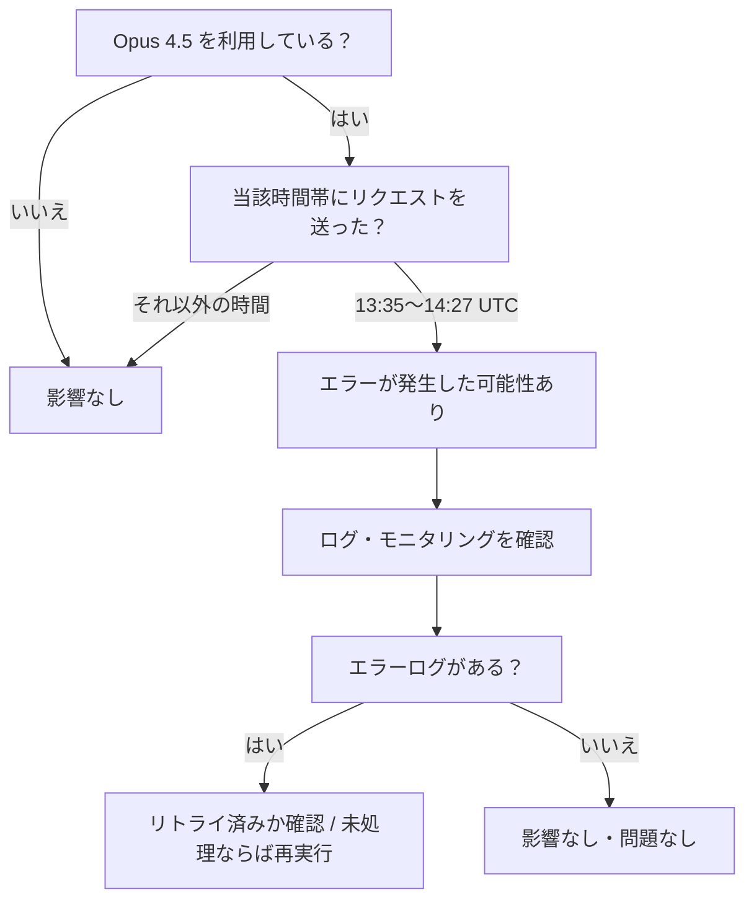
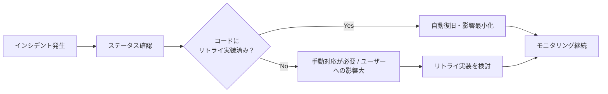

## はじめに

2026年6月29日、AnthropicのAIモデル **Claude Opus 4.5** においてエラー率が上昇するインシデントが発生しました。インシデントは約52分間継続しましたが、Anthropicの迅速な対応により現在は完全に解決されています。

本記事では、このインシデントの詳細なタイムライン・影響範囲・開発者として知っておくべきポイントを整理します。今後同様の障害が発生した際の参考にもなりますので、Claude APIを利用している開発者はぜひ把握しておいてください。

> **📌 影響を受ける人**
> - Claude Opus 4.5 をAPIまたはアプリケーション経由で利用している開発者・企業
> - 2026年6月29日 13:35〜14:27 UTC の時間帯にOpus 4.5へリクエストを送っていたサービス

---

## インシデントの全体像

今回の障害は、**Elevated errors（エラー率上昇）** として分類されています。短時間で収束したものの、APIを本番環境で利用しているサービスには一時的な影響が生じた可能性があります。

```mermaid
timeline
    title Opus 4.5 インシデント タイムライン（UTC）
    13:35 : 調査開始
           : Anthropic がエラー増加を検知
    13:52 : 原因特定・修正着手
           : 根本原因を特定しフィックスを開始
    14:13 : 修正適用・経過監視
           : パッチ適用後、安定性を観測
    14:27 : 解決宣言
           : 全リクエストが正常に処理される状態を確認
```

インシデント発生から解決まで **約52分**。Anthropicのステータスページ（status.claude.com）での情報公開も迅速で、透明性の高い対応が見られました。

---

## 変更内容（インシデント詳細）

| 項目 | 内容 |
|------|------|
| 発生日時（開始） | 2026-06-29 13:35 UTC |
| 解決日時 | 2026-06-29 14:27 UTC |
| 継続時間 | 約52分 |
| 対象モデル | Claude Opus 4.5 |
| 障害種別 | Elevated errors（エラー率上昇） |
| 利用側の対応 | **不要**（コード変更・設定変更なし） |
| 現在のステータス | ✅ 解決済み |

> **⚠️ 注意**
> 当該時間帯（13:35〜14:27 UTC）にOpus 4.5へ送ったリクエストは、エラーレスポンスを受け取っていた可能性があります。ログやモニタリングデータを確認し、影響を受けたリクエストがないか検証することを推奨します。

---

## 影響と対応

### こんな開発者への影響は？



### 開発者が取るべきアクション

1. **ログの確認**
   当該時間帯のAPIレスポンスログを確認し、エラーコード（5xx系）が記録されていないかチェックします。

2. **リトライの確認**
   エラーが発生していた場合、リトライロジックが正常に動作してリクエストが再送されていたか確認してください。

3. **ユーザーへの影響確認**
   エンドユーザーへの影響（回答が返らなかった・機能が一時停止した等）があった場合は、必要に応じて説明や補償を検討してください。

4. **今後の備え（リトライ実装の推奨）**
   今回のようなインシデントに備え、指数バックオフ付きのリトライロジックを実装しておくと障害耐性が高まります。

> **💡 Tips**
> Anthropicの公式ステータスページ（status.claude.com）をブックマークし、RSSや通知を設定しておくと、今後のインシデントをリアルタイムで把握できます。

---

## コード例

### Before（リトライなし：今回のようなインシデントに脆弱）

```python
import anthropic

client = anthropic.Anthropic()

def call_opus(prompt: str) -> str:
    message = client.messages.create(
        model="claude-opus-4-5",
        max_tokens=1024,
        messages=[{"role": "user", "content": prompt}]
    )
    return message.content[0].text
```

### After（指数バックオフ付きリトライ：障害耐性あり）

```python
import anthropic
import time
from anthropic import APIStatusError

client = anthropic.Anthropic()

def call_opus_with_retry(prompt: str, max_retries: int = 3) -> str:
    for attempt in range(max_retries):
        try:
            message = client.messages.create(
                model="claude-opus-4-5",
                max_tokens=1024,
                messages=[{"role": "user", "content": prompt}]
            )
            return message.content[0].text
        except APIStatusError as e:
            if e.status_code >= 500 and attempt < max_retries - 1:
                wait = 2 ** attempt  # 1秒 → 2秒 → 4秒
                print(f"サーバーエラー ({e.status_code})。{wait}秒後にリトライ... ({attempt + 1}/{max_retries})")
                time.sleep(wait)
            else:
                raise
    raise RuntimeError("最大リトライ回数を超えました")
```

> **💡 Tips**
> Anthropic公式SDKには `max_retries` パラメータが組み込まれており、クライアント初期化時に `anthropic.Anthropic(max_retries=3)` と指定するだけで自動リトライが有効になります。カスタムロジックが不要な場合はこちらを活用しましょう。

```python
# SDK組み込みのリトライ機能を使う場合
client = anthropic.Anthropic(max_retries=3)
```

---

## 今回のインシデントが示す教訓



今回のインシデントはAnthropicの迅速な対応により短時間で収束しましたが、**インフラ依存のサービスはいつでも障害リスクを持つ**ということを改めて認識させてくれます。以下の3点を実践することで、同様の障害時にも影響を最小化できます。

1. **ステータスページの監視** — 障害を早期検知する
2. **リトライロジックの実装** — 一時的なエラーを自動で乗り越える
3. **ログとアラートの整備** — 影響範囲を素早く把握する

---

## まとめ

| ポイント | 内容 |
|----------|------|
| 障害モデル | Claude Opus 4.5 |
| 継続時間 | 約52分（13:35〜14:27 UTC） |
| 現在の状態 | ✅ 完全解決済み |
| 利用者の対応 | コード変更不要。ログ確認を推奨 |
| 今後の備え | リトライロジック実装・ステータス監視 |

今回のインシデントは解決済みであり、現時点でOpus 4.5を利用するうえで特別な対応は必要ありません。ただし、本番環境でLLM APIを使用している場合は、障害耐性のある設計を日頃から意識することが重要です。今回の事例を機に、自身のシステムのリトライ戦略を見直してみてください。
