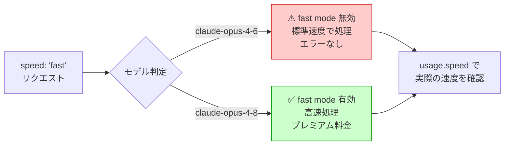
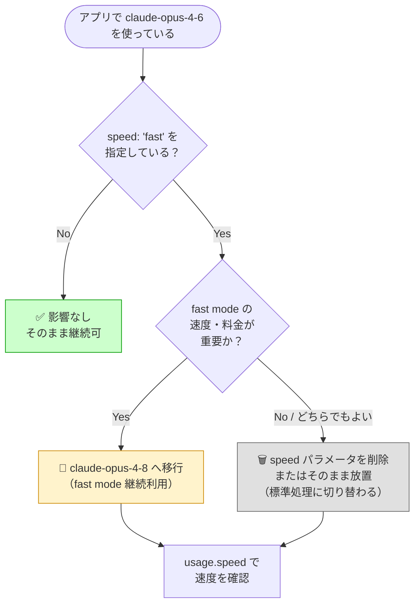

## はじめに

2026年6月29日、Anthropic は **Claude Opus 4.6 の fast mode を廃止**しました。

この変更で特に注意が必要なのは、`speed: "fast"` を指定したリクエストに対して**エラーが返らない**という点です。コードを変更せずに使い続けると、気づかないまま標準速度・標準料金での処理に切り替わります。

> **📌 影響を受ける人**
> - `claude-opus-4-6` モデルを使用しているすべての開発者
> - `speed: "fast"` パラメータを Messages API で指定しているアプリケーション
> - fast mode のコスト・速度特性を前提に設計しているシステム

---

## 変更の全体像



---

## 変更内容

### 何が変わったか

| 項目 | 変更前（〜2026/06/28） | 変更後（2026/06/29〜） |
|------|----------------------|----------------------|
| `claude-opus-4-6` + `speed: "fast"` | 高速処理・プレミアム料金 | **標準速度・標準料金** |
| エラー返却 | なし | **なし（サイレント変更）** |
| fast mode 利用可能モデル | claude-opus-4-6, claude-opus-4-8 | **claude-opus-4-8 のみ** |
| 実際の速度確認方法 | — | `response.usage.speed` |

> **⚠️ Breaking Change**
> `speed: "fast"` を `claude-opus-4-6` に送っても **400 エラーや警告は一切返りません**。レスポンス内容だけ見ていると変更に気づけないため、速度・コストを前提にしたシステムは必ずコードを確認してください。

---

## 影響と対応

### 影響パターン別の対応フロー



### 取るべきアクション

1. **コードを検索する**  
   `speed` パラメータと `claude-opus-4-6` の組み合わせを使っている箇所をすべてリストアップする

2. **fast mode が必要なら `claude-opus-4-8` へ移行する**  
   モデル名を差し替えるだけで fast mode は引き続き利用できる

3. **speed パラメータが不要なら削除する**  
   4.6 に送っても無害だが、意図が伝わらないコードはメンテナンス性を下げる

4. **`usage.speed` を監視に組み込む**  
   実際にどの速度で処理されているかをログに記録し、意図しない切り替わりを検知できるようにする

---

## コード例

### Before（fast mode が意図通り動いていた時）

```python
import anthropic

client = anthropic.Anthropic()

response = client.messages.create(
    model="claude-opus-4-6",   # ← fast mode が有効だったモデル
    max_tokens=1024,
    messages=[{"role": "user", "content": "Hello!"}],
    speed="fast",               # ← fast mode 指定
)

print(response.content)
# ※ この組み合わせは 2026/06/28 まで高速・プレミアム料金で動作
```

### After: fast mode を継続利用する場合

```python
import anthropic

client = anthropic.Anthropic()

response = client.messages.create(
    model="claude-opus-4-8",   # ✅ 4.8 へ変更
    max_tokens=1024,
    messages=[{"role": "user", "content": "Hello!"}],
    speed="fast",               # fast mode が有効
)

# 実際の速度をログに残すことを推奨
print(f"Speed: {response.usage.speed}")
print(response.content)
```

### After: fast mode が不要な場合

```python
import anthropic

client = anthropic.Anthropic()

response = client.messages.create(
    model="claude-opus-4-6",   # モデルはそのまま
    max_tokens=1024,
    messages=[{"role": "user", "content": "Hello!"}],
    # speed パラメータは削除（または残しても標準処理）
)

print(response.content)
```

### 影響範囲チェックスクリプト

既存コードベースに速やかに影響箇所を洗い出したい場合は、以下のコマンドが参考になります。

```bash
# Python プロジェクトで speed="fast" と opus-4-6 の同時使用を探す
grep -rn "speed" . --include="*.py" | grep -i "fast"
grep -rn "opus-4-6" . --include="*.py"
```

> **💡 Tips**
> `usage.speed` フィールドを監視ダッシュボードに組み込んでおくと、モデルのアップデートによる意図しない速度変更を早期に検知できます。staging 環境での定期的な確認も有効です。

---

## まとめ

| 確認ポイント | 内容 |
|-------------|------|
| **変更日** | 2026年6月29日 |
| **廃止内容** | `claude-opus-4-6` の fast mode |
| **エラーの有無** | なし（サイレント変更） |
| **fast mode 継続** | `claude-opus-4-8` へ移行が必要 |
| **速度確認方法** | `response.usage.speed` |

今回の変更で最も注意すべきは「**エラーが返らない**」点です。動作しているように見えても、速度と料金が静かに変わっています。`claude-opus-4-6` + `speed: "fast"` を使っているコードは必ず今週中に確認し、fast mode の継続利用が必要な場合は `claude-opus-4-8` へ切り替えてください。
