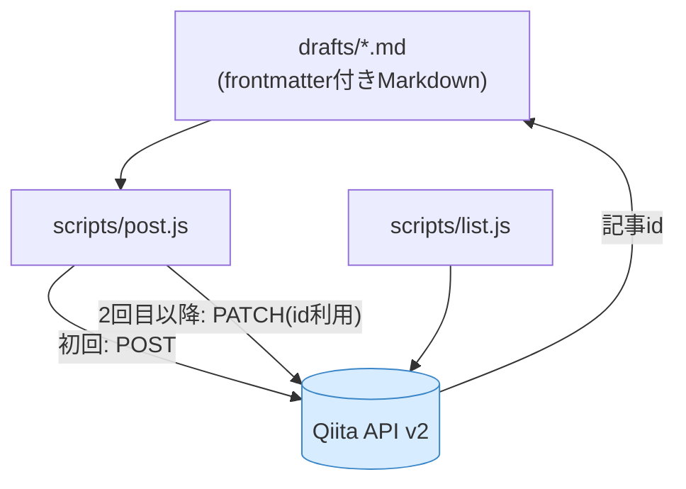

> この記事はClaude (Sonnet 5) と一緒に執筆しました。

## きっかけ

Claude DesktopのCodeタブで最初に投げたお願いはこれだけです。

```text
Qiitaの記事を書くプロジェクトを新規につくりたい。下書きを一緒に作ってAPIで送信したい。
```

## できたプロジェクト構成

できあがったのは `qiita-writer` という小さなプロジェクトです。



- `drafts/*.md`: frontmatter(`title` / `tags` / `private` / `id`)付きの下書きMarkdown
- `scripts/post.js`: 下書きをQiita API v2に投稿・更新するCLI。初回はPOSTし、
  返ってきた記事idをfrontmatterに自動で書き戻す。次からはPATCHで上書き更新になる
- `scripts/list.js`: 自分の投稿済み記事一覧を確認するCLI
- `scripts/frontmatter.js`: 依存ライブラリなしの簡易frontmatterパーサー

「下書きを作ってAPIで送信したい」という一文が、そのまま「投稿して終わり」ではなく「投稿後も直しながら育てる」前提の設計に翻訳されました。
記事idの自動書き戻しと上書き更新もこちらから頼んだものではなく、依頼を運用フローに落とし込む過程で出てきた提案でした。

## 実際に記事を書いてもらう

土台ができたあと、別プロジェクト(自作Androidアプリの限定配布ポータル)の
READMEを渡して「この内容で記事を書いて」と依頼しました。READMEは開発者向けの
説明書なので、そのまま貼っても記事にはなりません。読者を想定した見出し構成に
組み替え、コードは記事として読める分量に絞る、という変換を挟んで
Qiita向けの記事体に書き起こされました。

## 「下書きにできない?」— Qiita APIに下書きは無い

途中で「投稿前に下書き状態にできない?」と聞いたところ、Qiita API v2には
**本当の意味での「未公開の下書き」状態が無い** と教えてもらいました（まったく調べなかったので）。
選べるのは次の2つだけです。

- `private: false` → 公開
- `private: true` → 限定共有(URLを知っている人だけが見られる)

そこで「`private: true` で投稿し、直したら `private: false` に切り替えて公開する」という運用に落ち着きました。

## ルールは会話ではなくAGENTS.mdに残す

1. 記事冒頭に、Claudeと一緒に書いたことを明示する1行を必ず入れる
2. 下書きは必ず `private: true` で作り、明示的な公開指示が出るまで
   `private: false` にしない

これらは会話の中で都度伝えるのではなく、`AGENTS.md` に「崩してはいけない不変条件」として書きました。
会話の中の約束はセッションが終われば消えますが、ファイルに書いたルールは次のセッションでも何も言わずに守られます。

## 図はmermaidで描く

最初の記事ではASCIIアート(罫線文字)で図を描いていたのですが、Qiita上で
表示が崩れました。等幅フォント前提の図は環境が変わると簡単に壊れます。
Qiitaは `mermaid` コードブロックにネイティブ対応しているので、以降はすべての
図をmermaidで描くことにし、これもAGENTS.mdに明記しました。

mermaidに乗り換えたあとも一つ落とし穴がありました。ノードラベルの中で
改行したくて `"drafts/*.md\n(frontmatter付きMarkdown)"` のように `\n` を
書いていたのですが、Qiita上では改行されずに `\n` という文字列がそのまま
表示されてしまいました。Qiitaのmermaidレンダラは `\n` を改行として
解釈してくれないようで、代わりに `<br/>` タグを使うと意図通りに改行されます。
これも地味に踏み抜きやすいポイントなので、AGENTS.mdに「ノードラベル内の
改行は `\n` ではなく `<br/>` を使う」と書き足しました。

## まとめ

- 「記事を書いて」ではなく「記事を書く仕組みを作って」と頼むと、下書き管理・API連携・更新フローまで含めた設計が返ってくる
- Qiita APIには下書き状態が無い。`private: true`(限定共有)を実質的な下書きとして使う運用にする
- 「AI執筆の明示」「下書きはprivateのまま」のようなルールは、AGENTS.mdに書く。セッションをまたいでも、モデルが変わっても引き継がれる
