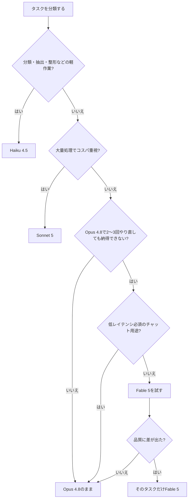

:::note warn
本記事は**2026年7月5日時点**の情報です。この分野の情報の賞味期限は牛乳並みに短いので、価格・仕様は必ず[公式ドキュメント](https://platform.claude.com/docs/en/about-claude/models/overview)で確認してください
:::

## はじめに

> 「Opusが最上位」と覚えた矢先に、その上が来た

モデル名インフレに疲れている皆さん、こんにちは。安心してください。今回は「数字が増えた」だけの話ではなく、**階層が1つ増えた**という構造の変化です。構造さえ掴めば、むしろ整理は楽になります。この記事で3分〜5分で把握していきましょう。

## 何が起きたのか:Opusの上に「Mythos級」ができた

これまでのClaudeの階級は3段でした。

```
(旧) Haiku < Sonnet < Opus
(新) Haiku < Sonnet < Opus < Mythos級(Fable 5 / Mythos 5)
```

2026年7月時点の主要ラインナップを、価格込みで整理するとこうなります。

| モデル | モデルID | 立ち位置 | 価格（入力/出力、100万トークンあたり） |
|---|---|---|---|
| **Claude Fable 5** | `claude-fable-5` | 一般提供の最上位（Mythos級） | USD 10 / USD 50 |
| **Claude Mythos 5** | `claude-mythos-5` | 承認組織限定（Project Glasswing） | USD 10 / USD 50 |
| Claude Opus 4.8 | `claude-opus-4-8` | 日常の主力・ワークホース | USD 5 / USD 25 |
| Claude Sonnet 5 | `claude-sonnet-5` | コスパ枠。コーディングはOpus級に肉薄 | USD 3 / USD 15（2026-08-31まで導入価格 USD 2 / USD 10） |
| Claude Haiku 4.5 | `claude-haiku-4-5` | 速い・安い | USD 1 / USD 5 |

Fable 5はOpus 4.8のちょうど**2倍の価格**。コンテキストは100万トークン、最大出力は128Kトークンです。

## なぜ「上」が作られたのか:賢さより「持久力」の軸

「Opusをもっと賢くすればいいのでは?」と思うかもしれません。しかしMythos級の仕様を並べてみると、狙いが単なる賢さの上積みではなく**長時間の自律稼働**にあることが見えてきます。

- **思考(thinking)が常時オン**でオフにできない → 浅い即答を最初から想定していない
- **コンテキスト1Mトークン・最大出力128K** → 何十回もツールを呼びながら走る長丁場が前提
- **1リクエストが数分〜十数分** → 「対話する」単位ではなく「仕事を預ける」単位

つまりこれは「即答が賢いモデル」ではなく「**数時間の仕事を一人で完走するモデル**」です。逆に言えば、この特性が刺さらない仕事——短い定型応答、低レイテンシ必須のチャット、分類・整形——では**価格差に見合う差が出にくい**。これがこのティアの明確な限界であり、後述の判断フローで「ほとんどの人は乗り換え不要」と言い切れる理由でもあります。

## FableとMythosは何が違うのか

ここが一番誤解されやすいポイントです。

- **同じ基盤モデル**です。能力・価格・APIサーフェスはほぼ同一
- **Fable 5**:誰でも使える。ただしバイオ・サイバー等のデュアルユース領域に**追加の安全分類器**が入っている
- **Mythos 5**:その安全措置なしで提供される代わりに、**審査を通過した組織だけ**(Project Glasswing経由)が使える

つまり「性能の差」ではなく「**提供条件の差**」です。一般ユーザーが気にすべきはFable 5だけで、Mythosは「そういう枠もある」と知っていれば十分です。

ちなみに名前はFable(寓話)とMythos(神話)。Haiku(俳句)→Sonnet(ソネット)→Opus(大作)と来て、ついに神話まで到達しました。モデル名がだんだん文学部っぽくなっていますが、中身は理系です(※学部は関係ありません)。

## 技術的に押さえるポイント5つ

APIから使う人向けの要点です。

1. **思考(thinking)は常時オン**:`thinking`パラメータを省略すればOK。明示的にオフ(`disabled`)にしようとすると400エラー。深さは`effort`(low〜max)で制御する設計に変わった
2. **生の思考ログは返らない**:`display: "summarized"`を指定すると要約された思考は見られる。デフォルトは非表示
3. **1ターンが長い**:難しいタスクだと1リクエストが数分〜十数分走ることが普通にある。タイムアウト設計・ストリーミング・進捗表示は必須の前提に
4. **refusal(拒否)への対応**:安全分類器がHTTP 200+`stop_reason: "refusal"`で返すことがあり、セキュリティ業務など無害な仕事でも誤発動しうる。`fallbacks`パラメータ(ベータ)を付けておくと、拒否時に同一リクエスト内でOpus 4.8に自動退避できる
5. **運用要件**:**30日データ保持が必須**。ゼロデータ保持(ZDR)設定の組織では全リクエストが400になるので、契約設定を先に確認

## 移行時に400になるやつ(コピペ確認用)

Opus 4.7以降の流れを引き継いでいるので、古いコードからの移行では以下が地雷です。

- [ ] `thinking: {type: "enabled", budget_tokens: N}` → **400**(adaptiveへ)
- [ ] `thinking: {type: "disabled"}` → **400**(Fable 5はパラメータごと省略)
- [ ] `temperature` / `top_p` / `top_k` → **400**(削除する)
- [ ] アシスタントプリフィル(最後にassistantメッセージを置く技)→ **400**(structured outputsへ)
- [ ] `max_tokens`が小さいまま → 思考が長い分、余裕を持たせないと途中で切れる

「昨日まで動いていたコードが、モデルIDを変えた瞬間に400の雨」はこの界隈の風物詩ですが、雨雲の位置が分かっていれば傘は差せます。

ありがちな失敗例をひとつ。モデルIDは設定ファイルで差し替えたのに、共通のAPIラッパーの奥に`temperature: 0`がハードコードされていて、**全エンドポイントが一斉に400**——というのが移行事故の典型パターンです。パラメータはコードの深いところに埋まりがちなので、移行前に`temperature|top_p|top_k|budget_tokens`あたりでリポジトリをgrepしておくと、雨雲の位置が事前に分かります。

## で、乗り換えるべきか:判断フロー

正直なところ、**ほとんどの人は今日すぐ乗り換える必要はありません**。

- **日常のコーディング・エージェント業務** → Opus 4.8のまま(能力十分で価格半分)
- **大量処理・コスパ重視** → Sonnet 5(いまは導入価格でさらにお得)
- **分類・整形などの軽作業** → Haiku 4.5
- **何時間も走る自律エージェント、最難関の設計・調査・デバッグ** → **Fable 5を試す価値あり**。1リクエストに時間はかかるが、人間が張り付く時間まで含めたトータルでは安くつくことがある

この流れを図にすると次の通り。上から順に判定していけば迷いません。



目安は「**Opus 4.8で2〜3回やり直しても納得の出ないタスク**」が出てきたら、それをFable 5に投げてみる。差が出なければ戻ればいいだけです。「とりあえず最強を常用したい」気持ちはわかりますが、まず翌月の請求書と相談してください。

コスト感の目安も置いておきます(公称単価からの機械的な試算で、実測ではありません)。入力10万+出力3万トークンの重めのリクエスト1回あたり、Fable 5は約2.50 USD、Opus 4.8は約1.25 USD。仮に1日20回投げると差額は約25 USD/日、月に直すと約750 USDです。「エンジニアの張り付き時間が減るなら安い」と見るか「月750ドルの固定費」と見るかはタスク次第——だからこそ全面移行ではなく「最難関だけFable」の使い分けが効きます。

## よくある誤解FAQ

**Q. Mythos 5は申請すれば誰でも使える?**
A. いいえ。Project Glasswing経由の審査を通過した組織限定です。一般の開発者が触る機会は当面ないと考えてOK。能力はFable 5と同一なので、羨ましがる必要もありません。

**Q. Fable 5にすれば何でも賢くなる?**
A. なりません。短い定型タスクや分類ではOpus 4.8以下との差がほとんど出ず、価格だけ2倍になります。差が出るのは「長時間・多段・最難関」の領域です。

**Q. refusal(拒否)が返ってきたらプロンプトが悪い?**
A. 必ずしも違います。安全分類器の誤発動(セキュリティ業務やライフサイエンス系の無害な仕事でも起きえます)の可能性があるので、まず`stop_details`のカテゴリを確認し、`fallbacks`でOpus 4.8へ自動退避させるのが定石です。

## まとめ

- Claude 5ファミリーは**Opusの上の新ティア**。Fable 5(一般提供)とMythos 5(承認組織限定)は同じモデルで、違いは安全措置と提供条件
- API面の変化:思考常時オン、effortで制御、長時間ターン前提、refusal+fallbacks、30日データ保持必須
- 主力はOpus 4.8 / Sonnet 5のままで良い。Fableは「最難関タスクの切り札」から試す

**参考リンク**
- 公式発表:https://www.anthropic.com/news/claude-fable-5-mythos-5
- モデル一覧・価格:https://platform.claude.com/docs/en/about-claude/models/overview

---

*最新モデル解説、需要があれば続けます。「使ってみた」編が読みたい方はいいねで投票してください。
