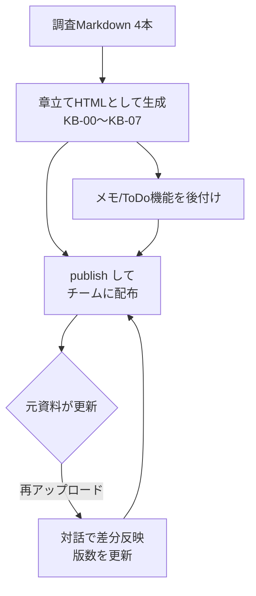

## はじめに

筆者は最近、あるAI駆動開発チーム（社内でAIエージェントを開発フローに組み込んでいるチーム）向けに、調査資料を1本のナレッジベースにまとめる作業をしました。このとき成果物の器として選んだのが Claude の **Artifact** です。

最初は「HTMLを1枚吐き出して終わり」くらいのつもりだったのですが、実際に使ってみると Artifact は **作って配って終わりの静的資料ではなく、対話で継続的に育てられる生きた資料** として機能しました。本記事では、その一連のワークフローを実体験ベースで共有します。

### この記事でわかること

- 調査資料を Artifact 製の HTML ナレッジベースにまとめる流れ
- publish してチームに配布するときの手順と注意点
- 元資料が更新されたときに「対話で」反映して版を上げていく運用
- 閲覧者が書き込めるメモ機能を後付けするときのハマりどころ

### 対象読者

- Claude（Pro 以上）を触っていて、Artifact を「使い捨てのプレビュー」以上に活用したい人
- チーム内に散らばった調査・設計資料を1枚に集約して配りたい人

### 前提

Artifact の基本操作（コード生成、プレビュー、ダウンロード）は把握している前提で進めます。プランは Pro 以上を想定しています（永続ストレージや publish の一部挙動がプランに依存するため）。

## 背景：4本の調査を「配れる1枚」にしたい

チームでは、AIエージェント開発に関する調査を複数の Markdown に分けて蓄積していました。マルチエージェント設計、Skills の運用、MCP、モデル・プランの使い分け…といった具合に4本ほどに分かれており、それぞれは充実しているものの、**「メンバーに配って参照してもらう」という観点だと分断されていて使いづらい** 状態でした。

やりたかったのは次の3点です。

- 4本の調査を横断できる **1枚のナレッジベース** にまとめる
- メンバーが **アカウントの有無を気にせず開ける** 形で配布する
- 元資料が更新されたら、**作り直しではなく差分で追従** できるようにする

## なぜ Artifact だったのか

候補は他にもありました（Markdown をそのまま共有、静的サイトを立てる、ドキュメントツールに転記、など）。それでも Artifact を選んだ理由は、**「章立てのHTMLを対話で組み上げて、そのまま公開リンクにできる」** という一気通貫さでした。

特に効いたのが次の2点です。

1. **生成と修正が同じ会話の中で完結する** — 「KB-02にこの節を足して」「この表にリンクを付けて」といった指示をそのまま反映でき、資料の履歴が会話として残ります。
2. **publish で誰でも開けるリンクになる** — 標準的なHTML Artifactなら、リンクを知っている人はClaudeアカウントなしで閲覧できます（[公式ヘルプ](https://support.claude.com/en/articles/9547008-publish-and-share-artifacts)）。

## ワークフロー全体像

実際の流れを図にすると、こうなります。



ポイントは、`C` の配布と `E` の更新がループになっているところです。一度配って終わりではなく、**元資料の更新のたびに同じ会話で追従して版を上げる** という運用に落ち着きました。

## 1. HTMLナレッジベースを章立てで組む

最初にやったのは、4本の調査＋既存の計画書をアップロードし、章立ての設計から合意することでした。いきなり全文を書かせるのではなく、**「ホーム＋各調査を1章ずつ＋横断早見表＋出典」という骨格を先に決めた** のが後々効きました。章の粒度が決まっていると、あとから「この章に節を足す」という差分指示が通しやすくなります。

生成は一気にではなく、章ごとに段階的に組み立てていきました。全体を一度に吐かせると、修正のたびに巨大なHTMLを丸ごと書き直すことになり、時間もかかれば事故も増えます。**章単位で構築・置換する** ほうが安定します。


※画像は記事向けにマスキングしています

## 2. Artifact として publish して配布する

ここで一つ、地味だけれど重要な点があります。**Claude 自身は公開リンクを発行できません。** publish はユーザーがプレビューパネルの共有／Publish メニューから行う操作です。


publish すると「リンクを知っている人は誰でも閲覧できる」状態になります。裏を返すと、**社外秘の情報を含むなら公開範囲に注意が必要** ということです。筆者のケースはチーム内配布だったので、リンクの共有先を絞る運用にしました。


## 3. 元資料が更新されたら「対話で」反映する

このワークフローでいちばん恩恵を感じたのがここです。調査Markdownは一度書いて終わりではなく、その後も加筆されていきました。そのたびに、**更新版を再アップロードして「この資料を更新したのでナレッジベースに反映して」と伝えるだけ** で、該当章に新しい節が足され、出典一覧と版数（v1.1 → v1.2 …）が更新されていきます。


作り直しではなく差分で追従できるので、資料が「育って」いく感覚がありました。実際、筆者のケースでは最終的に v1.6 まで版が上がり、途中で個別の依頼（リポジトリ名にGitHubリンクを付ける、特定キーワードの言及有無を `grep` で確認する、といった細かい作業）も同じ会話の中でこなせました。

## 4. 閲覧者が書き込めるメモ機能を後付けする

配布したあと、「閲覧者が章ごとにメモやToDoを残せると便利では」と思い、**開閉式の右サイドバー** を後付けしました。ここは実装的にハマりどころが2つあったので、そのまま共有します。


### localStorage は使えない → `window.storage`

Artifact はサンドボックス化された iframe 内で動くため、**`localStorage` / `sessionStorage` は使えません**（エラーになるか、書き込みが黙って失われます。[公式の説明](https://support.claude.com/en/articles/9487310-what-are-artifacts-and-how-do-i-use-them)）。

publish 済み Artifact でメモを永続化したい場合は、専用の永続ストレージAPI（`window.storage`）を使い、それが使えない環境ではセッション内メモリに退避する、というフォールバックを噛ませるのが安全です。

```javascript
// ※ API名・形はプレビューで要確認。永続ストレージがあればそちらへ、ダメならメモリへ退避する
async function saveNote(key, value) {
  try {
    if (window.storage && typeof window.storage.setItem === "function") {
      await window.storage.setItem(key, value);
      return;
    }
  } catch (e) {
    // 権限・環境の都合で失敗したらフォールバックに回す
  }
  memoryStore[key] = value; // セッション内メモリ
}
```

なお永続化は「publish 済み・対象プラン・テキスト・容量20MB以内」といった条件が揃って初めて効きます。条件を外すと**エラーも出ずに翌セッションで空** になるので、過信は禁物です。

### エクスポートも用意しておく

永続化が保証しきれない以上、**書いたメモをテキストで書き出せる導線** を併せて用意しておくと安心です。筆者は「章ごとのメモをまとめてコピー／`.txt` でダウンロード」する機能を足し、ToDoは Markdown のチェックボックス形式（`- [x]` / `- [ ]`）で出力するようにしました。ダウンロードがブロックされる環境ではコピーに自動フォールバックさせています。

## publish 時に出た CSS エラーと対処

最後に、publish 時にだけ出たエラーを1つ。次のようなメッセージが出ました。

```text
Error: Error inlining remote css file SecurityError...
Error: Error loading remote stylesheet Error: Failed to fetch
Error: Error while reading CSS rules from https://fonts.googleapis.com/...
```

原因は `<head>` に入れていた **Google Fonts の外部リンク** でした。publish 時に全CSSをインライン化しようとした際、クロスオリジンのスタイルシートは `cssRules` を読み取れず（ブラウザのセキュリティ制限）、エラーになっていたのです。

対処はシンプルで、外部フォントのリンク（`preconnect` + `stylesheet`）を削除し、**システムフォントのフォールバックだけで組む** ことにしました。

```css
/* 外部フォントに依存せず、OS 標準フォントで組む */
body {
  font-family: "Noto Sans JP", "Hiragino Sans", "Yu Gothic UI",
    "Meiryo", sans-serif;
}
```

日本語のナレッジベース用途なら、これで見た目の劣化はほぼ気になりませんでした。**Artifact を publish する前提なら、最初から外部CSS/フォントに依存しない構成にしておく** のが無難、というのが学びです。

## まとめ

Artifact を「使い捨てのプレビュー」ではなく **チームで育てるナレッジベースの器** として使うと、次のような運用が回せます。

- 章立てのHTMLを **対話で段階的に** 組み上げる
- publish して **アカウント不要のリンク** で配布する（公開範囲には注意）
- 元資料の更新を **再アップロード＋差分指示** で追従し、版を上げていく
- メモなどの機能は後付けできるが、**永続化は `window.storage` ＋フォールバック＋エクスポート** で守る
- publish 前提なら **外部CSS/フォントに依存しない** 構成にしておく

「調査資料が複数に分かれていて配りづらい」という課題を持っているチームには、選択肢として試す価値があると感じました。

## 参考

- [Publish and share artifacts | Claude Help Center](https://support.claude.com/en/articles/9547008-publish-and-share-artifacts)
- [What are artifacts and how do I use them? | Claude Help Center](https://support.claude.com/en/articles/9487310-what-are-artifacts-and-how-do-i-use-them)
