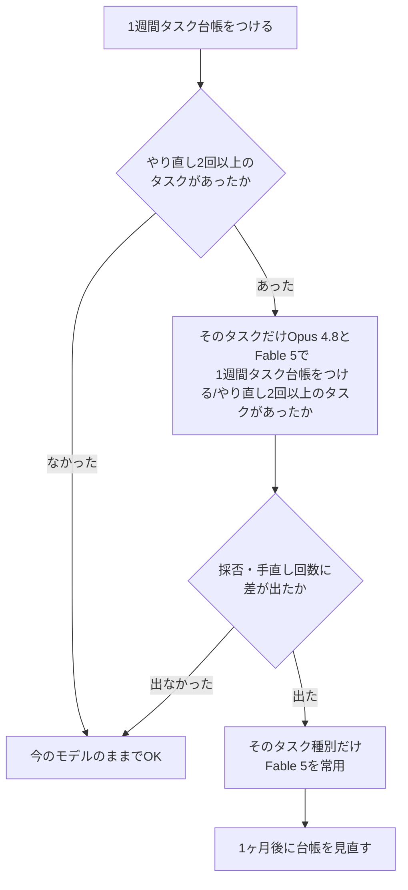

## 要約

- 差が出たのは「**長時間・多段・曖昧**」な仕事。数時間級の自律タスクと、意図を詰め切っていない依頼でFable 5がOpus 4.8を明確に上回った
- **定型・軽作業では体感差なし**。分類・整形・短文生成は前編の予想どおり「価格だけ2倍」で終わった
- 乗り換え判断は勘ではなく**「やり直し回数の記録」**から始めるのが早い。1週間タスク台帳をつけて、やり直し2回以上のタスクだけ両モデルにA/Bさせれば十分

:::note warn
本記事は**2026年7月時点**の情報と、筆者環境における一事例(n=1)の検証結果です。ベンチマークスコアのような定量値ではなく、実務での「採用できたか」「手直しが何回で済んだか」という筆者の主観基準に基づいています。モデル仕様・価格は必ず[公式ドキュメント](https://platform.claude.com/docs/en/about-claude/models/overview)で最新情報を確認してください。
:::

## はじめに

前回、「Fable5から「Opusの上」に何ができたのか5分で把握する」という記事でFable 5のスペックと価格を整理しました。要点は、Opus 4.8の**ちょうど2倍の価格**で、常時思考オン・コンテキスト100万トークン・1リクエストが数分〜十数分という「数時間級の仕事を一人で完走するモデル」だということ。

新しいモデルが出るたびに感じるのですが、知りたいのは「で、実際どうなの?」の一点なのに、タイムラインに流れてくるのはスペック表の転載と価格比較ばかりです。価格が2倍なら仕事の質も2倍になるのか、それとも「思考が常時オンなだけの、値段が2倍のOpus」なのか。これはスペック表を何度読んでも、公式ブログを何周しても分かりません。結局のところ、実際に手を動かして、同じ仕事を両方のモデルにやらせて成果物を並べて見比べるしかない話です。

思い返せば、Sonnet 5が出たときも、Opus 4.8が出たときも似たような流れでした。発表直後はスペック表と価格表がタイムラインを埋め尽くし、数日後に「試してみた」系の記事がぽつぽつ出て、ようやく実務の解像度で語れるようになる。今回のFable 5は価格が2倍という分かりやすい壁があるぶん、「試してみた」の重要度が普段より高いモデルだと感じていました。

前編で立てた仮説は「Opus 4.8で2〜3回やり直しても納得できないタスクだけFable 5に投げてみる」というものでした。これはあくまで机上の予想だったので、今回はこの予想が実際に当たっているのか、当たっているとしてどの程度当たっているのかを、手元の業務タスクで検証しています。

## 検証の設計:何をどう比べたか

検証の骨子は単純です。日々の業務から性質の異なる4カテゴリのタスクを選び、Opus 4.8とFable 5の両方に同じプロンプト・同じ入力(同じリポジトリ状態、同じ資料)で依頼し、出てきた成果物を同一の基準でレビューしました。

具体的には、依頼を投げる前にリポジトリやドキュメントの状態を揃えておき、片方のモデルに投げたら状態をリセットしてもう片方に同じ依頼を投げる、という形で「後出しの追加情報」が紛れ込まないようにしています。レビューの際は、どちらのモデルの成果物かをできるだけ意識せずに読み、「これはそのまま採用できるか」「採用できるとして手直しは何箇所・何往復で済んだか」という基準だけで判定しました。ベンチマークのようなスコアリングはしていません。基準は「実務で使えるかどうか」の一点です。

先に検証の限界を正直に書いておきます。ここを誤魔化すと再現性のない記事になってしまうので、あえて章を割きます。

- **n=1です**。筆者一人が、筆者の環境・筆者の判断基準で行った一事例であり、統計的な有意差を主張するものではありません。別のドメイン・別のエンジニアが試せば、当然違う結果になり得ます
- **タスクは筆者の業務由来**であり、内容は一般化・匿名化して例示します。社内固有の情報や具体的な数値はぼかしているため、「実際のタスクを一般化した例です」と注記した箇所は、あくまで雰囲気を伝えるための再構成です
- **評価は定量スコアではなく実務基準**(採否・手直し回数)です。速度や正答率のようなベンチマーク的な再現性は最初から狙っていません

その上で、「自分の業務でも同じことをすれば同じように判断できる」という再現性は担保したつもりです。プロトコルは最後の章にチェックリストとして置きます。

4カテゴリの選び方についても補足しておきます。適当に4つ選んだわけではなく、直近1〜2ヶ月の自分の業務ログを振り返って「時間がかかった仕事」「依頼が曖昧だった仕事」「悩んで答えが出なかった仕事」「特に悩まずさばけた仕事」という粒度で分類し、それぞれの代表格として今回の4カテゴリを選んでいます。つまり検証タスクの選定自体が、後述する「タスク台帳」のミニ版だったとも言えます。また「手直し」の定義も揃えておく必要があり、今回は「成果物に対してこちらから追加の指示を出し、モデルに再度手を入れさせた回数」をカウントしています。誤字の修正のような瑣末な直しは含めず、設計方針や実装方針に関わる差し戻しだけを数えました。

もう一つ気をつけたのが確証バイアスです。「Fable 5の方が高いのだから優れているはず」という先入観でレビューすると、多少強引にでもFable 5の成果物を持ち上げてしまいかねません。これを避けるため、成果物のファイル名やコミットメッセージから作成元が分かる情報を先に削り、可能な範囲でどちらの出力かを伏せた状態でまず読み、判定を書いてから答え合わせをする、という手順を踏みました。完全な二重盲検ではありませんが(自分で依頼を投げている以上、文体の癖などから薄々気づいてしまう場面もありました)、何もしないよりは判定のブレを減らせたはずです。

## 検証1:数時間級の自律タスク(リファクタ・調査)

ここが一番はっきり差が出たカテゴリです。

例として、「レガシーな社内APIクライアントのモジュール一式を、型定義や呼び出し側の互換性を保ったまま新しいSDKのインターフェースに置き換え、影響範囲のテストも合わせて直す」といった、着手から数時間かかる規模のリファクタタスクを両モデルに投げました(※実際のタスクを一般化した例です)。あわせて、複数のログファイルやモジュールにまたがる不具合の原因を横断的に読み解いて調査報告としてまとめる、という長時間の調査系タスクでも比較しています。

Opus 4.8は序盤の速度・精度は十分で、最初の1〜2時間分の作業だけを見ると差を感じません。ただ、作業が長丁場になるほど、途中で方針がぶれたり、序盤に決めた設計判断を後半になって忘れたかのように矛盾したコードを書いたりする場面が出てきました。調査タスクでも同様で、序盤で「この仮説は棄却した」と自分で判断したはずの内容を、終盤の報告書で再び持ち出してくることがありました。人間が定期的に「さっきの方針で続けて」「その仮説はもう検討済み」と割り込んで軌道修正する前提であれば十分実用に足るのですが、放置すると品質が経過とともに緩やかに崩れていく感触があります。

Fable 5は、同じ規模のタスクで**最後まで一人で完走する持久力**がはっきり違いました。序盤で決めた設計方針を最後の変更まで一貫して守り、途中で止まって確認を求めてくることもなく、成果物を通しで見たときに「前半と後半で書いた人が違う」ような違和感がありません。調査系タスクでも、一度棄却した仮説を蒸し返すことなく、最終報告までロジックの筋が通っていました。前編で触れた「思考が常時オン」「1リクエストが数分〜十数分」という仕様は伊達ではなく、まさにこの「長時間放置しても崩れない」ために振られたコストだと納得しました。

このカテゴリで一番印象的だったのは、成果物の「差分の質」でした。Opus 4.8の差分は、変更が必要な箇所には確実に手が入っているのですが、途中でリファクタの粒度が変わったり(最初は関数単位で綺麗に分けていたのに、後半はファイル全体を一気に書き換えるような荒さになる)、コメントの書き方のトーンが途中から変わったりすることがありました。単体では気づきにくいのですが、差分全体を通しでレビューすると「息切れ」のような跡が見えます。Fable 5の差分は、最初のコミットから最後のコミットまで粒度とトーンが揃っていて、レビュー時に「ここから急に雑になった」という箇所を探す手間そのものが発生しませんでした。長時間タスクでのレビューコストは、直し方の量よりも「どこで質が崩れたかを探す手間」の方が地味に効いてくるので、ここが揃っているだけでもレビュアー側の負担はかなり違います。

「持久力」を判断する上で実際に見ていた観察ポイントも書いておきます。具体的には、①テストを書きっぱなしで放置せず最後まで通す状態に持っていけているか、②TODOコメントを残したまま終わっていないか、③序盤に決めた命名規則や設計方針が終盤まで一貫しているか、の3点です。Opus 4.8はこの3点のうち1〜2点でどこかしら息切れの跡が見られることが多く、Fable 5は3点とも最後まで維持されていることが多い、というのが今回観察できた傾向でした。あくまで傾向であり、Opus 4.8が必ず崩れるわけでも、Fable 5が絶対に崩れないわけでもない点は付け加えておきます。

## 検証2:曖昧な依頼の意図補完

これも差が出ました。

「このログ集計バッチ、もう少し使いやすくしておいて」のような、意図を詰め切らずに投げた一言の依頼で比較しています(※実際のタスクを一般化した例です)。こういう依頼は本来良くない依頼の仕方なのですが、現実の業務では日常茶飯事です。依頼者自身も「使いやすく」の具体像を持っていないことが多く、むしろそれをこちらに考えてほしいというのが本音だったりします。

Opus 4.8は、曖昧さが大きいタスクに対して「使いやすくする、とは具体的にどのような改善を指しますか?」と確認を挟んでくることが多く、これ自体は誠実な振る舞いです。ただし、依頼者側が意図を明確に言語化できていない場合はここで会話が止まり、堂々巡りになりがちでした。忙しいときにこのキャッチボールが挟まると、結局こちらが仕様を書き下ろす羽目になり、「だったら最初から自分で書いた方が早かったのでは」という気分になります。

Fable 5は、曖昧な依頼に対して質問攻めにするのではなく、文脈(周辺のコード、過去のコミット履歴、命名規則、類似モジュールの作り)から妥当なデフォルトを自分で決めて、まず一通り手を動かした状態で提示してくることが多い印象でした。たとえるなら、新人とベテランの違いに近いものを感じます(※比喩です)。新人は指示が曖昧だと「それはどういう意味ですか」と都度確認しますが、ベテランは文脈から「たぶんこういうことだろう」と当たりをつけて、まず動くものを作ってから「この解釈で合っていますか、違えば直します」と確認する。Fable 5の振る舞いは後者に近く、依頼者が意図を100%言語化していなくても、一度目の提示で「採用」または「軽微な修正で採用」に到達する率が体感で高いタスクカテゴリでした。これは特に、依頼を投げる側に時間的余裕がない現場ほど効いてくる差だと感じます。

もう少し具体的に書くと、「使いやすく」という依頼に対してFable 5が実際に決めてきたデフォルトは、「実行結果のサマリを先頭に出す」「エラー時のログをもう少し人間が読める形式に変える」「よく使うオプションにショートハンドを足す」といった、周辺コードの書きぶりから類推できる範囲の改善でした。的が外れていた場合ももちろんありますが、外れたとしても「土台ができている状態からの軌道修正」で済むため、ゼロから会話をやり直すよりも早く着地します。曖昧な依頼を投げがちなのは経験の浅いメンバーや、忙しくて言語化に時間を割けないメンバーであることが多く、そうした依頼者ほどこの差の恩恵を受けやすいというのも実務的には見逃せないポイントでした。

補足すると、これは「曖昧な依頼を投げていい」という話ではありません。依頼を丁寧に言語化するに越したことはなく、その努力を怠っていい理由にはならないのですが、現実の業務では時間的制約からそこまで手が回らない場面が必ず出てきます。そうした「本当は良くないが避けられない曖昧さ」を吸収してくれる度合いが違う、というのが今回の検証で確認したかったことです。

## 検証3:難バグ調査・設計判断

ここは条件付きで差が出た、というのが正直な結論です。

「原因不明の間欠的な不具合の切り分け」や「複数のアーキテクチャ案(たとえばデータの持ち方をテーブル分割にするか、単一テーブルに寄せるか)からどちらを選ぶかの設計判断」のようなタスクで比較しました(※実際のタスクを一般化した例です)。1回のやり取りだけを見ると、Opus 4.8とFable 5の「賢さ」の差はそこまで体感できません。単発の洞察の鋭さという点では、両者とも十分に優秀です。

差が出るのは、仮説の立て方と検証の姿勢です。Fable 5は複数の仮説を並行して立て、それぞれを自分で反証しにいく(「この仮説だとこのログのタイムスタンプと矛盾するはずなので違う」といった自己ツッコミ)動きが目立ちました。設計判断のタスクでも、一方の案を推す前に両方の案のトレードオフを自分で洗い出し、「この案は将来こういうケースで破綻しうる」と先回りして潰してから結論を出してくる場面がありました。結果として、Opus 4.8では2〜3回のやり直しが必要だった調査・判断が、Fable 5では1回の提示でほぼ着地する、という形で効いてきます。つまり「一発の賢さ」ではなく「一発で正解に寄せる粘り強さ」の差、というのが実感に近い表現です。逆に言えば、時間をかけてこちらが対話しながら詰めていくスタイルの調査であれば、Opus 4.8でも最終的な到達点は大きく変わらないとも感じました。

実務的には、このカテゴリをハイブリッドで使うのが一番しっくりきました。まずOpus 4.8で気軽に壁打ちをして論点を洗い出し、それでも2〜3回やり直しても納得がいかない、あるいは最初から一発で結論まで持っていきたい重い判断だけをFable 5に投げる、という使い分けです。すべてを最初からFable 5に投げるのではなく、「壁打ちはOpus、最終ジャッジはFable」くらいの温度感が、価格と待ち時間のバランスとして現実的だと感じました。

設計判断のタスクで実際に出てきた成果物の傾向にも触れておきます。Opus 4.8は「案A・案Bのメリット・デメリット」を並べた上で「状況によります」という形で終わることがあり、これは誠実ではあるものの、最終的な意思決定は結局こちらに委ねられます。Fable 5は同じ材料を並べた上で、「今回のデータ増加のペースと将来の要件を踏まえるとA案が優位。ただしB案を選ぶ場合はこの制約に注意」というように、一歩踏み込んだ推奨まで出してくることが多く、意思決定者としてはそのまま社内資料に転用しやすい形で返ってきました。この「踏み込んで結論を出す」姿勢こそが、やり直し回数を1回で済ませられる理由の中心だと感じています。

## 検証4:定型・軽作業(分類・整形・短文生成)

ここは前編で立てた予想どおり、**差が出ませんでした**。

ログの分類、フォーマットの整形、定型的な短文の生成、コミットメッセージの下書きといったタスクでは、Opus 4.8とFable 5の成果物を見比べても違いが分かりませんでした。むしろ体感の応答時間はOpus 4.8の方が短く、こうした軽作業に関しては価格が2倍のFable 5を使う理由が見当たりません。

これは前編で書いた「Mythos級は即答が賢いモデルではなく、数時間の仕事を一人で完走するモデル」という整理どおりの結果で、裏取りができた形です。たとえるなら、高級寿司店の職人にコンビニのおにぎりを握らせるようなもので、できあがるおにぎり自体は普通に美味しいのですが、その職人をわざわざ指名する意味がありません(※冗談です)。定型・軽作業はHaiku 4.5かSonnet 5に任せるのが素直な選択で、この判断だけは前編から一切ぶれていません。

むしろ運用上の注意点として、こうした軽作業のルーティンにFable 5が紛れ込まないようにする方が実務的な課題でした。たとえば共通のスクリプトやCIのモデル指定を書き換えたつもりが一部の呼び出しだけ変え忘れていて、定型処理が知らないうちにFable 5経由で流れていた、というのは実際にありそうな事故です(幸い今回は実害には至りませんでした)。「高いモデルをどこに使うか」だけでなく「安いタスクに高いモデルが紛れ込んでいないか」もあわせて監視しておく価値はありそうです。

## 番外:運用面の体感

検証タスクそのものとは別に、実際に運用してみて分かったことも書いておきます。詳細な仕様は前編の記事に譲り、ここでは体感のみ触れます。

- **「1リクエスト数分〜十数分」は本当でした**。難しいタスクほど顕著で、進捗表示なしで待つと「固まったのでは」と不安になる長さです。タイムアウト設定は長めに取り、可能なら`display: "summarized"`で要約された思考ログを流して、待ち時間の間も何かしら進捗が見えるような画面設計にしておかないと、運用担当が疑心暗鬼になります。CLIで使う場合はスピナーだけでなく、直近の要約テキストを1行流すだけでも体感の安心感がかなり変わりました
- **refusal(拒否)の誤発動**は、セキュリティ関連の調査タスクで実際に一度遭遇しました。中身は完全に無害な業務だったので、`stop_details`を見て安全分類器の誤反応だと分かり、`fallbacks`でOpus 4.8に自動退避する設定にしてからは問題なく回っています。頻度としては稀ですが、業務フローに組み込む場合は「拒否されたら人間に通知して終わり」ではなく、自動フォールバックまで用意しておくのが実務的でした
- **移行時の400地雷**は前編に書いたチェックリストの通りで、実際に古い共通ラッパーの奥に`temperature`がハードコードされていて全エンドポイントが一斉に400になる事故を踏みました。移行前のgrepは本当に効きます。この辺りの詳細は前編の「移行時に400になるやつ」の章を参照してください
- **利用ログの残し方**も見直しが必要でした。1リクエストが長時間・多段になるぶん、「どのタスクにどちらのモデルを使い、結果はどうだったか」を後から追いにくくなります。今回の検証で使ったタスク台帳は、副産物としてこの利用実態の可視化にも役立ちました。個人の検証で終わらせず、チームで使うなら最初からログの残し方をセットで決めておくと、後で「あのタスクは結局どっちが良かったんだっけ」と迷わずに済みます
- **コスト感覚のズレ**も無視できません。前編で「入力10万+出力3万トークンの重めのリクエスト1回あたり」の機械的な試算を紹介しましたが、実際に長時間タスクを何度か回してみると、体感の請求額はその試算よりも重く感じました。長時間タスクほど途中のツール呼び出しやコンテキストの読み込みが積み重なるため、単純な入出力トークン数の掛け算だけでは実感に届きにくいというのが率直な感想です。予算を確保する際は、機械的な試算値に多少のバッファを見ておくことをお勧めします

## 結果まとめと「元が取れる仕事」の判定基準

ここまで書いてきた4つの検証と番外編の運用面を、まとめて一覧にしておきます。個別の章を読み返さなくても、この表と後述の判定フローだけ見れば「今のタスクをFable 5に投げる価値があるか」の当たりはつくはずです。

| カテゴリ | Fable 5の優位性 | コメント |
|---|---|---|
| 数時間級の自律タスク(リファクタ・調査) | ◯ | 完走する持久力・品質の一貫性で明確に差 |
| 曖昧な依頼の意図補完 | ◯ | デフォルトを自分で決めて進む。質問攻めにしない |
| 難バグ調査・設計判断 | △ | 単発の賢さは僅差。やり直し回数の削減で効く |
| 定型・軽作業(分類・整形・短文) | × | 差を感じない。価格差だけが残る |
| 運用面(進捗・timeout・refusal) | 要対応 | 仕様通りだが設計の作り込みが前提になる |

△の「難バグ調査・設計判断」が一番判断に迷う行だと思います。ここは「対話しながら詰める時間があるか」で分かれる、というのが今回の実感です。時間的な余裕があってOpus 4.8と何往復もキャッチボールできるなら差は縮まりますが、一発で着地させたい・やり直しの往復コストそのものを削りたいという場面では、Fable 5に投げる価値がありました。

判定基準はシンプルで、「**Opus 4.8でやり直しが2回以上続いたタスク**」だけをFable 5の候補にする、という前編の仮説どおりで問題ありませんでした。逆にやり直しが1回以内で済んでいるタスクにFable 5を使っても、体感差はほぼありません。

:::note info
チーム等で展開する場合は、この判定基準を個人任せにせず、チームの共通ルールにしておくことをお勧めします。
:::
誰かが「なんとなく賢そうだから」でFable 5を使い始めると、前述の「軽作業への紛れ込み」のように、コストだけが積み上がって効果が見えない状態に陥りがちです。逆に、やり直し回数という誰でも数えられる指標をチームの共通言語にしておけば、「このタスク種別はFable行き」という合意形成がしやすくなります。

読者が自分の業務で同じ検証をするための再現プロトコルをチェックリストにしておきます。

- [ ] **1週間、普段の業務タスクを台帳につける**。依頼内容・使ったモデル・やり直し回数の3項目だけで十分。凝った記録フォーマットは不要です
- [ ] **台帳から「やり直し2回以上」だったタスクを抽出する**。ここが少なければ、そもそも今のモデルで十分足りているというサインです
- [ ] **抽出したタスクだけ、Opus 4.8とFable 5に同条件で依頼してA/Bする**。同じリポジトリ状態・同じ資料で、片方を試したら状態を戻してからもう片方を試すのがポイントです
- [ ] **成果物の採否と手直し回数を記録する**。数値化しようとせず「採用できた/手直し◯回で採用/不採用」のような粗い粒度で十分です
- [ ] **差が出なければOpus 4.8に戻る**。差が出たタスク種別だけFable 5を常用する、という部分的な乗り換えに留める
- [ ] **1ヶ月後、同じ台帳を見直す**。業務内容が変われば判定基準も変わるので、一度きりの判定で固定しないこと

判定フローを図にすると次の通りです。

この台帳自体、Fable 5に食わせる価値のあるタスクを見つけるためのフィルタだと考えると、地味ですが一番コスパの良い投資だと思います。「なんとなく最強モデルを常用する」よりも、「やり直しが多いタスクだけ高いモデルに寄せる」方が、月末の請求書を見たときの精神衛生にも良いはずです。

### この検証についてよくある疑問

**Q. 検証にどれくらいの期間をかけたのか?**
A. 具体的な日数は業務都合により伏せますが、一度に全カテゴリを検証したのではなく、日々の業務の中で該当するタスクが出るたびに両モデルへ投げる、という形で少しずつサンプルを積み上げました。まとまった検証期間を確保できない人でも、この「業務の中で自然に積み上げる」やり方であれば無理なく再現できるはずです。

**Q. n=1の結果を信じていいのか?**
A. 信じるかどうかというより、「自分の仕事に当てはまるかどうかは自分で確かめるしかない」というのがこの記事の立場です。今回の結果は仮説として持ち帰ってもらい、最後のチェックリストで自分の業務に対して同じ手順を回してみることをお勧めします。他人の検証結果を鵜呑みにするくらいなら、自分のタスク台帳の方が確実に当てになります。

**Q. Sonnet 5との比較はしないのか?**
A. 今回はOpus 4.8との比較に絞りました。前編の判断フローの通り、大量処理・コスパ重視の軽作業はそもそもSonnet 5かHaiku 4.5の担当領域であり、Fable 5と競合する土俵に乗ってくるのは「Opus 4.8で粘ってもやり直しが続くタスク」だと考えているためです。Sonnet 5との比較は、別の機会に取り上げたいと思います。

**Q. 検証結果は他のエンジニアにも当てはまるか?**
A. 業務内容が近ければ傾向自体は参考になるはずですが、そのまま鵜呑みにせず、まずは自分のタスク台帳で1週間分だけでも試してみることをお勧めします。検証4カテゴリの中で自分の業務がどこに寄っているかによって、Fable 5から得られる恩恵の大きさは大きく変わります。定型作業の比率が高いチームであれば、今回の結果以上に「差が出ない」割合が高くなる可能性も十分にあります。

## まとめ

- Fable 5が価格差(Opus 4.8の2倍)に見合うのは、**長時間・多段・曖昧**という3つの条件が重なる仕事だけでした
- 定型・軽作業では体感差がなく、前編の予想どおり「価格だけ2倍」に終わりました
- 難バグ調査・設計判断は条件付き。壁打ちはOpus 4.8、最終ジャッジだけFable 5、というハイブリッド運用が現実的でした
- 乗り換えるかどうかは勘で決めず、**やり直し回数の記録**から始めるのが一番早く、一番外れません

「スペック表通りの結果でした」と「スペック表とは違う結果でした」のどちらが出ても記事としては面白いのですが、今回は概ね前編の仮説通りという、地味ながら実用上は一番ありがたい結果に落ち着きました。仮説通りだったからこそ、判断フローをそのまま安心して使い続けられます。派手なオチがない代わりに、明日から使える判定基準が残ったなら、検証記事としては十分に元が取れていると思っています。
