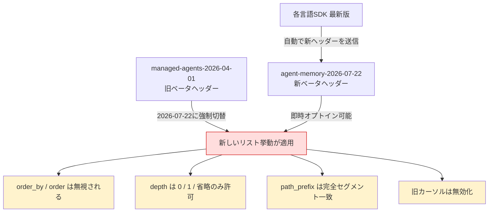
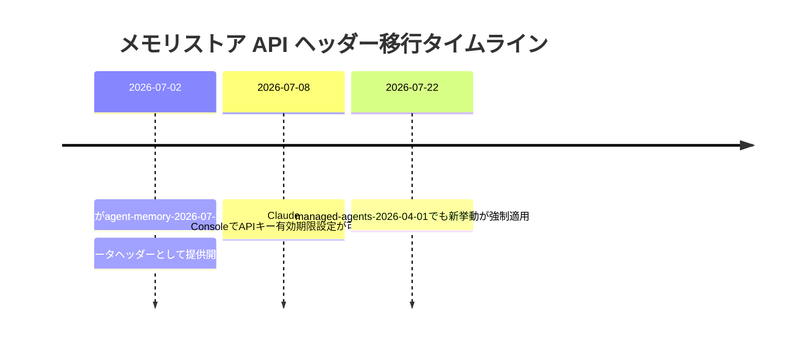
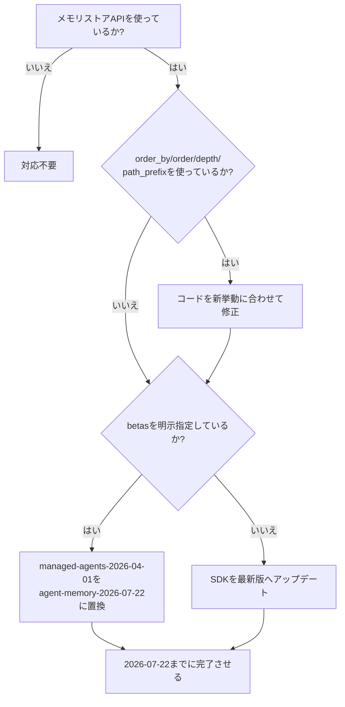

## はじめに

2026年7月に入り、Anthropic の Claude API まわりで見逃せないアップデートが立て続けに公開されました。中でも重要なのが、**メモリストア API（Memory Stores API）のリスト取得挙動を変更する新しいベータヘッダー `agent-memory-2026-07-22`** の導入です。

このヘッダーは単なるオプトイン機能ではありません。**2026年7月22日には、これまで使われていた `managed-agents-2026-04-01` ヘッダー自体が同じ新挙動に切り替わる**ため、`order_by` / `order` / `depth` / `path_prefix` を使ってメモリ一覧を取得しているコードは、対応しないと本番で壊れる可能性があります。

あわせて、各言語 SDK もこの新ヘッダーをデフォルトで送信するようアップデートされました。本記事では、

- 何が変わるのか
- 誰が影響を受けるのか
- 今すぐ何をすべきか

を整理します。また、副次的なアップデートとして Claude Console での API キー有効期限設定機能についても触れます。

> **📌 影響を受ける人**
> Claude の Managed Agents（メモリストア機能）を利用しているすべての開発者。特に `GET /v1/memory_stores/{id}/memories` を呼び出し、`order_by`・`order`・`depth`・`path_prefix` パラメータを利用している、またはページネーションカーソルを保存しているコードは要確認です。

## 変更の全体像

今回のアップデートの関係性を図にすると以下のようになります。



移行のタイムラインはこちらです。



## 変更内容

### 1. メモリストア API：新ベータヘッダー `agent-memory-2026-07-22`（Severity: High・破壊的変更）

`GET /v1/memory_stores/{memory_store_id}/memories` のリスト取得挙動が以下のように変わります。

| 項目 | 旧挙動（`managed-agents-2026-04-01`） | 新挙動（`agent-memory-2026-07-22` / 2026-07-22以降は旧ヘッダーも同様） |
|---|---|---|
| ソート順 | `order_by` / `order` で指定可能 | サーバー定義の安定順で固定。パラメータは無視される |
| `depth` | 任意の値を許容 | `0` / `1` / 省略のみ。それ以外は 400 エラー |
| `path_prefix` | 部分文字列一致 | 末尾に `/` が必須。パスセグメント全体一致 |
| ページカーソル | — | 旧ヘッダーで発行されたカーソルは新ヘッダーで無効。最初のページからやり直しが必要 |
| 同時指定 | — | `agent-memory-2026-07-22` と `managed-agents-2026-04-01` を同時送信すると 400 エラー |

> **⚠️ Breaking Change**
> 2026年7月22日以降は、**ベータヘッダーを指定しなくても**（＝旧ヘッダーのままでも）新しいリスト挙動が強制適用されます。「まだ移行していないから大丈夫」という猶予はありません。

### 2. 各言語 SDK のアップデート（Severity: Medium）

Python・TypeScript・Go・Java・Ruby・PHP・C#・CLI の各 SDK が、メモリストア呼び出し時に `agent-memory-2026-07-22` をデフォルトで送信するようになりました。

| SDK | 対象バージョン |
|---|---|
| Python | 0.116.0 |
| TypeScript | 0.110.0 |
| Go | 1.56.0 |
| Java | 2.48.0 |
| Ruby | 1.55.0 |
| PHP | 0.36.0 |
| C# | 12.35.0 |
| ant CLI | 1.16.0 |

コード内で `betas` を明示的に指定している場合は、**追加ではなく置き換え**が必要です。両方送ると 400 エラーになります。

### 3. Claude Console：API キーの有効期限設定（Severity: Medium）

2026年7月8日のアップデートで、Claude Console から API キー / Admin API キーを作成する際に、有効期限を「プリセット」「カスタム期間」「無期限（Never）」から選べるようになりました。7日以上の有効期間を設定したキーは、期限切れ前に作成者へメール通知が届きます。既存キーへの影響はありません。Admin API では `expires_at` フィールドで各キーの有効期限を確認できます。

## 影響と対応

対応が必要かどうかは、以下のフローで判断できます。



具体的なアクションは次の3つです。

1. **SDK を最新版に更新する**（前掲バージョン以上）。これだけで新ヘッダーがデフォルト送信されます。
2. **`betas` を明示指定しているコードを見直す**。`managed-agents-2026-04-01` を残したまま `agent-memory-2026-07-22` を追加すると 400 エラーになるため、置き換えが必須です。
3. **ソート・階層・パスプレフィックスに依存するロジックを見直す**。特にクライアント側で「サーバーが特定の順序で返す」ことを前提にしたコード、`depth` に 2 以上を渡しているコード、`path_prefix` を部分一致として使っているコードは、7月22日より前に修正してください。

> **💡 Tips**
> ページネーションカーソルはヘッダー間で互換性がありません。移行時は保存済みのカーソルを破棄し、最初のページから取得し直す実装にしておくと安全です。

## コード例

TypeScript SDK でメモリストアの一覧取得を行うケースの Before/After です。

### Before（旧ベータヘッダーを明示指定）

```typescript
const response = await client.beta.memoryStores.memories.list(
  "memory_store_id",
  {
    order_by: "created_at",
    order: "desc",
    depth: 2,
    path_prefix: "projects",
  },
  {
    betas: ["managed-agents-2026-04-01"],
  }
);
```

### After（新ベータヘッダーに対応）

```typescript
const response = await client.beta.memoryStores.memories.list(
  "memory_store_id",
  {
    // order_by / order は新挙動では無視されるため削除
    depth: 1, // 0, 1, 省略のみ許可
    path_prefix: "projects/", // 末尾の "/" が必須（セグメント一致）
  },
  {
    betas: ["agent-memory-2026-07-22"], // managed-agents-2026-04-01 から置き換え
  }
);
```

`order_by` / `order` を削除し、`depth` を許容値に収め、`path_prefix` の末尾にスラッシュを付ける、という3点が主な修正ポイントです。

## まとめ

- **最重要**：メモリストア API のリスト取得挙動が変わる新ベータヘッダー `agent-memory-2026-07-22` が登場。2026年7月22日には旧ヘッダー `managed-agents-2026-04-01` にも同じ挙動が強制適用されるため、対応必須。
- `order_by` / `order` は無視、`depth` は `0`/`1`/省略のみ、`path_prefix` はセグメント完全一致（末尾 `/` 必須）に変更される。
- 各言語 SDK（Python 0.116.0、TypeScript 0.110.0、Go 1.56.0 など）は新ヘッダーをデフォルト送信するよう更新済み。`betas` を明示指定している場合は置き換えが必要。
- ページネーションカーソルはヘッダー間で互換性がないため、移行時は最初のページから取り直す。
- 副次的に、Claude Console で API キーの有効期限（プリセット/カスタム/無期限）が設定可能になった。

Managed Agents のメモリ機能を使っているプロジェクトは、**2026年7月22日を締め切り**として、早めにコードとSDKバージョンを見直しておくことをおすすめします。
