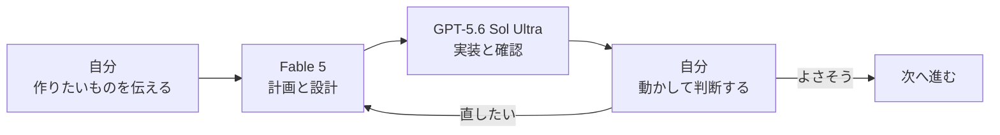

おはこんばんわ。最近はゲームを作らせてもらっています。

今日、自分の環境でGPT-5.6 SolをUltraモードで使えるようになったので、6時間くらいずっと動かしてみました。

正直、まだ6時間です。ちゃんと条件をそろえた比較でもないですし、トークン数のログも取っていません。なのでレビューというより第一印象に近いです。

それでも、GPT-5.5のときとは少し違うなと思ったことがあったので、忘れないうちに書いておきます。

一番感じたのは、こちらが「違う、そうじゃない」と説明し直す回数が減ったことでした。

## 今はFable 5とGPTで役割を分けている

GPT-5.5のころからProの20x枠を契約して、ゲーム開発に使っています。

最近Fable 5が使えるようになってからは、実装計画や設計まわりをFable 5に考えてもらい、実装はGPTに任せることが増えました。

今の分担はだいたいこんな感じです。

Fable 5には、いきなりコードを書いてもらうというより、「どう作るか」を先に考えてもらっています。

自分の頭の中では分かっているつもりでも、実際には曖昧なところがかなりあります。それを実装できる単位まで整理してもらう感じです。

同期が、OpusとFableの違いをこんなふうに言っていました。

> Opusは平均60点くらいのものが多く、たまに30点のものを出す。  
> Fableは平均80点くらいで、たまに200点くらいのものを出す。

もちろん数字は完全に例えです。

でもFable 5を使っていると、この「たまに200点」はちょっと分かります。こちらが頼んだ範囲をこなすだけではなく、「そう、それを言いたかった」と思う提案を急に出してくることがあります。

## Ultraでは、必要な役割に分かれて動いている

GPT-5.6 SolのUltraモードで面白かったのが、タスクに合わせてサブエージェントが動くところです。

実際の画面では、QA、UIレビュー、ビジュアル表現の確認、画面遷移の制約確認など、いろいろな役割が出てきました。

自分が一つずつ役割を指定しているわけではありません。頼んだ内容を見て、必要そうな担当に分かれて動いているように見えます。

今までは「すごく頭のいいAI一人と話している」という感覚でした。Ultraは、必要になったらその場で小さなチームを作る感じに近いです。

OpenAIの説明でも、Ultraはサブエージェントを使って複雑な作業を進めるモードとされています。なので「GPT-5.6ならいつでも複数のAIが動く」というより、GPT-5.6 SolのUltraモードの特徴と考えるのがよさそうです。

## GPTは、一緒に粘土工作をする友達みたいなもの

自分にとってGPTは、指示を出したら完成品が返ってくるだけの道具ではありません。

友達と一緒に粘土をこねて、フィギュアを作っている感じに近いです。

「これ、あれじゃないかな」

「もう少しこっちを削った方がよくない？」

「それなら、このパーツも付けてみよう」

そんな感じで話しながら、最初はよく分からなかった塊を少しずつ形にしていきます。

AIが出したものを見て自分の考えが変わり、それをまたAIに伝える。自分だけでは思いつかなかったものが、その往復から出てくることがあります。

この感覚はGPTに限らず、対話しながら使うAIにはだいたい感じています。

## 5.5より「説明し直す回数」が減った

GPT-5.5もかなり頭はよかったです。ただ、こちらの意図と少しずれた実装が出てくることがありました。

「そこじゃなくて、こっちを直してほしい」

「その変更で別のところが動かなくなっている」

「いったん前提から説明し直そう」

こういう壁打ちを何回かして、やっと欲しかった形になることも多かったです。

GPT-5.6 Sol Ultraを使ってみると、この回数が減りました。最初から意図に近いところまで実装して、そのまま次へ進めることが増えた感じです。

もちろん一発で全部完成するわけではありません。今でも確認や修正は必要です。

ただ、壁打ちの中でも「一緒に良くするための会話」は残り、「意図が伝わっていなくてやり直す会話」が減ったように思います。

## だからトークンの減り方も緩やかだったのかもしれない

使っていて最初に「あれ？」と思ったのが、トークンの減り方でした。

GPT-5.5を使っていたときより、減り方が緩やかに感じました。

最初はモデル側の仕組みが変わったのかと思いましたが、単純に修正の往復が減ったからかもしれません。

やりたいことを一回で近いところまで実装してくれれば、説明し直す回数も再実装の回数も減ります。その結果、完成までに使うトークンも少なくなります。

なので「GPT-5.6は一回の処理が必ず安い」という話ではありません。Ultraはサブエージェントも使うので、一つのタスク自体は重い可能性があります。月額料金が下がったわけでもありません。

あくまで自分の使い方では、完成までの遠回りが減った結果、全体の消費が減ったように感じたという話です。

これは素直にうれしかったです。

## AIは賢くなるけど、自分は勝手には賢くならない

GPT-5.6がここまでよくなっているとは、正直思っていませんでした。

巷ではもうGPT-6がどうなるのかという話も見かけます。正式な話はさておき、次の世代がどんな性能になるのかは楽しみで仕方がありません。

ただ、一つ悩みがあります。

AIの性能はどんどん上がっていきますが、自分の性能は自動では上がりません。

AIが速く正確に実装できるようになるほど、何を作りたいのか、どこまでできたら完成なのか、出てきたものが本当に正しいのかを決めるのは自分です。

AIが遅い間はAIがボトルネックでした。でもAIがどんどん速くなったら、次にボトルネックになるのは自分かもしれません。

そこは気をつけたいと思いました。

## おわりに

まだ6時間なので、もっと長く使ったら印象が変わるかもしれません。

それでも今のところ、GPT-5.6 Sol UltraはGPT-5.5より「違う、そうじゃない」と言う回数が減りました。そのおかげで修正の往復が減り、完成までに使うトークンも少なくなったように感じています。

AIが進化するのを楽しみつつ、自分が開発のボトルネックにならないように、自分の作る力も一緒に上げていきたいです。

同じようにゲーム開発や個人開発で使っている人がいたら、GPT-5.6 Solの使用感も聞いてみたいです。

---

## 参考

- [Previewing GPT-5.6 Sol: a next-generation model - OpenAI](https://openai.com/index/previewing-gpt-5-6-sol/)
- [Introducing GPT-5.5 - OpenAI](https://openai.com/index/introducing-gpt-5-5/)
- [Claude Fable 5 - Anthropic](https://www.anthropic.com/claude/fable)
- [About ChatGPT Pro tiers - OpenAI Help Center](https://help.openai.com/en/articles/9793128-what-is-chatgpt-pro)
