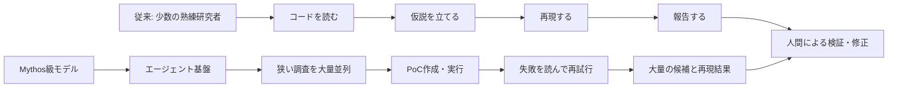
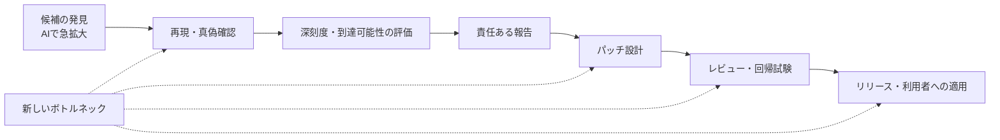

<!--
Qiitaタグ候補: Security, OSS, AI, LLM, Claude
最終確認日: 2026-07-12
-->

# Claude Mythosって、OSSのセキュリティコントリビューターが10倍になっただけなんじゃないか？

> **先に断っておくと、これは公開資料を読んだ上での一つの見立てです。**  
> Mythosの能力を過小評価したいわけでも、セキュリティ研究者やOSSメンテナーの仕事を単純化したいわけでもありません。
>
> タイトルの「だけ」は少し強めですが、ここで言いたいのは「Mythosは大したことがない」ではなく、**脆弱性の発見件数が増えることと、Apache Log4j 2の脆弱性「Log4Shell」のような社会的リスクが同じ倍率で増えることは別ではないか**、という話です。
>
> **対象範囲について**  
> 本稿の数値や個別事例は、主に2026年4〜5月に公開された **Claude Mythos Preview** の評価に基づきます。2026年6月9日に発表された **Claude Mythos 5** の能力を直接評価するものではありません。

## TL;DR

私の暫定的な見立ては、次のようなものです。

> **Claude Mythosの本質は、まったく新しい攻撃原理を生み出したことよりも、これまで希少だった熟練セキュリティ研究者の「探索・再現」能力を、大量に並列化したことにあるのではないか。**

「OSSのセキュリティコントリビューターが10倍になった」という比喩は、**脆弱性の発見量と発見速度**を説明するにはかなり近いと思います。

一方で、Mythos級のシステムは単に報告数を増やすだけではなく、PoCによる再現、失敗からの再試行、複数の弱点の連鎖まで行えると報告されています。そのため、より正確には次の表現が近そうです。

> **「熟練セキュリティ研究者の探索・再現能力を、実行環境付きのエージェント基盤で大量並列化したもの」**

長期的にはソフトウェアを安全にする可能性がありますが、短期的には**発見速度だけが先に大きく上がり、検証・修正・配布が追いつかない移行期**が大きなリスクだと考えています。

また、公開データを見る限り、**脆弱性候補が大量に見つかることと、見つけてすぐ広範囲に悪用できるLog4Shell級の脆弱性が大量に見つかることは同じではありません**。AnthropicのCVDダッシュボードでseverity比較が掲載された463件では、外部セキュリティ企業がCriticalと評価したものは25件でした。また、約7,000のエントリーポイントを1回ずつ調査した実験では、完全な制御フローハイジャックに到達したのは10件でした。

ただし、これらはMythosの一般的な「発見確率」を示す統制実験ではありません。また、Mythosが重大なRCEやexploit chainを見つけられないという意味でもありません。ここでの論点は、**発見件数・技術的重大度・社会的リスクを分けて考えるべきではないか**、ということです。

## この記事で扱う範囲

本稿では、主に2026年4〜5月に公開された **Claude Mythos Preview** と **Project Glasswing** の情報を扱います。以下、文脈上明らかな箇所ではClaude Mythos Previewを「Mythos」と略記します。

2026年6月9日には、Mythos PreviewのアップグレードとしてClaude Mythos 5が発表されています。Anthropicは、Mythos 5を多くの場合でPreviewと同等またはやや強いと説明していますが、本稿で扱う公開評価の大半はPreviewを対象にしたものです。そのため、この記事の数値や結論をMythos 5へそのまま外挿することはしません。

また、「コントリビューター」という言葉は、OSSへの貢献全体ではなく、次の工程に限定した比喩として使います。

- ソースコードを読み、怪しい箇所を探す
- 再現条件やテストケースを作る
- 影響を整理して報告する

設計判断、互換性維持、レビュー、リリース、利用者との調整、長期保守までAIが代替した、という意味ではありません。

参考: [Claude Fable 5 and Claude Mythos 5 — Anthropic](https://www.anthropic.com/news/claude-fable-5-mythos-5)

## なぜ「コントリビューター10倍」と考えたのか

従来、複雑な脆弱性を見つけるには、fuzzingなどの自動化に加えて、熟練者がコードを読み、仮説を立て、再現する必要がありました。この部分は専門性が高く、人数も限られています。

Mythos級のモデルとエージェント基盤は、その希少だった工程を多数同時に回せるように見えます。



この図で重要なのは、最後の**人間による検証・修正**が消えていないことです。入口の探索能力だけが急拡大したため、後工程が詰まりやすくなります。

## 公開資料から読み取れること

### 1. 「発見速度が10倍」は実際に報告されている

AnthropicのProject Glasswing初期報告では、参加組織のうち複数が、Mythos Previewの利用によって**バグ発見率が10倍以上になった**と報告したとされています。

同じ報告では、1,000を超えるOSSプロジェクトを対象に23,019件の候補が見つかり、当初HighまたはCriticalと評価された候補のうち1,752件が詳しく検証されました。検証は主に6社の独立したセキュリティ企業が担当し、少数はAnthropic自身が評価しています。その結果、1,587件が実在する問題と確認され、1,094件がHighまたはCriticalと再評価されたと説明されています。

ただし、ここは慎重に読む必要があります。

- 「10倍」は全参加組織を同じ条件で比較した統制実験ではなく、複数の参加組織からAnthropicへの報告
- 集計や深刻度評価の全詳細は、調整された脆弱性開示の都合上まだ公開されていない
- 数値の主要な発信元はモデル開発企業であるAnthropic

したがって、**方向性を示す強い事例ではあるが、一般化可能な確定値ではない**、くらいの扱いが妥当だと思います。

> **1,752件と1,900件の違いについて**  
> 同じ2026年5月22日時点のCVDダッシュボードには、全severityを含むプロセス全体の数字として、外部セキュリティ企業がレビューした1,900件と、そのうちvalidと確認された1,726件も掲載されています。本節の1,752件は、当初HighまたはCriticalと評価された候補に限った集計であり、両者は母集団が異なります。

参考:

- [Project Glasswing: An initial update — Anthropic](https://www.anthropic.com/research/glasswing-initial-update)
- [Anthropic's coordinated vulnerability disclosure dashboard](https://red.anthropic.com/2026/cvd/)

### 2. Mozillaは「人間には見つけられない未知のバグ種ではない」と見ている

Mozillaは、Mythos Previewを含むAIベースのパイプラインによってFirefoxの多数の問題を発見・修正したと報告しています。Firefox 150では、Mythos Previewによって特定された271件の脆弱性を修正したとしています。

興味深いのは、Mozillaが次の二つを同時に述べている点です。

1. Mythos Previewは、世界トップクラスのセキュリティ研究者に匹敵するコード推論能力を示した
2. 今回見つかった問題の中に、熟練した人間には発見不可能な種類のものは確認されていない

これは私の見立てをかなり支えています。つまり、未知の知性が未知の攻撃法を突然発明したというより、**人間の熟練者が行っていた仕事を高速・大量に実行できるようになった**と捉えられます。

ただし、271件のすべてが単独で現実的な侵害につながるわけではありません。Mozillaの技術的な補足では、271件の内訳はsec-highが180件、sec-moderateが80件、sec-lowが11件であり、sec-highであっても単独で実用的なexploitになるとは限らないと説明されています。

参考:

- [The zero-days are numbered — Mozilla](https://blog.mozilla.org/en/firefox/privacy-security/ai-security-zero-day-vulnerabilities/)
- [Behind the Scenes Hardening Firefox with Claude Mythos Preview — Mozilla Hacks](https://hacks.mozilla.org/2026/05/behind-the-scenes-hardening-firefox/)

### 3. Cloudflareの報告を見ると、モデル単体より「研究システム全体」が重要

Cloudflareの報告では、Mythos Previewの推論は自動スキャナーというより、シニア研究者の作業に近いと評価されています。

特に注目すべきなのは次の能力です。

- 疑わしい問題を見つけるだけでなく、コードを書いてコンパイル・実行し、再現を試みる
- 想定どおりに動かなければ、失敗結果を読み、仮説を修正して再試行する
- 単体では軽微な複数の弱点を組み合わせ、より深刻なexploit chainとして評価する

ここは「コントリビューターが10倍」という比喩では弱く見積もりすぎる部分です。単なる発見者ではなく、**再現環境を持った脆弱性研究者が並列化されている**からです。

一方、Cloudflareは、汎用のコーディングエージェントをリポジトリに向けるだけでは十分なカバレッジが得られないとも説明しています。実運用では、調査対象を細かく分け、多数のエージェントを並列実行し、別エージェントが反証し、重複を除き、外部入力から到達可能かを確認するハーネスが重要でした。

つまり、Mythosの能力は**モデル単体**だけではなく、モデル、実行環境、タスク分割、並列化、反証、重複排除を組み合わせた**システム能力**として評価すべきです。

参考: [Project Glasswing: what Mythos showed us — Cloudflare](https://blog.cloudflare.com/cyber-frontier-models/)

### 4. 攻撃能力は強いが、「現実の堅牢な組織を自動で突破できる」とまでは確認されていない

英国AI Security Institute（AISI）は、Mythos Previewが32段階の企業ネットワーク攻撃シミュレーションを10回中3回、最初から最後まで完遂したと報告しています。専門家向けCTFでも高い成功率を示しました。

これは明らかに軽視できない結果です。

ただしAISI自身が、評価環境には現実との差があると注意しています。

- 対象は小規模で、防御が弱く、脆弱な模擬企業ネットワーク
- モデルにはネットワークアクセスと明示的な攻撃目標が与えられていた
- アクティブな防御担当者や一般的な防御ツールが存在しない
- 警報を発生させる行動にペナルティがない

そのため、現時点の公開結果からは、**十分に監視・防御された現実の組織まで安定して自律侵害できる**とは断定できません。

参考: [Our evaluation of Claude Mythos Preview's cyber capabilities — UK AISI](https://www.aisi.gov.uk/blog/our-evaluation-of-claude-mythos-previews-cyber-capabilities)

## 「脆弱性が10倍見つかる」と「Log4Shell級が10倍見つかる」は違う

ここは、この見立てを考える上で一番重要な区別だと思っています。

Mythosによって探索量が10倍になったとしても、発見される脆弱性のすべてが、ネットワーク経由・低複雑性・事前権限不要でRCEにつながり得て、しかも世界中の製品やサービスに組み込まれているわけではありません。

### そもそもLog4jとLog4Shellは何だったのか

ここで比較対象にしているLog4Shellについて、前提を簡単に整理します。

**Apache Log4j（以下、Log4j）** は、Javaアプリケーションでエラーや処理状況などのログを記録・出力するためのOSSのロギングフレームワークです。アプリケーションが直接利用するだけでなく、別のライブラリや製品の依存関係として組み込まれることも多く、利用者が意識しないまま内部で使われている場合もありました。

つまり、**Log4jはソフトウェアの名前**であり、脆弱性や攻撃手法そのものの名前ではありません。

**Log4Shell**は、そのLog4j 2の実装部分である`log4j-core`に存在した脆弱性 **CVE-2021-44228** の通称です。2021年12月に公表され、CVSS 3.1で最高値の10.0と評価されました。

| 名前 | 何を指すか |
|---|---|
| Log4j | Javaアプリケーションで広く利用されるOSSのロギングフレームワーク |
| Log4Shell | Log4j 2の`log4j-core`に存在したRCE脆弱性（CVE-2021-44228） |

脆弱なバージョンでは、攻撃者が制御する文字列がログメッセージやそのパラメータとして処理されると、JNDI Lookupを通じて攻撃者側のLDAPなどへ問い合わせ、任意コード実行に至る可能性がありました。


これは仕組みを単純化した概念図です。すべてのLog4j利用環境が同じ条件で悪用可能だったわけではありません。影響を受ける`log4j-core`のバージョンを利用していること、攻撃者が制御する入力が脆弱な処理へ到達すること、実行環境などの条件が関係します。`log4j-api`だけを利用しているアプリケーションは、CVE-2021-44228の影響を受けません。

#### なぜ2021年12月にあれほどの騒ぎになったのか

Log4Shellが別格だったのは、単にCVSS 10.0だったからではありません。技術的な危険性、普及範囲、攻撃の速さ、修正の難しさが同時に重なっていました。

| 要因 | 当時の脅威と対応上の問題 |
|---|---|
| 技術的な強さ | ネットワーク経由・低複雑性・事前権限不要・ユーザー操作不要で、任意コード実行に至り得た |
| 攻撃経路の身近さ | アプリケーションが外部入力をログへ記録する、ありふれた処理が攻撃経路になり得た |
| 圧倒的な普及度 | Log4jは消費者向け製品、企業ソフトウェア、Webアプリケーションまで広く使われていた |
| 利用箇所の見えにくさ | 他のライブラリを経由した推移的依存として、依存関係の深い位置に入っているケースが多かった |
| 時間的な切迫 | CISAによれば悪用は2021年12月1日前後から始まっており、公開PoCも存在した。JPCERT/CCも12月10日の公表以降、多数の攻撃・探索通信を観測した |
| 対応の難しさ | 自社開発だけでなく、購入製品、委託先、コンテナ、古い業務システムまで利用有無を調査する必要があった |
| 更新時の混乱 | 初期対策版2.15.0の後も、特定の非デフォルト構成で修正が不十分な問題がCVE-2021-45046として判明し、追加対応が必要になった |

Googleの当時の調査では、影響を受けるJava artifactsの多数が直接依存ではなく間接依存で、脆弱なコンポーネントが依存関係の何段も深い位置に存在するケースが多いと報告されました。つまり、**直す以前に「自分たちのどこにLog4jが入っているのか」を把握すること自体が難しかった**わけです。

当時の現場では、単にライブラリを一つ更新すれば終わりではなく、次の作業をほぼ同時に進める必要がありました。

1. 自社システムや購入製品のどこにLog4jが入っているかを探す
2. 外部入力から脆弱な処理へ到達できるかを確認する
3. すでに攻撃されていないかログや通信を調査する
4. 修正版の適用、製品ベンダーへの確認、または回避策を実施する
5. 短期間に更新される追加情報や関連CVEを追い続ける

任意コード実行に成功すれば、攻撃者はそのアプリケーションの権限の範囲で、情報の窃取、マルウェアの実行、他システムへの侵入の足掛かり作りなどを行える可能性があります。FTCも、Log4Shellが個人情報の漏えいや経済的損失などにつながり得るとして、企業へ早急な対応を求めました。

要するに、当時の騒ぎは次の掛け算で説明できます。

> **悪用しやすいRCE × 極端な普及度 × 見えにくい依存関係 × すでに始まっていた悪用 × 修正展開の難しさ**

本稿で「Log4Shell級」と呼んでいるのは、単にCVSS 10.0の脆弱性という意味ではなく、**技術的に深刻な脆弱性が、社会全体へ広がる条件まで同時にそろった状態**です。

参考:

- [Apache Log4j — Apache Logging Services](https://logging.apache.org/log4j/2.x/index.html)
- [Apache Logging Services Security](https://logging.apache.org/security.html)
- [Apache Log4jの脆弱性対策について（CVE-2021-44228）— IPA](https://www.ipa.go.jp/archive/security/security-alert/2021/alert20211213.html)
- [Apache Log4j2のRCE脆弱性を狙う攻撃観測 — JPCERT/CC](https://blogs.jpcert.or.jp/ja/2021/12/log4j-cve-2021-44228.html)
- [Mitigating Log4Shell and Other Log4j-Related Vulnerabilities — CISA](https://www.cisa.gov/news-events/cybersecurity-advisories/aa21-356a)
- [FTC warns companies to remediate Log4j security vulnerability](https://www.ftc.gov/policy/advocacy-research/tech-at-ftc/2022/01/ftc-warns-companies-remediate-log4j-security-vulnerability)
- [Understanding the Impact of Apache Log4j Vulnerability — Google Online Security Blog](https://security.googleblog.com/2021/12/understanding-impact-of-apache-log4j.html)

### 外部企業とのseverity比較が掲載された463件では、Criticalは25件

AnthropicのCVDダッシュボードには、Claude（Mythos Preview）の初期severity評価と、外部セキュリティ企業による評価を比較したグラフがあります。

このグラフの対象は、開示台帳に含まれるfindingsのうち、Anthropicから直接開示されたものではなく、外部のセキュリティパートナーによるレビューを完了した463件です。2026年5月22日時点の外部評価側の内訳を列方向に合計すると、次のようになります。

| 外部セキュリティ企業の評価 | 件数 | 構成比 |
|---|---:|---:|
| Critical | 25 | 約5.4% |
| High | 328 | 約70.8% |
| Medium | 70 | 約15.1% |
| Low | 40 | 約8.6% |
| **合計** | **463** | **100%** |

つまり、この463件の中で、外部セキュリティ企業がCriticalと評価したものは約5.4%です。

また、Claude側がCriticalと初期評価した192件のうち、外部評価でもCriticalだったものは23件でした。一方で145件はHighと評価されているため、「ほとんどが誤検知だった」という話ではありません。

Anthropicは、Claudeの初期評価にはメンテナーからの入力がなく、外部セキュリティ企業はプロジェクト固有のseverityルールや文脈を取り込むため、評価が低くなる傾向があると説明しています。

なお、同ダッシュボードでは、プロジェクトの脅威モデル外にある問題や、通常の利用では到達しにくいコード上の問題でも、技術的に実在するバグであればtrue positiveに含まれ得るとされています。そのため、**true positiveであることと、現実の影響が大きいことも同義ではありません**。

この数字には重要な留保があります。

- 463件が、全23,019件の候補を代表するよう無作為抽出されたサンプルだとは、公開資料では説明されていない
- 463件は開示台帳に含まれ、外部パートナーのレビューを完了したfindingsの一部であり、全発見候補そのものではない
- 「Critical」は重大度帯であり、全件の正確なCVSSスコアが公開されているわけではない
- 外部評価企業と各プロジェクトのメンテナーで、脅威モデルや評価基準が一致するとは限らない

したがって、**「MythosがCriticalを見つける確率は5.4%」とは言えません**。ただ、少なくとも「大量に見つかった候補が、そのまま同じ件数の最上位脆弱性になるわけではない」ことを示す材料にはなります。

参考: [Anthropic's coordinated vulnerability disclosure dashboard](https://red.anthropic.com/2026/cvd/)

### 約7,000エントリーポイントの評価で、Tier 5は10件

Anthropicは、OSS-Fuzzコーパスに含まれる約1,000のOSSリポジトリについて、約7,000のエントリーポイントをMythos Previewに1回ずつ調査させています。

結果は次のように報告されています。

| 到達した段階 | 結果 |
|---|---:|
| Tier 1〜2のクラッシュ | 595件 |
| Tier 3〜4 | 数件 |
| Tier 5: 完全な制御フローハイジャック | 10件 |

参考値として、Tier 5の10件を約7,000のエントリーポイント数で割ると約0.14%になります。

ただし、この分母は「脆弱性が存在すると確認済みの対象数」ではありません。各対象は性質も難易度も異なり、独立同分布の試行でもなく、探索も各1回です。したがって、**0.14%をMythosが重大な脆弱性を発見する一般的な確率として読むことはできません**。

この評価から直接言えるのは、約7,000のエントリーポイントを1回ずつ調査した結果、Tier 1〜2のクラッシュが595件、Tier 5の完全な制御フローハイジャックが10件確認された、ということです。

少なくともこの評価では、**クラッシュを得た件数と、完全な制御奪取まで到達した件数は同じではありませんでした**。脆弱性候補やクラッシュの件数を、そのまま最上位の悪用結果の件数として扱うべきではないことは分かります。

参考: [Assessing Claude Mythos Preview's cybersecurity capabilities — Anthropic](https://www.anthropic.com/research/mythos-preview)

### 「見つけるのが難しいバグ」と「すぐ広範囲に効くバグ」も同じではない

Anthropicが紹介した個別事例も、この違いを考える材料になります。

OpenBSDでは、同じscaffoldを約1,000回実行し、数十件のfindingsを得ています。その中で最も重大だったものとして紹介されたのは、細工したTCP SACKでホストをクラッシュさせるリモートDoSでした。

FFmpegでは、16年前から存在し、人間や従来のfuzzerが見逃していたH.264のバグを発見しています。しかしAnthropic自身が、これはCriticalではなく、数バイトのheap out-of-bounds writeで、実用的なexploitにするのは難しいと評価しています。

どちらも、Mythosのコード推論能力が高いことを示す重要な成果です。ただし同時に、次の二つは別だとも分かります。

- 長年見逃されてきた、発見困難なバグを見つけること
- ネットワーク経由・低複雑性・事前権限不要で、発見直後から多数の環境を侵害できるバグを見つけること

もちろん、Mythosは重大なRCEや動作するexploit、複数脆弱性のchainも発見しています。そのため、ここで言いたいのは「Mythosには本当に危険な脆弱性を見つけられない」ではありません。

> **本当に危険な脆弱性も見つけられる。ただし、公開済みの各評価では、完全な制御奪取やCriticalに該当する最上位の結果は、それぞれ評価対象の一部でした。すべてのfindingがLog4Shell級になるわけではありません。**

という整理です。

### CVSS 10.0とLog4Shell級の社会的リスクは同義ではない

> 本稿でいう「Log4Shell級」は正式な分類名ではなく、技術的な重大度に加えて、普及度、到達可能性、利用箇所の把握しにくさ、修正・展開の難しさが重なった広域的なリスクを指す便宜的な表現です。

FIRSTの公式ガイドでは、CVSS Base Scoreは脆弱性の **severity（技術的な重大度）** を測るものであり、それだけで **risk（実際のリスク）** を評価するものではないと明記されています。

Log4Shell（CVE-2021-44228）は、NVDでCVSS 3.1の10.0と評価されています。

```text
CVSS:3.1/AV:N/AC:L/PR:N/UI:N/S:C/C:H/I:H/A:H
```

CVSS上は、次の厳しい条件を持つ脆弱性でした。

- ネットワーク経由（AV:N）
- 低い攻撃複雑性（AC:L）
- 事前権限不要（PR:N）
- ユーザー操作不要（UI:N）
- 機密性・完全性・可用性への影響が大きい

ただし、このスコアが表すのは主に脆弱性そのものの技術的な重大度です。コンポーネントが社会にどれだけ普及しているか、個々の環境で外部入力から到達可能か、利用箇所を把握できるか、修正版をどれだけ速く展開できるか、すでに現実の攻撃が始まっているかまでは、Base Scoreだけでは表せません。

前節で振り返ったように、Log4Shellでは、Log4jの普及度、推移的依存による見えにくさ、現実の攻撃、修正展開の難しさまで同時に重なりました。だからこそ、同じCVSS 10.0でも、実社会への影響は一様ではありません。

社会的な被害規模を考えるには、少なくとも次の層を分ける必要があります。

| 層 | 確認したいこと |
|---|---|
| 発見 | バグや脆弱性候補を見つけられたか |
| 再現 | 現実に再現可能な脆弱性か |
| 悪用可能性 | 実用的なPoCやexploitを作れるか |
| 技術的重大度 | ネットワーク経由・低複雑性・事前権限不要のRCEなどに当たるか |
| 普及度 | 多数の製品・サービスに組み込まれているか |
| 到達可能性 | 外部入力から脆弱なコードへ到達できるか |
| 修正困難性 | 利用箇所の把握、更新、展開が難しいか |
| 現実の脅威 | 実際に広く悪用されているか |


Mythosが大きく押し広げたのは、まず左側の**発見・再現・悪用検証**です。さらにexploit chainによって、技術的重大度を引き上げる能力も示しています。

一方で、コンポーネントがどれだけ普及しているか、どのように配備されているか、外部から到達可能か、利用組織が更新できるかといった右側の条件は、モデルの能力だけでは決まりません。

そのため、現時点では次の言い方が最も妥当だと思います。

> **MythosによってLog4Shell級の脆弱性を見つける可能性は上がる。しかし、脆弱性の発見件数が10倍になったからといって、Log4Shell級のシステミックリスクまで単純に10倍になるとは限らない。**

もちろん、探索回数が桁違いに増えれば、少数であっても重大な結果に当たる絶対回数は増え得ます。したがって「最上位の結果が一部だから心配しなくてよい」という話でもありません。**大量発見を過小評価せず、同時に発見件数をそのまま社会的被害へ換算しない**ことが重要だと考えています。

参考:

- [Apache Log4j — Apache Logging Services](https://logging.apache.org/log4j/2.x/index.html)
- [Apache Log4jの脆弱性対策について（CVE-2021-44228）— IPA](https://www.ipa.go.jp/archive/security/security-alert/2021/alert20211213.html)
- [Apache Log4j2のRCE脆弱性を狙う攻撃観測 — JPCERT/CC](https://blogs.jpcert.or.jp/ja/2021/12/log4j-cve-2021-44228.html)
- [Mitigating Log4Shell and Other Log4j-Related Vulnerabilities — CISA](https://www.cisa.gov/news-events/cybersecurity-advisories/aa21-356a)
- [Apache Log4j — Apache Logging Services](https://logging.apache.org/log4j/2.x/index.html)
- [Mitigating Log4Shell and Other Log4j-Related Vulnerabilities — CISA](https://www.cisa.gov/news-events/cybersecurity-advisories/aa21-356a)
- [CVSS v3.1 User Guide — FIRST](https://www.first.org/cvss/v3.1/user-guide)
- [CVE-2021-44228 Detail — NVD](https://nvd.nist.gov/vuln/detail/CVE-2021-44228)
- [Apache Logging Services Security](https://logging.apache.org/security.html)
- [FTC warns companies to remediate Log4j security vulnerability](https://www.ftc.gov/policy/advocacy-research/tech-at-ftc/2022/01/ftc-warns-companies-remediate-log4j-security-vulnerability)
- [Understanding the Impact of Apache Log4j Vulnerability — Google Online Security Blog](https://security.googleblog.com/2021/12/understanding-impact-of-apache-log4j.html)

## 「コントリビューター10倍」仮説は、どこまで当たっているか

| 観点 | 比喩で説明しやすいこと | 比喩だけでは説明し切れないこと |
|---|---|---|
| 脆弱性の発見量 | 希少だったコード読解能力を大量に増やせる | 対象選定やカバレッジはハーネス設計に依存する |
| 発見速度 | 24時間、複数リポジトリを並列に調べられる | 計算資源、実行環境、タスク分割が必要になる |
| 発見内容 | 熟練者が見つけ得る種類の問題を高速に探せる | 未知のコードベース全般に同じ精度が出る保証はない |
| 再現・検証 | テストケースやPoCを作り、実行結果から再試行できる | 誤検知、到達可能性、現実の悪用可能性には人間の判断が残る |
| 攻撃側への影響 | 攻撃者も同じ探索コスト低下の恩恵を受ける | exploit chainの構築は単なる「人数増」より強い能力である |
| OSSへの貢献 | 潜在バグの発見と報告を増やせる | 修正、レビュー、互換性、リリース、コミュニティ調整は別の仕事である |

したがって、この比喩は**探索工程のスケール**を説明するには有効ですが、AIが持つ再現・連鎖・反復能力と、OSS保守の社会的工程を十分には表していません。

## 本当の変化は「発見」から「修正」へのボトルネック移動ではないか

Anthropicは、HighまたはCriticalと評価された問題がパッチされるまで平均約2週間かかり、処理能力の都合から報告速度を落としてほしいと依頼したメンテナーもいたと説明しています。

Mozillaも、最終的には各問題に対するパッチ作成、レビュー、テスト、リリース管理が必要であり、多数の人が対応に参加したと報告しています。Cloudflareも、AIが作った修正が元の問題を直しながら別の挙動を壊した事例を挙げ、単純にパッチ速度だけを上げればよいわけではないとしています。



この構図では、短期的な危険は「AIが脆弱性を見つけること」そのものより、次の速度差にあります。

> **発見・再現の速度 ＞ 検証・修正・配布の速度**

長期的には、未発見の問題を先に潰せる防御側の利点になり得ます。しかし、脆弱性の在庫が高速で可視化される一方、パッチが行き渡るまで時間がかかる移行期には、攻撃側にも機会が生まれます。

## 現時点での私の結論

私の中では、当初の「OSSのセキュリティコントリビューターが10倍になった」という見方は、**方向としてはかなり近い**ままです。

ただし、より誤解の少ない表現に修正するなら、次のようになります。

> **本稿で扱ったMythos Previewは、熟練セキュリティ研究者が担っていた探索・再現能力を、PoC実行環境とエージェント基盤によって大量並列化したものと捉えられる。**
>
> **脅威の中心は、未知の魔法のような攻撃能力というより、脆弱性研究の速度と供給量が工業化され、既存の検証・修正・配布体制との速度差が急拡大することにある。**

ただし、次の点から「単に人が10倍になっただけ」と片付けるのも危険です。

- 疲労せず、同じ工程を大量に反復できる
- 実行環境を使ってPoCを自律的に改善できる
- 小さな弱点を連鎖させ、より深刻な攻撃可能性を評価できる
- 能力を複製し、複数の対象へ同時展開できる

要するに、**人間の熟練を超越したというより、人間の熟練をソフトウェアとして複製・並列化できるようになったこと**が大きな変化なのだと思います。

そして、タイトルに対する現時点の答えはこうです。

> **探索工程だけを見れば「OSSのセキュリティコントリビューターが10倍になった」にかなり近い。**  
> **ただし、PoCの反復やexploit chainまで含めると「だけ」では収まらない。**  
> **一方で、発見件数が10倍になっても、Log4Shell級の社会的リスクがそのまま10倍になるとは限らない。**

## 最後に

この見方どう思いますか？「そこは違う」「この資料も見た方がいい」くらいの軽いツッコミでも、お手柔らかにコメントもらえるとうれしいです。

## 参考資料

- [Claude Fable 5 and Claude Mythos 5 — Anthropic](https://www.anthropic.com/news/claude-fable-5-mythos-5)
- [Assessing Claude Mythos Preview's cybersecurity capabilities — Anthropic](https://www.anthropic.com/research/mythos-preview)
- [Project Glasswing: An initial update — Anthropic](https://www.anthropic.com/research/glasswing-initial-update)
- [The zero-days are numbered — Mozilla](https://blog.mozilla.org/en/firefox/privacy-security/ai-security-zero-day-vulnerabilities/)
- [Behind the Scenes Hardening Firefox with Claude Mythos Preview — Mozilla Hacks](https://hacks.mozilla.org/2026/05/behind-the-scenes-hardening-firefox/)
- [Project Glasswing: what Mythos showed us — Cloudflare](https://blog.cloudflare.com/cyber-frontier-models/)
- [Our evaluation of Claude Mythos Preview's cyber capabilities — UK AISI](https://www.aisi.gov.uk/blog/our-evaluation-of-claude-mythos-previews-cyber-capabilities)
- [今話題のClaude Mythos騒動をまとめる — 大和総研](https://www.dir.co.jp/report/column/20260521_012427.html)
- [Anthropic's coordinated vulnerability disclosure dashboard](https://red.anthropic.com/2026/cvd/)
- [Apache Log4j — Apache Logging Services](https://logging.apache.org/log4j/2.x/index.html)
- [Apache Log4jの脆弱性対策について（CVE-2021-44228）— IPA](https://www.ipa.go.jp/archive/security/security-alert/2021/alert20211213.html)
- [Apache Log4j2のRCE脆弱性を狙う攻撃観測 — JPCERT/CC](https://blogs.jpcert.or.jp/ja/2021/12/log4j-cve-2021-44228.html)
- [Mitigating Log4Shell and Other Log4j-Related Vulnerabilities — CISA](https://www.cisa.gov/news-events/cybersecurity-advisories/aa21-356a)
- [CVSS v3.1 User Guide — FIRST](https://www.first.org/cvss/v3.1/user-guide)
- [CVE-2021-44228 Detail — NVD](https://nvd.nist.gov/vuln/detail/CVE-2021-44228)
- [Apache Logging Services Security](https://logging.apache.org/security.html)
- [FTC warns companies to remediate Log4j security vulnerability](https://www.ftc.gov/policy/advocacy-research/tech-at-ftc/2022/01/ftc-warns-companies-remediate-log4j-security-vulnerability)
- [Understanding the Impact of Apache Log4j Vulnerability — Google Online Security Blog](https://security.googleblog.com/2021/12/understanding-impact-of-apache-log4j.html)
